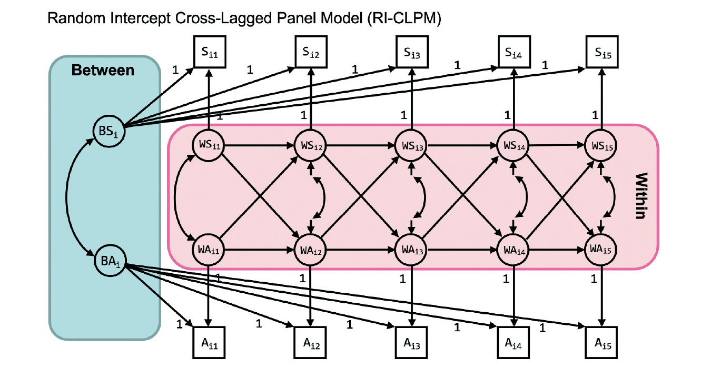

```{r setup}
knitr::opts_knit$set(root.dir = "~/gametime-longitudinal")
```

```{r}
library(lavaan)
dat <- readRDS("Models/RI-CLPM/data/RICLPM-wide-subset.Rdata")
```



Mulder, J. D., & Hamaker, E. L. (2020). Three Extensions of the Random Intercept Cross-Lagged Panel Model. Structural Equation Modeling: A Multidisciplinary Journal, 0(0), 1–11. https://doi.org/10.1080/10705511.2020.1784738


```{r}
# From: https://jeroendmulder.github.io/RI-CLPM/lavaan.html

riclpm <- '
  # Create between components (random intercepts)
  RIx =~ 1*x1 + 1*x2 + 1*x3 + 1*x4 + 1*x5
  RIy =~ 1*y1 + 1*y2 + 1*y3 + 1*y4 + 1*y5

  # Create within-person centered variables
  wx1 =~ 1*x1
  wx2 =~ 1*x2
  wx3 =~ 1*x3
  wx4 =~ 1*x4
  wx5 =~ 1*x5
  wy1 =~ 1*y1
  wy2 =~ 1*y2
  wy3 =~ 1*y3
  wy4 =~ 1*y4
  wy5 =~ 1*y5

  # Estimate the lagged effects between the within-person centered variables.
  wx2 + wy2 ~ wx1 + wy1
  wx3 + wy3 ~ wx2 + wy2
  wx4 + wy4 ~ wx3 + wy3
  wx5 + wy5 ~ wx4 + wy4

  # Estimate the covariance between the within-person centered
  # variables at the first wave.
  wx1 ~~ wy1 # Covariance

  # Estimate the covariances between the residuals of the
  # within-person centered variables (the innovations).
  wx2 ~~ wy2
  wx3 ~~ wy3
  wx4 ~~ wy4
  wx5 ~~ wy5

  # Estimate the variance and covariance of the random intercepts.
  RIx ~~ RIx
  RIy ~~ RIy
  RIx ~~ RIy

  # Estimate the (residual) variance of the within-person centered variables.
  wx1 ~~ wx1 # Variances
  wy1 ~~ wy1
  wx2 ~~ wx2 # Residual variances
  wy2 ~~ wy2
  wx3 ~~ wx3
  wy3 ~~ wy3
  wx4 ~~ wx4
  wy4 ~~ wy4
  wx5 ~~ wx5
  wy5 ~~ wy5
'
fit_lavaan <- lavaan(
    riclpm,
    data = dat,
    missing = "ML",
    meanstructure = TRUE,
    int.ov.free = TRUE
)
summary(fit_lavaan, standardized = TRUE)
```


With 3 time points
```{r}
riclpm <- '
  # Create between components (random intercepts)
  RIx =~ 1*x1 + 1*x2 + 1*x3
  RIy =~ 1*y1 + 1*y2 + 1*y3

  # Create within-person centered variables
  wx1 =~ 1*x1
  wx2 =~ 1*x2
  wx3 =~ 1*x3
  wy1 =~ 1*y1
  wy2 =~ 1*y2
  wy3 =~ 1*y3

  # Estimate the lagged effects between the within-person centered variables.
  wx2 + wy2 ~ wx1 + wy1
  wx3 + wy3 ~ wx2 + wy2

  # Estimate the covariance between the within-person centered
  # variables at the first wave.
  wx1 ~~ wy1 # Covariance

  # Estimate the covariances between the residuals of the
  # within-person centered variables (the innovations).
  wx2 ~~ wy2
  wx3 ~~ wy3

  # Estimate the variance and covariance of the random intercepts.
  RIx ~~ RIx
  RIy ~~ RIy
  RIx ~~ RIy

  # Estimate the (residual) variance of the within-person centered variables.
  wx1 ~~ wx1 # Variances
  wy1 ~~ wy1
  wx2 ~~ wx2 # Residual variances
  wy2 ~~ wy2
  wx3 ~~ wx3
  wy3 ~~ wy3
'
fit_lavaan <- lavaan(
    riclpm,
    data = dat,
    missing = "ML",
    meanstructure = TRUE,
    int.ov.free = TRUE
)
summary(fit_lavaan, standardized = TRUE)
```