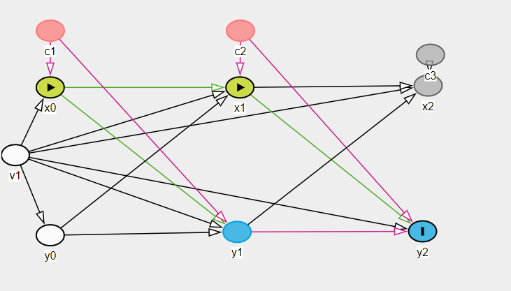

```{r setup}
knitr::opts_knit$set(root.dir = "~/gametime-longitudinal")
library(tidyverse)
library(lavaan)
```


Let's investigate the effect of a simple time-varying confounder. Here I'm mostly intersting in creating bias for the x -> y cross-lagged effects.



In the DAG I've added a time-varying variable thas causes both $x_i$ and $y_{i+1}$. 

```{r}
## Time varying confounding
# 3 time points with compound symmetry covariance
add_time_varying_confounding <- function(
    data,
    mu = c(0, 0, 0),
    SD = 2, 
    corr = 0.8) {

        n <- nrow(data)
        cor_C <- SD * 2 * corr
        sigmaC <- matrix(
            c(
                SD^2, cor_C, cor_C,
                cor_C, SD^2, cor_C,
                cor_C, cor_C, SD^2
            ),
            nrow = 3, ncol = 3
        )
        C <- MASS::mvrnorm(n, mu, sigmaC)

        data <- data %>% 
        mutate(
            c1 = C[, 1],
            c2 = C[, 2],
            c3 = C[, 3],
            x1 = x1 + c1,
            x2 = x2 + c2,
            x3 = x3 + c3,
            y1 = y1,
            y2 = y2 + c1,
            y3 = y3 + c2
        )

        data
}

```

Simulate data with all cross-lagged effects set to zero.
```{r}
source("Models/RI-CLPM/simulate-RICLPM-data.R")

params <- list(
    n = 10000,
    # beta = autoregressive params
    beta_2x = 0.66,
    beta_2y = 0.55,
    beta_3x = 0.40,
    beta_3y = 0.33,
    # gamma = cross-lagged effects
    gamma_2x = 0,
    gamma_2y = 0,
    gamma_3x = 0,
    gamma_3y = 0,
    x_mean = 2,
    y_mean = 4,
    ## covariances
    sd_wx1 = 1,
    sd_wy1 = 1,
    cor_wx1_wy1 = 0.5,
    sd_wx2 = 1.33,
    sd_wy2 = 1.33,
    cor_wx2_wy2 = 0.6,
    sd_wx3 = 1.33,
    sd_wy3 = 1.33,
    cor_wx3_wy3 = 0.44,
    sd_x_RE = 1.2,
    sd_y_RE = 1.2,
    cor_xy_intercepts = 0.33
)

d <- do.call(sim_RICLPM_data, params)
d <- add_time_varying_confounding(d)
```


# lavaan RICLPM
```{r echo=FALSE}
# Based on: https://jeroendmulder.github.io/RI-CLPM/lavaan.html
riclpm <- '
  # Create between components (random intercepts)
  RIx =~ 1*x1 + 1*x2 + 1*x3
  RIy =~ 1*y1 + 1*y2 + 1*y3

  # Create within-person centered variables
  wx1 =~ 1*x1
  wx2 =~ 1*x2
  wx3 =~ 1*x3
  wy1 =~ 1*y1
  wy2 =~ 1*y2
  wy3 =~ 1*y3

  # Estimate the lagged effects between the within-person centered variables.
  wx2 + wy2 ~ wx1 + wy1
  wx3 + wy3 ~ wx2 + wy2

  # Estimate the covariance between the within-person centered
  # variables at the first wave.
  wx1 ~~ wy1 # Covariance

  # Estimate the covariances between the residuals of the
  # within-person centered variables (the innovations).
  wx2 ~~ wy2
  wx3 ~~ wy3

  # Estimate the variance and covariance of the random intercepts.
  RIx ~~ RIx
  RIy ~~ RIy
  RIx ~~ RIy

  # Estimate the (residual) variance of the within-person centered variables.
  wx1 ~~ wx1 # Variances
  wy1 ~~ wy1
  wx2 ~~ wx2 # Residual variances
  wy2 ~~ wy2
  wx3 ~~ wx3
  wy3 ~~ wy3
'
fit_RICLPM <- lavaan(
    riclpm, 
    data = d, 
    meanstructure = TRUE, 
    int.ov.free = TRUE
) 
```

```{r, echo =FALSE}
coefs <- coef(fit_RICLPM)
res <- data.frame(
    term = names(coefs),
    est = coefs,
    theta = with(
        params,
            c(
                beta_2x,
                gamma_2x,
                gamma_2y,
                beta_2y,
                beta_3x,
                gamma_3x,
                gamma_3y,
                beta_3y,
                sd_wx1 * sd_wy1 * cor_wx1_wy1,
                sd_wx2 * sd_wy2 * cor_wx2_wy2,
                sd_wx3 * sd_wy3 * cor_wx3_wy3,
                sd_x_RE^2,
                sd_y_RE^2,
                sd_x_RE * sd_y_RE * cor_xy_intercepts,
                sd_wx1^2,
                sd_wy1^2,
                sd_wx2^2,
                sd_wy2^2,
                sd_wx3^2,
                sd_wy3^2,
                rep(NA, 6) # ignore means
            )
    ),
    row.names = NULL
)


res %>%
    filter(term %in% c("wx2~wy1", "wx3~wy2", "wy2~wx1", "wy3~wx2")) %>%
ggplot(aes(y = factor(term, levels = c(names(coefs))))) + 
    geom_point(aes(x = est, color = "est")) +
    geom_point(aes(x = theta, color = "theta")) +
    labs(
        y = "Terms",
        x = "Value",
        title = "RI-CLPM fit to RI-CLPM data + time-varying confounding",
        subtitle = "Only cross-lagged effects"
    ) +
    xlim(c(0, 1))

```

Estimates are very biased. 


## Adjust for time-varying confounders

Let's see if we adjust for confounders and get correct results. I've simply ddded this to the lavaan RICLPM:

```
  # adjust for time-varying confounders
  x1 ~ c1
  x2 ~ c2
  x3 ~ c3 
  y2 ~ c1
  y3 ~ c2 
```

```{r, echo = FALSE}
# Based on: https://jeroendmulder.github.io/RI-CLPM/lavaan.html
riclpm <- '
  # Create between components (random intercepts)
  RIx =~ 1*x1 + 1*x2 + 1*x3
  RIy =~ 1*y1 + 1*y2 + 1*y3

  # Create within-person centered variables
  wx1 =~ 1*x1
  wx2 =~ 1*x2
  wx3 =~ 1*x3
  wy1 =~ 1*y1
  wy2 =~ 1*y2
  wy3 =~ 1*y3

  # adjust for time-varying confounders
  x1 ~ c1
  x2 ~ c2
  x3 ~ c3 
  y2 ~ c1
  y3 ~ c2 

  # Estimate the lagged effects between the within-person centered variables.
  wx2 + wy2 ~ wx1 + wy1
  wx3 + wy3 ~ wx2 + wy2

  # Estimate the covariance between the within-person centered
  # variables at the first wave.
  wx1 ~~ wy1 # Covariance

  # Estimate the covariances between the residuals of the
  # within-person centered variables (the innovations).
  wx2 ~~ wy2
  wx3 ~~ wy3

  # Estimate the variance and covariance of the random intercepts.
  RIx ~~ RIx
  RIy ~~ RIy
  RIx ~~ RIy

  # Estimate the (residual) variance of the within-person centered variables.
  wx1 ~~ wx1 # Variances
  wy1 ~~ wy1
  wx2 ~~ wx2 # Residual variances
  wy2 ~~ wy2
  wx3 ~~ wx3
  wy3 ~~ wy3
'
fit_RICLPM <- lavaan(
    riclpm, 
    data = d, 
    meanstructure = TRUE, 
    int.ov.free = TRUE
) 
```

```{r, echo = FALSE}
coefs <- coef(fit_RICLPM)
coefs_subset <- coefs[
    names(coefs) %in% c("wx2~wy1", "wx3~wy2", "wy2~wx1", "wy3~wx2")
    ]

res <- data.frame(
    term = names(coefs_subset),
    est = coefs_subset,
    theta = with(
        params,
            c(
                gamma_2x,
                gamma_2y,
                gamma_3x,
                gamma_3y

            )
    ),
    row.names = NULL
)

ggplot(res, aes(y = factor(term, levels = c(names(coefs))))) + 
    geom_point(aes(x = est, color = "est")) +
    geom_point(aes(x = theta, color = "theta")) +
    labs(
        y = "Terms",
        x = "Value",
        title = "RI-CLPM fit to RI-CLPM data + time-varying confounding (adjusted)",
        subtitle = "Only cross-lagged effects"
    ) + 
    xlim(c(0, 1))

```

Bias is removed.


## Notes
* No suprises here, unmeasured time-varying confounding will screw us.
* Very difficult to make the correct adjustments
