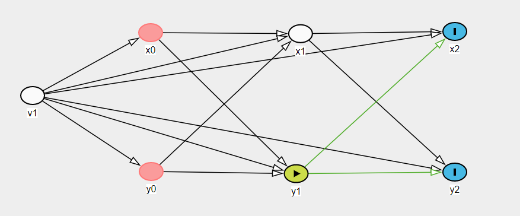

So, this file is just a sanity check. I'm just gonna test if we can recover the effects using a regression approach implied by the DAG (see below).

```{r}
library(lme4)
knitr::opts_knit$set(root.dir = "~/gametime-longitudinal")
library(tidyverse)
library(lavaan)
```


Gen data, n = 50,000.
```{r}
source("Models/RI-CLPM/simulate-RICLPM-data.R")
set.seed(1111)
params <- list(
    n = 5e4,
    # beta = autoregressive params
    beta_2x = 0.66,
    beta_2y = 0.55,
    beta_3x = 0.40,
    beta_3y = 0.33,
    # gamma = cross-lagged effects
    gamma_2x = 0.22,
    gamma_2y = 0.33,
    gamma_3x = 0.44,
    gamma_3y = 0.55,
    x_mean = 2,
    y_mean = 4,
    ## covariances
    sd_wx1 = 1,
    sd_wy1 = 1,
    cor_wx1_wy1 = 0.5,
    sd_wx2 = 1.7,
    sd_wy2 = 1.33,
    cor_wx2_wy2 = 0.6,
    sd_wx3 = 1.33,
    sd_wy3 = 1.44,
    cor_wx3_wy3 = 0.44,
    sd_x_RE = 1.2,
    sd_y_RE = 1.44,
    cor_xy_intercepts = 0.33
)
d <- do.call(sim_RICLPM_data, params)
d$id <- 1:nrow(d)

d_long <- pivot_longer(
    d,
    -id,
    names_to = c(".value", "time"),
    names_pattern = c("(.)(.)")
)
```


Let's begin by a naive approach to and estimate random intercepts and use them to separate BS and WS effects.

```{r}
fit_y <- lmer(y ~ 1 + (1 | id), data = d_long)
fit_x <- lmer(x ~ 1 + (1 | id), data = d_long)

d$U_y_est <- ranef(fit_y)$id[, "(Intercept)"] 
d$U_x_est <- ranef(fit_x)$id[, "(Intercept)"] 
```

The estimated random intercepts are strongly correlated with the true random intercepts. 
```{r}
plot(d$U_y_est, d$U_y)
cor(d$U_y_est, d$U_y)
```

Let's try to get subtract away all BS variance, using:
 - the true random intercepts
 - the estimated random intercepts,
 - the observed means
```{r}
dw <- d %>%
    mutate(
        x_mean = mean(c(x1, x2, x3)), # obs means
        y_mean = mean(c(y1, y2, y3)),
        wx1 = x1 - U_x, # true deviations
        wx2 = x2 - U_x,
        wx3 = x3 - U_x,
        wy1 = y1 - U_y,
        wy2 = y2 - U_y,
        wy3 = y3 - U_y,
        wx1e = x1 - U_x_est, # estimated
        wx2e = x2 - U_x_est,
        wx3e = x3 - U_x_est,
        wy1e = y1 - U_y_est,
        wy2e = y2 - U_y_est,
        wy3e = y3 - U_y_est,

        wx1m = x1 - x_mean, # data mean
        wx2m = x2 - x_mean,
        wx3m = x3 - x_mean,
        wy1m = y1 - y_mean,
        wy2m = y2 - y_mean,
        wy3m = y3 - y_mean,
    )
```


Fit the Lavaan RICLPM again:
```{r}
# Based on: https://jeroendmulder.github.io/RI-CLPM/lavaan.html
riclpm <- '
  # Create between components (random intercepts)
  RIx =~ 1*x1 + 1*x2 + 1*x3
  RIy =~ 1*y1 + 1*y2 + 1*y3

  # Create within-person centered variables
  wx1 =~ 1*x1
  wx2 =~ 1*x2
  wx3 =~ 1*x3
  wy1 =~ 1*y1
  wy2 =~ 1*y2
  wy3 =~ 1*y3

  # Estimate the lagged effects between the within-person centered variables.
  wx2 + wy2 ~ wx1 + wy1
  wx3 + wy3 ~ wx2 + wy2

  # Estimate the covariance between the within-person centered
  # variables at the first wave.
  wx1 ~~ wy1 # Covariance

  # Estimate the covariances between the residuals of the
  # within-person centered variables (the innovations).
  wx2 ~~ wy2
  wx3 ~~ wy3

  # Estimate the variance and covariance of the random intercepts.
  RIx ~~ RIx
  RIy ~~ RIy
  RIx ~~ RIy

  # Estimate the (residual) variance of the within-person centered variables.
  wx1 ~~ wx1 # Variances
  wy1 ~~ wy1
  wx2 ~~ wx2 # Residual variances
  wy2 ~~ wy2
  wx3 ~~ wx3
  wy3 ~~ wy3
'
fit_RICLPM <- lavaan(
    riclpm, 
    data = d, 
    meanstructure = TRUE, 
    int.ov.free = TRUE
) 
```

The corresponding DAG would be (if we just focus on 1 effect, for simplicity)


We can see that we need to adjust for time-invariant confounding (`v1`), and `x1` if we want the effect of `y1` on `x2` or `y2`. So if we had measured the confounding we'd be able to just use OLS. 
```{r}
get_ols_coefs <- function(ols_fit, coefs, label) {
    ols_coefs <- coef(ols_fit)
    ols_coefs <- ols_coefs[names(ols_coefs) %in% coefs] 
    data.frame(
        label,
        est = ols_coefs,
        coef = c("AR", "cross-lagg")
        )
}
# Just different models
res <- rbind(
    get_ols_coefs(
        lm(x2 ~ x1 + y1, data = dw),
        c("x1", "y1"),
        "unadjusted"
    ),
    get_ols_coefs(
        lm(x2 ~ x1 + y1 + U_x + U_y, data = dw),
        c("x1", "y1"),
        "adjusted (true)"
    ),
    get_ols_coefs(
        lm(x2 ~ x1 + y1 + U_x_est + U_y_est, data = dw),
        c("x1", "y1"),
        "adjusted (RE)"
    ),
    get_ols_coefs(
        lm(wx2 ~ wx1 + wy1, data = dw),
        c("wx1", "wy1"),
        "ws (true)"
    ),
    get_ols_coefs(
        lm(wx2e ~ wx1e + wy1e, data = dw),
        c("wx1e", "wy1e"),
        "ws (RE estimated)"
    ),
    get_ols_coefs(
        lm(wx2m ~ wx1m + wy1m, data = dw),
        c("wx1m", "wy1m"),
        "ws (obs mean)"
    ),
    get_ols_coefs(
        fit_RICLPM,
        c("wx2~wx1", "wx2~wy1"),
        "lavaan"
    )
)

# Plot and compare
res %>%
    group_by(coef) %>%
    arrange(est) %>%
    mutate(label = factor(label, levels = label)) %>%
ggplot(aes(est, label, color = coef)) + 
    geom_point() +
    geom_segment(aes(x = -Inf, xend = est, y = label, yend = label)) +
    geom_vline(
        data = data.frame(
            est = c(params$beta_2x, params$gamma_2x),
            coef = c("AR", "cross-lagg")
        ), 
        aes(xintercept = est),
        linetype = "dashed") +
    facet_wrap(~coef, scales = "free_x") +
    labs(
        title = "Compare results",
        subtitle = "Dashed line = true value"
    )
```

## Current conclusions

- We can see that the lavaan RICLPM, and OLS adjusting or subtracting using the true confounders, will indeed give the correct causal effect. 

- It does seem like the RICLPM is working as expected... 

- Any long format LMM will fail because of lagged variables and endogoneity?