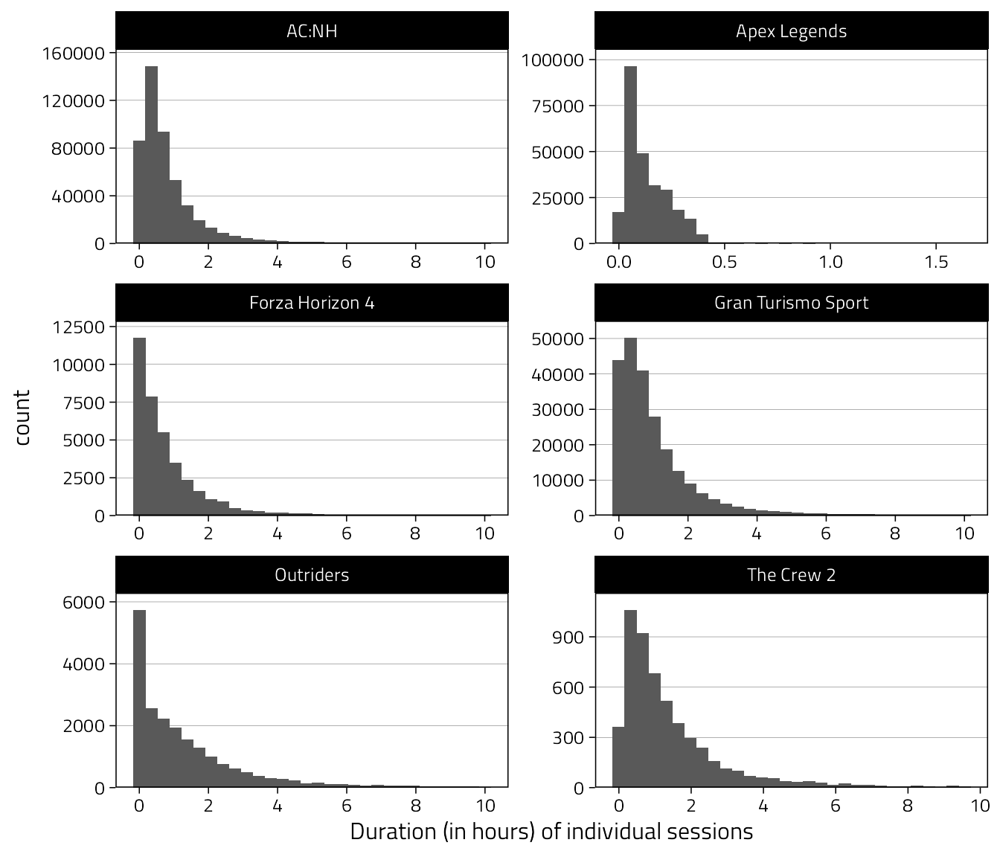

# Data wrangling

Before visualising and modelling, we clean the raw survey and behavioural (telemetry) data. Here, we also "define" participants by excluding from the raw data any individuals who didn't respond to a single survey item, or who didn't have any play data in the six week duration. Lack of play data indicates that they are not "active players", the target population of our study. 

We first load the required R packages.


```r
library(knitr)
library(kableExtra)
library(janitor)
library(here)
library(scales)
library(lubridate)
library(gtsummary)
library(multidplyr)
library(tidyverse)
library(sessioninfo)
```

And then set options for plots and parallel computations.


```r
# parallel computations
MAX_CORES <- as.numeric(Sys.getenv("MAX_CORES"))
if (is.na(MAX_CORES)) MAX_CORES <- parallel::detectCores(logical = FALSE)
cluster <- new_cluster(MAX_CORES)
# load packages on clusters
cluster_library(cluster, c("dplyr", "lubridate"))

# For saving intermediate files
dir.create("Temp", FALSE)
```

## Survey

The table in `Data/qualtrics.csv.gz` contains the raw survey data, except that we have excluded respondents who didn't consent and who withdrew from the study. We proceed now to clean that file.


```r
# read_csv() automatically decompresses the .gz archive
d <- read_csv(here("Data", "qualtrics.csv.gz"))

# Clean responses to the question asking if they played in past 2 weeks
d <- d %>%
  mutate(played = factor(!str_detect(played, "NOT")))

# Create estimated time played variable from reported hours & mins
d <- d %>%
  mutate(minutes = minutes / 60) %>%
  mutate(
    hours_est = rowSums(select(., hours, minutes), na.rm = TRUE)
  ) %>%
  # sum above returns 0 if both hours and minutes are NA, fix here:
  mutate(
    hours_est = if_else(is.na(hours) & is.na(minutes), NaN, hours_est)
  ) %>%
  select(-minutes, -hours)

# Ensure correct ordering and variable type of item responses
spane_levels <- c(
  "Very rarely or never",
  "Rarely",
  "Occasionally",
  "Sometimes",
  "Frequently",
  "Often",
  "Very often or always"
)
pens_levels <- c(
  "Strongly disagree",
  "Disagree",
  "Somewhat disagree",
  "Neither agree nor disagree",
  "Somewhat agree",
  "Agree",
  "Strongly agree"
)
d <- d %>%
  mutate(
    across(
      starts_with("spane_"),
      function(x) {
        factor(
          x,
          levels = spane_levels
        )
      }
    )
  )
d <- d %>%
  mutate(
    across(
      starts_with("pens_"),
      function(x) {
        factor(
          x,
          levels = pens_levels
        )
      }
    )
  )

# Convert item responses to numbers
d <- d %>%
  mutate(
    across(
      c(starts_with("spane_"), starts_with("pens_")),
      as.numeric
    )
  )

# Reverse reverse-scored items
reverse_items <- c(
  "pens_needs_9",
  "pens_motivations_2",
  "pens_motivations_3"
)
d <- d %>%
  mutate(
    across(all_of(reverse_items), ~ 8 - .x)
  )

# Subscale items
spane_pos_items <- paste0("spane_", c(1, 3, 5, 7, 10, 12))
spane_neg_items <- paste0("spane_", c(2, 4, 6, 8, 9, 11))
autonomy_items <- paste0("pens_needs_", 1:3)
competence_items <- paste0("pens_needs_", 4:6)
relatedness_items <- paste0("pens_needs_", 7:9)
intrinsic_items <- paste0("pens_motivations_", 1:4)
extrinsic_items <- paste0("pens_motivations_", 5:8)

# Create (sub)scale scores (means of item responses)
d <- d %>%
  mutate(
    spane_pos = rowMeans(
      select(., all_of(spane_pos_items)),
      na.rm = TRUE
    ),
    spane_neg = rowMeans(
      select(., all_of(spane_neg_items)),
      na.rm = TRUE
    ),
    spane = spane_pos - spane_neg,
    intrinsic = rowMeans(
      select(., all_of(intrinsic_items)),
      na.rm = TRUE
    ),
    extrinsic = rowMeans(
      select(., all_of(extrinsic_items)),
      na.rm = TRUE
    ),
    autonomy = rowMeans(
      select(., all_of(autonomy_items)),
      na.rm = TRUE
    ),
    competence = rowMeans(
      select(., all_of(competence_items)),
      na.rm = TRUE
    ),
    relatedness = rowMeans(
      select(., all_of(relatedness_items)),
      na.rm = TRUE
    ),
  )

# Then remove and rename variables
d <- d %>%
  select(
    -all_of(
      c(
        spane_pos_items,
        spane_neg_items,
        autonomy_items,
        competence_items,
        relatedness_items,
        intrinsic_items,
        extrinsic_items
      )
    )
  )

# Abbreviate long game names
d <- d %>%
  mutate(
    game = ifelse(game == "Animal Crossing: New Horizons", "AC:NH", game)
  )

# Gender as factor
d <- d %>%
  mutate(gender = factor(gender))

# Prettier names for tables/figures
d <- d %>%
  rename(
    Affect = spane,
    `Life satisfaction` = csas
  ) %>%
  rename_with(
    str_to_title,
    c(played:experience, game, company, intrinsic:relatedness)
  )

# Make table easier to look at by including only variables we need
# in a reasonable order
d <- d %>%
  select(
    Game, pid, wid,
    Affect, `Life satisfaction`,
    Intrinsic, Extrinsic, hours_est,
    StartDate, Age, Gender, Experience
  ) %>%
  arrange(Game, pid, wid)
```

### Exclude non-responders

At this point we remove all who did not respond to any items at any wave. For example there were "participants" who had simply clicked the consent buttons and then exited the survey. This defines a participant in combination with telemetry, below. (It is best to run this up here to speed up some computations below.)


```r
# Person-wave level indicator if person answered any survey questions at wave
d$Responded <- apply(
  select(d, Affect, `Life satisfaction`, Intrinsic, Extrinsic), 1,
  function(x) sum(!is.na(x)) > 0
)

# Person-level indicator of how many waves responded to
d <- d %>%
  group_by(Game, pid) %>%
  mutate(
    `# of waves with response` = sum(Responded),
    `Any waves with response` = factor(`# of waves with response` > 0)
  ) %>%
  ungroup()

# Table of waves answered to by game
d %>%
  distinct(
    Game, pid,
    `# of waves with response`,
    `Any waves with response`
  ) %>%
  select(-pid) %>%
  tbl_summary(by = Game) %>%
  add_overall() %>%
  as_kable_extra(
    caption = "Summary of participants with and without responses."
  ) %>% 
  kable_styling(full_width = FALSE, font_size = 12)
```

<table style="NAborder-bottom: 0; font-size: 12px; width: auto !important; margin-left: auto; margin-right: auto;" class="table">
<caption style="font-size: initial !important;">(\#tab:exclude-non-responders)Summary of participants with and without responses.</caption>
 <thead>
  <tr>
   <th style="text-align:left;"> Characteristic </th>
   <th style="text-align:left;"> Overall, N = 108,880 </th>
   <th style="text-align:left;"> AC:NH, N = 15,137 </th>
   <th style="text-align:left;"> Apex Legends, N = 1,609 </th>
   <th style="text-align:left;"> EVE Online, N = 984 </th>
   <th style="text-align:left;"> Forza Horizon 4, N = 3,519 </th>
   <th style="text-align:left;"> Gran Turismo Sport, N = 81,331 </th>
   <th style="text-align:left;"> Outriders, N = 2,051 </th>
   <th style="text-align:left;"> The Crew 2, N = 4,249 </th>
  </tr>
 </thead>
<tbody>
  <tr>
   <td style="text-align:left;"> # of waves with response </td>
   <td style="text-align:left;">  </td>
   <td style="text-align:left;">  </td>
   <td style="text-align:left;">  </td>
   <td style="text-align:left;">  </td>
   <td style="text-align:left;">  </td>
   <td style="text-align:left;">  </td>
   <td style="text-align:left;">  </td>
   <td style="text-align:left;">  </td>
  </tr>
  <tr>
   <td style="text-align:left;padding-left: 2em;" indentlevel="1"> 0 </td>
   <td style="text-align:left;"> 16,750 (15%) </td>
   <td style="text-align:left;"> 777 (5.1%) </td>
   <td style="text-align:left;"> 238 (15%) </td>
   <td style="text-align:left;"> 70 (7.1%) </td>
   <td style="text-align:left;"> 350 (9.9%) </td>
   <td style="text-align:left;"> 14,338 (18%) </td>
   <td style="text-align:left;"> 142 (6.9%) </td>
   <td style="text-align:left;"> 835 (20%) </td>
  </tr>
  <tr>
   <td style="text-align:left;padding-left: 2em;" indentlevel="1"> 1 </td>
   <td style="text-align:left;"> 61,400 (56%) </td>
   <td style="text-align:left;"> 7,990 (53%) </td>
   <td style="text-align:left;"> 923 (57%) </td>
   <td style="text-align:left;"> 590 (60%) </td>
   <td style="text-align:left;"> 1,959 (56%) </td>
   <td style="text-align:left;"> 45,997 (57%) </td>
   <td style="text-align:left;"> 1,285 (63%) </td>
   <td style="text-align:left;"> 2,656 (63%) </td>
  </tr>
  <tr>
   <td style="text-align:left;padding-left: 2em;" indentlevel="1"> 2 </td>
   <td style="text-align:left;"> 17,654 (16%) </td>
   <td style="text-align:left;"> 3,432 (23%) </td>
   <td style="text-align:left;"> 289 (18%) </td>
   <td style="text-align:left;"> 190 (19%) </td>
   <td style="text-align:left;"> 577 (16%) </td>
   <td style="text-align:left;"> 12,296 (15%) </td>
   <td style="text-align:left;"> 378 (18%) </td>
   <td style="text-align:left;"> 492 (12%) </td>
  </tr>
  <tr>
   <td style="text-align:left;padding-left: 2em;" indentlevel="1"> 3 </td>
   <td style="text-align:left;"> 13,076 (12%) </td>
   <td style="text-align:left;"> 2,938 (19%) </td>
   <td style="text-align:left;"> 159 (9.9%) </td>
   <td style="text-align:left;"> 134 (14%) </td>
   <td style="text-align:left;"> 633 (18%) </td>
   <td style="text-align:left;"> 8,700 (11%) </td>
   <td style="text-align:left;"> 246 (12%) </td>
   <td style="text-align:left;"> 266 (6.3%) </td>
  </tr>
  <tr>
   <td style="text-align:left;"> Any waves with response </td>
   <td style="text-align:left;">  </td>
   <td style="text-align:left;">  </td>
   <td style="text-align:left;">  </td>
   <td style="text-align:left;">  </td>
   <td style="text-align:left;">  </td>
   <td style="text-align:left;">  </td>
   <td style="text-align:left;">  </td>
   <td style="text-align:left;">  </td>
  </tr>
  <tr>
   <td style="text-align:left;padding-left: 2em;" indentlevel="1"> TRUE </td>
   <td style="text-align:left;"> 92,130 (85%) </td>
   <td style="text-align:left;"> 14,360 (95%) </td>
   <td style="text-align:left;"> 1,371 (85%) </td>
   <td style="text-align:left;"> 914 (93%) </td>
   <td style="text-align:left;"> 3,169 (90%) </td>
   <td style="text-align:left;"> 66,993 (82%) </td>
   <td style="text-align:left;"> 1,909 (93%) </td>
   <td style="text-align:left;"> 3,414 (80%) </td>
  </tr>
  <tr>
   <td style="text-align:left;padding-left: 2em;" indentlevel="1"> FALSE </td>
   <td style="text-align:left;"> 16,750 (15%) </td>
   <td style="text-align:left;"> 777 (5.1%) </td>
   <td style="text-align:left;"> 238 (15%) </td>
   <td style="text-align:left;"> 70 (7.1%) </td>
   <td style="text-align:left;"> 350 (9.9%) </td>
   <td style="text-align:left;"> 14,338 (18%) </td>
   <td style="text-align:left;"> 142 (6.9%) </td>
   <td style="text-align:left;"> 835 (20%) </td>
  </tr>
</tbody>
<tfoot><tr><td style="padding: 0; " colspan="100%">
<sup>1</sup> n (%)</td></tr></tfoot>
</table>

```r
# Take out all who didn't answer a single wave
d <- filter(d, `Any waves with response` == "TRUE")

# Remove the indicators
d <- select(d, -`# of waves with response`, -`Any waves with response`)
```

Calculate the exact interval between survey waves for each person x wave


```r
survey_intervals <- d %>%
  select(Game, pid, wid, StartDate) %>%
  arrange(pid, wid) %>%
  # Make sure that there is a row for each subject X wave
  # so interval is calculated correctly
  complete(wid, nesting(pid, Game)) %>%
  arrange(pid, wid) %>%
  group_by(pid) %>%
  partition(cluster) %>%
  # Interval between waves in days
  mutate(
    interval = (as.numeric(StartDate) - as.numeric(lag(StartDate))) /
      3600 / 24
  ) %>%
  collect() %>%
  ungroup() %>%
  select(wid, pid, Game, interval)
d <- left_join(d, survey_intervals)
```

We then have a clean table of the relevant survey responses, ready to be joined with the game play behaviour data (telemetry), below.

## Telemetry

We first load the game behaviour data sets, saved in game-specific compressed comma-separated value files. These files are minimally processed versions of ones received from publishers. (Players who didn't explicitly consent in the survey were excluded, variable names were harmonised, and tables were reshaped to the same format.)


```r
# Animal Crossing
t_acnh <- read_csv(here("Data", "telemetry-acnh.csv.gz")) %>%
  mutate(Game = "AC:NH")

# Apex Legends
t_al <- read_csv(here("Data", "telemetry-apex-legends.csv.gz"))
# Select relevant variables
t_al <- t_al %>%
  select(
    pid, session_start, session_end
  ) %>%
  # Format datetimes
  transmute(
    pid,
    session_start = as_datetime(mdy_hm(session_start), tz = "UTC"),
    session_end = as_datetime(mdy_hm(session_end), tz = "UTC"),
    Game = "Apex Legends"
  )

# Eve
t_eo <- read_csv(here("Data", "telemetry-eve-online.csv.gz"))
t_eo <- t_eo %>% 
  mutate(
    Game = "EVE Online"
  )

# Forza Horizon 4
t_fh <- read_csv(here("Data", "telemetry-forza-horizon-4.csv.gz"))
t_fh <- t_fh %>%
  mutate(
    session_start = parse_date_time(session_start, "%m/%d/%Y %I:%M:%S %p"),
    session_end = parse_date_time(session_end, "%m/%d/%Y %I:%M:%S %p")
  ) %>%
  mutate(Game = "Forza Horizon 4")

# Gran Turismo
t_gts <- read_csv(here("Data", "telemetry-gran-turismo-sport.csv.gz")) %>%
  mutate(
    Game = "Gran Turismo Sport",
    pid = as.character(pid)
  )

# Outriders
t_or <- read_csv(here("Data", "telemetry-outriders.csv.gz"))
# Select relevant variables
t_or <- t_or %>%
  select(pid, session_start, session_end) %>%
  mutate(Game = "Outriders")

# The Crew 2
# Session times are constructed from a signal sent in 5-minute intervals,
#  therefore if the end timestamp is missing, the session was <5 minutes in duration, and therefore not used
t_tc2 <- read_csv(here("Data", "telemetry-the-crew-2.csv.gz"))
# Drop <5min sessions and name game
t_tc2 <- t_tc2 %>% 
  drop_na(session_end) %>% 
  mutate(Game = "The Crew 2")
```

Merge games tables to one table


```r
# Merge games' telemetry to one table
d_t <- bind_rows(
  t_acnh, t_al, t_eo, t_fh, t_gts, t_or, t_tc2
)
```

### A note on Apex Legends sessions

Apex Legends "sessions" are individual matches, and therefore actual gameplay sessions are longer in duration and consist of many matches. Therefore looking at individual session durations or counting the number of "sessions" for Apex Legends is misleading. If the individual sessions are of interest, you should first aggregate the matches to sessions by e.g. merging all matches that occur within say 5 minutes of each other. 

### Clean sessions

Calculate hours played for each session


```r
d_t <- d_t %>%
  mutate(
    interval = interval(session_start, session_end)
  ) %>%
  mutate(Hours = as.numeric(as.duration(interval)) / 3600)
```

A table of the ranges of the raw session durations reveals some implausible values, which can happen e.g. when a device's clock is improperly configured. We therefore remove bad sessions (ones that were outside the total measurement window, that had negative durations or durations greater than 10 hours.)


```r
# Create indicators for implausible timestamps
d_t <- d_t %>%
  mutate(
    `Session under 0h` = Hours < 0,
    `Session over 10h` = Hours > 10,
    `Session before` = session_end < min(d$StartDate) - days(14),
    `Session after` = session_start > max(d$StartDate)
  )

# Show a table of raw sessions and potential bad sessions
d_t %>%
  select(Game, Hours, starts_with("Session ")) %>%
  tbl_summary(
    by = Game,
    statistic = list(all_continuous() ~ "{median} ({min}, {max})")
  ) %>%
  add_overall() %>%
  as_kable_extra(caption = "Summaries of raw session durations") %>% 
  kable_styling(full_width = FALSE, font_size = 12)
```

<table style="NAborder-bottom: 0; font-size: 12px; width: auto !important; margin-left: auto; margin-right: auto;" class="table">
<caption style="font-size: initial !important;">(\#tab:clean-sessions)Summaries of raw session durations</caption>
 <thead>
  <tr>
   <th style="text-align:left;"> Characteristic </th>
   <th style="text-align:left;"> Overall, N = 1,697,802 </th>
   <th style="text-align:left;"> AC:NH, N = 640,766 </th>
   <th style="text-align:left;"> Apex Legends, N = 383,200 </th>
   <th style="text-align:left;"> EVE Online, N = 93,388 </th>
   <th style="text-align:left;"> Forza Horizon 4, N = 47,905 </th>
   <th style="text-align:left;"> Gran Turismo Sport, N = 363,735 </th>
   <th style="text-align:left;"> Outriders, N = 160,351 </th>
   <th style="text-align:left;"> The Crew 2, N = 8,457 </th>
  </tr>
 </thead>
<tbody>
  <tr>
   <td style="text-align:left;"> Hours </td>
   <td style="text-align:left;"> 0.37 (-189,092.51, 346,154.65) </td>
   <td style="text-align:left;"> 0.55 (-189,092.51, 346,154.65) </td>
   <td style="text-align:left;"> 0.10 (-0.30, 1.47) </td>
   <td style="text-align:left;"> 0.38 (0.00, 23.93) </td>
   <td style="text-align:left;"> 0.42 (0.00, 23.92) </td>
   <td style="text-align:left;"> 0.66 (0.00, 24.00) </td>
   <td style="text-align:left;"> 0.94 (0.00, 719.22) </td>
   <td style="text-align:left;"> 0.92 (0.06, 167.97) </td>
  </tr>
  <tr>
   <td style="text-align:left;"> Session under 0h </td>
   <td style="text-align:left;"> 8,626 (0.5%) </td>
   <td style="text-align:left;"> 8,623 (1.3%) </td>
   <td style="text-align:left;"> 2 (&lt;0.1%) </td>
   <td style="text-align:left;"> 0 (0%) </td>
   <td style="text-align:left;"> 0 (0%) </td>
   <td style="text-align:left;"> 0 (0%) </td>
   <td style="text-align:left;"> 1 (&lt;0.1%) </td>
   <td style="text-align:left;"> 0 (0%) </td>
  </tr>
  <tr>
   <td style="text-align:left;"> Session over 10h </td>
   <td style="text-align:left;"> 32,828 (1.9%) </td>
   <td style="text-align:left;"> 20,921 (3.3%) </td>
   <td style="text-align:left;"> 0 (0%) </td>
   <td style="text-align:left;"> 2,255 (2.4%) </td>
   <td style="text-align:left;"> 95 (0.2%) </td>
   <td style="text-align:left;"> 1,774 (0.5%) </td>
   <td style="text-align:left;"> 7,518 (4.7%) </td>
   <td style="text-align:left;"> 265 (3.1%) </td>
  </tr>
  <tr>
   <td style="text-align:left;"> Session before </td>
   <td style="text-align:left;"> 107,417 (6.3%) </td>
   <td style="text-align:left;"> 694 (0.1%) </td>
   <td style="text-align:left;"> 5,879 (1.5%) </td>
   <td style="text-align:left;"> 0 (0%) </td>
   <td style="text-align:left;"> 0 (0%) </td>
   <td style="text-align:left;"> 0 (0%) </td>
   <td style="text-align:left;"> 100,844 (63%) </td>
   <td style="text-align:left;"> 0 (0%) </td>
  </tr>
  <tr>
   <td style="text-align:left;"> Session after </td>
   <td style="text-align:left;"> 1,017 (&lt;0.1%) </td>
   <td style="text-align:left;"> 0 (0%) </td>
   <td style="text-align:left;"> 0 (0%) </td>
   <td style="text-align:left;"> 0 (0%) </td>
   <td style="text-align:left;"> 0 (0%) </td>
   <td style="text-align:left;"> 0 (0%) </td>
   <td style="text-align:left;"> 1,017 (0.6%) </td>
   <td style="text-align:left;"> 0 (0%) </td>
  </tr>
</tbody>
<tfoot><tr><td style="padding: 0; " colspan="100%">
<sup>1</sup> Median (Range); n (%)</td></tr></tfoot>
</table>

```r
# Then remove flagged sessions from data
d_t <- d_t %>%
  filter(
    between(Hours, 0, 10),
    !`Session before`,
    !`Session after`
  )

# And now unnecessary variables
d_t <- d_t %>% 
  select(-starts_with("Session "))
```

#### Overlapping sessions

Deal with potentially overlapping sessions. A function to do this.


```r
source(here("R/merge_intervals.R"))
```

Then merge all overlapping sessions for a given participant.


```r
# explicitly cache
data_path <- here("Temp", "session-overlap-merged.rds")
if (file.exists(data_path)) {
  message("Loading cached data")
  d_t <- read_rds(file = data_path)
} else {
  message(
    "Merging overlapping sessions (grab a coffee, this will take a while)"
  )
  cluster_copy(cluster, c("merge_interval", "merge_intervals_all"))
  d_t <- d_t %>%
    group_by(pid, Game) %>%
    partition(cluster) %>%
    mutate(
      interval = interval(session_start, session_end)
    ) %>%
    arrange(session_start, session_end, .by_group = TRUE) %>%
    mutate(interval_merged = merge_intervals_all(interval)) %>%
    collect() %>%
    ungroup()
  write_rds(d_t, file = data_path)
}
```

Examples of overlapping sessions


```r
d_t %>%
  arrange(session_start, session_end) %>%
  filter(pid == "de9b7f238ba168b0") %>%
  mutate(interval = interval(session_start, session_end)) %>%
  mutate(overlaps = int_overlaps(interval, lag(interval))) %>% 
  head() %>% 
  kbl() %>% 
  kable_styling(full_width = FALSE, font_size = 12)
```

<table class="table" style="font-size: 12px; width: auto !important; margin-left: auto; margin-right: auto;">
 <thead>
  <tr>
   <th style="text-align:left;"> pid </th>
   <th style="text-align:left;"> session_start </th>
   <th style="text-align:left;"> session_end </th>
   <th style="text-align:left;"> Game </th>
   <th style="text-align:right;"> interval </th>
   <th style="text-align:right;"> Hours </th>
   <th style="text-align:right;"> interval_merged </th>
   <th style="text-align:left;"> overlaps </th>
  </tr>
 </thead>
<tbody>
  <tr>
   <td style="text-align:left;"> de9b7f238ba168b0 </td>
   <td style="text-align:left;"> 2021-07-03 02:59:26 </td>
   <td style="text-align:left;"> 2021-07-03 04:40:27 </td>
   <td style="text-align:left;"> AC:NH </td>
   <td style="text-align:right;"> 2021-07-03 02:59:26 UTC--2021-07-03 04:40:27 UTC </td>
   <td style="text-align:right;"> 1.6836111 </td>
   <td style="text-align:right;"> 2021-07-03 02:59:26 UTC--2021-07-03 04:40:27 UTC </td>
   <td style="text-align:left;"> NA </td>
  </tr>
  <tr>
   <td style="text-align:left;"> de9b7f238ba168b0 </td>
   <td style="text-align:left;"> 2021-07-03 03:03:19 </td>
   <td style="text-align:left;"> 2021-07-03 04:26:54 </td>
   <td style="text-align:left;"> AC:NH </td>
   <td style="text-align:right;"> 2021-07-03 03:03:19 UTC--2021-07-03 04:26:54 UTC </td>
   <td style="text-align:right;"> 1.3930556 </td>
   <td style="text-align:right;"> NA--NA </td>
   <td style="text-align:left;"> TRUE </td>
  </tr>
  <tr>
   <td style="text-align:left;"> de9b7f238ba168b0 </td>
   <td style="text-align:left;"> 2021-07-03 06:55:19 </td>
   <td style="text-align:left;"> 2021-07-03 07:33:04 </td>
   <td style="text-align:left;"> AC:NH </td>
   <td style="text-align:right;"> 2021-07-03 06:55:19 UTC--2021-07-03 07:33:04 UTC </td>
   <td style="text-align:right;"> 0.6291667 </td>
   <td style="text-align:right;"> 2021-07-03 06:55:19 UTC--2021-07-03 07:33:04 UTC </td>
   <td style="text-align:left;"> FALSE </td>
  </tr>
  <tr>
   <td style="text-align:left;"> de9b7f238ba168b0 </td>
   <td style="text-align:left;"> 2021-07-03 08:00:01 </td>
   <td style="text-align:left;"> 2021-07-03 08:01:49 </td>
   <td style="text-align:left;"> AC:NH </td>
   <td style="text-align:right;"> 2021-07-03 08:00:01 UTC--2021-07-03 08:01:49 UTC </td>
   <td style="text-align:right;"> 0.0300000 </td>
   <td style="text-align:right;"> 2021-07-03 08:00:01 UTC--2021-07-03 08:01:49 UTC </td>
   <td style="text-align:left;"> FALSE </td>
  </tr>
  <tr>
   <td style="text-align:left;"> de9b7f238ba168b0 </td>
   <td style="text-align:left;"> 2021-07-03 08:15:07 </td>
   <td style="text-align:left;"> 2021-07-03 11:50:21 </td>
   <td style="text-align:left;"> AC:NH </td>
   <td style="text-align:right;"> 2021-07-03 08:15:07 UTC--2021-07-03 11:50:21 UTC </td>
   <td style="text-align:right;"> 3.5872222 </td>
   <td style="text-align:right;"> 2021-07-03 08:15:07 UTC--2021-07-03 13:36:21 UTC </td>
   <td style="text-align:left;"> FALSE </td>
  </tr>
  <tr>
   <td style="text-align:left;"> de9b7f238ba168b0 </td>
   <td style="text-align:left;"> 2021-07-03 11:02:22 </td>
   <td style="text-align:left;"> 2021-07-03 13:36:21 </td>
   <td style="text-align:left;"> AC:NH </td>
   <td style="text-align:right;"> 2021-07-03 11:02:22 UTC--2021-07-03 13:36:21 UTC </td>
   <td style="text-align:right;"> 2.5663889 </td>
   <td style="text-align:right;"> NA--NA </td>
   <td style="text-align:left;"> TRUE </td>
  </tr>
</tbody>
</table>

We then replace the original intervals with the new ones (dropping many rows that are now redundant and set to NA), and then remove the now possibly invalid start and end times and durations (this corrected information is now contained in `interval`).


```r
d_t <- d_t %>% 
  select(-interval) %>% 
  rename(interval = interval_merged) %>% 
  drop_na(interval) %>% 
  select(Game, pid, interval)
```

We then re-remove sessions longer than 10h, which could have been created due to merging.


```r
d_t <- d_t %>% 
  filter(as.numeric(as.duration(interval))/3600 <= 10)
```

### Correlate sessions to waves


```r
# Correlate game sessions to waves
# Start by expanding the survey data to include NAs for waves with no responses. This enables using telemetry for waves where survey wasn't completed.

# Complete data for all pid-wid combinations (all pids have 3 rows; new rows have NAs for all other variables)
d <- d %>%
  complete(nesting(Game, pid), wid)

# If a survey wasn't responded to, replace start date with previous wave's date + two weeks. Enables creating a two-week window preceding "survey response" to count hours played.
d <- d %>%
  arrange(Game, pid, wid) %>%
  group_by(Game, pid) %>%
  partition(cluster) %>%
  # Fill potential missing wave 2 with wave 1 + 14
  mutate(
    StartDate = if_else(
      is.na(StartDate),
      lag(StartDate, 1) + days(14),
      StartDate
    )
  ) %>%
  # Fill potential missing wave 3 with wave 2 + 14
  mutate(
    StartDate = if_else(
      is.na(StartDate),
      lag(StartDate, 1) + days(14),
      StartDate
    )
  ) %>%
  collect() %>%
  ungroup()

# The survey data frame now has a row for each participant-wave, even when survey wasn't answered by that participant at that wave.

# Join all play sessions to every wave of each player
d_t <- d %>%
  select(Game, pid, wid, StartDate) %>%
  left_join(d_t)

# Then keep only those sessions that were in that wave's time window:
# Is session start and/or end within 0-2 weeks preceding survey?
d_t <- d_t %>%
  mutate(
    start_in = int_start(interval) %within%
      interval(StartDate - days(14), StartDate),
    end_in = int_end(interval) %within%
      interval(StartDate - days(14), StartDate)
  )
d_t <- d_t %>%
  filter(start_in | end_in)

# Exact duration depends on if session was completely in window or partially
d_t <- d_t %>%
  mutate(
    Hours = case_when(
      # Entire session in window: All time counts
      start_in & end_in ~ as.duration(interval),
      # Started before window, ended within: start of window to end of session
      !start_in & end_in ~ as.duration(
        int_end(interval) - (StartDate - days(14))
      ),
      # Started in window, ended after: Session start to end of window
      start_in & !end_in ~ as.duration(StartDate - int_start(interval))
    )
  ) %>%
  mutate(Hours = as.numeric(Hours) / 3600)
```

### Histograms of session durations

Then look at individual sessions' durations. Recall that Apex Legends sessions are individual matches so they will look a lot shorter.


```r
d_t %>%
  ggplot(aes(Hours)) +
  geom_histogram() +
  scale_x_continuous(
    "Duration (in hours) of individual sessions",
    breaks = pretty_breaks()
  ) +
  scale_y_continuous(expand = expansion(c(0, .1))) +
  facet_wrap("Game", scales = "free", ncol = 2)
```

<div class="figure" style="text-align: center">

<p class="caption">(\#fig:session-duration-histograms)Histograms of individual session durations (after taking out bad sessions and merging overlapping sessions).</p>
</div>

### Aggregate session durations

Aggregate to sum hours for each wave


```r
# Summarise per wave to sum hours and number of sessions
# this also sets sum hours to zero for people with no telemetry
d_t <- d_t %>%
  group_by(Game, pid, wid) %>%
  summarise(
    Sessions = sum(!is.na(Hours)),
    Hours = sum(Hours, na.rm = TRUE) # is 0 if all Hours are NA
  ) %>%
  ungroup()
```

These are the average session numbers and hours played in the total study period


```r
d_t %>% 
  select(-pid, -wid) %>% 
  tbl_summary(by = Game) %>% 
  add_overall() %>% 
  as_kable_extra(
    caption = "Average session numbers and hours played in the whole study"
  ) %>% 
  kable_styling(full_width = FALSE, font_size = 12)
```

<table style="NAborder-bottom: 0; font-size: 12px; width: auto !important; margin-left: auto; margin-right: auto;" class="table">
<caption style="font-size: initial !important;">(\#tab:unnamed-chunk-4)Average session numbers and hours played in the whole study</caption>
 <thead>
  <tr>
   <th style="text-align:left;"> Characteristic </th>
   <th style="text-align:left;"> Overall, N = 85,342 </th>
   <th style="text-align:left;"> AC:NH, N = 34,739 </th>
   <th style="text-align:left;"> Apex Legends, N = 2,941 </th>
   <th style="text-align:left;"> EVE Online, N = 2,522 </th>
   <th style="text-align:left;"> Forza Horizon 4, N = 4,587 </th>
   <th style="text-align:left;"> Gran Turismo Sport, N = 37,009 </th>
   <th style="text-align:left;"> Outriders, N = 2,645 </th>
   <th style="text-align:left;"> The Crew 2, N = 899 </th>
  </tr>
 </thead>
<tbody>
  <tr>
   <td style="text-align:left;"> Sessions </td>
   <td style="text-align:left;"> 6 (2, 15) </td>
   <td style="text-align:left;"> 11 (4, 19) </td>
   <td style="text-align:left;"> 61 (20, 124) </td>
   <td style="text-align:left;"> 15 (9, 24) </td>
   <td style="text-align:left;"> 4 (2, 10) </td>
   <td style="text-align:left;"> 3 (1, 8) </td>
   <td style="text-align:left;"> 3 (1, 8) </td>
   <td style="text-align:left;"> 3 (1, 7) </td>
  </tr>
  <tr>
   <td style="text-align:left;"> Hours </td>
   <td style="text-align:left;"> 4 (1, 11) </td>
   <td style="text-align:left;"> 6 (2, 15) </td>
   <td style="text-align:left;"> 8 (3, 17) </td>
   <td style="text-align:left;"> 10 (1, 33) </td>
   <td style="text-align:left;"> 2 (0, 7) </td>
   <td style="text-align:left;"> 3 (1, 8) </td>
   <td style="text-align:left;"> 3 (1, 13) </td>
   <td style="text-align:left;"> 4 (1, 10) </td>
  </tr>
</tbody>
<tfoot><tr><td style="padding: 0; " colspan="100%">
<sup>1</sup> Median (IQR)</td></tr></tfoot>
</table>

### Merge telemetry to survey data


```r
# Join back to survey data
d <- left_join(d, d_t)

# This creates NA hours for people who didn't exist in telemetry,
# thus we can replace NAs with zeros.
d <- d %>%
  mutate(Hours = replace_na(Hours, 0))
```

### Exclude participants with no telemetry


```r
# Indicator if person played at wave
d <- d %>%
  mutate(Played = Hours > 0)

# Create participant-level indicator of whether there was any telemetry
d <- d %>%
  group_by(Game, pid) %>%
  mutate(
    `# of waves with play` = sum(Played),
    `Any waves with play` = factor(`# of waves with play` > 0)
  ) %>%
  ungroup()

# Table of waves with play by game
d %>%
  distinct(
    Game, pid,
    `# of waves with play`,
    `Any waves with play`
  ) %>%
  select(-pid) %>%
  tbl_summary(by = Game) %>%
  add_overall() %>%
  as_kable_extra(
    caption = "Summary of participants with and without responses."
  ) %>% 
  kable_styling(full_width = FALSE, font_size = 12)
```

<table style="NAborder-bottom: 0; font-size: 12px; width: auto !important; margin-left: auto; margin-right: auto;" class="table">
<caption style="font-size: initial !important;">(\#tab:exclude-no-telemetry)Summary of participants with and without responses.</caption>
 <thead>
  <tr>
   <th style="text-align:left;"> Characteristic </th>
   <th style="text-align:left;"> Overall, N = 92,130 </th>
   <th style="text-align:left;"> AC:NH, N = 14,360 </th>
   <th style="text-align:left;"> Apex Legends, N = 1,371 </th>
   <th style="text-align:left;"> EVE Online, N = 914 </th>
   <th style="text-align:left;"> Forza Horizon 4, N = 3,169 </th>
   <th style="text-align:left;"> Gran Turismo Sport, N = 66,993 </th>
   <th style="text-align:left;"> Outriders, N = 1,909 </th>
   <th style="text-align:left;"> The Crew 2, N = 3,414 </th>
  </tr>
 </thead>
<tbody>
  <tr>
   <td style="text-align:left;"> # of waves with play </td>
   <td style="text-align:left;">  </td>
   <td style="text-align:left;">  </td>
   <td style="text-align:left;">  </td>
   <td style="text-align:left;">  </td>
   <td style="text-align:left;">  </td>
   <td style="text-align:left;">  </td>
   <td style="text-align:left;">  </td>
   <td style="text-align:left;">  </td>
  </tr>
  <tr>
   <td style="text-align:left;padding-left: 2em;" indentlevel="1"> 0 </td>
   <td style="text-align:left;"> 53,195 (58%) </td>
   <td style="text-align:left;"> 714 (5.0%) </td>
   <td style="text-align:left;"> 213 (16%) </td>
   <td style="text-align:left;"> 9 (1.0%) </td>
   <td style="text-align:left;"> 1,188 (37%) </td>
   <td style="text-align:left;"> 47,735 (71%) </td>
   <td style="text-align:left;"> 379 (20%) </td>
   <td style="text-align:left;"> 2,957 (87%) </td>
  </tr>
  <tr>
   <td style="text-align:left;padding-left: 2em;" indentlevel="1"> 1 </td>
   <td style="text-align:left;"> 11,562 (13%) </td>
   <td style="text-align:left;"> 1,896 (13%) </td>
   <td style="text-align:left;"> 175 (13%) </td>
   <td style="text-align:left;"> 50 (5.5%) </td>
   <td style="text-align:left;"> 570 (18%) </td>
   <td style="text-align:left;"> 7,919 (12%) </td>
   <td style="text-align:left;"> 771 (40%) </td>
   <td style="text-align:left;"> 181 (5.3%) </td>
  </tr>
  <tr>
   <td style="text-align:left;padding-left: 2em;" indentlevel="1"> 2 </td>
   <td style="text-align:left;"> 8,720 (9.5%) </td>
   <td style="text-align:left;"> 2,407 (17%) </td>
   <td style="text-align:left;"> 183 (13%) </td>
   <td style="text-align:left;"> 93 (10%) </td>
   <td style="text-align:left;"> 494 (16%) </td>
   <td style="text-align:left;"> 5,009 (7.5%) </td>
   <td style="text-align:left;"> 424 (22%) </td>
   <td style="text-align:left;"> 110 (3.2%) </td>
  </tr>
  <tr>
   <td style="text-align:left;padding-left: 2em;" indentlevel="1"> 3 </td>
   <td style="text-align:left;"> 18,653 (20%) </td>
   <td style="text-align:left;"> 9,343 (65%) </td>
   <td style="text-align:left;"> 800 (58%) </td>
   <td style="text-align:left;"> 762 (83%) </td>
   <td style="text-align:left;"> 917 (29%) </td>
   <td style="text-align:left;"> 6,330 (9.4%) </td>
   <td style="text-align:left;"> 335 (18%) </td>
   <td style="text-align:left;"> 166 (4.9%) </td>
  </tr>
  <tr>
   <td style="text-align:left;"> Any waves with play </td>
   <td style="text-align:left;">  </td>
   <td style="text-align:left;">  </td>
   <td style="text-align:left;">  </td>
   <td style="text-align:left;">  </td>
   <td style="text-align:left;">  </td>
   <td style="text-align:left;">  </td>
   <td style="text-align:left;">  </td>
   <td style="text-align:left;">  </td>
  </tr>
  <tr>
   <td style="text-align:left;padding-left: 2em;" indentlevel="1"> TRUE </td>
   <td style="text-align:left;"> 38,935 (42%) </td>
   <td style="text-align:left;"> 13,646 (95%) </td>
   <td style="text-align:left;"> 1,158 (84%) </td>
   <td style="text-align:left;"> 905 (99%) </td>
   <td style="text-align:left;"> 1,981 (63%) </td>
   <td style="text-align:left;"> 19,258 (29%) </td>
   <td style="text-align:left;"> 1,530 (80%) </td>
   <td style="text-align:left;"> 457 (13%) </td>
  </tr>
  <tr>
   <td style="text-align:left;padding-left: 2em;" indentlevel="1"> FALSE </td>
   <td style="text-align:left;"> 53,195 (58%) </td>
   <td style="text-align:left;"> 714 (5.0%) </td>
   <td style="text-align:left;"> 213 (16%) </td>
   <td style="text-align:left;"> 9 (1.0%) </td>
   <td style="text-align:left;"> 1,188 (37%) </td>
   <td style="text-align:left;"> 47,735 (71%) </td>
   <td style="text-align:left;"> 379 (20%) </td>
   <td style="text-align:left;"> 2,957 (87%) </td>
  </tr>
</tbody>
<tfoot><tr><td style="padding: 0; " colspan="100%">
<sup>1</sup> n (%)</td></tr></tfoot>
</table>

```r
# Take out all who didn't answer a single wave
d <- filter(d, `Any waves with play` == "TRUE")

# Remove the indicators
d <- select(d, -`# of waves with play`, -`Any waves with play`)
```

### Exclude extreme player-wave hours played


```r
d %>%
  mutate(Over_16h_day_telemetry = Hours / 14 > 16) %>%
  mutate(Over_16h_day_subjective = hours_est / 14 > 16) %>%
  select(Game, starts_with("Over_")) %>%
  tbl_summary(by = Game) %>%
  add_overall() %>%
  as_kable_extra(
    caption = "Numbers (%) of person-waves with more than 16h/day of play"
  ) %>% 
  kable_styling(full_width = FALSE, font_size = 12)
```

<table style="NAborder-bottom: 0; font-size: 12px; width: auto !important; margin-left: auto; margin-right: auto;" class="table">
<caption style="font-size: initial !important;">(\#tab:exclude-extreme-wave-hours)Numbers (%) of person-waves with more than 16h/day of play</caption>
 <thead>
  <tr>
   <th style="text-align:left;"> Characteristic </th>
   <th style="text-align:left;"> Overall, N = 116,805 </th>
   <th style="text-align:left;"> AC:NH, N = 40,938 </th>
   <th style="text-align:left;"> Apex Legends, N = 3,474 </th>
   <th style="text-align:left;"> EVE Online, N = 2,715 </th>
   <th style="text-align:left;"> Forza Horizon 4, N = 5,943 </th>
   <th style="text-align:left;"> Gran Turismo Sport, N = 57,774 </th>
   <th style="text-align:left;"> Outriders, N = 4,590 </th>
   <th style="text-align:left;"> The Crew 2, N = 1,371 </th>
  </tr>
 </thead>
<tbody>
  <tr>
   <td style="text-align:left;"> Over_16h_day_telemetry </td>
   <td style="text-align:left;"> 0 (0%) </td>
   <td style="text-align:left;"> 0 (0%) </td>
   <td style="text-align:left;"> 0 (0%) </td>
   <td style="text-align:left;"> 0 (0%) </td>
   <td style="text-align:left;"> 0 (0%) </td>
   <td style="text-align:left;"> 0 (0%) </td>
   <td style="text-align:left;"> 0 (0%) </td>
   <td style="text-align:left;"> 0 (0%) </td>
  </tr>
  <tr>
   <td style="text-align:left;"> Over_16h_day_subjective </td>
   <td style="text-align:left;"> 130 (0.2%) </td>
   <td style="text-align:left;"> 84 (0.4%) </td>
   <td style="text-align:left;"> 8 (0.5%) </td>
   <td style="text-align:left;"> 2 (0.2%) </td>
   <td style="text-align:left;"> 6 (0.2%) </td>
   <td style="text-align:left;"> 26 (&lt;0.1%) </td>
   <td style="text-align:left;"> 2 (&lt;0.1%) </td>
   <td style="text-align:left;"> 2 (0.3%) </td>
  </tr>
  <tr>
   <td style="text-align:left;padding-left: 2em;" indentlevel="1"> Unknown </td>
   <td style="text-align:left;"> 53,709 </td>
   <td style="text-align:left;"> 18,660 </td>
   <td style="text-align:left;"> 1,789 </td>
   <td style="text-align:left;"> 1,386 </td>
   <td style="text-align:left;"> 2,693 </td>
   <td style="text-align:left;"> 26,063 </td>
   <td style="text-align:left;"> 2,360 </td>
   <td style="text-align:left;"> 758 </td>
  </tr>
</tbody>
<tfoot><tr><td style="padding: 0; " colspan="100%">
<sup>1</sup> n (%)</td></tr></tfoot>
</table>

```r
d <- d %>%
  mutate(
    Hours = if_else(Hours / 14 > 8, NaN, Hours),
    hours_est = if_else(hours_est / 14 > 8, NaN, hours_est)
  )
```

## Exclude bad survey intervals

Participants could complete the survey waves whenever after receiving the invitation emails. Therefore participants could e.g. complete wave 3 and then be reminded to go back to the wave 2 invitation email and do it. We therefore exclude all person-waves with negative intervals. We do this here so that the full join could be performed above. Note, interval is NA if the wave wasn't completed, resulting to unknown values below.


```r
d %>%
  mutate(Negative_interval = interval < 0) %>%
  select(Game, Negative_interval) %>%
  tbl_summary(by = Game) %>%
  add_overall() %>%
  as_kable_extra(
    caption = "Numbers (%) of person-waves with negative intervals"
  ) %>% 
  kable_styling(full_width = FALSE, font_size = 12)
```

<table style="NAborder-bottom: 0; font-size: 12px; width: auto !important; margin-left: auto; margin-right: auto;" class="table">
<caption style="font-size: initial !important;">(\#tab:exclude-survey-intervals)Numbers (%) of person-waves with negative intervals</caption>
 <thead>
  <tr>
   <th style="text-align:left;"> Characteristic </th>
   <th style="text-align:left;"> Overall, N = 116,805 </th>
   <th style="text-align:left;"> AC:NH, N = 40,938 </th>
   <th style="text-align:left;"> Apex Legends, N = 3,474 </th>
   <th style="text-align:left;"> EVE Online, N = 2,715 </th>
   <th style="text-align:left;"> Forza Horizon 4, N = 5,943 </th>
   <th style="text-align:left;"> Gran Turismo Sport, N = 57,774 </th>
   <th style="text-align:left;"> Outriders, N = 4,590 </th>
   <th style="text-align:left;"> The Crew 2, N = 1,371 </th>
  </tr>
 </thead>
<tbody>
  <tr>
   <td style="text-align:left;"> Negative_interval </td>
   <td style="text-align:left;"> 35 (0.1%) </td>
   <td style="text-align:left;"> 19 (0.2%) </td>
   <td style="text-align:left;"> 0 (0%) </td>
   <td style="text-align:left;"> 1 (0.2%) </td>
   <td style="text-align:left;"> 1 (&lt;0.1%) </td>
   <td style="text-align:left;"> 14 (0.1%) </td>
   <td style="text-align:left;"> 0 (0%) </td>
   <td style="text-align:left;"> 0 (0%) </td>
  </tr>
  <tr>
   <td style="text-align:left;padding-left: 2em;" indentlevel="1"> Unknown </td>
   <td style="text-align:left;"> 91,717 </td>
   <td style="text-align:left;"> 32,232 </td>
   <td style="text-align:left;"> 2,798 </td>
   <td style="text-align:left;"> 2,305 </td>
   <td style="text-align:left;"> 4,610 </td>
   <td style="text-align:left;"> 44,626 </td>
   <td style="text-align:left;"> 3,939 </td>
   <td style="text-align:left;"> 1,207 </td>
  </tr>
</tbody>
<tfoot><tr><td style="padding: 0; " colspan="100%">
<sup>1</sup> n (%)</td></tr></tfoot>
</table>

```r
d <- d %>%
  filter(interval > 0 | is.na(interval))
```

## Save cleaned data


```r
write_rds(d, file = here("Data", "cleaned_data.rds"), compress = "gz")
```

## Test data cleaning

Run some tests on the cleaned data.

```r
library(testthat)
test_dir(here("R/tests/testthat"))
```

```
## ✓ | F W S  OK | Context
## 
⠏ |         0 | session-overlap                                                 
⠸ |         4 | session-overlap                                                 
⠼ |         5 | session-overlap                                                 
✓ |         5 | session-overlap [18.2s]
## 
## ══ Results ═════════════════════════════════════════════════════════════════════
## Duration: 18.2 s
## 
## [ FAIL 0 | WARN 0 | SKIP 0 | PASS 5 ]
## 
## Keep up the good work.
```

## System information


```r
sessionInfo()
```

```
## R version 4.1.2 (2021-11-01)
## Platform: aarch64-apple-darwin20 (64-bit)
## Running under: macOS Monterey 12.2.1
## 
## Matrix products: default
## LAPACK: /Library/Frameworks/R.framework/Versions/4.1-arm64/Resources/lib/libRlapack.dylib
## 
## locale:
## [1] en_US.UTF-8/en_US.UTF-8/en_US.UTF-8/C/en_US.UTF-8/en_US.UTF-8
## 
## attached base packages:
## [1] stats     graphics  grDevices datasets  utils     methods   base     
## 
## other attached packages:
##  [1] testthat_3.1.0    sessioninfo_1.1.1 forcats_0.5.1     stringr_1.4.0    
##  [5] dplyr_1.0.7       purrr_0.3.4       readr_2.0.2       tidyr_1.1.4      
##  [9] tibble_3.1.5      tidyverse_1.3.1   multidplyr_0.1.0  gtsummary_1.4.2  
## [13] lubridate_1.8.0   scales_1.1.1      here_1.0.1        janitor_2.1.0    
## [17] kableExtra_1.3.4  knitr_1.36        ggplot2_3.3.5    
## 
## loaded via a namespace (and not attached):
##  [1] fs_1.5.0            bit64_4.0.5         webshot_0.5.2      
##  [4] httr_1.4.2          rprojroot_2.0.2     tools_4.1.2        
##  [7] backports_1.2.1     bslib_0.3.1         utf8_1.2.2         
## [10] R6_2.5.1            DBI_1.1.1           colorspace_2.0-2   
## [13] withr_2.4.2         tidyselect_1.1.1    processx_3.5.2     
## [16] downlit_0.2.1       bit_4.0.4           compiler_4.1.2     
## [19] textshaping_0.3.5   cli_3.0.1           rvest_1.0.1        
## [22] gt_0.3.1            xml2_1.3.2          desc_1.4.0         
## [25] labeling_0.4.2      stringfish_0.15.2   bookdown_0.24      
## [28] sass_0.4.0          callr_3.7.0         systemfonts_1.0.2  
## [31] digest_0.6.28       rmarkdown_2.11      svglite_2.0.0      
## [34] pkgconfig_2.0.3     htmltools_0.5.2     highr_0.9          
## [37] dbplyr_2.1.1        fastmap_1.1.0       rlang_0.4.11       
## [40] readxl_1.3.1        rstudioapi_0.13     farver_2.1.0       
## [43] RApiSerialize_0.1.0 jquerylib_0.1.4     generics_0.1.0     
## [46] jsonlite_1.7.2      vroom_1.5.5         magrittr_2.0.1     
## [49] Matrix_1.3-4        waldo_0.3.1         Rcpp_1.0.7         
## [52] munsell_0.5.0       fansi_0.5.0         lifecycle_1.0.1    
## [55] stringi_1.7.5       yaml_2.2.1          snakecase_0.11.0   
## [58] grid_4.1.2          parallel_4.1.2      crayon_1.4.1       
## [61] lattice_0.20-45     haven_2.4.3         splines_4.1.2      
## [64] hms_1.1.1           ps_1.6.0            pillar_1.6.3       
## [67] pkgload_1.2.2       codetools_0.2-18    reprex_2.0.1       
## [70] glue_1.4.2          praise_1.0.0        evaluate_0.14      
## [73] RcppParallel_5.1.4  broom.helpers_1.4.0 renv_0.14.0        
## [76] modelr_0.1.8        vctrs_0.3.8         tzdb_0.1.2         
## [79] cellranger_1.1.0    gtable_0.3.0        qs_0.25.1          
## [82] assertthat_0.2.1    xfun_0.26           broom_0.7.9        
## [85] ragg_1.1.3          survival_3.2-13     viridisLite_0.4.0  
## [88] ellipsis_0.3.2
```
