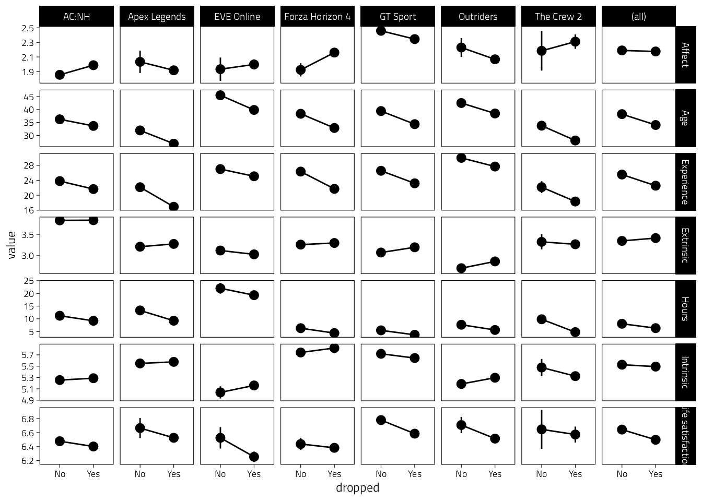

# Descriptives

Load the required packages.


```r
library(knitr)
library(scales)
library(gtsummary)
library(flextable)
library(lme4)
library(broom.mixed)
library(kableExtra)
library(here)
library(tidyverse)
library(lubridate)
```

We then load the previously cleaned data table.


```r
data_path <- here("Data", "cleaned_data.rds")
if (file.exists(data_path)) {
  d <- read_rds(file = data_path)
} else {
  stop(str_glue("{data_path} doesn't exist, run `01-clean.Rmd` to create it."))
}

# Make wave a nicely labelled factor
d <- d %>%
  mutate(Wave = factor(wid, levels = 1:3, labels = paste0("Wave ", 1:3)))

# Rename game to fit titles in plots
d <- d %>% 
  mutate(Game = if_else(Game == "Gran Turismo Sport", "GT Sport", Game))
```

## Demographics after exclusions


```r
d %>%
  filter(wid == 1) %>%
  distinct(pid, Game, Age, Experience, Gender) %>%
  select(-pid) %>%
  tbl_summary(by = Game, missing_text = "Missing") %>%
  add_overall() %>%
  bold_labels() %>%
  italicize_levels() %>%
  as_kable_extra(caption = "Sample demographics") %>% 
  kable_styling(full_width = FALSE, font_size = 12)
```

<table style="NAborder-bottom: 0; font-size: 12px; width: auto !important; margin-left: auto; margin-right: auto;" class="table">
<caption style="font-size: initial !important;">(\#tab:demographics-table)Sample demographics</caption>
 <thead>
  <tr>
   <th style="text-align:left;"> Characteristic </th>
   <th style="text-align:left;"> Overall, N = 38,935 </th>
   <th style="text-align:left;"> AC:NH, N = 13,646 </th>
   <th style="text-align:left;"> Apex Legends, N = 1,158 </th>
   <th style="text-align:left;"> EVE Online, N = 905 </th>
   <th style="text-align:left;"> Forza Horizon 4, N = 1,981 </th>
   <th style="text-align:left;"> GT Sport, N = 19,258 </th>
   <th style="text-align:left;"> Outriders, N = 1,530 </th>
   <th style="text-align:left;"> The Crew 2, N = 457 </th>
  </tr>
 </thead>
<tbody>
  <tr>
   <td style="text-align:left;"> Age </td>
   <td style="text-align:left;"> 34 (25, 42) </td>
   <td style="text-align:left;"> 32 (25, 41) </td>
   <td style="text-align:left;"> 25 (20, 32) </td>
   <td style="text-align:left;"> 39 (31, 50) </td>
   <td style="text-align:left;"> 33 (24, 42) </td>
   <td style="text-align:left;"> 35 (25, 43) </td>
   <td style="text-align:left;"> 38 (32, 45) </td>
   <td style="text-align:left;"> 25 (20, 35) </td>
  </tr>
  <tr>
   <td style="text-align:left;padding-left: 2em;" indentlevel="1"> Missing </td>
   <td style="text-align:left;"> 82 </td>
   <td style="text-align:left;"> 29 </td>
   <td style="text-align:left;"> 5 </td>
   <td style="text-align:left;"> 3 </td>
   <td style="text-align:left;"> 6 </td>
   <td style="text-align:left;"> 37 </td>
   <td style="text-align:left;"> 2 </td>
   <td style="text-align:left;"> 0 </td>
  </tr>
  <tr>
   <td style="text-align:left;"> Gender </td>
   <td style="text-align:left;">  </td>
   <td style="text-align:left;">  </td>
   <td style="text-align:left;">  </td>
   <td style="text-align:left;">  </td>
   <td style="text-align:left;">  </td>
   <td style="text-align:left;">  </td>
   <td style="text-align:left;">  </td>
   <td style="text-align:left;">  </td>
  </tr>
  <tr>
   <td style="text-align:left;padding-left: 2em;" indentlevel="1"> Man </td>
   <td style="text-align:left;"> 29,765 (77%) </td>
   <td style="text-align:left;"> 5,451 (40%) </td>
   <td style="text-align:left;"> 1,002 (87%) </td>
   <td style="text-align:left;"> 853 (95%) </td>
   <td style="text-align:left;"> 1,884 (95%) </td>
   <td style="text-align:left;"> 18,745 (98%) </td>
   <td style="text-align:left;"> 1,400 (92%) </td>
   <td style="text-align:left;"> 430 (94%) </td>
  </tr>
  <tr>
   <td style="text-align:left;padding-left: 2em;" indentlevel="1"> Non-binary / third gender </td>
   <td style="text-align:left;"> 705 (1.8%) </td>
   <td style="text-align:left;"> 557 (4.1%) </td>
   <td style="text-align:left;"> 25 (2.2%) </td>
   <td style="text-align:left;"> 7 (0.8%) </td>
   <td style="text-align:left;"> 11 (0.6%) </td>
   <td style="text-align:left;"> 87 (0.5%) </td>
   <td style="text-align:left;"> 15 (1.0%) </td>
   <td style="text-align:left;"> 3 (0.7%) </td>
  </tr>
  <tr>
   <td style="text-align:left;padding-left: 2em;" indentlevel="1"> Prefer not to say </td>
   <td style="text-align:left;"> 363 (0.9%) </td>
   <td style="text-align:left;"> 183 (1.3%) </td>
   <td style="text-align:left;"> 17 (1.5%) </td>
   <td style="text-align:left;"> 10 (1.1%) </td>
   <td style="text-align:left;"> 12 (0.6%) </td>
   <td style="text-align:left;"> 119 (0.6%) </td>
   <td style="text-align:left;"> 16 (1.0%) </td>
   <td style="text-align:left;"> 6 (1.3%) </td>
  </tr>
  <tr>
   <td style="text-align:left;padding-left: 2em;" indentlevel="1"> Woman </td>
   <td style="text-align:left;"> 8,017 (21%) </td>
   <td style="text-align:left;"> 7,426 (55%) </td>
   <td style="text-align:left;"> 109 (9.5%) </td>
   <td style="text-align:left;"> 32 (3.5%) </td>
   <td style="text-align:left;"> 68 (3.4%) </td>
   <td style="text-align:left;"> 267 (1.4%) </td>
   <td style="text-align:left;"> 97 (6.3%) </td>
   <td style="text-align:left;"> 18 (3.9%) </td>
  </tr>
  <tr>
   <td style="text-align:left;padding-left: 2em;" indentlevel="1"> Missing </td>
   <td style="text-align:left;"> 85 </td>
   <td style="text-align:left;"> 29 </td>
   <td style="text-align:left;"> 5 </td>
   <td style="text-align:left;"> 3 </td>
   <td style="text-align:left;"> 6 </td>
   <td style="text-align:left;"> 40 </td>
   <td style="text-align:left;"> 2 </td>
   <td style="text-align:left;"> 0 </td>
  </tr>
  <tr>
   <td style="text-align:left;"> Experience </td>
   <td style="text-align:left;"> 23 (16, 30) </td>
   <td style="text-align:left;"> 22 (15, 30) </td>
   <td style="text-align:left;"> 17 (10, 25) </td>
   <td style="text-align:left;"> 25 (20, 32) </td>
   <td style="text-align:left;"> 23 (15, 30) </td>
   <td style="text-align:left;"> 25 (16, 30) </td>
   <td style="text-align:left;"> 30 (22, 35) </td>
   <td style="text-align:left;"> 17 (11, 25) </td>
  </tr>
  <tr>
   <td style="text-align:left;padding-left: 2em;" indentlevel="1"> Missing </td>
   <td style="text-align:left;"> 181 </td>
   <td style="text-align:left;"> 62 </td>
   <td style="text-align:left;"> 8 </td>
   <td style="text-align:left;"> 5 </td>
   <td style="text-align:left;"> 9 </td>
   <td style="text-align:left;"> 91 </td>
   <td style="text-align:left;"> 5 </td>
   <td style="text-align:left;"> 1 </td>
  </tr>
</tbody>
<tfoot><tr><td style="padding: 0; " colspan="100%">
<sup>1</sup> Median (IQR); n (%)</td></tr></tfoot>
</table>

## Survey descriptives

These are for people after exclusions.

### Response rate & retention


```r
# Get data on invite dates and Ns
invites <- read_csv(here("Data", "invites.csv")) %>%
  rename(Game = game) %>%
  mutate(
    Game = str_replace(Game, "Animal Crossing: New Horizons", "AC:NH"),
    Game = str_replace(Game, "Gran Turismo Sport", "GT Sport")
    )
# Create a table where wave 0 are number of invites,
# then calculate response rate / retention at each wave.
# This assumes there are no new participants at wave 3
# (people who didn't participate in wave 2 showed up at wave 3).
tmp <- bind_rows(
  select(invites, -date),
  d %>% filter(Responded) %>% count(Game, wid)
)
tmp_total <- tmp %>% 
  group_by(wid) %>% 
  summarise(n = sum(n)) %>% 
  mutate(Game = "Total")
tmp <- bind_rows(tmp, tmp_total) %>% 
  arrange(Game, wid) %>%
  group_by(Game) %>%
  mutate(
    R_rate = percent(n / lag(n), .1),
    n = comma(n)
  ) %>%
  pivot_wider(names_from = wid, values_from = c(n, R_rate)) %>%
  mutate(
    Invites = n_0,
    `Wave 1` = str_glue("{n_1} ({R_rate_1})"),
    `Wave 2` = str_glue("{n_2} ({R_rate_2})"),
    `Wave 3` = str_glue("{n_3} ({R_rate_3})")
  ) %>%
  select(Game, Invites:`Wave 3`) %>%
  mutate(across(everything(), ~ str_replace(., "NA", "0"))) %>% 
  ungroup()
tmp %>%   
  kbl(caption = "Number of people (response/retention rate) participating at each wave.") %>% 
  kable_styling(full_width = FALSE, font_size = 12)
```

<table class="table" style="font-size: 12px; width: auto !important; margin-left: auto; margin-right: auto;">
<caption style="font-size: initial !important;">(\#tab:response-rate-table)Number of people (response/retention rate) participating at each wave.</caption>
 <thead>
  <tr>
   <th style="text-align:left;"> Game </th>
   <th style="text-align:left;"> Invites </th>
   <th style="text-align:left;"> Wave 1 </th>
   <th style="text-align:left;"> Wave 2 </th>
   <th style="text-align:left;"> Wave 3 </th>
  </tr>
 </thead>
<tbody>
  <tr>
   <td style="text-align:left;"> AC:NH </td>
   <td style="text-align:left;"> 640,000 </td>
   <td style="text-align:left;"> 13,536 (2.1%) </td>
   <td style="text-align:left;"> 5,049 (37.3%) </td>
   <td style="text-align:left;"> 4,084 (80.9%) </td>
  </tr>
  <tr>
   <td style="text-align:left;"> Apex Legends </td>
   <td style="text-align:left;"> 900,000 </td>
   <td style="text-align:left;"> 1,128 (0.1%) </td>
   <td style="text-align:left;"> 406 (36.0%) </td>
   <td style="text-align:left;"> 228 (56.2%) </td>
  </tr>
  <tr>
   <td style="text-align:left;"> EVE Online </td>
   <td style="text-align:left;"> 30,000 </td>
   <td style="text-align:left;"> 899 (3.0%) </td>
   <td style="text-align:left;"> 240 (26.7%) </td>
   <td style="text-align:left;"> 221 (92.1%) </td>
  </tr>
  <tr>
   <td style="text-align:left;"> Forza Horizon 4 </td>
   <td style="text-align:left;"> 834,515 </td>
   <td style="text-align:left;"> 1,959 (0.2%) </td>
   <td style="text-align:left;"> 772 (39.4%) </td>
   <td style="text-align:left;"> 597 (77.3%) </td>
  </tr>
  <tr>
   <td style="text-align:left;"> GT Sport </td>
   <td style="text-align:left;"> 1,729,677 </td>
   <td style="text-align:left;"> 19,073 (1.1%) </td>
   <td style="text-align:left;"> 7,699 (40.4%) </td>
   <td style="text-align:left;"> 5,512 (71.6%) </td>
  </tr>
  <tr>
   <td style="text-align:left;"> Outriders </td>
   <td style="text-align:left;"> 90,000.0 </td>
   <td style="text-align:left;"> 1,525.0 (1.7%) </td>
   <td style="text-align:left;"> 379.0 (24.9%) </td>
   <td style="text-align:left;"> 370.0 (97.6%) </td>
  </tr>
  <tr>
   <td style="text-align:left;"> The Crew 2 </td>
   <td style="text-align:left;"> 1,013,000 </td>
   <td style="text-align:left;"> 457 (0.0%) </td>
   <td style="text-align:left;"> 97 (21.2%) </td>
   <td style="text-align:left;"> 85 (87.6%) </td>
  </tr>
  <tr>
   <td style="text-align:left;"> Total </td>
   <td style="text-align:left;"> 5,237,192 </td>
   <td style="text-align:left;"> 38,577 (0.7%) </td>
   <td style="text-align:left;"> 14,642 (38.0%) </td>
   <td style="text-align:left;"> 11,097 (75.8%) </td>
  </tr>
</tbody>
</table>

```r
# Also save this table for MS
tmp %>% 
  flextable() %>% 
  save_as_docx(path = "Figures/Retention-rates.docx")
```

### Missingness

Here we report on the % missing for each variable


```r
install.packages("naniar")
```

```
## Installing naniar [0.6.1] ...
## 	OK [linked cache]
```

```r
library(naniar)
d %>% 
  select(Game, pid, Wave, Affect, `Life satisfaction`, Hours) %>% 
  complete(nesting(Game, pid), Wave) %>% 
  group_by(Game, Wave) %>% 
  select(-pid) %>% 
  miss_var_summary() %>% 
  select(-n_miss) %>% 
  mutate(pct_miss = percent(pct_miss/100, .1)) %>% 
  pivot_wider(
    names_from = c(Wave, variable), 
    values_from = pct_miss, 
    names_glue = "{variable} ({Wave})"
    ) %>% 
  kbl(caption = "Percent missing at each wave for key variables") %>% 
  kable_styling(full_width = FALSE, font_size = 12)
```

<table class="table" style="font-size: 12px; width: auto !important; margin-left: auto; margin-right: auto;">
<caption style="font-size: initial !important;">(\#tab:unnamed-chunk-1)Percent missing at each wave for key variables</caption>
 <thead>
  <tr>
   <th style="text-align:left;"> Game </th>
   <th style="text-align:left;"> Affect (Wave 1) </th>
   <th style="text-align:left;"> Life satisfaction (Wave 1) </th>
   <th style="text-align:left;"> Hours (Wave 1) </th>
   <th style="text-align:left;"> Affect (Wave 2) </th>
   <th style="text-align:left;"> Life satisfaction (Wave 2) </th>
   <th style="text-align:left;"> Hours (Wave 2) </th>
   <th style="text-align:left;"> Affect (Wave 3) </th>
   <th style="text-align:left;"> Life satisfaction (Wave 3) </th>
   <th style="text-align:left;"> Hours (Wave 3) </th>
  </tr>
 </thead>
<tbody>
  <tr>
   <td style="text-align:left;"> AC:NH </td>
   <td style="text-align:left;"> 3.5% </td>
   <td style="text-align:left;"> 1.9% </td>
   <td style="text-align:left;"> 0.2% </td>
   <td style="text-align:left;"> 63.8% </td>
   <td style="text-align:left;"> 63.2% </td>
   <td style="text-align:left;"> 0.1% </td>
   <td style="text-align:left;"> 70.6% </td>
   <td style="text-align:left;"> 70.3% </td>
   <td style="text-align:left;"> 0.2% </td>
  </tr>
  <tr>
   <td style="text-align:left;"> Apex Legends </td>
   <td style="text-align:left;"> 8.7% </td>
   <td style="text-align:left;"> 4.9% </td>
   <td style="text-align:left;"> 0.0% </td>
   <td style="text-align:left;"> 66.8% </td>
   <td style="text-align:left;"> 65.6% </td>
   <td style="text-align:left;"> 0.0% </td>
   <td style="text-align:left;"> 81.1% </td>
   <td style="text-align:left;"> 80.6% </td>
   <td style="text-align:left;"> 0.1% </td>
  </tr>
  <tr>
   <td style="text-align:left;"> EVE Online </td>
   <td style="text-align:left;"> 5.1% </td>
   <td style="text-align:left;"> 2.2% </td>
   <td style="text-align:left;"> 1.7% </td>
   <td style="text-align:left;"> 74.6% </td>
   <td style="text-align:left;"> 73.7% </td>
   <td style="text-align:left;"> 0.9% </td>
   <td style="text-align:left;"> 75.9% </td>
   <td style="text-align:left;"> 75.7% </td>
   <td style="text-align:left;"> 1.2% </td>
  </tr>
  <tr>
   <td style="text-align:left;"> Forza Horizon 4 </td>
   <td style="text-align:left;"> 4.5% </td>
   <td style="text-align:left;"> 2.2% </td>
   <td style="text-align:left;"> 0.2% </td>
   <td style="text-align:left;"> 62.0% </td>
   <td style="text-align:left;"> 61.5% </td>
   <td style="text-align:left;"> 0.1% </td>
   <td style="text-align:left;"> 70.4% </td>
   <td style="text-align:left;"> 69.9% </td>
   <td style="text-align:left;"> 0.1% </td>
  </tr>
  <tr>
   <td style="text-align:left;"> GT Sport </td>
   <td style="text-align:left;"> 4.5% </td>
   <td style="text-align:left;"> 2.2% </td>
   <td style="text-align:left;"> 0.0% </td>
   <td style="text-align:left;"> 60.9% </td>
   <td style="text-align:left;"> 60.3% </td>
   <td style="text-align:left;"> 0.0% </td>
   <td style="text-align:left;"> 71.9% </td>
   <td style="text-align:left;"> 71.6% </td>
   <td style="text-align:left;"> 0.1% </td>
  </tr>
  <tr>
   <td style="text-align:left;"> Outriders </td>
   <td style="text-align:left;"> 2.8% </td>
   <td style="text-align:left;"> 1.7% </td>
   <td style="text-align:left;"> 0.1% </td>
   <td style="text-align:left;"> 75.8% </td>
   <td style="text-align:left;"> 75.4% </td>
   <td style="text-align:left;"> 0.0% </td>
   <td style="text-align:left;"> 76.5% </td>
   <td style="text-align:left;"> 75.9% </td>
   <td style="text-align:left;"> 0.0% </td>
  </tr>
  <tr>
   <td style="text-align:left;"> The Crew 2 </td>
   <td style="text-align:left;"> 4.4% </td>
   <td style="text-align:left;"> 2.2% </td>
   <td style="text-align:left;"> 0.0% </td>
   <td style="text-align:left;"> 79.9% </td>
   <td style="text-align:left;"> 79.4% </td>
   <td style="text-align:left;"> 0.0% </td>
   <td style="text-align:left;"> 81.4% </td>
   <td style="text-align:left;"> 81.4% </td>
   <td style="text-align:left;"> 0.0% </td>
  </tr>
</tbody>
</table>


### Differences

We then looked at differences between people who dropped out vs who did not.


```r
tmp <- d %>% 
  replace_na(list(Responded = FALSE)) %>%
  group_by(Game, pid) %>% 
  summarise(
    across(
      c(Affect, `Life satisfaction`, 
        Intrinsic, Extrinsic, 
        Age, Experience, Hours),
      mean, na.rm = TRUE
    ),
    dropped = factor(
      sum(Responded) != 3, 
      levels = c(FALSE, TRUE), 
      labels = c("No", "Yes")
    )
  )
tmp <- ungroup(tmp)
tmp <- tmp %>% 
  pivot_longer(Affect:Hours)
tmp %>%   
  ggplot(aes(dropped, value)) +
  stat_summary() +
  stat_summary(fun = mean, geom = "line", group = 1) +
  facet_grid(name~Game, scales = "free_y", margins = "Game")
```



```r
out <- tmp %>% 
  group_by(name) %>% 
  summarise(
    fit = list(
      lmer(value ~ dropped + (1 + dropped | Game), data = cur_data())
    )
  )
out %>% 
  mutate(
    out = map(fit, ~tidy(.x, "fixed"))
  ) %>% 
  select(-fit) %>% 
  unnest(out) %>% 
  filter(term != "(Intercept)") %>% 
  mutate(across(where(is.numeric), ~number(., .01))) %>% 
  transmute(
    Variable = name,
    Difference = str_glue("{estimate} ({std.error})")
  ) %>% 
  flextable(cwidth = 2) %>% 
  save_as_docx(path = "Figures/Between-dropout-table.docx")
```


### Response dates

Only for actual responses (not rows where survey date was filled to be able to join telemetry)


```r
d %>%
  # Take only actually responded-to waves
  filter(Responded) %>%
  mutate(Date = as_date(StartDate)) %>%
  count(Game, Wave, Date) %>%
  ggplot(
    aes(Date, n, fill = Wave)
  ) +
  geom_col() +
  scale_y_continuous(
    "Responses",
    breaks = pretty_breaks(),
    expand = expansion(c(0, .1)),
  ) +
  scale_x_date(
    "Date",
    date_breaks = "7 day", date_labels = "%b\n%d", date_minor_breaks = "1 day"
  ) +
  facet_wrap("Game", scales = "free_y", ncol = 1)
```

<div class="figure" style="text-align: center">

<p class="caption">(\#fig:response-date-histograms)Histograms of response dates.</p>
</div>

Response times


```r
d %>%
  filter(Responded) %>%
  mutate(Hour = hour(StartDate)) %>%
  count(Game, Wave, Hour) %>%
  ggplot(aes(Hour, y = n, fill = Wave)) +
  scale_y_continuous(
    "Responses",
    breaks = pretty_breaks(),
    expand = expansion(c(0, .1)),
  ) +
  scale_x_continuous(
    breaks = seq(0, 21, by = 3),
    expand = expansion(c(0.01))
  ) +
  geom_col() +
  facet_wrap("Game", scales = "free", ncol = 2) +
  theme(legend.position = "bottom")
```

<div class="figure" style="text-align: center">

<p class="caption">(\#fig:response-time-histograms)Histograms of response times (in UTC).</p>
</div>

#### Durations between waves

Participants could respond with variable delays due to variation in email schedules and late responding. So we also check the actual intervals between completing waves. Very small values are possible because a participant could have e.g. completed both waves 2 and 3 in succession after receiving wave 3 invitation. Note that negative values were also possible for this reason but they were excluded before. (This figure is restricted to 5-30 day intervals to display the bulk of the data.)


```r
# Table
d %>%
  select(Wave, Game, interval) %>%
  # group_by(Wave) %>%
  filter(Wave != "Wave 1") %>%
  summarise(
    Value = quantile(
      interval,
      probs = c(0, .10, .25, .5, .75, .90, 1),
      na.rm = T
    ) %>%
      round(3),
    Quantile = percent(c(0, .10, .25, .5, .75, .90, 1))
  ) %>%
  pivot_wider(names_from = Quantile, values_from = Value) %>%
  kbl(caption = "Interval duration percentiles preceding waves 2 and 3.") %>% 
  kable_styling(full_width = FALSE, font_size = 12)
```

<table class="table" style="font-size: 12px; width: auto !important; margin-left: auto; margin-right: auto;">
<caption style="font-size: initial !important;">(\#tab:intervals-between-waves-histogram)Interval duration percentiles preceding waves 2 and 3.</caption>
 <thead>
  <tr>
   <th style="text-align:right;"> 0% </th>
   <th style="text-align:right;"> 10% </th>
   <th style="text-align:right;"> 25% </th>
   <th style="text-align:right;"> 50% </th>
   <th style="text-align:right;"> 75% </th>
   <th style="text-align:right;"> 90% </th>
   <th style="text-align:right;"> 100% </th>
  </tr>
 </thead>
<tbody>
  <tr>
   <td style="text-align:right;"> 0.001 </td>
   <td style="text-align:right;"> 11.649 </td>
   <td style="text-align:right;"> 13.706 </td>
   <td style="text-align:right;"> 14.046 </td>
   <td style="text-align:right;"> 15.941 </td>
   <td style="text-align:right;"> 17.105 </td>
   <td style="text-align:right;"> 49.287 </td>
  </tr>
</tbody>
</table>

```r
# Figure
d %>%
  filter(Wave != "Wave 1") %>%
  filter(between(interval, 5, 30)) %>% 
  mutate(Wave = fct_drop(Wave)) %>%
  ggplot(aes(interval)) +
  geom_vline(xintercept = 14, size = .2) +
  geom_histogram(binwidth = 1, col = "white") +
  scale_y_continuous(
    "Count",
    expand = expansion(c(0, .1))
  ) +
  scale_x_continuous(
    "Days between responding",
    breaks = pretty_breaks()
  ) +
  facet_grid(Game ~ Wave, scales = "free_y")
```

<div class="figure" style="text-align: center">

<p class="caption">(\#fig:intervals-between-waves-histogram)Histograms of intervals between participants completing the survey waves (in days).</p>
</div>

## System information


```r
sessionInfo()
```

```
## R version 4.1.3 (2022-03-10)
## Platform: aarch64-apple-darwin20 (64-bit)
## Running under: macOS Monterey 12.3
## 
## Matrix products: default
## BLAS:   /Library/Frameworks/R.framework/Versions/4.1-arm64/Resources/lib/libRblas.0.dylib
## LAPACK: /Library/Frameworks/R.framework/Versions/4.1-arm64/Resources/lib/libRlapack.dylib
## 
## locale:
## [1] en_US.UTF-8/en_US.UTF-8/en_US.UTF-8/C/en_US.UTF-8/en_US.UTF-8
## 
## attached base packages:
## [1] stats     graphics  grDevices datasets  utils     methods   base     
## 
## other attached packages:
##  [1] naniar_0.6.1      lubridate_1.8.0   forcats_0.5.1     stringr_1.4.0    
##  [5] dplyr_1.0.7       purrr_0.3.4       readr_2.0.2       tidyr_1.1.4      
##  [9] tibble_3.1.5      tidyverse_1.3.1   here_1.0.1        kableExtra_1.3.4 
## [13] broom.mixed_0.2.7 lme4_1.1-27.1     Matrix_1.3-4      flextable_0.7.0  
## [17] gtsummary_1.4.2   scales_1.1.1      knitr_1.36        ggplot2_3.3.5    
## 
## loaded via a namespace (and not attached):
##  [1] nlme_3.1-153        fs_1.5.0            bit64_4.0.5        
##  [4] webshot_0.5.2       httr_1.4.2          rprojroot_2.0.2    
##  [7] tools_4.1.3         backports_1.2.1     bslib_0.3.1        
## [10] utf8_1.2.2          R6_2.5.1            DBI_1.1.1          
## [13] colorspace_2.0-2    withr_2.4.2         tidyselect_1.1.1   
## [16] downlit_0.2.1       bit_4.0.4           compiler_4.1.3     
## [19] textshaping_0.3.5   cli_3.0.1           rvest_1.0.1        
## [22] gt_0.3.1            xml2_1.3.2          officer_0.4.1      
## [25] labeling_0.4.2      bookdown_0.24       sass_0.4.0         
## [28] systemfonts_1.0.2   digest_0.6.28       minqa_1.2.4        
## [31] rmarkdown_2.11      svglite_2.0.0       base64enc_0.1-3    
## [34] pkgconfig_2.0.3     htmltools_0.5.2     highr_0.9          
## [37] dbplyr_2.1.1        fastmap_1.1.0       readxl_1.3.1       
## [40] rlang_0.4.11        rstudioapi_0.13     farver_2.1.0       
## [43] jquerylib_0.1.4     generics_0.1.0      jsonlite_1.7.2     
## [46] vroom_1.5.5         zip_2.2.0           magrittr_2.0.1     
## [49] Rcpp_1.0.7          munsell_0.5.0       fansi_0.5.0        
## [52] gdtools_0.2.4       visdat_0.5.3        lifecycle_1.0.1    
## [55] stringi_1.7.5       yaml_2.2.1          MASS_7.3-54        
## [58] grid_4.1.3          parallel_4.1.3      crayon_1.4.1       
## [61] lattice_0.20-45     haven_2.4.3         splines_4.1.3      
## [64] hms_1.1.1           pillar_1.6.3        uuid_0.1-4         
## [67] boot_1.3-28         codetools_0.2-18    reprex_2.0.1       
## [70] glue_1.4.2          evaluate_0.14       modelr_0.1.8       
## [73] data.table_1.14.2   broom.helpers_1.4.0 renv_0.14.0        
## [76] tzdb_0.1.2          vctrs_0.3.8         nloptr_1.2.2.2     
## [79] cellranger_1.1.0    gtable_0.3.0        assertthat_0.2.1   
## [82] xfun_0.26           broom_0.7.9         ragg_1.1.3         
## [85] survival_3.2-13     viridisLite_0.4.0   ellipsis_0.3.2
```
