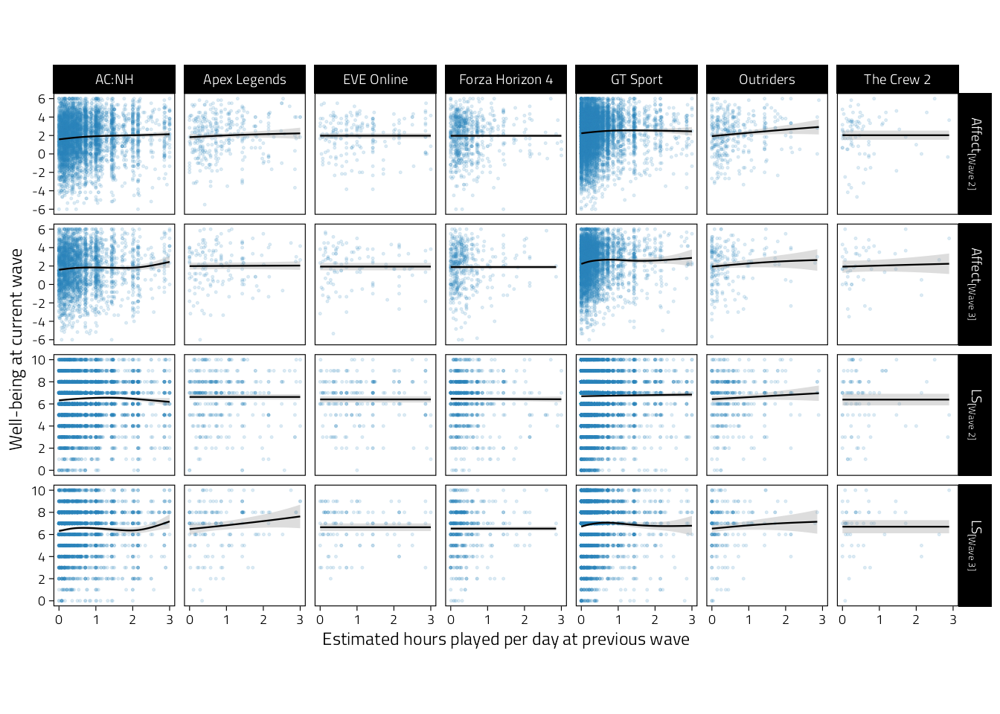
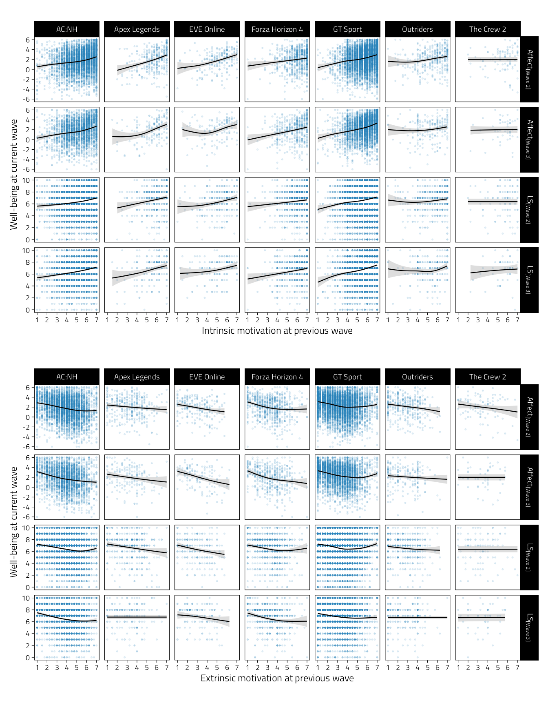
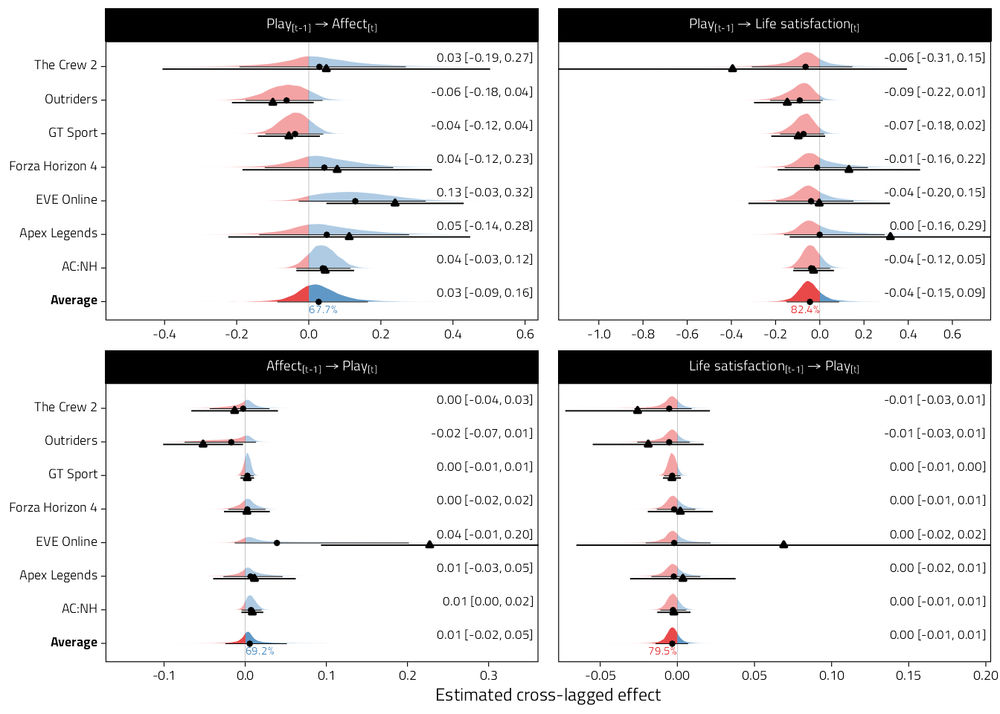
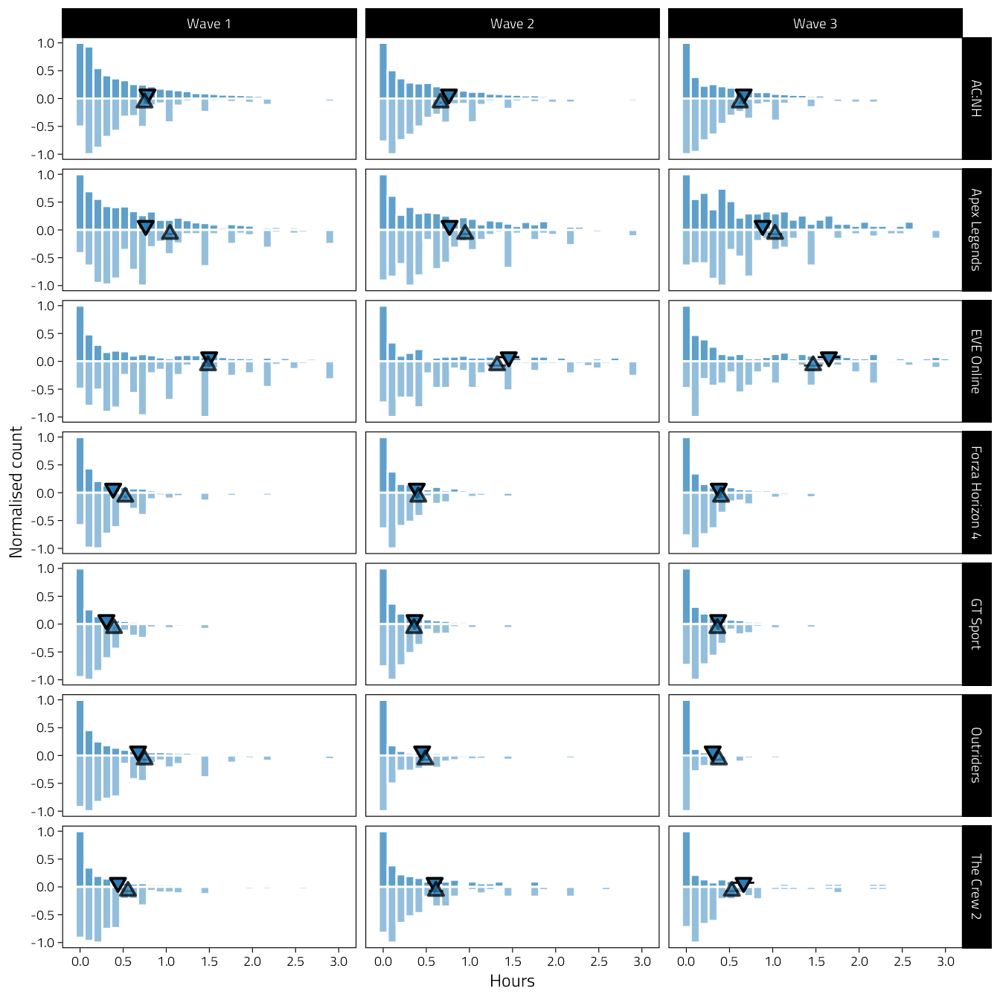
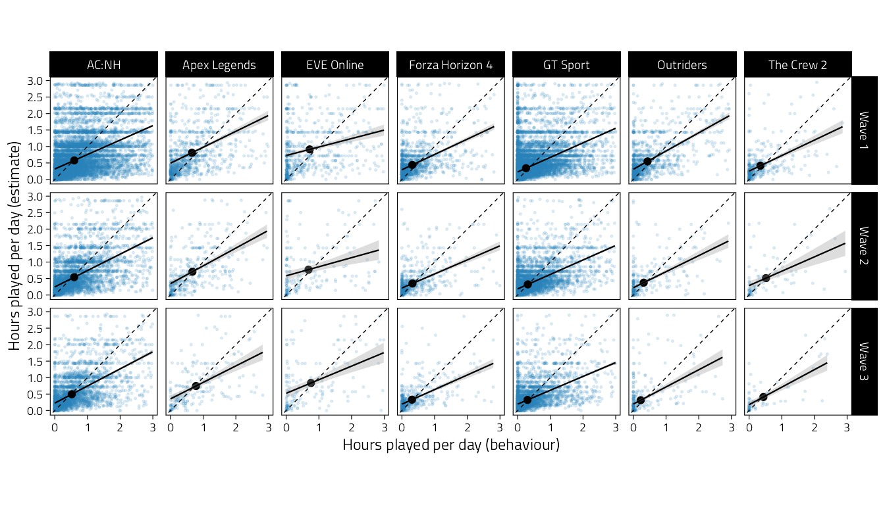

# Main analysis

This document contains the main analyses presented in the manuscript.

We first load the required R packages.


```r
library(knitr)
library(scales)
library(DT)
library(kableExtra)
library(ggpp)
library(bayestestR)
library(brms)
library(ragg)
library(here)
library(ggtext)
library(ggstance)
library(ggdist)
library(patchwork)
library(lavaan)
library(multidplyr)
library(tidyverse)
library(tidybayes)
library(janitor)
```

Define plotting, table, and parallel processing options.


```r
# parallel computations
MAX_CORES <- as.numeric(Sys.getenv("MAX_CORES"))
if (is.na(MAX_CORES)) MAX_CORES <- parallel::detectCores(logical = FALSE)
cluster <- new_cluster(MAX_CORES)

# load packages on clusters
cluster_library(cluster, c("dplyr", "lavaan"))

# MCMC settings
options(mc.cores = 1)
if (require("cmdstanr")) options(brms.backend = "cmdstanr")
```

We analyse the data cleaned previously.


```r
data_path <- here("Data", "cleaned_data.rds")
if (file.exists(data_path)) {
  d <- read_rds(file = data_path)
} else {
  stop(str_glue("{data_path} doesn't exist, run `01-clean.Rmd` to create it."))
}

# Make wave a nicely labelled factor
d <- d %>%
  mutate(Wave = factor(wid, levels = 1:3, labels = paste0("Wave ", 1:3)))

# Rename game to fit titles in plots
d <- d %>% 
  mutate(Game = if_else(Game == "Gran Turismo Sport", "GT Sport", Game))
```

For all analyses, game time indicates average number of hours per day. The telemetry indicates total hours in the two week window, so we divide that by 14 to talk about average hours per day.


```r
d <- d %>%
  mutate(
    Hours = Hours / 14,
    hours_est = hours_est / 14
  )
```

## Variables over time

Hours played per week is cut at a reasonable value for the figures:


```r
d %>%
  mutate(Hours_over_3 = Hours > 3) %>%
  tabyl(Hours_over_3) %>%
  adorn_pct_formatting() %>% 
  kbl(caption = "Table of hours excluded from figure") %>% 
  kable_styling(full_width = FALSE, font_size = 12)
```

<table class="table" style="font-size: 12px; width: auto !important; margin-left: auto; margin-right: auto;">
<caption style="font-size: initial !important;">(\#tab:unnamed-chunk-1)Table of hours excluded from figure</caption>
 <thead>
  <tr>
   <th style="text-align:left;"> Hours_over_3 </th>
   <th style="text-align:right;"> n </th>
   <th style="text-align:left;"> percent </th>
   <th style="text-align:left;"> valid_percent </th>
  </tr>
 </thead>
<tbody>
  <tr>
   <td style="text-align:left;"> FALSE </td>
   <td style="text-align:right;"> 113595 </td>
   <td style="text-align:left;"> 97.3% </td>
   <td style="text-align:left;"> 97.4% </td>
  </tr>
  <tr>
   <td style="text-align:left;"> TRUE </td>
   <td style="text-align:right;"> 3075 </td>
   <td style="text-align:left;"> 2.6% </td>
   <td style="text-align:left;"> 2.6% </td>
  </tr>
  <tr>
   <td style="text-align:left;"> NA </td>
   <td style="text-align:right;"> 100 </td>
   <td style="text-align:left;"> 0.1% </td>
   <td style="text-align:left;"> - </td>
  </tr>
</tbody>
</table>


```r
tmp <- d %>%
  select(
    Game, Wave, pid,
    Hours, Affect, `Life satisfaction`,
    Intrinsic, Extrinsic
  ) %>%
  pivot_longer(Hours:Extrinsic) %>%
  drop_na(value) %>%
  filter(!(name == "Hours" & value > 3)) %>%
  mutate(name = fct_inorder(name))
tmp %>%
  ggplot(
    aes(
      Wave,
      value
    )
  ) +
  scale_x_discrete(labels = 1:3, expand = expansion(c(0.1, .1))) +
  scale_y_continuous(
    "Value",
    breaks = pretty_breaks(),
    expand = expansion(.025)
  ) +
  geom_blank() +
  stat_halfeye(
    height = .02,
    normalize = "panels",
    slab_color = col1,
    slab_fill = alpha(col1, 0.3),
    slab_size = 0.5,
    adjust = 1.1,
    point_interval = NULL,
    show.legend = FALSE
  ) +
  stat_summary(
    fun.data = mean_cl_normal,
    fatten = 1.25
  ) +
  stat_summary(
    fun = mean,
    geom = "line",
    size = .33,
    group = 1
  ) +
  facet_grid(name ~ Game, scales = "free_y") +
  theme(
    legend.position = "none"
  )
```

<div class="figure" style="text-align: center">

<p class="caption">(\#fig:variables-over-time)Density plots of key variables over time.</p>
</div>

```r
agg_png(
  "Figures/Fig-variables-over-time.png", 
  width = W, height = W*0.7, units = "cm", res = 400
)
last_plot()
dev.off()
```

```
## agg_png 
##       2
```

Then take a look at a simple model of change over time for each variable. Note that we can't use varying slopes with lmer because there's not enough data, so just random intercepts for players.


```r
library(lme4)
library(broom.mixed)
parameters_change_over_time <- d %>%
  select(
    Game, pid, wid,
    Hours, Intrinsic, Extrinsic,
    Affect, `Life satisfaction`
  ) %>%
  # Put intercept at first wave
  mutate(Wave = wid - 1) %>%
  pivot_longer(Hours:`Life satisfaction`, names_to = "Variable") %>%
  group_by(Variable) %>%
  summarise(
    lmer(value ~ Wave + (1 | pid) + (1 + Wave | Game), data = cur_data()) %>%
      tidy(., "fixed", conf.int = TRUE)
  )
parameters_change_over_time %>%
  mutate(across(where(is.numeric), ~ format(round(.x, 2), nsmall = 2))) %>%
  mutate(Result = str_glue("{estimate}, 95%CI [{conf.low}, {conf.high}]")) %>%
  select(Variable, term, Result) %>%
  pivot_wider(names_from = term, values_from = Result) %>% 
  kbl(caption = "Change over time parameter estimates") %>% 
  kable_styling(full_width = FALSE, font_size = 12)
```

<table class="table" style="font-size: 12px; width: auto !important; margin-left: auto; margin-right: auto;">
<caption style="font-size: initial !important;">(\#tab:model-variables-over-time)Change over time parameter estimates</caption>
 <thead>
  <tr>
   <th style="text-align:left;"> Variable </th>
   <th style="text-align:left;"> (Intercept) </th>
   <th style="text-align:left;"> Wave </th>
  </tr>
 </thead>
<tbody>
  <tr>
   <td style="text-align:left;"> Affect </td>
   <td style="text-align:left;"> 2.12, 95%CI [ 2.00,  2.24] </td>
   <td style="text-align:left;"> -0.05, 95%CI [-0.10, -0.01] </td>
  </tr>
  <tr>
   <td style="text-align:left;"> Extrinsic </td>
   <td style="text-align:left;"> 3.25, 95%CI [ 3.02, 3.48] </td>
   <td style="text-align:left;"> -0.01, 95%CI [-0.03, 0.01] </td>
  </tr>
  <tr>
   <td style="text-align:left;"> Hours </td>
   <td style="text-align:left;"> 0.69, 95%CI [ 0.39,  1.00] </td>
   <td style="text-align:left;"> -0.09, 95%CI [-0.15, -0.04] </td>
  </tr>
  <tr>
   <td style="text-align:left;"> Intrinsic </td>
   <td style="text-align:left;"> 5.51, 95%CI [ 5.33,  5.69] </td>
   <td style="text-align:left;"> -0.18, 95%CI [-0.23, -0.13] </td>
  </tr>
  <tr>
   <td style="text-align:left;"> Life satisfaction </td>
   <td style="text-align:left;"> 6.47, 95%CI [6.40, 6.55] </td>
   <td style="text-align:left;"> 0.05, 95%CI [0.03, 0.08] </td>
  </tr>
</tbody>
</table>

## Simple correlation

Before more informative modelling, we estimate simple bivariate regressions between the key variables. 


```r
d %>%
  select(
    Game, pid, wid, Wave,
    Hours, hours_est, Intrinsic, Extrinsic,
    Affect, `Life satisfaction`
  ) %>%
  pivot_longer(
    c(Affect, `Life satisfaction`),
    names_to = "Outcome", values_to = "Outcome_value"
  ) %>%
  pivot_longer(
    c(Hours, hours_est, Intrinsic, Extrinsic),
    names_to = "Predictor", values_to = "Predictor_value"
  ) %>%
  group_by(Game, Outcome, Predictor, Wave) %>%
  summarise(
    tidy(
      lm(
        Outcome_value ~ Predictor_value, 
        data = cur_data()
      ), 
      conf.int = TRUE
    ),
  ) %>%
  filter(term != "(Intercept)") %>%
  ggplot(aes(estimate, Game, col = Wave)) +
  geom_vline(xintercept = 0, lty = 2, size = .25) +
  scale_x_continuous(
    "Bivariate regression coefficient (95%CI)",
    breaks = pretty_breaks()
  ) +
  geom_pointrangeh(
    aes(xmin = conf.low, xmax = conf.high),
    size = .4,
    position = position_dodge2v(.35)
  ) +
  facet_grid(Outcome ~ Predictor) +
  theme(
    legend.position = "bottom",
    axis.title.y = element_blank()
  )
```

<div class="figure" style="text-align: center">

<p class="caption">(\#fig:simple-regression-coefficients)Unstandardised bivariate regression coefficients of models predicting well-being. Columns indicate predictors, and the two rows are the different well-being outcome variables.</p>
</div>

## RICLPM

Wrangle data to a format where lavaan model is easier to map to variable pairs: Wide format with different rows for outcomes (well-being) and predictors (hours, needs, motivations).


```r
d_riclpm_long <- d %>%
  select(
    Game, pid, wid,
    Hours, hours_est,
    Intrinsic, Extrinsic,
    Affect, `Life satisfaction`
  ) %>%
  # Long format on well-being scores (outcomes)
  pivot_longer(
    c(Affect, `Life satisfaction`),
    names_to = "y_var", values_to = "y"
  ) %>%
  # Long format on other variables (predictors)
  pivot_longer(
    c(Hours, hours_est, Intrinsic, Extrinsic),
    names_to = "x_var", values_to = "x"
  )
d_riclpm_wide <- d_riclpm_long %>%
  pivot_wider(names_from = wid, values_from = c(x, y), names_sep = "")
write_rds(d_riclpm_wide, here("Temp", "d_riclpm_wide.rds"))
```

### Cross-lagged scatterplots


```r
Order <- tibble(
  y_var = rep(c("Affect", "Life satisfaction"), each = 2),
  wid = c(2, 3, 2, 3),
  Panel = c(
    "Affect[plain('[Wave 2]')]",
    "Affect[plain('[Wave 3]')]",
    "LS[plain('[Wave 2]')]",
    "LS[plain('[Wave 3]')]"
  ),
  Panel_label = fct_inorder(Panel)
)

d_riclpm_plots <- d_riclpm_long %>%
  # Take out hours per day over 3 for these plots
  mutate(x = if_else(str_detect(x_var, "ours") & x > 3, NaN, x)) %>%
  arrange(Game, pid, x_var, wid) %>%
  group_by(Game, pid, x_var, y_var) %>%
  mutate(lag_x = lag(x)) %>%
  left_join(Order) %>%
  ungroup() %>%
  filter(wid > 1)

d_riclpm_plots %>%
  filter(x_var == "Hours") %>%
  ggplot(aes(lag_x, y)) +
  scale_x_continuous(
    "Hours played per day at previous wave",
    breaks = pretty_breaks(3)
  ) +
  scale_y_continuous(
    "Well-being at current wave",
    breaks = pretty_breaks()
  ) +
  geom_point(size = .2, alpha = .2, shape = 1, col = col1) +
  geom_smooth(
    method = "gam", size = .4,
    color = "black",
    alpha = .33, show.legend = FALSE
  ) +
  facet_grid(
    Panel_label ~ Game,
    scales = "free_y",
    labeller = labeller(.rows = label_parsed)
  ) +
  theme(
    aspect.ratio = 1,
    panel.grid = element_blank()
  )
```

<div class="figure" style="text-align: center">

<p class="caption">(\#fig:riclpm-crosslag-scatter-hours)Scatterplots of well-being (rows indicate variables and waves) on average hours played per day during the previous wave. Regression lines are GAM fitted lines and 95%CIs.</p>
</div>

```r
agg_png(
  "Figures/Fig-cl-scatter-hours.png", 
  width = W, height = W*0.6, units = "cm", res = 400
)
last_plot()
dev.off()
```

```
## agg_png 
##       2
```


```r
# Plots with other predictors
p_tmp_0 <- last_plot() %+%
  filter(d_riclpm_plots, x_var == "hours_est") +
  scale_x_continuous(
    "Estimated hours played per day at previous wave",
    breaks = 0:3
  )
p_tmp_0
```

<div class="figure" style="text-align: center">

<p class="caption">(\#fig:riclpm-crosslag-scatter-hours-estimated)Scatterplots of well-being (rows indicate variables and waves) on estimated average hours played per day during the previous wave. Regression lines are GAM fitted lines and 95%CIs.</p>
</div>


```r
p_tmp_1 <- last_plot() %+%
  filter(d_riclpm_plots, x_var == "Intrinsic") +
  scale_x_continuous(
    "Intrinsic motivation at previous wave",
    breaks = pretty_breaks()
  )
p_tmp_1
```

<div class="figure" style="text-align: center">

<p class="caption">(\#fig:riclpm-crosslag-scatter-intrinsic)Scatterplots of well-being (rows indicate variables and waves) on intrinsic motivation during the previous wave. Regression lines are GAM fitted lines and 95%CIs.</p>
</div>


```r
p_tmp_2 <- last_plot() %+%
  filter(d_riclpm_plots, x_var == "Extrinsic") +
  scale_x_continuous(
    "Extrinsic motivation at previous wave",
    breaks = pretty_breaks()
  )
p_tmp_2
```

<div class="figure" style="text-align: center">

<p class="caption">(\#fig:riclpm-crosslag-scatter-extrinsic)Scatterplots of well-being (rows indicate variables and waves) on extrinsic motivation during the previous wave. Regression lines are GAM fitted lines and 95%CIs.</p>
</div>


```r
p_tmp_1 / p_tmp_2
```

<div class="figure" style="text-align: center">

<p class="caption">(\#fig:riclpm-crosslag-scatter-motivations)Scatterplots of well-being (rows indicate variables and waves) on intrinsic and extrinsic motivation during the previous wave. Regression lines are GAM fitted lines and 95%CIs.</p>
</div>

```r
agg_png(
  "Figures/Fig-cl-scatter-motivations.png", 
  width = W, height = W*1.1, units = "cm", res = 400
)
last_plot()
dev.off()
```

```
## agg_png 
##       2
```

### Fit one model to all data

First fit RICLPM to all data. Separately to the two well-being outcomes, and each predictor (hours, subjective scales). Constrain (cross)lagged parameters

Syntax based on <https://jeroendmulder.github.io/RI-CLPM/lavaan.html>


```r
riclpm_constrained <- "
  # Create between components (random intercepts)
  RIx =~ 1*x1 + 1*x2 + 1*x3
  RIy =~ 1*y1 + 1*y2 + 1*y3

  # Create within-person centered variables
  wx1 =~ 1*x1
  wx2 =~ 1*x2
  wx3 =~ 1*x3
  wy1 =~ 1*y1
  wy2 =~ 1*y2
  wy3 =~ 1*y3

  # Estimate the lagged effects between the within-person centered variables (constrained).
  wx2 ~ bx*wx1 + gx*wy1
  wy2 ~ gy*wx1 + by*wy1
  wx3 ~ bx*wx2 + gx*wy2
  wy3 ~ gy*wx2 + by*wy2

  # Estimate the covariance between the within-person centered
  # variables at the first wave.
  wx1 ~~ wy1 # Covariance

  # Estimate the covariances between the residuals of the
  # within-person centered variables (the innovations).
  wx2 ~~ wy2
  wx3 ~~ wy3

  # Estimate the variance and covariance of the random intercepts.
  RIx ~~ RIx
  RIy ~~ RIy
  RIx ~~ RIy

  # Estimate the (residual) variance of the within-person centered variables.
  wx1 ~~ wx1 # Variances
  wy1 ~~ wy1
  wx2 ~~ wx2 # Residual variances
  wy2 ~~ wy2
  wx3 ~~ wx3
  wy3 ~~ wy3
"
```


```r
cluster_copy(cluster, "riclpm_constrained")
fit_riclpm_all <- d_riclpm_wide %>%
  group_by(y_var, x_var) %>%
  partition(cluster) %>%
  summarise(
    fit = lavaan(
      riclpm_constrained,
      data = cur_data(),
      missing = "ml",
      meanstructure = TRUE,
      int.ov.free = TRUE
    ) %>% list()
  ) %>%
  collect()

get_lavaan_pars <- function(x) {
  bind_rows(
    parameterestimates(x) %>%
      mutate(Type = "Unstandardized"),
    standardizedsolution(x) %>%
      rename(est = est.std) %>%
      mutate(Type = "Standardized")
  ) %>%
    as_tibble() %>%
    unite("Parameter", c(lhs, op, rhs), sep = " ", remove = FALSE)
}

pars_riclpm_avg <- fit_riclpm_all %>%
  mutate(pars = map(fit, get_lavaan_pars)) %>%
  select(-fit)
```


```r
pars_riclpm_avg %>%
  ungroup() %>%
  unnest(pars) %>%
  filter(
    Parameter %in% c("wy2 ~ wx1", "wx2 ~ wy1", "wy2 ~ wy1", "wx2 ~ wx1"),
    Type == "Unstandardized"
  ) %>%
  mutate(across(where(is.numeric), ~ format(round(.x, 2), nsmall = 2))) %>%
  mutate(Result = str_glue("{est}, [{ci.lower}, {ci.upper}]")) %>%
  select(y_var, x_var, Parameter, Result) %>%
  pivot_wider(names_from = Parameter, values_from = Result) %>%
  kbl(
    caption = "RICLPM regression parameters from pooled model."
  ) %>% 
  kable_styling(full_width = FALSE, font_size = 12)
```

<table class="table" style="font-size: 12px; width: auto !important; margin-left: auto; margin-right: auto;">
<caption style="font-size: initial !important;">(\#tab:riclpm-pooled-table)RICLPM regression parameters from pooled model.</caption>
 <thead>
  <tr>
   <th style="text-align:left;"> y_var </th>
   <th style="text-align:left;"> x_var </th>
   <th style="text-align:left;"> wx2 ~ wx1 </th>
   <th style="text-align:left;"> wx2 ~ wy1 </th>
   <th style="text-align:left;"> wy2 ~ wx1 </th>
   <th style="text-align:left;"> wy2 ~ wy1 </th>
  </tr>
 </thead>
<tbody>
  <tr>
   <td style="text-align:left;"> Affect </td>
   <td style="text-align:left;"> Extrinsic </td>
   <td style="text-align:left;"> 0.22, [ 0.18,  0.27] </td>
   <td style="text-align:left;"> -0.06, [-0.08, -0.04] </td>
   <td style="text-align:left;"> -0.12, [-0.17, -0.07] </td>
   <td style="text-align:left;"> 0.35, [ 0.32,  0.39] </td>
  </tr>
  <tr>
   <td style="text-align:left;"> Affect </td>
   <td style="text-align:left;"> Hours </td>
   <td style="text-align:left;"> 0.47, [ 0.46,  0.49] </td>
   <td style="text-align:left;"> 0.01, [ 0.00,  0.01] </td>
   <td style="text-align:left;"> -0.02, [-0.07,  0.03] </td>
   <td style="text-align:left;"> 0.37, [ 0.34,  0.41] </td>
  </tr>
  <tr>
   <td style="text-align:left;"> Affect </td>
   <td style="text-align:left;"> hours_est </td>
   <td style="text-align:left;"> 0.17, [ 0.14,  0.20] </td>
   <td style="text-align:left;"> 0.01, [ 0.00,  0.02] </td>
   <td style="text-align:left;"> -0.03, [-0.09,  0.03] </td>
   <td style="text-align:left;"> 0.37, [ 0.34,  0.41] </td>
  </tr>
  <tr>
   <td style="text-align:left;"> Affect </td>
   <td style="text-align:left;"> Intrinsic </td>
   <td style="text-align:left;"> 0.35, [ 0.32,  0.39] </td>
   <td style="text-align:left;"> 0.07, [ 0.06,  0.09] </td>
   <td style="text-align:left;"> 0.14, [ 0.09,  0.19] </td>
   <td style="text-align:left;"> 0.36, [ 0.32,  0.39] </td>
  </tr>
  <tr>
   <td style="text-align:left;"> Life satisfaction </td>
   <td style="text-align:left;"> Extrinsic </td>
   <td style="text-align:left;"> 0.23, [ 0.18,  0.28] </td>
   <td style="text-align:left;"> -0.02, [-0.04,  0.00] </td>
   <td style="text-align:left;"> -0.07, [-0.14,  0.00] </td>
   <td style="text-align:left;"> 0.18, [ 0.14,  0.22] </td>
  </tr>
  <tr>
   <td style="text-align:left;"> Life satisfaction </td>
   <td style="text-align:left;"> Hours </td>
   <td style="text-align:left;"> 0.48, [ 0.46,  0.49] </td>
   <td style="text-align:left;"> 0.00, [-0.01,  0.00] </td>
   <td style="text-align:left;"> -0.06, [-0.12,  0.01] </td>
   <td style="text-align:left;"> 0.18, [ 0.14,  0.22] </td>
  </tr>
  <tr>
   <td style="text-align:left;"> Life satisfaction </td>
   <td style="text-align:left;"> hours_est </td>
   <td style="text-align:left;"> 0.17, [ 0.14,  0.21] </td>
   <td style="text-align:left;"> 0.01, [ 0.00,  0.02] </td>
   <td style="text-align:left;"> 0.03, [-0.05,  0.11] </td>
   <td style="text-align:left;"> 0.18, [ 0.14,  0.22] </td>
  </tr>
  <tr>
   <td style="text-align:left;"> Life satisfaction </td>
   <td style="text-align:left;"> Intrinsic </td>
   <td style="text-align:left;"> 0.38, [ 0.34,  0.41] </td>
   <td style="text-align:left;"> 0.04, [ 0.02,  0.05] </td>
   <td style="text-align:left;"> 0.18, [ 0.12,  0.24] </td>
   <td style="text-align:left;"> 0.18, [ 0.15,  0.22] </td>
  </tr>
</tbody>
</table>

### Separate models per game

Fit the above model separately to each game.


```r
fit_riclpm_sep <- d_riclpm_wide %>%
  group_by(y_var, x_var, Game) %>%
  partition(cluster) %>%
  summarise(
    fit = lavaan(
      riclpm_constrained,
      data = cur_data(),
      missing = "ml",
      meanstructure = TRUE,
      int.ov.free = TRUE
    ) %>% list()
  ) %>%
  collect()
pars_riclpm_sep <- fit_riclpm_sep %>%
  mutate(pars = map(fit, get_lavaan_pars)) %>%
  select(-fit)
```

### Table of RICLPM parameters

This table displays the lavaan estimates (game specific and pooled).


```r
pars_riclpm <- pars_riclpm_sep %>%
  mutate(Model = "Independent") %>%
  bind_rows(pars_riclpm_avg %>% mutate(Model = "Pooled", Game = "Average")) %>%
  ungroup() %>%
  unnest(pars) %>%
  # Take regression parameters at first interval, and
  # covariance parameters of interest
  filter(
    (str_detect(Parameter, " ~ ") & !str_detect(Parameter, "3")) |
      Parameter %in% c("RIx ~~ RIy", "wx1 ~~ wy1", "wx2 ~~ wy2", "wx3 ~~ wy3")
  ) %>%
  mutate(Game = fct_relevel(Game, "Average")) %>%
  select(-c(lhs:label, z))

# Interactive table so reader can find what they're looking for
pars_riclpm %>% 
  mutate(
    pvalue = pvalue(pvalue),
    across(x_var:Game, factor),
    across(where(is.numeric), ~format(round(.x, 2), nsmall = 2)),
    Estimate = str_glue("{est} [{ci.lower}, {ci.upper}]")
  ) %>% 
  select(
    x_var, y_var, Game, Parameter, Type, Model,
    Estimate, pvalue
  ) %>% 
  datatable(
    filter = "top",
    class = "display",
    rownames = FALSE
  ) %>% 
  formatStyle(TRUE, `font-size` = '12px')
```

```{=html}
<div id="htmlwidget-fa361d482815dd09133d" style="width:100%;height:auto;" class="datatables html-widget"></div>
<script type="application/json" data-for="htmlwidget-fa361d482815dd09133d">{"x":{"filter":"top","vertical":false,"filterHTML":"<tr>\n  <td data-type=\"factor\" style=\"vertical-align: top;\">\n    <div class=\"form-group has-feedback\" style=\"margin-bottom: auto;\">\n      <input type=\"search\" placeholder=\"All\" class=\"form-control\" style=\"width: 100%;\"/>\n      <span class=\"glyphicon glyphicon-remove-circle form-control-feedback\"><\/span>\n    <\/div>\n    <div style=\"width: 100%; display: none;\">\n      <select multiple=\"multiple\" style=\"width: 100%;\" data-options=\"[&quot;Extrinsic&quot;,&quot;Hours&quot;,&quot;hours_est&quot;,&quot;Intrinsic&quot;]\"><\/select>\n    <\/div>\n  <\/td>\n  <td data-type=\"character\" style=\"vertical-align: top;\">\n    <div class=\"form-group has-feedback\" style=\"margin-bottom: auto;\">\n      <input type=\"search\" placeholder=\"All\" class=\"form-control\" style=\"width: 100%;\"/>\n      <span class=\"glyphicon glyphicon-remove-circle form-control-feedback\"><\/span>\n    <\/div>\n  <\/td>\n  <td data-type=\"factor\" style=\"vertical-align: top;\">\n    <div class=\"form-group has-feedback\" style=\"margin-bottom: auto;\">\n      <input type=\"search\" placeholder=\"All\" class=\"form-control\" style=\"width: 100%;\"/>\n      <span class=\"glyphicon glyphicon-remove-circle form-control-feedback\"><\/span>\n    <\/div>\n    <div style=\"width: 100%; display: none;\">\n      <select multiple=\"multiple\" style=\"width: 100%;\" data-options=\"[&quot;Average&quot;,&quot;AC:NH&quot;,&quot;Apex Legends&quot;,&quot;EVE Online&quot;,&quot;Forza Horizon 4&quot;,&quot;GT Sport&quot;,&quot;Outriders&quot;,&quot;The Crew 2&quot;]\"><\/select>\n    <\/div>\n  <\/td>\n  <td data-type=\"character\" style=\"vertical-align: top;\">\n    <div class=\"form-group has-feedback\" style=\"margin-bottom: auto;\">\n      <input type=\"search\" placeholder=\"All\" class=\"form-control\" style=\"width: 100%;\"/>\n      <span class=\"glyphicon glyphicon-remove-circle form-control-feedback\"><\/span>\n    <\/div>\n  <\/td>\n  <td data-type=\"character\" style=\"vertical-align: top;\">\n    <div class=\"form-group has-feedback\" style=\"margin-bottom: auto;\">\n      <input type=\"search\" placeholder=\"All\" class=\"form-control\" style=\"width: 100%;\"/>\n      <span class=\"glyphicon glyphicon-remove-circle form-control-feedback\"><\/span>\n    <\/div>\n  <\/td>\n  <td data-type=\"character\" style=\"vertical-align: top;\">\n    <div class=\"form-group has-feedback\" style=\"margin-bottom: auto;\">\n      <input type=\"search\" placeholder=\"All\" class=\"form-control\" style=\"width: 100%;\"/>\n      <span class=\"glyphicon glyphicon-remove-circle form-control-feedback\"><\/span>\n    <\/div>\n  <\/td>\n  <td data-type=\"character\" style=\"vertical-align: top;\">\n    <div class=\"form-group has-feedback\" style=\"margin-bottom: auto;\">\n      <input type=\"search\" placeholder=\"All\" class=\"form-control\" style=\"width: 100%;\"/>\n      <span class=\"glyphicon glyphicon-remove-circle form-control-feedback\"><\/span>\n    <\/div>\n  <\/td>\n  <td data-type=\"character\" style=\"vertical-align: top;\">\n    <div class=\"form-group has-feedback\" style=\"margin-bottom: auto;\">\n      <input type=\"search\" placeholder=\"All\" class=\"form-control\" style=\"width: 100%;\"/>\n      <span class=\"glyphicon glyphicon-remove-circle form-control-feedback\"><\/span>\n    <\/div>\n  <\/td>\n<\/tr>","data":[["Extrinsic","Extrinsic","Extrinsic","Extrinsic","Extrinsic","Extrinsic","Extrinsic","Extrinsic","Extrinsic","Extrinsic","Extrinsic","Extrinsic","Extrinsic","Extrinsic","Extrinsic","Extrinsic","Intrinsic","Intrinsic","Intrinsic","Intrinsic","Intrinsic","Intrinsic","Intrinsic","Intrinsic","Intrinsic","Intrinsic","Intrinsic","Intrinsic","Intrinsic","Intrinsic","Intrinsic","Intrinsic","Extrinsic","Extrinsic","Extrinsic","Extrinsic","Extrinsic","Extrinsic","Extrinsic","Extrinsic","Extrinsic","Extrinsic","Extrinsic","Extrinsic","Extrinsic","Extrinsic","Extrinsic","Extrinsic","Extrinsic","Extrinsic","Extrinsic","Extrinsic","Extrinsic","Extrinsic","Extrinsic","Extrinsic","Extrinsic","Extrinsic","Extrinsic","Extrinsic","Extrinsic","Extrinsic","Extrinsic","Extrinsic","Extrinsic","Extrinsic","Extrinsic","Extrinsic","Extrinsic","Extrinsic","Extrinsic","Extrinsic","Extrinsic","Extrinsic","Extrinsic","Extrinsic","Extrinsic","Extrinsic","Extrinsic","Extrinsic","Hours","Hours","Hours","Hours","Hours","Hours","Hours","Hours","Hours","Hours","Hours","Hours","Hours","Hours","Hours","Hours","Hours","Hours","Hours","Hours","Hours","Hours","Hours","Hours","Hours","Hours","Hours","Hours","Hours","Hours","Hours","Hours","hours_est","hours_est","hours_est","hours_est","hours_est","hours_est","hours_est","hours_est","hours_est","hours_est","hours_est","hours_est","hours_est","hours_est","hours_est","hours_est","hours_est","hours_est","hours_est","hours_est","hours_est","hours_est","hours_est","hours_est","hours_est","hours_est","hours_est","hours_est","hours_est","hours_est","hours_est","hours_est","Extrinsic","Extrinsic","Extrinsic","Extrinsic","Extrinsic","Extrinsic","Extrinsic","Extrinsic","Extrinsic","Extrinsic","Extrinsic","Extrinsic","Extrinsic","Extrinsic","Extrinsic","Extrinsic","Hours","Hours","Hours","Hours","Hours","Hours","Hours","Hours","Hours","Hours","Hours","Hours","Hours","Hours","Hours","Hours","hours_est","hours_est","hours_est","hours_est","hours_est","hours_est","hours_est","hours_est","hours_est","hours_est","hours_est","hours_est","hours_est","hours_est","hours_est","hours_est","hours_est","hours_est","hours_est","hours_est","hours_est","hours_est","hours_est","hours_est","hours_est","hours_est","hours_est","hours_est","hours_est","hours_est","hours_est","hours_est","Intrinsic","Intrinsic","Intrinsic","Intrinsic","Intrinsic","Intrinsic","Intrinsic","Intrinsic","Intrinsic","Intrinsic","Intrinsic","Intrinsic","Intrinsic","Intrinsic","Intrinsic","Intrinsic","Extrinsic","Extrinsic","Extrinsic","Extrinsic","Extrinsic","Extrinsic","Extrinsic","Extrinsic","Extrinsic","Extrinsic","Extrinsic","Extrinsic","Extrinsic","Extrinsic","Extrinsic","Extrinsic","Hours","Hours","Hours","Hours","Hours","Hours","Hours","Hours","Hours","Hours","Hours","Hours","Hours","Hours","Hours","Hours","Hours","Hours","Hours","Hours","Hours","Hours","Hours","Hours","Hours","Hours","Hours","Hours","Hours","Hours","Hours","Hours","Hours","Hours","Hours","Hours","Hours","Hours","Hours","Hours","Hours","Hours","Hours","Hours","Hours","Hours","Hours","Hours","hours_est","hours_est","hours_est","hours_est","hours_est","hours_est","hours_est","hours_est","hours_est","hours_est","hours_est","hours_est","hours_est","hours_est","hours_est","hours_est","hours_est","hours_est","hours_est","hours_est","hours_est","hours_est","hours_est","hours_est","hours_est","hours_est","hours_est","hours_est","hours_est","hours_est","hours_est","hours_est","hours_est","hours_est","hours_est","hours_est","hours_est","hours_est","hours_est","hours_est","hours_est","hours_est","hours_est","hours_est","hours_est","hours_est","hours_est","hours_est","hours_est","hours_est","hours_est","hours_est","hours_est","hours_est","hours_est","hours_est","hours_est","hours_est","hours_est","hours_est","hours_est","hours_est","hours_est","hours_est","Intrinsic","Intrinsic","Intrinsic","Intrinsic","Intrinsic","Intrinsic","Intrinsic","Intrinsic","Intrinsic","Intrinsic","Intrinsic","Intrinsic","Intrinsic","Intrinsic","Intrinsic","Intrinsic","Extrinsic","Extrinsic","Extrinsic","Extrinsic","Extrinsic","Extrinsic","Extrinsic","Extrinsic","Extrinsic","Extrinsic","Extrinsic","Extrinsic","Extrinsic","Extrinsic","Extrinsic","Extrinsic","Hours","Hours","Hours","Hours","Hours","Hours","Hours","Hours","Hours","Hours","Hours","Hours","Hours","Hours","Hours","Hours","Hours","Hours","Hours","Hours","Hours","Hours","Hours","Hours","Hours","Hours","Hours","Hours","Hours","Hours","Hours","Hours","hours_est","hours_est","hours_est","hours_est","hours_est","hours_est","hours_est","hours_est","hours_est","hours_est","hours_est","hours_est","hours_est","hours_est","hours_est","hours_est","hours_est","hours_est","hours_est","hours_est","hours_est","hours_est","hours_est","hours_est","hours_est","hours_est","hours_est","hours_est","hours_est","hours_est","hours_est","hours_est","hours_est","hours_est","hours_est","hours_est","hours_est","hours_est","hours_est","hours_est","hours_est","hours_est","hours_est","hours_est","hours_est","hours_est","hours_est","hours_est","Extrinsic","Extrinsic","Extrinsic","Extrinsic","Extrinsic","Extrinsic","Extrinsic","Extrinsic","Extrinsic","Extrinsic","Extrinsic","Extrinsic","Extrinsic","Extrinsic","Extrinsic","Extrinsic","hours_est","hours_est","hours_est","hours_est","hours_est","hours_est","hours_est","hours_est","hours_est","hours_est","hours_est","hours_est","hours_est","hours_est","hours_est","hours_est","Extrinsic","Extrinsic","Extrinsic","Extrinsic","Extrinsic","Extrinsic","Extrinsic","Extrinsic","Extrinsic","Extrinsic","Extrinsic","Extrinsic","Extrinsic","Extrinsic","Extrinsic","Extrinsic","Extrinsic","Extrinsic","Extrinsic","Extrinsic","Extrinsic","Extrinsic","Extrinsic","Extrinsic","Extrinsic","Extrinsic","Extrinsic","Extrinsic","Extrinsic","Extrinsic","Extrinsic","Extrinsic","Extrinsic","Extrinsic","Extrinsic","Extrinsic","Extrinsic","Extrinsic","Extrinsic","Extrinsic","Extrinsic","Extrinsic","Extrinsic","Extrinsic","Extrinsic","Extrinsic","Extrinsic","Extrinsic","Hours","Hours","Hours","Hours","Hours","Hours","Hours","Hours","Hours","Hours","Hours","Hours","Hours","Hours","Hours","Hours","Extrinsic","Extrinsic","Extrinsic","Extrinsic","Extrinsic","Extrinsic","Extrinsic","Extrinsic","Extrinsic","Extrinsic","Extrinsic","Extrinsic","Extrinsic","Extrinsic","Extrinsic","Extrinsic","Hours","Hours","Hours","Hours","Hours","Hours","Hours","Hours","Hours","Hours","Hours","Hours","Hours","Hours","Hours","Hours","Hours","Hours","Hours","Hours","Hours","Hours","Hours","Hours","Hours","Hours","Hours","Hours","Hours","Hours","Hours","Hours","Extrinsic","Extrinsic","Extrinsic","Extrinsic","Extrinsic","Extrinsic","Extrinsic","Extrinsic","Extrinsic","Extrinsic","Extrinsic","Extrinsic","Extrinsic","Extrinsic","Extrinsic","Extrinsic","Hours","Hours","Hours","Hours","Hours","Hours","Hours","Hours","Hours","Hours","Hours","Hours","Hours","Hours","Hours","Hours","Hours","Hours","Hours","Hours","Hours","Hours","Hours","Hours","Hours","Hours","Hours","Hours","Hours","Hours","Hours","Hours","hours_est","hours_est","hours_est","hours_est","hours_est","hours_est","hours_est","hours_est","hours_est","hours_est","hours_est","hours_est","hours_est","hours_est","hours_est","hours_est","hours_est","hours_est","hours_est","hours_est","hours_est","hours_est","hours_est","hours_est","hours_est","hours_est","hours_est","hours_est","hours_est","hours_est","hours_est","hours_est","Intrinsic","Intrinsic","Intrinsic","Intrinsic","Intrinsic","Intrinsic","Intrinsic","Intrinsic","Intrinsic","Intrinsic","Intrinsic","Intrinsic","Intrinsic","Intrinsic","Intrinsic","Intrinsic","Intrinsic","Intrinsic","Intrinsic","Intrinsic","Intrinsic","Intrinsic","Intrinsic","Intrinsic","Intrinsic","Intrinsic","Intrinsic","Intrinsic","Intrinsic","Intrinsic","Intrinsic","Intrinsic","Intrinsic","Intrinsic","Intrinsic","Intrinsic","Intrinsic","Intrinsic","Intrinsic","Intrinsic","Intrinsic","Intrinsic","Intrinsic","Intrinsic","Intrinsic","Intrinsic","Intrinsic","Intrinsic","Intrinsic","Intrinsic","Intrinsic","Intrinsic","Intrinsic","Intrinsic","Intrinsic","Intrinsic","Intrinsic","Intrinsic","Intrinsic","Intrinsic","Intrinsic","Intrinsic","Intrinsic","Intrinsic","Intrinsic","Intrinsic","Intrinsic","Intrinsic","Intrinsic","Intrinsic","Intrinsic","Intrinsic","Intrinsic","Intrinsic","Intrinsic","Intrinsic","Intrinsic","Intrinsic","Intrinsic","Intrinsic","Intrinsic","Intrinsic","Intrinsic","Intrinsic","Intrinsic","Intrinsic","Intrinsic","Intrinsic","Intrinsic","Intrinsic","Intrinsic","Intrinsic","Intrinsic","Intrinsic","Intrinsic","Intrinsic","Hours","Hours","Hours","Hours","Hours","Hours","Hours","Hours","Hours","Hours","Hours","Hours","Hours","Hours","Hours","Hours","Intrinsic","Intrinsic","Intrinsic","Intrinsic","Intrinsic","Intrinsic","Intrinsic","Intrinsic","Intrinsic","Intrinsic","Intrinsic","Intrinsic","Intrinsic","Intrinsic","Intrinsic","Intrinsic","Extrinsic","Extrinsic","Extrinsic","Extrinsic","Extrinsic","Extrinsic","Extrinsic","Extrinsic","Extrinsic","Extrinsic","Extrinsic","Extrinsic","Extrinsic","Extrinsic","Extrinsic","Extrinsic","Intrinsic","Intrinsic","Intrinsic","Intrinsic","Intrinsic","Intrinsic","Intrinsic","Intrinsic","Intrinsic","Intrinsic","Intrinsic","Intrinsic","Intrinsic","Intrinsic","Intrinsic","Intrinsic","Intrinsic","Intrinsic","Intrinsic","Intrinsic","Intrinsic","Intrinsic","Intrinsic","Intrinsic","Intrinsic","Intrinsic","Intrinsic","Intrinsic","Intrinsic","Intrinsic","Intrinsic","Intrinsic","Intrinsic","Intrinsic","Intrinsic","Intrinsic","Intrinsic","Intrinsic","Intrinsic","Intrinsic","Intrinsic","Intrinsic","Intrinsic","Intrinsic","Intrinsic","Intrinsic","Intrinsic","Intrinsic","Intrinsic","Intrinsic","Intrinsic","Intrinsic","Intrinsic","Intrinsic","Intrinsic","Intrinsic","Intrinsic","Intrinsic","Intrinsic","Intrinsic","Intrinsic","Intrinsic","Intrinsic","Intrinsic","Extrinsic","Extrinsic","Extrinsic","Extrinsic","Extrinsic","Extrinsic","Extrinsic","Extrinsic","Extrinsic","Extrinsic","Extrinsic","Extrinsic","Extrinsic","Extrinsic","Extrinsic","Extrinsic","Hours","Hours","Hours","Hours","Hours","Hours","Hours","Hours","Hours","Hours","Hours","Hours","Hours","Hours","Hours","Hours","hours_est","hours_est","hours_est","hours_est","hours_est","hours_est","hours_est","hours_est","hours_est","hours_est","hours_est","hours_est","hours_est","hours_est","hours_est","hours_est","Intrinsic","Intrinsic","Intrinsic","Intrinsic","Intrinsic","Intrinsic","Intrinsic","Intrinsic","Intrinsic","Intrinsic","Intrinsic","Intrinsic","Intrinsic","Intrinsic","Intrinsic","Intrinsic","Extrinsic","Extrinsic","Extrinsic","Extrinsic","Extrinsic","Extrinsic","Extrinsic","Extrinsic","Extrinsic","Extrinsic","Extrinsic","Extrinsic","Extrinsic","Extrinsic","Extrinsic","Extrinsic","Hours","Hours","Hours","Hours","Hours","Hours","Hours","Hours","Hours","Hours","Hours","Hours","Hours","Hours","Hours","Hours","hours_est","hours_est","hours_est","hours_est","hours_est","hours_est","hours_est","hours_est","hours_est","hours_est","hours_est","hours_est","hours_est","hours_est","hours_est","hours_est","Intrinsic","Intrinsic","Intrinsic","Intrinsic","Intrinsic","Intrinsic","Intrinsic","Intrinsic","Intrinsic","Intrinsic","Intrinsic","Intrinsic","Intrinsic","Intrinsic","Intrinsic","Intrinsic"],["Affect","Affect","Affect","Affect","Affect","Affect","Affect","Affect","Affect","Affect","Affect","Affect","Affect","Affect","Affect","Affect","Affect","Affect","Affect","Affect","Affect","Affect","Affect","Affect","Affect","Affect","Affect","Affect","Affect","Affect","Affect","Affect","Life satisfaction","Life satisfaction","Life satisfaction","Life satisfaction","Life satisfaction","Life satisfaction","Life satisfaction","Life satisfaction","Life satisfaction","Life satisfaction","Life satisfaction","Life satisfaction","Life satisfaction","Life satisfaction","Life satisfaction","Life satisfaction","Life satisfaction","Life satisfaction","Life satisfaction","Life satisfaction","Life satisfaction","Life satisfaction","Life satisfaction","Life satisfaction","Life satisfaction","Life satisfaction","Life satisfaction","Life satisfaction","Life satisfaction","Life satisfaction","Life satisfaction","Life satisfaction","Life satisfaction","Life satisfaction","Life satisfaction","Life satisfaction","Life satisfaction","Life satisfaction","Life satisfaction","Life satisfaction","Life satisfaction","Life satisfaction","Life satisfaction","Life satisfaction","Life satisfaction","Life satisfaction","Life satisfaction","Life satisfaction","Life satisfaction","Life satisfaction","Life satisfaction","Life satisfaction","Life satisfaction","Life satisfaction","Life satisfaction","Life satisfaction","Life satisfaction","Life satisfaction","Life satisfaction","Life satisfaction","Life satisfaction","Life satisfaction","Life satisfaction","Life satisfaction","Life satisfaction","Life satisfaction","Life satisfaction","Life satisfaction","Life satisfaction","Life satisfaction","Life satisfaction","Life satisfaction","Life satisfaction","Life satisfaction","Life satisfaction","Life satisfaction","Life satisfaction","Life satisfaction","Life satisfaction","Life satisfaction","Life satisfaction","Life satisfaction","Life satisfaction","Life satisfaction","Life satisfaction","Life satisfaction","Life satisfaction","Life satisfaction","Life satisfaction","Life satisfaction","Life satisfaction","Life satisfaction","Life satisfaction","Life satisfaction","Life satisfaction","Life satisfaction","Life satisfaction","Life satisfaction","Life satisfaction","Life satisfaction","Life satisfaction","Life satisfaction","Life satisfaction","Life satisfaction","Life satisfaction","Life satisfaction","Life satisfaction","Life satisfaction","Life satisfaction","Life satisfaction","Life satisfaction","Life satisfaction","Affect","Affect","Affect","Affect","Affect","Affect","Affect","Affect","Affect","Affect","Affect","Affect","Affect","Affect","Affect","Affect","Affect","Affect","Affect","Affect","Affect","Affect","Affect","Affect","Affect","Affect","Affect","Affect","Affect","Affect","Affect","Affect","Affect","Affect","Affect","Affect","Affect","Affect","Affect","Affect","Affect","Affect","Affect","Affect","Affect","Affect","Affect","Affect","Affect","Affect","Affect","Affect","Affect","Affect","Affect","Affect","Affect","Affect","Affect","Affect","Affect","Affect","Affect","Affect","Affect","Affect","Affect","Affect","Affect","Affect","Affect","Affect","Affect","Affect","Affect","Affect","Affect","Affect","Affect","Affect","Life satisfaction","Life satisfaction","Life satisfaction","Life satisfaction","Life satisfaction","Life satisfaction","Life satisfaction","Life satisfaction","Life satisfaction","Life satisfaction","Life satisfaction","Life satisfaction","Life satisfaction","Life satisfaction","Life satisfaction","Life satisfaction","Life satisfaction","Life satisfaction","Life satisfaction","Life satisfaction","Life satisfaction","Life satisfaction","Life satisfaction","Life satisfaction","Life satisfaction","Life satisfaction","Life satisfaction","Life satisfaction","Life satisfaction","Life satisfaction","Life satisfaction","Life satisfaction","Life satisfaction","Life satisfaction","Life satisfaction","Life satisfaction","Life satisfaction","Life satisfaction","Life satisfaction","Life satisfaction","Life satisfaction","Life satisfaction","Life satisfaction","Life satisfaction","Life satisfaction","Life satisfaction","Life satisfaction","Life satisfaction","Life satisfaction","Life satisfaction","Life satisfaction","Life satisfaction","Life satisfaction","Life satisfaction","Life satisfaction","Life satisfaction","Life satisfaction","Life satisfaction","Life satisfaction","Life satisfaction","Life satisfaction","Life satisfaction","Life satisfaction","Life satisfaction","Life satisfaction","Life satisfaction","Life satisfaction","Life satisfaction","Life satisfaction","Life satisfaction","Life satisfaction","Life satisfaction","Life satisfaction","Life satisfaction","Life satisfaction","Life satisfaction","Life satisfaction","Life satisfaction","Life satisfaction","Life satisfaction","Life satisfaction","Life satisfaction","Life satisfaction","Life satisfaction","Life satisfaction","Life satisfaction","Life satisfaction","Life satisfaction","Life satisfaction","Life satisfaction","Life satisfaction","Life satisfaction","Life satisfaction","Life satisfaction","Life satisfaction","Life satisfaction","Life satisfaction","Life satisfaction","Life satisfaction","Life satisfaction","Life satisfaction","Life satisfaction","Life satisfaction","Life satisfaction","Life satisfaction","Life satisfaction","Life satisfaction","Life satisfaction","Life satisfaction","Life satisfaction","Life satisfaction","Life satisfaction","Life satisfaction","Life satisfaction","Life satisfaction","Life satisfaction","Life satisfaction","Life satisfaction","Life satisfaction","Life satisfaction","Life satisfaction","Life satisfaction","Life satisfaction","Life satisfaction","Life satisfaction","Life satisfaction","Life satisfaction","Life satisfaction","Life satisfaction","Life satisfaction","Life satisfaction","Life satisfaction","Life satisfaction","Life satisfaction","Life satisfaction","Life satisfaction","Life satisfaction","Life satisfaction","Life satisfaction","Life satisfaction","Life satisfaction","Life satisfaction","Life satisfaction","Life satisfaction","Affect","Affect","Affect","Affect","Affect","Affect","Affect","Affect","Affect","Affect","Affect","Affect","Affect","Affect","Affect","Affect","Affect","Affect","Affect","Affect","Affect","Affect","Affect","Affect","Affect","Affect","Affect","Affect","Affect","Affect","Affect","Affect","Affect","Affect","Affect","Affect","Affect","Affect","Affect","Affect","Affect","Affect","Affect","Affect","Affect","Affect","Affect","Affect","Affect","Affect","Affect","Affect","Affect","Affect","Affect","Affect","Affect","Affect","Affect","Affect","Affect","Affect","Affect","Affect","Affect","Affect","Affect","Affect","Affect","Affect","Affect","Affect","Affect","Affect","Affect","Affect","Affect","Affect","Affect","Affect","Life satisfaction","Life satisfaction","Life satisfaction","Life satisfaction","Life satisfaction","Life satisfaction","Life satisfaction","Life satisfaction","Life satisfaction","Life satisfaction","Life satisfaction","Life satisfaction","Life satisfaction","Life satisfaction","Life satisfaction","Life satisfaction","Affect","Affect","Affect","Affect","Affect","Affect","Affect","Affect","Affect","Affect","Affect","Affect","Affect","Affect","Affect","Affect","Affect","Affect","Affect","Affect","Affect","Affect","Affect","Affect","Affect","Affect","Affect","Affect","Affect","Affect","Affect","Affect","Life satisfaction","Life satisfaction","Life satisfaction","Life satisfaction","Life satisfaction","Life satisfaction","Life satisfaction","Life satisfaction","Life satisfaction","Life satisfaction","Life satisfaction","Life satisfaction","Life satisfaction","Life satisfaction","Life satisfaction","Life satisfaction","Life satisfaction","Life satisfaction","Life satisfaction","Life satisfaction","Life satisfaction","Life satisfaction","Life satisfaction","Life satisfaction","Life satisfaction","Life satisfaction","Life satisfaction","Life satisfaction","Life satisfaction","Life satisfaction","Life satisfaction","Life satisfaction","Affect","Affect","Affect","Affect","Affect","Affect","Affect","Affect","Affect","Affect","Affect","Affect","Affect","Affect","Affect","Affect","Life satisfaction","Life satisfaction","Life satisfaction","Life satisfaction","Life satisfaction","Life satisfaction","Life satisfaction","Life satisfaction","Life satisfaction","Life satisfaction","Life satisfaction","Life satisfaction","Life satisfaction","Life satisfaction","Life satisfaction","Life satisfaction","Affect","Affect","Affect","Affect","Affect","Affect","Affect","Affect","Affect","Affect","Affect","Affect","Affect","Affect","Affect","Affect","Affect","Affect","Affect","Affect","Affect","Affect","Affect","Affect","Affect","Affect","Affect","Affect","Affect","Affect","Affect","Affect","Life satisfaction","Life satisfaction","Life satisfaction","Life satisfaction","Life satisfaction","Life satisfaction","Life satisfaction","Life satisfaction","Life satisfaction","Life satisfaction","Life satisfaction","Life satisfaction","Life satisfaction","Life satisfaction","Life satisfaction","Life satisfaction","Affect","Affect","Affect","Affect","Affect","Affect","Affect","Affect","Affect","Affect","Affect","Affect","Affect","Affect","Affect","Affect","Affect","Affect","Affect","Affect","Affect","Affect","Affect","Affect","Affect","Affect","Affect","Affect","Affect","Affect","Affect","Affect","Affect","Affect","Affect","Affect","Affect","Affect","Affect","Affect","Affect","Affect","Affect","Affect","Affect","Affect","Affect","Affect","Affect","Affect","Affect","Affect","Affect","Affect","Affect","Affect","Affect","Affect","Affect","Affect","Affect","Affect","Affect","Affect","Affect","Affect","Affect","Affect","Affect","Affect","Affect","Affect","Affect","Affect","Affect","Affect","Affect","Affect","Affect","Affect","Affect","Affect","Affect","Affect","Affect","Affect","Affect","Affect","Affect","Affect","Affect","Affect","Affect","Affect","Affect","Affect","Affect","Affect","Affect","Affect","Affect","Affect","Affect","Affect","Affect","Affect","Affect","Affect","Affect","Affect","Affect","Affect","Affect","Affect","Affect","Affect","Affect","Affect","Affect","Affect","Affect","Affect","Affect","Affect","Affect","Affect","Affect","Affect","Affect","Affect","Affect","Affect","Affect","Affect","Affect","Affect","Affect","Affect","Affect","Affect","Affect","Affect","Affect","Affect","Life satisfaction","Life satisfaction","Life satisfaction","Life satisfaction","Life satisfaction","Life satisfaction","Life satisfaction","Life satisfaction","Life satisfaction","Life satisfaction","Life satisfaction","Life satisfaction","Life satisfaction","Life satisfaction","Life satisfaction","Life satisfaction","Life satisfaction","Life satisfaction","Life satisfaction","Life satisfaction","Life satisfaction","Life satisfaction","Life satisfaction","Life satisfaction","Life satisfaction","Life satisfaction","Life satisfaction","Life satisfaction","Life satisfaction","Life satisfaction","Life satisfaction","Life satisfaction","Affect","Affect","Affect","Affect","Affect","Affect","Affect","Affect","Affect","Affect","Affect","Affect","Affect","Affect","Affect","Affect","Affect","Affect","Affect","Affect","Affect","Affect","Affect","Affect","Affect","Affect","Affect","Affect","Affect","Affect","Affect","Affect","Life satisfaction","Life satisfaction","Life satisfaction","Life satisfaction","Life satisfaction","Life satisfaction","Life satisfaction","Life satisfaction","Life satisfaction","Life satisfaction","Life satisfaction","Life satisfaction","Life satisfaction","Life satisfaction","Life satisfaction","Life satisfaction","Life satisfaction","Life satisfaction","Life satisfaction","Life satisfaction","Life satisfaction","Life satisfaction","Life satisfaction","Life satisfaction","Life satisfaction","Life satisfaction","Life satisfaction","Life satisfaction","Life satisfaction","Life satisfaction","Life satisfaction","Life satisfaction","Life satisfaction","Life satisfaction","Life satisfaction","Life satisfaction","Life satisfaction","Life satisfaction","Life satisfaction","Life satisfaction","Life satisfaction","Life satisfaction","Life satisfaction","Life satisfaction","Life satisfaction","Life satisfaction","Life satisfaction","Life satisfaction","Life satisfaction","Life satisfaction","Life satisfaction","Life satisfaction","Life satisfaction","Life satisfaction","Life satisfaction","Life satisfaction","Life satisfaction","Life satisfaction","Life satisfaction","Life satisfaction","Life satisfaction","Life satisfaction","Life satisfaction","Life satisfaction","Life satisfaction","Life satisfaction","Life satisfaction","Life satisfaction","Life satisfaction","Life satisfaction","Life satisfaction","Life satisfaction","Life satisfaction","Life satisfaction","Life satisfaction","Life satisfaction","Life satisfaction","Life satisfaction","Life satisfaction","Life satisfaction","Affect","Affect","Affect","Affect","Affect","Affect","Affect","Affect","Affect","Affect","Affect","Affect","Affect","Affect","Affect","Affect","Affect","Affect","Affect","Affect","Affect","Affect","Affect","Affect","Affect","Affect","Affect","Affect","Affect","Affect","Affect","Affect","Affect","Affect","Affect","Affect","Affect","Affect","Affect","Affect","Affect","Affect","Affect","Affect","Affect","Affect","Affect","Affect","Affect","Affect","Affect","Affect","Affect","Affect","Affect","Affect","Affect","Affect","Affect","Affect","Affect","Affect","Affect","Affect","Life satisfaction","Life satisfaction","Life satisfaction","Life satisfaction","Life satisfaction","Life satisfaction","Life satisfaction","Life satisfaction","Life satisfaction","Life satisfaction","Life satisfaction","Life satisfaction","Life satisfaction","Life satisfaction","Life satisfaction","Life satisfaction","Life satisfaction","Life satisfaction","Life satisfaction","Life satisfaction","Life satisfaction","Life satisfaction","Life satisfaction","Life satisfaction","Life satisfaction","Life satisfaction","Life satisfaction","Life satisfaction","Life satisfaction","Life satisfaction","Life satisfaction","Life satisfaction","Life satisfaction","Life satisfaction","Life satisfaction","Life satisfaction","Life satisfaction","Life satisfaction","Life satisfaction","Life satisfaction","Life satisfaction","Life satisfaction","Life satisfaction","Life satisfaction","Life satisfaction","Life satisfaction","Life satisfaction","Life satisfaction","Life satisfaction","Life satisfaction","Life satisfaction","Life satisfaction","Life satisfaction","Life satisfaction","Life satisfaction","Life satisfaction","Life satisfaction","Life satisfaction","Life satisfaction","Life satisfaction","Life satisfaction","Life satisfaction","Life satisfaction","Life satisfaction"],["AC:NH","AC:NH","AC:NH","AC:NH","AC:NH","AC:NH","AC:NH","AC:NH","AC:NH","AC:NH","AC:NH","AC:NH","AC:NH","AC:NH","AC:NH","AC:NH","Outriders","Outriders","Outriders","Outriders","Outriders","Outriders","Outriders","Outriders","Outriders","Outriders","Outriders","Outriders","Outriders","Outriders","Outriders","Outriders","Apex Legends","Apex Legends","Apex Legends","Apex Legends","Apex Legends","Apex Legends","Apex Legends","Apex Legends","Apex Legends","Apex Legends","Apex Legends","Apex Legends","Apex Legends","Apex Legends","Apex Legends","Apex Legends","Forza Horizon 4","Forza Horizon 4","Forza Horizon 4","Forza Horizon 4","Forza Horizon 4","Forza Horizon 4","Forza Horizon 4","Forza Horizon 4","Forza Horizon 4","Forza Horizon 4","Forza Horizon 4","Forza Horizon 4","Forza Horizon 4","Forza Horizon 4","Forza Horizon 4","Forza Horizon 4","Outriders","Outriders","Outriders","Outriders","Outriders","Outriders","Outriders","Outriders","Outriders","Outriders","Outriders","Outriders","Outriders","Outriders","Outriders","Outriders","EVE Online","EVE Online","EVE Online","EVE Online","EVE Online","EVE Online","EVE Online","EVE Online","EVE Online","EVE Online","EVE Online","EVE Online","EVE Online","EVE Online","EVE Online","EVE Online","Forza Horizon 4","Forza Horizon 4","Forza Horizon 4","Forza Horizon 4","Forza Horizon 4","Forza Horizon 4","Forza Horizon 4","Forza Horizon 4","Forza Horizon 4","Forza Horizon 4","Forza Horizon 4","Forza Horizon 4","Forza Horizon 4","Forza Horizon 4","Forza Horizon 4","Forza Horizon 4","Apex Legends","Apex Legends","Apex Legends","Apex Legends","Apex Legends","Apex Legends","Apex Legends","Apex Legends","Apex Legends","Apex Legends","Apex Legends","Apex Legends","Apex Legends","Apex Legends","Apex Legends","Apex Legends","GT Sport","GT Sport","GT Sport","GT Sport","GT Sport","GT Sport","GT Sport","GT Sport","GT Sport","GT Sport","GT Sport","GT Sport","GT Sport","GT Sport","GT Sport","GT Sport","Apex Legends","Apex Legends","Apex Legends","Apex Legends","Apex Legends","Apex Legends","Apex Legends","Apex Legends","Apex Legends","Apex Legends","Apex Legends","Apex Legends","Apex Legends","Apex Legends","Apex Legends","Apex Legends","Forza Horizon 4","Forza Horizon 4","Forza Horizon 4","Forza Horizon 4","Forza Horizon 4","Forza Horizon 4","Forza Horizon 4","Forza Horizon 4","Forza Horizon 4","Forza Horizon 4","Forza Horizon 4","Forza Horizon 4","Forza Horizon 4","Forza Horizon 4","Forza Horizon 4","Forza Horizon 4","EVE Online","EVE Online","EVE Online","EVE Online","EVE Online","EVE Online","EVE Online","EVE Online","EVE Online","EVE Online","EVE Online","EVE Online","EVE Online","EVE Online","EVE Online","EVE Online","Outriders","Outriders","Outriders","Outriders","Outriders","Outriders","Outriders","Outriders","Outriders","Outriders","Outriders","Outriders","Outriders","Outriders","Outriders","Outriders","AC:NH","AC:NH","AC:NH","AC:NH","AC:NH","AC:NH","AC:NH","AC:NH","AC:NH","AC:NH","AC:NH","AC:NH","AC:NH","AC:NH","AC:NH","AC:NH","The Crew 2","The Crew 2","The Crew 2","The Crew 2","The Crew 2","The Crew 2","The Crew 2","The Crew 2","The Crew 2","The Crew 2","The Crew 2","The Crew 2","The Crew 2","The Crew 2","The Crew 2","The Crew 2","Apex Legends","Apex Legends","Apex Legends","Apex Legends","Apex Legends","Apex Legends","Apex Legends","Apex Legends","Apex Legends","Apex Legends","Apex Legends","Apex Legends","Apex Legends","Apex Legends","Apex Legends","Apex Legends","Outriders","Outriders","Outriders","Outriders","Outriders","Outriders","Outriders","Outriders","Outriders","Outriders","Outriders","Outriders","Outriders","Outriders","Outriders","Outriders","The Crew 2","The Crew 2","The Crew 2","The Crew 2","The Crew 2","The Crew 2","The Crew 2","The Crew 2","The Crew 2","The Crew 2","The Crew 2","The Crew 2","The Crew 2","The Crew 2","The Crew 2","The Crew 2","EVE Online","EVE Online","EVE Online","EVE Online","EVE Online","EVE Online","EVE Online","EVE Online","EVE Online","EVE Online","EVE Online","EVE Online","EVE Online","EVE Online","EVE Online","EVE Online","Forza Horizon 4","Forza Horizon 4","Forza Horizon 4","Forza Horizon 4","Forza Horizon 4","Forza Horizon 4","Forza Horizon 4","Forza Horizon 4","Forza Horizon 4","Forza Horizon 4","Forza Horizon 4","Forza Horizon 4","Forza Horizon 4","Forza Horizon 4","Forza Horizon 4","Forza Horizon 4","Outriders","Outriders","Outriders","Outriders","Outriders","Outriders","Outriders","Outriders","Outriders","Outriders","Outriders","Outriders","Outriders","Outriders","Outriders","Outriders","The Crew 2","The Crew 2","The Crew 2","The Crew 2","The Crew 2","The Crew 2","The Crew 2","The Crew 2","The Crew 2","The Crew 2","The Crew 2","The Crew 2","The Crew 2","The Crew 2","The Crew 2","The Crew 2","AC:NH","AC:NH","AC:NH","AC:NH","AC:NH","AC:NH","AC:NH","AC:NH","AC:NH","AC:NH","AC:NH","AC:NH","AC:NH","AC:NH","AC:NH","AC:NH","EVE Online","EVE Online","EVE Online","EVE Online","EVE Online","EVE Online","EVE Online","EVE Online","EVE Online","EVE Online","EVE Online","EVE Online","EVE Online","EVE Online","EVE Online","EVE Online","EVE Online","EVE Online","EVE Online","EVE Online","EVE Online","EVE Online","EVE Online","EVE Online","EVE Online","EVE Online","EVE Online","EVE Online","EVE Online","EVE Online","EVE Online","EVE Online","The Crew 2","The Crew 2","The Crew 2","The Crew 2","The Crew 2","The Crew 2","The Crew 2","The Crew 2","The Crew 2","The Crew 2","The Crew 2","The Crew 2","The Crew 2","The Crew 2","The Crew 2","The Crew 2","Apex Legends","Apex Legends","Apex Legends","Apex Legends","Apex Legends","Apex Legends","Apex Legends","Apex Legends","Apex Legends","Apex Legends","Apex Legends","Apex Legends","Apex Legends","Apex Legends","Apex Legends","Apex Legends","GT Sport","GT Sport","GT Sport","GT Sport","GT Sport","GT Sport","GT Sport","GT Sport","GT Sport","GT Sport","GT Sport","GT Sport","GT Sport","GT Sport","GT Sport","GT Sport","AC:NH","AC:NH","AC:NH","AC:NH","AC:NH","AC:NH","AC:NH","AC:NH","AC:NH","AC:NH","AC:NH","AC:NH","AC:NH","AC:NH","AC:NH","AC:NH","Forza Horizon 4","Forza Horizon 4","Forza Horizon 4","Forza Horizon 4","Forza Horizon 4","Forza Horizon 4","Forza Horizon 4","Forza Horizon 4","Forza Horizon 4","Forza Horizon 4","Forza Horizon 4","Forza Horizon 4","Forza Horizon 4","Forza Horizon 4","Forza Horizon 4","Forza Horizon 4","AC:NH","AC:NH","AC:NH","AC:NH","AC:NH","AC:NH","AC:NH","AC:NH","AC:NH","AC:NH","AC:NH","AC:NH","AC:NH","AC:NH","AC:NH","AC:NH","EVE Online","EVE Online","EVE Online","EVE Online","EVE Online","EVE Online","EVE Online","EVE Online","EVE Online","EVE Online","EVE Online","EVE Online","EVE Online","EVE Online","EVE Online","EVE Online","GT Sport","GT Sport","GT Sport","GT Sport","GT Sport","GT Sport","GT Sport","GT Sport","GT Sport","GT Sport","GT Sport","GT Sport","GT Sport","GT Sport","GT Sport","GT Sport","GT Sport","GT Sport","GT Sport","GT Sport","GT Sport","GT Sport","GT Sport","GT Sport","GT Sport","GT Sport","GT Sport","GT Sport","GT Sport","GT Sport","GT Sport","GT Sport","AC:NH","AC:NH","AC:NH","AC:NH","AC:NH","AC:NH","AC:NH","AC:NH","AC:NH","AC:NH","AC:NH","AC:NH","AC:NH","AC:NH","AC:NH","AC:NH","Outriders","Outriders","Outriders","Outriders","Outriders","Outriders","Outriders","Outriders","Outriders","Outriders","Outriders","Outriders","Outriders","Outriders","Outriders","Outriders","GT Sport","GT Sport","GT Sport","GT Sport","GT Sport","GT Sport","GT Sport","GT Sport","GT Sport","GT Sport","GT Sport","GT Sport","GT Sport","GT Sport","GT Sport","GT Sport","GT Sport","GT Sport","GT Sport","GT Sport","GT Sport","GT Sport","GT Sport","GT Sport","GT Sport","GT Sport","GT Sport","GT Sport","GT Sport","GT Sport","GT Sport","GT Sport","The Crew 2","The Crew 2","The Crew 2","The Crew 2","The Crew 2","The Crew 2","The Crew 2","The Crew 2","The Crew 2","The Crew 2","The Crew 2","The Crew 2","The Crew 2","The Crew 2","The Crew 2","The Crew 2","Apex Legends","Apex Legends","Apex Legends","Apex Legends","Apex Legends","Apex Legends","Apex Legends","Apex Legends","Apex Legends","Apex Legends","Apex Legends","Apex Legends","Apex Legends","Apex Legends","Apex Legends","Apex Legends","Outriders","Outriders","Outriders","Outriders","Outriders","Outriders","Outriders","Outriders","Outriders","Outriders","Outriders","Outriders","Outriders","Outriders","Outriders","Outriders","Forza Horizon 4","Forza Horizon 4","Forza Horizon 4","Forza Horizon 4","Forza Horizon 4","Forza Horizon 4","Forza Horizon 4","Forza Horizon 4","Forza Horizon 4","Forza Horizon 4","Forza Horizon 4","Forza Horizon 4","Forza Horizon 4","Forza Horizon 4","Forza Horizon 4","Forza Horizon 4","The Crew 2","The Crew 2","The Crew 2","The Crew 2","The Crew 2","The Crew 2","The Crew 2","The Crew 2","The Crew 2","The Crew 2","The Crew 2","The Crew 2","The Crew 2","The Crew 2","The Crew 2","The Crew 2","Apex Legends","Apex Legends","Apex Legends","Apex Legends","Apex Legends","Apex Legends","Apex Legends","Apex Legends","Apex Legends","Apex Legends","Apex Legends","Apex Legends","Apex Legends","Apex Legends","Apex Legends","Apex Legends","EVE Online","EVE Online","EVE Online","EVE Online","EVE Online","EVE Online","EVE Online","EVE Online","EVE Online","EVE Online","EVE Online","EVE Online","EVE Online","EVE Online","EVE Online","EVE Online","Forza Horizon 4","Forza Horizon 4","Forza Horizon 4","Forza Horizon 4","Forza Horizon 4","Forza Horizon 4","Forza Horizon 4","Forza Horizon 4","Forza Horizon 4","Forza Horizon 4","Forza Horizon 4","Forza Horizon 4","Forza Horizon 4","Forza Horizon 4","Forza Horizon 4","Forza Horizon 4","GT Sport","GT Sport","GT Sport","GT Sport","GT Sport","GT Sport","GT Sport","GT Sport","GT Sport","GT Sport","GT Sport","GT Sport","GT Sport","GT Sport","GT Sport","GT Sport","EVE Online","EVE Online","EVE Online","EVE Online","EVE Online","EVE Online","EVE Online","EVE Online","EVE Online","EVE Online","EVE Online","EVE Online","EVE Online","EVE Online","EVE Online","EVE Online","GT Sport","GT Sport","GT Sport","GT Sport","GT Sport","GT Sport","GT Sport","GT Sport","GT Sport","GT Sport","GT Sport","GT Sport","GT Sport","GT Sport","GT Sport","GT Sport","AC:NH","AC:NH","AC:NH","AC:NH","AC:NH","AC:NH","AC:NH","AC:NH","AC:NH","AC:NH","AC:NH","AC:NH","AC:NH","AC:NH","AC:NH","AC:NH","The Crew 2","The Crew 2","The Crew 2","The Crew 2","The Crew 2","The Crew 2","The Crew 2","The Crew 2","The Crew 2","The Crew 2","The Crew 2","The Crew 2","The Crew 2","The Crew 2","The Crew 2","The Crew 2","AC:NH","AC:NH","AC:NH","AC:NH","AC:NH","AC:NH","AC:NH","AC:NH","AC:NH","AC:NH","AC:NH","AC:NH","AC:NH","AC:NH","AC:NH","AC:NH","Apex Legends","Apex Legends","Apex Legends","Apex Legends","Apex Legends","Apex Legends","Apex Legends","Apex Legends","Apex Legends","Apex Legends","Apex Legends","Apex Legends","Apex Legends","Apex Legends","Apex Legends","Apex Legends","Forza Horizon 4","Forza Horizon 4","Forza Horizon 4","Forza Horizon 4","Forza Horizon 4","Forza Horizon 4","Forza Horizon 4","Forza Horizon 4","Forza Horizon 4","Forza Horizon 4","Forza Horizon 4","Forza Horizon 4","Forza Horizon 4","Forza Horizon 4","Forza Horizon 4","Forza Horizon 4","Outriders","Outriders","Outriders","Outriders","Outriders","Outriders","Outriders","Outriders","Outriders","Outriders","Outriders","Outriders","Outriders","Outriders","Outriders","Outriders","The Crew 2","The Crew 2","The Crew 2","The Crew 2","The Crew 2","The Crew 2","The Crew 2","The Crew 2","The Crew 2","The Crew 2","The Crew 2","The Crew 2","The Crew 2","The Crew 2","The Crew 2","The Crew 2","Average","Average","Average","Average","Average","Average","Average","Average","Average","Average","Average","Average","Average","Average","Average","Average","Average","Average","Average","Average","Average","Average","Average","Average","Average","Average","Average","Average","Average","Average","Average","Average","Average","Average","Average","Average","Average","Average","Average","Average","Average","Average","Average","Average","Average","Average","Average","Average","Average","Average","Average","Average","Average","Average","Average","Average","Average","Average","Average","Average","Average","Average","Average","Average","Average","Average","Average","Average","Average","Average","Average","Average","Average","Average","Average","Average","Average","Average","Average","Average","Average","Average","Average","Average","Average","Average","Average","Average","Average","Average","Average","Average","Average","Average","Average","Average","Average","Average","Average","Average","Average","Average","Average","Average","Average","Average","Average","Average","Average","Average","Average","Average","Average","Average","Average","Average","Average","Average","Average","Average","Average","Average","Average","Average","Average","Average","Average","Average"],["wx2 ~ wx1","wx2 ~ wy1","wy2 ~ wx1","wy2 ~ wy1","wx1 ~~ wy1","wx2 ~~ wy2","wx3 ~~ wy3","RIx ~~ RIy","wx2 ~ wx1","wx2 ~ wy1","wy2 ~ wx1","wy2 ~ wy1","wx1 ~~ wy1","wx2 ~~ wy2","wx3 ~~ wy3","RIx ~~ RIy","wx2 ~ wx1","wx2 ~ wy1","wy2 ~ wx1","wy2 ~ wy1","wx1 ~~ wy1","wx2 ~~ wy2","wx3 ~~ wy3","RIx ~~ RIy","wx2 ~ wx1","wx2 ~ wy1","wy2 ~ wx1","wy2 ~ wy1","wx1 ~~ wy1","wx2 ~~ wy2","wx3 ~~ wy3","RIx ~~ RIy","wx2 ~ wx1","wx2 ~ wy1","wy2 ~ wx1","wy2 ~ wy1","wx1 ~~ wy1","wx2 ~~ wy2","wx3 ~~ wy3","RIx ~~ RIy","wx2 ~ wx1","wx2 ~ wy1","wy2 ~ wx1","wy2 ~ wy1","wx1 ~~ wy1","wx2 ~~ wy2","wx3 ~~ wy3","RIx ~~ RIy","wx2 ~ wx1","wx2 ~ wy1","wy2 ~ wx1","wy2 ~ wy1","wx1 ~~ wy1","wx2 ~~ wy2","wx3 ~~ wy3","RIx ~~ RIy","wx2 ~ wx1","wx2 ~ wy1","wy2 ~ wx1","wy2 ~ wy1","wx1 ~~ wy1","wx2 ~~ wy2","wx3 ~~ wy3","RIx ~~ RIy","wx2 ~ wx1","wx2 ~ wy1","wy2 ~ wx1","wy2 ~ wy1","wx1 ~~ wy1","wx2 ~~ wy2","wx3 ~~ wy3","RIx ~~ RIy","wx2 ~ wx1","wx2 ~ wy1","wy2 ~ wx1","wy2 ~ wy1","wx1 ~~ wy1","wx2 ~~ wy2","wx3 ~~ wy3","RIx ~~ RIy","wx2 ~ wx1","wx2 ~ wy1","wy2 ~ wx1","wy2 ~ wy1","wx1 ~~ wy1","wx2 ~~ wy2","wx3 ~~ wy3","RIx ~~ RIy","wx2 ~ wx1","wx2 ~ wy1","wy2 ~ wx1","wy2 ~ wy1","wx1 ~~ wy1","wx2 ~~ wy2","wx3 ~~ wy3","RIx ~~ RIy","wx2 ~ wx1","wx2 ~ wy1","wy2 ~ wx1","wy2 ~ wy1","wx1 ~~ wy1","wx2 ~~ wy2","wx3 ~~ wy3","RIx ~~ RIy","wx2 ~ wx1","wx2 ~ wy1","wy2 ~ wx1","wy2 ~ wy1","wx1 ~~ wy1","wx2 ~~ wy2","wx3 ~~ wy3","RIx ~~ RIy","wx2 ~ wx1","wx2 ~ wy1","wy2 ~ wx1","wy2 ~ wy1","wx1 ~~ wy1","wx2 ~~ wy2","wx3 ~~ wy3","RIx ~~ RIy","wx2 ~ wx1","wx2 ~ wy1","wy2 ~ wx1","wy2 ~ wy1","wx1 ~~ wy1","wx2 ~~ wy2","wx3 ~~ wy3","RIx ~~ RIy","wx2 ~ wx1","wx2 ~ wy1","wy2 ~ wx1","wy2 ~ wy1","wx1 ~~ wy1","wx2 ~~ wy2","wx3 ~~ wy3","RIx ~~ RIy","wx2 ~ wx1","wx2 ~ wy1","wy2 ~ wx1","wy2 ~ wy1","wx1 ~~ wy1","wx2 ~~ wy2","wx3 ~~ wy3","RIx ~~ RIy","wx2 ~ wx1","wx2 ~ wy1","wy2 ~ wx1","wy2 ~ wy1","wx1 ~~ wy1","wx2 ~~ wy2","wx3 ~~ wy3","RIx ~~ RIy","wx2 ~ wx1","wx2 ~ wy1","wy2 ~ wx1","wy2 ~ wy1","wx1 ~~ wy1","wx2 ~~ wy2","wx3 ~~ wy3","RIx ~~ RIy","wx2 ~ wx1","wx2 ~ wy1","wy2 ~ wx1","wy2 ~ wy1","wx1 ~~ wy1","wx2 ~~ wy2","wx3 ~~ wy3","RIx ~~ RIy","wx2 ~ wx1","wx2 ~ wy1","wy2 ~ wx1","wy2 ~ wy1","wx1 ~~ wy1","wx2 ~~ wy2","wx3 ~~ wy3","RIx ~~ RIy","wx2 ~ wx1","wx2 ~ wy1","wy2 ~ wx1","wy2 ~ wy1","wx1 ~~ wy1","wx2 ~~ wy2","wx3 ~~ wy3","RIx ~~ RIy","wx2 ~ wx1","wx2 ~ wy1","wy2 ~ wx1","wy2 ~ wy1","wx1 ~~ wy1","wx2 ~~ wy2","wx3 ~~ wy3","RIx ~~ RIy","wx2 ~ wx1","wx2 ~ wy1","wy2 ~ wx1","wy2 ~ wy1","wx1 ~~ wy1","wx2 ~~ wy2","wx3 ~~ wy3","RIx ~~ RIy","wx2 ~ wx1","wx2 ~ wy1","wy2 ~ wx1","wy2 ~ wy1","wx1 ~~ wy1","wx2 ~~ wy2","wx3 ~~ wy3","RIx ~~ RIy","wx2 ~ wx1","wx2 ~ wy1","wy2 ~ wx1","wy2 ~ wy1","wx1 ~~ wy1","wx2 ~~ wy2","wx3 ~~ wy3","RIx ~~ RIy","wx2 ~ wx1","wx2 ~ wy1","wy2 ~ wx1","wy2 ~ wy1","wx1 ~~ wy1","wx2 ~~ wy2","wx3 ~~ wy3","RIx ~~ RIy","wx2 ~ wx1","wx2 ~ wy1","wy2 ~ wx1","wy2 ~ wy1","wx1 ~~ wy1","wx2 ~~ wy2","wx3 ~~ wy3","RIx ~~ RIy","wx2 ~ wx1","wx2 ~ wy1","wy2 ~ wx1","wy2 ~ wy1","wx1 ~~ wy1","wx2 ~~ wy2","wx3 ~~ wy3","RIx ~~ RIy","wx2 ~ wx1","wx2 ~ wy1","wy2 ~ wx1","wy2 ~ wy1","wx1 ~~ wy1","wx2 ~~ wy2","wx3 ~~ wy3","RIx ~~ RIy","wx2 ~ wx1","wx2 ~ wy1","wy2 ~ wx1","wy2 ~ wy1","wx1 ~~ wy1","wx2 ~~ wy2","wx3 ~~ wy3","RIx ~~ RIy","wx2 ~ wx1","wx2 ~ wy1","wy2 ~ wx1","wy2 ~ wy1","wx1 ~~ wy1","wx2 ~~ wy2","wx3 ~~ wy3","RIx ~~ RIy","wx2 ~ wx1","wx2 ~ wy1","wy2 ~ wx1","wy2 ~ wy1","wx1 ~~ wy1","wx2 ~~ wy2","wx3 ~~ wy3","RIx ~~ RIy","wx2 ~ wx1","wx2 ~ wy1","wy2 ~ wx1","wy2 ~ wy1","wx1 ~~ wy1","wx2 ~~ wy2","wx3 ~~ wy3","RIx ~~ RIy","wx2 ~ wx1","wx2 ~ wy1","wy2 ~ wx1","wy2 ~ wy1","wx1 ~~ wy1","wx2 ~~ wy2","wx3 ~~ wy3","RIx ~~ RIy","wx2 ~ wx1","wx2 ~ wy1","wy2 ~ wx1","wy2 ~ wy1","wx1 ~~ wy1","wx2 ~~ wy2","wx3 ~~ wy3","RIx ~~ RIy","wx2 ~ wx1","wx2 ~ wy1","wy2 ~ wx1","wy2 ~ wy1","wx1 ~~ wy1","wx2 ~~ wy2","wx3 ~~ wy3","RIx ~~ RIy","wx2 ~ wx1","wx2 ~ wy1","wy2 ~ wx1","wy2 ~ wy1","wx1 ~~ wy1","wx2 ~~ wy2","wx3 ~~ wy3","RIx ~~ RIy","wx2 ~ wx1","wx2 ~ wy1","wy2 ~ wx1","wy2 ~ wy1","wx1 ~~ wy1","wx2 ~~ wy2","wx3 ~~ wy3","RIx ~~ RIy","wx2 ~ wx1","wx2 ~ wy1","wy2 ~ wx1","wy2 ~ wy1","wx1 ~~ wy1","wx2 ~~ wy2","wx3 ~~ wy3","RIx ~~ RIy","wx2 ~ wx1","wx2 ~ wy1","wy2 ~ wx1","wy2 ~ wy1","wx1 ~~ wy1","wx2 ~~ wy2","wx3 ~~ wy3","RIx ~~ RIy","wx2 ~ wx1","wx2 ~ wy1","wy2 ~ wx1","wy2 ~ wy1","wx1 ~~ wy1","wx2 ~~ wy2","wx3 ~~ wy3","RIx ~~ RIy","wx2 ~ wx1","wx2 ~ wy1","wy2 ~ wx1","wy2 ~ wy1","wx1 ~~ wy1","wx2 ~~ wy2","wx3 ~~ wy3","RIx ~~ RIy","wx2 ~ wx1","wx2 ~ wy1","wy2 ~ wx1","wy2 ~ wy1","wx1 ~~ wy1","wx2 ~~ wy2","wx3 ~~ wy3","RIx ~~ RIy","wx2 ~ wx1","wx2 ~ wy1","wy2 ~ wx1","wy2 ~ wy1","wx1 ~~ wy1","wx2 ~~ wy2","wx3 ~~ wy3","RIx ~~ RIy","wx2 ~ wx1","wx2 ~ wy1","wy2 ~ wx1","wy2 ~ wy1","wx1 ~~ wy1","wx2 ~~ wy2","wx3 ~~ wy3","RIx ~~ RIy","wx2 ~ wx1","wx2 ~ wy1","wy2 ~ wx1","wy2 ~ wy1","wx1 ~~ wy1","wx2 ~~ wy2","wx3 ~~ wy3","RIx ~~ RIy","wx2 ~ wx1","wx2 ~ wy1","wy2 ~ wx1","wy2 ~ wy1","wx1 ~~ wy1","wx2 ~~ wy2","wx3 ~~ wy3","RIx ~~ RIy","wx2 ~ wx1","wx2 ~ wy1","wy2 ~ wx1","wy2 ~ wy1","wx1 ~~ wy1","wx2 ~~ wy2","wx3 ~~ wy3","RIx ~~ RIy","wx2 ~ wx1","wx2 ~ wy1","wy2 ~ wx1","wy2 ~ wy1","wx1 ~~ wy1","wx2 ~~ wy2","wx3 ~~ wy3","RIx ~~ RIy","wx2 ~ wx1","wx2 ~ wy1","wy2 ~ wx1","wy2 ~ wy1","wx1 ~~ wy1","wx2 ~~ wy2","wx3 ~~ wy3","RIx ~~ RIy","wx2 ~ wx1","wx2 ~ wy1","wy2 ~ wx1","wy2 ~ wy1","wx1 ~~ wy1","wx2 ~~ wy2","wx3 ~~ wy3","RIx ~~ RIy","wx2 ~ wx1","wx2 ~ wy1","wy2 ~ wx1","wy2 ~ wy1","wx1 ~~ wy1","wx2 ~~ wy2","wx3 ~~ wy3","RIx ~~ RIy","wx2 ~ wx1","wx2 ~ wy1","wy2 ~ wx1","wy2 ~ wy1","wx1 ~~ wy1","wx2 ~~ wy2","wx3 ~~ wy3","RIx ~~ RIy","wx2 ~ wx1","wx2 ~ wy1","wy2 ~ wx1","wy2 ~ wy1","wx1 ~~ wy1","wx2 ~~ wy2","wx3 ~~ wy3","RIx ~~ RIy","wx2 ~ wx1","wx2 ~ wy1","wy2 ~ wx1","wy2 ~ wy1","wx1 ~~ wy1","wx2 ~~ wy2","wx3 ~~ wy3","RIx ~~ RIy","wx2 ~ wx1","wx2 ~ wy1","wy2 ~ wx1","wy2 ~ wy1","wx1 ~~ wy1","wx2 ~~ wy2","wx3 ~~ wy3","RIx ~~ RIy","wx2 ~ wx1","wx2 ~ wy1","wy2 ~ wx1","wy2 ~ wy1","wx1 ~~ wy1","wx2 ~~ wy2","wx3 ~~ wy3","RIx ~~ RIy","wx2 ~ wx1","wx2 ~ wy1","wy2 ~ wx1","wy2 ~ wy1","wx1 ~~ wy1","wx2 ~~ wy2","wx3 ~~ wy3","RIx ~~ RIy","wx2 ~ wx1","wx2 ~ wy1","wy2 ~ wx1","wy2 ~ wy1","wx1 ~~ wy1","wx2 ~~ wy2","wx3 ~~ wy3","RIx ~~ RIy","wx2 ~ wx1","wx2 ~ wy1","wy2 ~ wx1","wy2 ~ wy1","wx1 ~~ wy1","wx2 ~~ wy2","wx3 ~~ wy3","RIx ~~ RIy","wx2 ~ wx1","wx2 ~ wy1","wy2 ~ wx1","wy2 ~ wy1","wx1 ~~ wy1","wx2 ~~ wy2","wx3 ~~ wy3","RIx ~~ RIy","wx2 ~ wx1","wx2 ~ wy1","wy2 ~ wx1","wy2 ~ wy1","wx1 ~~ wy1","wx2 ~~ wy2","wx3 ~~ wy3","RIx ~~ RIy","wx2 ~ wx1","wx2 ~ wy1","wy2 ~ wx1","wy2 ~ wy1","wx1 ~~ wy1","wx2 ~~ wy2","wx3 ~~ wy3","RIx ~~ RIy","wx2 ~ wx1","wx2 ~ wy1","wy2 ~ wx1","wy2 ~ wy1","wx1 ~~ wy1","wx2 ~~ wy2","wx3 ~~ wy3","RIx ~~ RIy","wx2 ~ wx1","wx2 ~ wy1","wy2 ~ wx1","wy2 ~ wy1","wx1 ~~ wy1","wx2 ~~ wy2","wx3 ~~ wy3","RIx ~~ RIy","wx2 ~ wx1","wx2 ~ wy1","wy2 ~ wx1","wy2 ~ wy1","wx1 ~~ wy1","wx2 ~~ wy2","wx3 ~~ wy3","RIx ~~ RIy","wx2 ~ wx1","wx2 ~ wy1","wy2 ~ wx1","wy2 ~ wy1","wx1 ~~ wy1","wx2 ~~ wy2","wx3 ~~ wy3","RIx ~~ RIy","wx2 ~ wx1","wx2 ~ wy1","wy2 ~ wx1","wy2 ~ wy1","wx1 ~~ wy1","wx2 ~~ wy2","wx3 ~~ wy3","RIx ~~ RIy","wx2 ~ wx1","wx2 ~ wy1","wy2 ~ wx1","wy2 ~ wy1","wx1 ~~ wy1","wx2 ~~ wy2","wx3 ~~ wy3","RIx ~~ RIy","wx2 ~ wx1","wx2 ~ wy1","wy2 ~ wx1","wy2 ~ wy1","wx1 ~~ wy1","wx2 ~~ wy2","wx3 ~~ wy3","RIx ~~ RIy","wx2 ~ wx1","wx2 ~ wy1","wy2 ~ wx1","wy2 ~ wy1","wx1 ~~ wy1","wx2 ~~ wy2","wx3 ~~ wy3","RIx ~~ RIy","wx2 ~ wx1","wx2 ~ wy1","wy2 ~ wx1","wy2 ~ wy1","wx1 ~~ wy1","wx2 ~~ wy2","wx3 ~~ wy3","RIx ~~ RIy","wx2 ~ wx1","wx2 ~ wy1","wy2 ~ wx1","wy2 ~ wy1","wx1 ~~ wy1","wx2 ~~ wy2","wx3 ~~ wy3","RIx ~~ RIy","wx2 ~ wx1","wx2 ~ wy1","wy2 ~ wx1","wy2 ~ wy1","wx1 ~~ wy1","wx2 ~~ wy2","wx3 ~~ wy3","RIx ~~ RIy","wx2 ~ wx1","wx2 ~ wy1","wy2 ~ wx1","wy2 ~ wy1","wx1 ~~ wy1","wx2 ~~ wy2","wx3 ~~ wy3","RIx ~~ RIy","wx2 ~ wx1","wx2 ~ wy1","wy2 ~ wx1","wy2 ~ wy1","wx1 ~~ wy1","wx2 ~~ wy2","wx3 ~~ wy3","RIx ~~ RIy","wx2 ~ wx1","wx2 ~ wy1","wy2 ~ wx1","wy2 ~ wy1","wx1 ~~ wy1","wx2 ~~ wy2","wx3 ~~ wy3","RIx ~~ RIy","wx2 ~ wx1","wx2 ~ wy1","wy2 ~ wx1","wy2 ~ wy1","wx1 ~~ wy1","wx2 ~~ wy2","wx3 ~~ wy3","RIx ~~ RIy","wx2 ~ wx1","wx2 ~ wy1","wy2 ~ wx1","wy2 ~ wy1","wx1 ~~ wy1","wx2 ~~ wy2","wx3 ~~ wy3","RIx ~~ RIy","wx2 ~ wx1","wx2 ~ wy1","wy2 ~ wx1","wy2 ~ wy1","wx1 ~~ wy1","wx2 ~~ wy2","wx3 ~~ wy3","RIx ~~ RIy","wx2 ~ wx1","wx2 ~ wy1","wy2 ~ wx1","wy2 ~ wy1","wx1 ~~ wy1","wx2 ~~ wy2","wx3 ~~ wy3","RIx ~~ RIy","wx2 ~ wx1","wx2 ~ wy1","wy2 ~ wx1","wy2 ~ wy1","wx1 ~~ wy1","wx2 ~~ wy2","wx3 ~~ wy3","RIx ~~ RIy","wx2 ~ wx1","wx2 ~ wy1","wy2 ~ wx1","wy2 ~ wy1","wx1 ~~ wy1","wx2 ~~ wy2","wx3 ~~ wy3","RIx ~~ RIy","wx2 ~ wx1","wx2 ~ wy1","wy2 ~ wx1","wy2 ~ wy1","wx1 ~~ wy1","wx2 ~~ wy2","wx3 ~~ wy3","RIx ~~ RIy","wx2 ~ wx1","wx2 ~ wy1","wy2 ~ wx1","wy2 ~ wy1","wx1 ~~ wy1","wx2 ~~ wy2","wx3 ~~ wy3","RIx ~~ RIy","wx2 ~ wx1","wx2 ~ wy1","wy2 ~ wx1","wy2 ~ wy1","wx1 ~~ wy1","wx2 ~~ wy2","wx3 ~~ wy3","RIx ~~ RIy","wx2 ~ wx1","wx2 ~ wy1","wy2 ~ wx1","wy2 ~ wy1","wx1 ~~ wy1","wx2 ~~ wy2","wx3 ~~ wy3","RIx ~~ RIy","wx2 ~ wx1","wx2 ~ wy1","wy2 ~ wx1","wy2 ~ wy1","wx1 ~~ wy1","wx2 ~~ wy2","wx3 ~~ wy3","RIx ~~ RIy","wx2 ~ wx1","wx2 ~ wy1","wy2 ~ wx1","wy2 ~ wy1","wx1 ~~ wy1","wx2 ~~ wy2","wx3 ~~ wy3","RIx ~~ RIy","wx2 ~ wx1","wx2 ~ wy1","wy2 ~ wx1","wy2 ~ wy1","wx1 ~~ wy1","wx2 ~~ wy2","wx3 ~~ wy3","RIx ~~ RIy","wx2 ~ wx1","wx2 ~ wy1","wy2 ~ wx1","wy2 ~ wy1","wx1 ~~ wy1","wx2 ~~ wy2","wx3 ~~ wy3","RIx ~~ RIy","wx2 ~ wx1","wx2 ~ wy1","wy2 ~ wx1","wy2 ~ wy1","wx1 ~~ wy1","wx2 ~~ wy2","wx3 ~~ wy3","RIx ~~ RIy","wx2 ~ wx1","wx2 ~ wy1","wy2 ~ wx1","wy2 ~ wy1","wx1 ~~ wy1","wx2 ~~ wy2","wx3 ~~ wy3","RIx ~~ RIy","wx2 ~ wx1","wx2 ~ wy1","wy2 ~ wx1","wy2 ~ wy1","wx1 ~~ wy1","wx2 ~~ wy2","wx3 ~~ wy3","RIx ~~ RIy","wx2 ~ wx1","wx2 ~ wy1","wy2 ~ wx1","wy2 ~ wy1","wx1 ~~ wy1","wx2 ~~ wy2","wx3 ~~ wy3","RIx ~~ RIy","wx2 ~ wx1","wx2 ~ wy1","wy2 ~ wx1","wy2 ~ wy1","wx1 ~~ wy1","wx2 ~~ wy2","wx3 ~~ wy3","RIx ~~ RIy","wx2 ~ wx1","wx2 ~ wy1","wy2 ~ wx1","wy2 ~ wy1","wx1 ~~ wy1","wx2 ~~ wy2","wx3 ~~ wy3","RIx ~~ RIy","wx2 ~ wx1","wx2 ~ wy1","wy2 ~ wx1","wy2 ~ wy1","wx1 ~~ wy1","wx2 ~~ wy2","wx3 ~~ wy3","RIx ~~ RIy","wx2 ~ wx1","wx2 ~ wy1","wy2 ~ wx1","wy2 ~ wy1","wx1 ~~ wy1","wx2 ~~ wy2","wx3 ~~ wy3","RIx ~~ RIy","wx2 ~ wx1","wx2 ~ wy1","wy2 ~ wx1","wy2 ~ wy1","wx1 ~~ wy1","wx2 ~~ wy2","wx3 ~~ wy3","RIx ~~ RIy","wx2 ~ wx1","wx2 ~ wy1","wy2 ~ wx1","wy2 ~ wy1","wx1 ~~ wy1","wx2 ~~ wy2","wx3 ~~ wy3","RIx ~~ RIy","wx2 ~ wx1","wx2 ~ wy1","wy2 ~ wx1","wy2 ~ wy1","wx1 ~~ wy1","wx2 ~~ wy2","wx3 ~~ wy3","RIx ~~ RIy","wx2 ~ wx1","wx2 ~ wy1","wy2 ~ wx1","wy2 ~ wy1","wx1 ~~ wy1","wx2 ~~ wy2","wx3 ~~ wy3","RIx ~~ RIy","wx2 ~ wx1","wx2 ~ wy1","wy2 ~ wx1","wy2 ~ wy1","wx1 ~~ wy1","wx2 ~~ wy2","wx3 ~~ wy3","RIx ~~ RIy","wx2 ~ wx1","wx2 ~ wy1","wy2 ~ wx1","wy2 ~ wy1","wx1 ~~ wy1","wx2 ~~ wy2","wx3 ~~ wy3","RIx ~~ RIy","wx2 ~ wx1","wx2 ~ wy1","wy2 ~ wx1","wy2 ~ wy1","wx1 ~~ wy1","wx2 ~~ wy2","wx3 ~~ wy3","RIx ~~ RIy","wx2 ~ wx1","wx2 ~ wy1","wy2 ~ wx1","wy2 ~ wy1","wx1 ~~ wy1","wx2 ~~ wy2","wx3 ~~ wy3","RIx ~~ RIy","wx2 ~ wx1","wx2 ~ wy1","wy2 ~ wx1","wy2 ~ wy1","wx1 ~~ wy1","wx2 ~~ wy2","wx3 ~~ wy3","RIx ~~ RIy","wx2 ~ wx1","wx2 ~ wy1","wy2 ~ wx1","wy2 ~ wy1","wx1 ~~ wy1","wx2 ~~ wy2","wx3 ~~ wy3","RIx ~~ RIy","wx2 ~ wx1","wx2 ~ wy1","wy2 ~ wx1","wy2 ~ wy1","wx1 ~~ wy1","wx2 ~~ wy2","wx3 ~~ wy3","RIx ~~ RIy","wx2 ~ wx1","wx2 ~ wy1","wy2 ~ wx1","wy2 ~ wy1","wx1 ~~ wy1","wx2 ~~ wy2","wx3 ~~ wy3","RIx ~~ RIy","wx2 ~ wx1","wx2 ~ wy1","wy2 ~ wx1","wy2 ~ wy1","wx1 ~~ wy1","wx2 ~~ wy2","wx3 ~~ wy3","RIx ~~ RIy","wx2 ~ wx1","wx2 ~ wy1","wy2 ~ wx1","wy2 ~ wy1","wx1 ~~ wy1","wx2 ~~ wy2","wx3 ~~ wy3","RIx ~~ RIy","wx2 ~ wx1","wx2 ~ wy1","wy2 ~ wx1","wy2 ~ wy1","wx1 ~~ wy1","wx2 ~~ wy2","wx3 ~~ wy3","RIx ~~ RIy","wx2 ~ wx1","wx2 ~ wy1","wy2 ~ wx1","wy2 ~ wy1","wx1 ~~ wy1","wx2 ~~ wy2","wx3 ~~ wy3","RIx ~~ RIy","wx2 ~ wx1","wx2 ~ wy1","wy2 ~ wx1","wy2 ~ wy1","wx1 ~~ wy1","wx2 ~~ wy2","wx3 ~~ wy3","RIx ~~ RIy","wx2 ~ wx1","wx2 ~ wy1","wy2 ~ wx1","wy2 ~ wy1","wx1 ~~ wy1","wx2 ~~ wy2","wx3 ~~ wy3","RIx ~~ RIy","wx2 ~ wx1","wx2 ~ wy1","wy2 ~ wx1","wy2 ~ wy1","wx1 ~~ wy1","wx2 ~~ wy2","wx3 ~~ wy3","RIx ~~ RIy","wx2 ~ wx1","wx2 ~ wy1","wy2 ~ wx1","wy2 ~ wy1","wx1 ~~ wy1","wx2 ~~ wy2","wx3 ~~ wy3","RIx ~~ RIy","wx2 ~ wx1","wx2 ~ wy1","wy2 ~ wx1","wy2 ~ wy1","wx1 ~~ wy1","wx2 ~~ wy2","wx3 ~~ wy3","RIx ~~ RIy","wx2 ~ wx1","wx2 ~ wy1","wy2 ~ wx1","wy2 ~ wy1","wx1 ~~ wy1","wx2 ~~ wy2","wx3 ~~ wy3","RIx ~~ RIy","wx2 ~ wx1","wx2 ~ wy1","wy2 ~ wx1","wy2 ~ wy1","wx1 ~~ wy1","wx2 ~~ wy2","wx3 ~~ wy3","RIx ~~ RIy","wx2 ~ wx1","wx2 ~ wy1","wy2 ~ wx1","wy2 ~ wy1","wx1 ~~ wy1","wx2 ~~ wy2","wx3 ~~ wy3","RIx ~~ RIy","wx2 ~ wx1","wx2 ~ wy1","wy2 ~ wx1","wy2 ~ wy1","wx1 ~~ wy1","wx2 ~~ wy2","wx3 ~~ wy3","RIx ~~ RIy","wx2 ~ wx1","wx2 ~ wy1","wy2 ~ wx1","wy2 ~ wy1","wx1 ~~ wy1","wx2 ~~ wy2","wx3 ~~ wy3","RIx ~~ RIy","wx2 ~ wx1","wx2 ~ wy1","wy2 ~ wx1","wy2 ~ wy1","wx1 ~~ wy1","wx2 ~~ wy2","wx3 ~~ wy3","RIx ~~ RIy"],["Unstandardized","Unstandardized","Unstandardized","Unstandardized","Unstandardized","Unstandardized","Unstandardized","Unstandardized","Standardized","Standardized","Standardized","Standardized","Standardized","Standardized","Standardized","Standardized","Unstandardized","Unstandardized","Unstandardized","Unstandardized","Unstandardized","Unstandardized","Unstandardized","Unstandardized","Standardized","Standardized","Standardized","Standardized","Standardized","Standardized","Standardized","Standardized","Unstandardized","Unstandardized","Unstandardized","Unstandardized","Unstandardized","Unstandardized","Unstandardized","Unstandardized","Standardized","Standardized","Standardized","Standardized","Standardized","Standardized","Standardized","Standardized","Unstandardized","Unstandardized","Unstandardized","Unstandardized","Unstandardized","Unstandardized","Unstandardized","Unstandardized","Standardized","Standardized","Standardized","Standardized","Standardized","Standardized","Standardized","Standardized","Unstandardized","Unstandardized","Unstandardized","Unstandardized","Unstandardized","Unstandardized","Unstandardized","Unstandardized","Standardized","Standardized","Standardized","Standardized","Standardized","Standardized","Standardized","Standardized","Unstandardized","Unstandardized","Unstandardized","Unstandardized","Unstandardized","Unstandardized","Unstandardized","Unstandardized","Standardized","Standardized","Standardized","Standardized","Standardized","Standardized","Standardized","Standardized","Unstandardized","Unstandardized","Unstandardized","Unstandardized","Unstandardized","Unstandardized","Unstandardized","Unstandardized","Standardized","Standardized","Standardized","Standardized","Standardized","Standardized","Standardized","Standardized","Unstandardized","Unstandardized","Unstandardized","Unstandardized","Unstandardized","Unstandardized","Unstandardized","Unstandardized","Standardized","Standardized","Standardized","Standardized","Standardized","Standardized","Standardized","Standardized","Unstandardized","Unstandardized","Unstandardized","Unstandardized","Unstandardized","Unstandardized","Unstandardized","Unstandardized","Standardized","Standardized","Standardized","Standardized","Standardized","Standardized","Standardized","Standardized","Unstandardized","Unstandardized","Unstandardized","Unstandardized","Unstandardized","Unstandardized","Unstandardized","Unstandardized","Standardized","Standardized","Standardized","Standardized","Standardized","Standardized","Standardized","Standardized","Unstandardized","Unstandardized","Unstandardized","Unstandardized","Unstandardized","Unstandardized","Unstandardized","Unstandardized","Standardized","Standardized","Standardized","Standardized","Standardized","Standardized","Standardized","Standardized","Unstandardized","Unstandardized","Unstandardized","Unstandardized","Unstandardized","Unstandardized","Unstandardized","Unstandardized","Standardized","Standardized","Standardized","Standardized","Standardized","Standardized","Standardized","Standardized","Unstandardized","Unstandardized","Unstandardized","Unstandardized","Unstandardized","Unstandardized","Unstandardized","Unstandardized","Standardized","Standardized","Standardized","Standardized","Standardized","Standardized","Standardized","Standardized","Unstandardized","Unstandardized","Unstandardized","Unstandardized","Unstandardized","Unstandardized","Unstandardized","Unstandardized","Standardized","Standardized","Standardized","Standardized","Standardized","Standardized","Standardized","Standardized","Unstandardized","Unstandardized","Unstandardized","Unstandardized","Unstandardized","Unstandardized","Unstandardized","Unstandardized","Standardized","Standardized","Standardized","Standardized","Standardized","Standardized","Standardized","Standardized","Unstandardized","Unstandardized","Unstandardized","Unstandardized","Unstandardized","Unstandardized","Unstandardized","Unstandardized","Standardized","Standardized","Standardized","Standardized","Standardized","Standardized","Standardized","Standardized","Unstandardized","Unstandardized","Unstandardized","Unstandardized","Unstandardized","Unstandardized","Unstandardized","Unstandardized","Standardized","Standardized","Standardized","Standardized","Standardized","Standardized","Standardized","Standardized","Unstandardized","Unstandardized","Unstandardized","Unstandardized","Unstandardized","Unstandardized","Unstandardized","Unstandardized","Standardized","Standardized","Standardized","Standardized","Standardized","Standardized","Standardized","Standardized","Unstandardized","Unstandardized","Unstandardized","Unstandardized","Unstandardized","Unstandardized","Unstandardized","Unstandardized","Standardized","Standardized","Standardized","Standardized","Standardized","Standardized","Standardized","Standardized","Unstandardized","Unstandardized","Unstandardized","Unstandardized","Unstandardized","Unstandardized","Unstandardized","Unstandardized","Standardized","Standardized","Standardized","Standardized","Standardized","Standardized","Standardized","Standardized","Unstandardized","Unstandardized","Unstandardized","Unstandardized","Unstandardized","Unstandardized","Unstandardized","Unstandardized","Standardized","Standardized","Standardized","Standardized","Standardized","Standardized","Standardized","Standardized","Unstandardized","Unstandardized","Unstandardized","Unstandardized","Unstandardized","Unstandardized","Unstandardized","Unstandardized","Standardized","Standardized","Standardized","Standardized","Standardized","Standardized","Standardized","Standardized","Unstandardized","Unstandardized","Unstandardized","Unstandardized","Unstandardized","Unstandardized","Unstandardized","Unstandardized","Standardized","Standardized","Standardized","Standardized","Standardized","Standardized","Standardized","Standardized","Unstandardized","Unstandardized","Unstandardized","Unstandardized","Unstandardized","Unstandardized","Unstandardized","Unstandardized","Standardized","Standardized","Standardized","Standardized","Standardized","Standardized","Standardized","Standardized","Unstandardized","Unstandardized","Unstandardized","Unstandardized","Unstandardized","Unstandardized","Unstandardized","Unstandardized","Standardized","Standardized","Standardized","Standardized","Standardized","Standardized","Standardized","Standardized","Unstandardized","Unstandardized","Unstandardized","Unstandardized","Unstandardized","Unstandardized","Unstandardized","Unstandardized","Standardized","Standardized","Standardized","Standardized","Standardized","Standardized","Standardized","Standardized","Unstandardized","Unstandardized","Unstandardized","Unstandardized","Unstandardized","Unstandardized","Unstandardized","Unstandardized","Standardized","Standardized","Standardized","Standardized","Standardized","Standardized","Standardized","Standardized","Unstandardized","Unstandardized","Unstandardized","Unstandardized","Unstandardized","Unstandardized","Unstandardized","Unstandardized","Standardized","Standardized","Standardized","Standardized","Standardized","Standardized","Standardized","Standardized","Unstandardized","Unstandardized","Unstandardized","Unstandardized","Unstandardized","Unstandardized","Unstandardized","Unstandardized","Standardized","Standardized","Standardized","Standardized","Standardized","Standardized","Standardized","Standardized","Unstandardized","Unstandardized","Unstandardized","Unstandardized","Unstandardized","Unstandardized","Unstandardized","Unstandardized","Standardized","Standardized","Standardized","Standardized","Standardized","Standardized","Standardized","Standardized","Unstandardized","Unstandardized","Unstandardized","Unstandardized","Unstandardized","Unstandardized","Unstandardized","Unstandardized","Standardized","Standardized","Standardized","Standardized","Standardized","Standardized","Standardized","Standardized","Unstandardized","Unstandardized","Unstandardized","Unstandardized","Unstandardized","Unstandardized","Unstandardized","Unstandardized","Standardized","Standardized","Standardized","Standardized","Standardized","Standardized","Standardized","Standardized","Unstandardized","Unstandardized","Unstandardized","Unstandardized","Unstandardized","Unstandardized","Unstandardized","Unstandardized","Standardized","Standardized","Standardized","Standardized","Standardized","Standardized","Standardized","Standardized","Unstandardized","Unstandardized","Unstandardized","Unstandardized","Unstandardized","Unstandardized","Unstandardized","Unstandardized","Standardized","Standardized","Standardized","Standardized","Standardized","Standardized","Standardized","Standardized","Unstandardized","Unstandardized","Unstandardized","Unstandardized","Unstandardized","Unstandardized","Unstandardized","Unstandardized","Standardized","Standardized","Standardized","Standardized","Standardized","Standardized","Standardized","Standardized","Unstandardized","Unstandardized","Unstandardized","Unstandardized","Unstandardized","Unstandardized","Unstandardized","Unstandardized","Standardized","Standardized","Standardized","Standardized","Standardized","Standardized","Standardized","Standardized","Unstandardized","Unstandardized","Unstandardized","Unstandardized","Unstandardized","Unstandardized","Unstandardized","Unstandardized","Standardized","Standardized","Standardized","Standardized","Standardized","Standardized","Standardized","Standardized","Unstandardized","Unstandardized","Unstandardized","Unstandardized","Unstandardized","Unstandardized","Unstandardized","Unstandardized","Standardized","Standardized","Standardized","Standardized","Standardized","Standardized","Standardized","Standardized","Unstandardized","Unstandardized","Unstandardized","Unstandardized","Unstandardized","Unstandardized","Unstandardized","Unstandardized","Standardized","Standardized","Standardized","Standardized","Standardized","Standardized","Standardized","Standardized","Unstandardized","Unstandardized","Unstandardized","Unstandardized","Unstandardized","Unstandardized","Unstandardized","Unstandardized","Standardized","Standardized","Standardized","Standardized","Standardized","Standardized","Standardized","Standardized","Unstandardized","Unstandardized","Unstandardized","Unstandardized","Unstandardized","Unstandardized","Unstandardized","Unstandardized","Standardized","Standardized","Standardized","Standardized","Standardized","Standardized","Standardized","Standardized","Unstandardized","Unstandardized","Unstandardized","Unstandardized","Unstandardized","Unstandardized","Unstandardized","Unstandardized","Standardized","Standardized","Standardized","Standardized","Standardized","Standardized","Standardized","Standardized","Unstandardized","Unstandardized","Unstandardized","Unstandardized","Unstandardized","Unstandardized","Unstandardized","Unstandardized","Standardized","Standardized","Standardized","Standardized","Standardized","Standardized","Standardized","Standardized","Unstandardized","Unstandardized","Unstandardized","Unstandardized","Unstandardized","Unstandardized","Unstandardized","Unstandardized","Standardized","Standardized","Standardized","Standardized","Standardized","Standardized","Standardized","Standardized","Unstandardized","Unstandardized","Unstandardized","Unstandardized","Unstandardized","Unstandardized","Unstandardized","Unstandardized","Standardized","Standardized","Standardized","Standardized","Standardized","Standardized","Standardized","Standardized","Unstandardized","Unstandardized","Unstandardized","Unstandardized","Unstandardized","Unstandardized","Unstandardized","Unstandardized","Standardized","Standardized","Standardized","Standardized","Standardized","Standardized","Standardized","Standardized","Unstandardized","Unstandardized","Unstandardized","Unstandardized","Unstandardized","Unstandardized","Unstandardized","Unstandardized","Standardized","Standardized","Standardized","Standardized","Standardized","Standardized","Standardized","Standardized","Unstandardized","Unstandardized","Unstandardized","Unstandardized","Unstandardized","Unstandardized","Unstandardized","Unstandardized","Standardized","Standardized","Standardized","Standardized","Standardized","Standardized","Standardized","Standardized","Unstandardized","Unstandardized","Unstandardized","Unstandardized","Unstandardized","Unstandardized","Unstandardized","Unstandardized","Standardized","Standardized","Standardized","Standardized","Standardized","Standardized","Standardized","Standardized","Unstandardized","Unstandardized","Unstandardized","Unstandardized","Unstandardized","Unstandardized","Unstandardized","Unstandardized","Standardized","Standardized","Standardized","Standardized","Standardized","Standardized","Standardized","Standardized","Unstandardized","Unstandardized","Unstandardized","Unstandardized","Unstandardized","Unstandardized","Unstandardized","Unstandardized","Standardized","Standardized","Standardized","Standardized","Standardized","Standardized","Standardized","Standardized","Unstandardized","Unstandardized","Unstandardized","Unstandardized","Unstandardized","Unstandardized","Unstandardized","Unstandardized","Standardized","Standardized","Standardized","Standardized","Standardized","Standardized","Standardized","Standardized","Unstandardized","Unstandardized","Unstandardized","Unstandardized","Unstandardized","Unstandardized","Unstandardized","Unstandardized","Standardized","Standardized","Standardized","Standardized","Standardized","Standardized","Standardized","Standardized","Unstandardized","Unstandardized","Unstandardized","Unstandardized","Unstandardized","Unstandardized","Unstandardized","Unstandardized","Standardized","Standardized","Standardized","Standardized","Standardized","Standardized","Standardized","Standardized","Unstandardized","Unstandardized","Unstandardized","Unstandardized","Unstandardized","Unstandardized","Unstandardized","Unstandardized","Standardized","Standardized","Standardized","Standardized","Standardized","Standardized","Standardized","Standardized","Unstandardized","Unstandardized","Unstandardized","Unstandardized","Unstandardized","Unstandardized","Unstandardized","Unstandardized","Standardized","Standardized","Standardized","Standardized","Standardized","Standardized","Standardized","Standardized","Unstandardized","Unstandardized","Unstandardized","Unstandardized","Unstandardized","Unstandardized","Unstandardized","Unstandardized","Standardized","Standardized","Standardized","Standardized","Standardized","Standardized","Standardized","Standardized","Unstandardized","Unstandardized","Unstandardized","Unstandardized","Unstandardized","Unstandardized","Unstandardized","Unstandardized","Standardized","Standardized","Standardized","Standardized","Standardized","Standardized","Standardized","Standardized","Unstandardized","Unstandardized","Unstandardized","Unstandardized","Unstandardized","Unstandardized","Unstandardized","Unstandardized","Standardized","Standardized","Standardized","Standardized","Standardized","Standardized","Standardized","Standardized","Unstandardized","Unstandardized","Unstandardized","Unstandardized","Unstandardized","Unstandardized","Unstandardized","Unstandardized","Standardized","Standardized","Standardized","Standardized","Standardized","Standardized","Standardized","Standardized","Unstandardized","Unstandardized","Unstandardized","Unstandardized","Unstandardized","Unstandardized","Unstandardized","Unstandardized","Standardized","Standardized","Standardized","Standardized","Standardized","Standardized","Standardized","Standardized","Unstandardized","Unstandardized","Unstandardized","Unstandardized","Unstandardized","Unstandardized","Unstandardized","Unstandardized","Standardized","Standardized","Standardized","Standardized","Standardized","Standardized","Standardized","Standardized","Unstandardized","Unstandardized","Unstandardized","Unstandardized","Unstandardized","Unstandardized","Unstandardized","Unstandardized","Standardized","Standardized","Standardized","Standardized","Standardized","Standardized","Standardized","Standardized","Unstandardized","Unstandardized","Unstandardized","Unstandardized","Unstandardized","Unstandardized","Unstandardized","Unstandardized","Standardized","Standardized","Standardized","Standardized","Standardized","Standardized","Standardized","Standardized"],["Independent","Independent","Independent","Independent","Independent","Independent","Independent","Independent","Independent","Independent","Independent","Independent","Independent","Independent","Independent","Independent","Independent","Independent","Independent","Independent","Independent","Independent","Independent","Independent","Independent","Independent","Independent","Independent","Independent","Independent","Independent","Independent","Independent","Independent","Independent","Independent","Independent","Independent","Independent","Independent","Independent","Independent","Independent","Independent","Independent","Independent","Independent","Independent","Independent","Independent","Independent","Independent","Independent","Independent","Independent","Independent","Independent","Independent","Independent","Independent","Independent","Independent","Independent","Independent","Independent","Independent","Independent","Independent","Independent","Independent","Independent","Independent","Independent","Independent","Independent","Independent","Independent","Independent","Independent","Independent","Independent","Independent","Independent","Independent","Independent","Independent","Independent","Independent","Independent","Independent","Independent","Independent","Independent","Independent","Independent","Independent","Independent","Independent","Independent","Independent","Independent","Independent","Independent","Independent","Independent","Independent","Independent","Independent","Independent","Independent","Independent","Independent","Independent","Independent","Independent","Independent","Independent","Independent","Independent","Independent","Independent","Independent","Independent","Independent","Independent","Independent","Independent","Independent","Independent","Independent","Independent","Independent","Independent","Independent","Independent","Independent","Independent","Independent","Independent","Independent","Independent","Independent","Independent","Independent","Independent","Independent","Independent","Independent","Independent","Independent","Independent","Independent","Independent","Independent","Independent","Independent","Independent","Independent","Independent","Independent","Independent","Independent","Independent","Independent","Independent","Independent","Independent","Independent","Independent","Independent","Independent","Independent","Independent","Independent","Independent","Independent","Independent","Independent","Independent","Independent","Independent","Independent","Independent","Independent","Independent","Independent","Independent","Independent","Independent","Independent","Independent","Independent","Independent","Independent","Independent","Independent","Independent","Independent","Independent","Independent","Independent","Independent","Independent","Independent","Independent","Independent","Independent","Independent","Independent","Independent","Independent","Independent","Independent","Independent","Independent","Independent","Independent","Independent","Independent","Independent","Independent","Independent","Independent","Independent","Independent","Independent","Independent","Independent","Independent","Independent","Independent","Independent","Independent","Independent","Independent","Independent","Independent","Independent","Independent","Independent","Independent","Independent","Independent","Independent","Independent","Independent","Independent","Independent","Independent","Independent","Independent","Independent","Independent","Independent","Independent","Independent","Independent","Independent","Independent","Independent","Independent","Independent","Independent","Independent","Independent","Independent","Independent","Independent","Independent","Independent","Independent","Independent","Independent","Independent","Independent","Independent","Independent","Independent","Independent","Independent","Independent","Independent","Independent","Independent","Independent","Independent","Independent","Independent","Independent","Independent","Independent","Independent","Independent","Independent","Independent","Independent","Independent","Independent","Independent","Independent","Independent","Independent","Independent","Independent","Independent","Independent","Independent","Independent","Independent","Independent","Independent","Independent","Independent","Independent","Independent","Independent","Independent","Independent","Independent","Independent","Independent","Independent","Independent","Independent","Independent","Independent","Independent","Independent","Independent","Independent","Independent","Independent","Independent","Independent","Independent","Independent","Independent","Independent","Independent","Independent","Independent","Independent","Independent","Independent","Independent","Independent","Independent","Independent","Independent","Independent","Independent","Independent","Independent","Independent","Independent","Independent","Independent","Independent","Independent","Independent","Independent","Independent","Independent","Independent","Independent","Independent","Independent","Independent","Independent","Independent","Independent","Independent","Independent","Independent","Independent","Independent","Independent","Independent","Independent","Independent","Independent","Independent","Independent","Independent","Independent","Independent","Independent","Independent","Independent","Independent","Independent","Independent","Independent","Independent","Independent","Independent","Independent","Independent","Independent","Independent","Independent","Independent","Independent","Independent","Independent","Independent","Independent","Independent","Independent","Independent","Independent","Independent","Independent","Independent","Independent","Independent","Independent","Independent","Independent","Independent","Independent","Independent","Independent","Independent","Independent","Independent","Independent","Independent","Independent","Independent","Independent","Independent","Independent","Independent","Independent","Independent","Independent","Independent","Independent","Independent","Independent","Independent","Independent","Independent","Independent","Independent","Independent","Independent","Independent","Independent","Independent","Independent","Independent","Independent","Independent","Independent","Independent","Independent","Independent","Independent","Independent","Independent","Independent","Independent","Independent","Independent","Independent","Independent","Independent","Independent","Independent","Independent","Independent","Independent","Independent","Independent","Independent","Independent","Independent","Independent","Independent","Independent","Independent","Independent","Independent","Independent","Independent","Independent","Independent","Independent","Independent","Independent","Independent","Independent","Independent","Independent","Independent","Independent","Independent","Independent","Independent","Independent","Independent","Independent","Independent","Independent","Independent","Independent","Independent","Independent","Independent","Independent","Independent","Independent","Independent","Independent","Independent","Independent","Independent","Independent","Independent","Independent","Independent","Independent","Independent","Independent","Independent","Independent","Independent","Independent","Independent","Independent","Independent","Independent","Independent","Independent","Independent","Independent","Independent","Independent","Independent","Independent","Independent","Independent","Independent","Independent","Independent","Independent","Independent","Independent","Independent","Independent","Independent","Independent","Independent","Independent","Independent","Independent","Independent","Independent","Independent","Independent","Independent","Independent","Independent","Independent","Independent","Independent","Independent","Independent","Independent","Independent","Independent","Independent","Independent","Independent","Independent","Independent","Independent","Independent","Independent","Independent","Independent","Independent","Independent","Independent","Independent","Independent","Independent","Independent","Independent","Independent","Independent","Independent","Independent","Independent","Independent","Independent","Independent","Independent","Independent","Independent","Independent","Independent","Independent","Independent","Independent","Independent","Independent","Independent","Independent","Independent","Independent","Independent","Independent","Independent","Independent","Independent","Independent","Independent","Independent","Independent","Independent","Independent","Independent","Independent","Independent","Independent","Independent","Independent","Independent","Independent","Independent","Independent","Independent","Independent","Independent","Independent","Independent","Independent","Independent","Independent","Independent","Independent","Independent","Independent","Independent","Independent","Independent","Independent","Independent","Independent","Independent","Independent","Independent","Independent","Independent","Independent","Independent","Independent","Independent","Independent","Independent","Independent","Independent","Independent","Independent","Independent","Independent","Independent","Independent","Independent","Independent","Independent","Independent","Independent","Independent","Independent","Independent","Independent","Independent","Independent","Independent","Independent","Independent","Independent","Independent","Independent","Independent","Independent","Independent","Independent","Independent","Independent","Independent","Independent","Independent","Independent","Independent","Independent","Independent","Independent","Independent","Independent","Independent","Independent","Independent","Independent","Independent","Independent","Independent","Independent","Independent","Independent","Independent","Independent","Independent","Independent","Independent","Independent","Independent","Independent","Independent","Independent","Independent","Independent","Independent","Independent","Independent","Independent","Independent","Independent","Independent","Independent","Independent","Independent","Independent","Independent","Independent","Independent","Independent","Independent","Independent","Independent","Independent","Independent","Independent","Independent","Independent","Independent","Independent","Independent","Independent","Independent","Independent","Independent","Independent","Independent","Independent","Independent","Independent","Independent","Independent","Independent","Independent","Independent","Independent","Independent","Independent","Independent","Independent","Independent","Independent","Independent","Independent","Independent","Independent","Independent","Independent","Independent","Independent","Independent","Independent","Independent","Independent","Independent","Independent","Independent","Independent","Independent","Independent","Independent","Independent","Independent","Independent","Independent","Independent","Independent","Independent","Independent","Independent","Independent","Independent","Independent","Independent","Independent","Independent","Independent","Independent","Independent","Independent","Independent","Independent","Independent","Independent","Independent","Independent","Independent","Independent","Independent","Independent","Independent","Independent","Independent","Independent","Independent","Independent","Independent","Independent","Independent","Independent","Independent","Independent","Independent","Independent","Independent","Independent","Independent","Independent","Independent","Independent","Independent","Independent","Independent","Independent","Independent","Independent","Independent","Independent","Independent","Independent","Independent","Independent","Independent","Independent","Independent","Independent","Independent","Independent","Independent","Independent","Independent","Independent","Independent","Independent","Independent","Independent","Independent","Independent","Independent","Independent","Independent","Independent","Independent","Independent","Independent","Independent","Independent","Independent","Independent","Independent","Independent","Independent","Independent","Independent","Independent","Independent","Independent","Independent","Independent","Independent","Independent","Independent","Independent","Independent","Independent","Pooled","Pooled","Pooled","Pooled","Pooled","Pooled","Pooled","Pooled","Pooled","Pooled","Pooled","Pooled","Pooled","Pooled","Pooled","Pooled","Pooled","Pooled","Pooled","Pooled","Pooled","Pooled","Pooled","Pooled","Pooled","Pooled","Pooled","Pooled","Pooled","Pooled","Pooled","Pooled","Pooled","Pooled","Pooled","Pooled","Pooled","Pooled","Pooled","Pooled","Pooled","Pooled","Pooled","Pooled","Pooled","Pooled","Pooled","Pooled","Pooled","Pooled","Pooled","Pooled","Pooled","Pooled","Pooled","Pooled","Pooled","Pooled","Pooled","Pooled","Pooled","Pooled","Pooled","Pooled","Pooled","Pooled","Pooled","Pooled","Pooled","Pooled","Pooled","Pooled","Pooled","Pooled","Pooled","Pooled","Pooled","Pooled","Pooled","Pooled","Pooled","Pooled","Pooled","Pooled","Pooled","Pooled","Pooled","Pooled","Pooled","Pooled","Pooled","Pooled","Pooled","Pooled","Pooled","Pooled","Pooled","Pooled","Pooled","Pooled","Pooled","Pooled","Pooled","Pooled","Pooled","Pooled","Pooled","Pooled","Pooled","Pooled","Pooled","Pooled","Pooled","Pooled","Pooled","Pooled","Pooled","Pooled","Pooled","Pooled","Pooled","Pooled","Pooled","Pooled","Pooled","Pooled","Pooled","Pooled"],[" 0.37 [  0.29,  0.45]","-0.02 [ -0.05,  0.01]","-0.13 [ -0.22, -0.05]"," 0.28 [  0.21,  0.35]","-0.11 [ -0.17, -0.05]","-0.10 [ -0.16, -0.04]","-0.05 [ -0.09,  0.00]","-0.50 [ -0.57, -0.43]"," 0.37 [  0.31,  0.44]","-0.03 [ -0.07,  0.02]","-0.08 [ -0.14, -0.03]"," 0.25 [  0.19,  0.30]","-0.11 [ -0.17, -0.05]","-0.09 [ -0.15, -0.04]","-0.05 [ -0.09,  0.00]","-0.26 [ -0.30, -0.23]"," 0.55 [  0.36,  0.74]","-0.05 [ -0.17,  0.06]"," 0.00 [ -0.22,  0.22]"," 0.49 [  0.29,  0.69]"," 0.10 [ -0.17,  0.36]"," 0.13 [ -0.04,  0.30]"," 0.18 [  0.03,  0.33]"," 0.55 [  0.27,  0.83]"," 0.46 [  0.29,  0.63]","-0.06 [ -0.19,  0.07]"," 0.00 [ -0.13,  0.13]"," 0.41 [  0.25,  0.57]"," 0.10 [ -0.16,  0.36]"," 0.11 [ -0.03,  0.25]"," 0.18 [  0.04,  0.32]"," 0.36 [  0.18,  0.55]"," 0.24 [ -0.24,  0.72]","-0.04 [ -0.19,  0.11]","-0.36 [ -0.90,  0.18]"," 0.09 [ -0.23,  0.42]","-0.20 [ -0.47,  0.06]","-0.33 [ -0.72,  0.06]","-0.07 [ -0.29,  0.15]","-0.13 [ -0.43,  0.17]"," 0.24 [ -0.17,  0.64]","-0.07 [ -0.34,  0.20]","-0.19 [ -0.48,  0.10]"," 0.09 [ -0.21,  0.38]","-0.17 [ -0.39,  0.04]","-0.27 [ -0.64,  0.11]","-0.07 [ -0.29,  0.15]","-0.07 [ -0.24,  0.09]"," 0.25 [  0.06,  0.44]","-0.08 [ -0.15, -0.01]","-0.27 [ -0.50, -0.04]"," 0.13 [ -0.03,  0.29]","-0.09 [ -0.26,  0.09]","-0.41 [ -0.60, -0.21]","-0.19 [ -0.32, -0.07]","-0.16 [ -0.35,  0.04]"," 0.25 [  0.08,  0.42]","-0.15 [ -0.28, -0.02]","-0.16 [ -0.30, -0.02]"," 0.13 [ -0.03,  0.30]","-0.07 [ -0.19,  0.06]","-0.35 [ -0.52, -0.18]","-0.19 [ -0.31, -0.07]","-0.09 [ -0.19,  0.02]"," 0.23 [  0.01,  0.45]"," 0.05 [ -0.05,  0.16]"," 0.06 [ -0.23,  0.34]"," 0.36 [  0.14,  0.59]","-0.04 [ -0.30,  0.21]"," 0.26 [ -0.03,  0.55]"," 0.01 [ -0.18,  0.19]","-0.30 [ -0.57, -0.04]"," 0.22 [  0.03,  0.42]"," 0.09 [ -0.09,  0.26]"," 0.03 [ -0.13,  0.19]"," 0.33 [  0.14,  0.52]","-0.03 [ -0.20,  0.14]"," 0.17 [ -0.03,  0.37]"," 0.00 [ -0.15,  0.16]","-0.29 [ -0.54, -0.04]"," 0.43 [  0.23,  0.63]"," 0.07 [ -0.07,  0.20]"," 0.00 [ -0.32,  0.32]"," 0.10 [ -0.39,  0.58]"," 0.03 [ -0.22,  0.28]"," 0.12 [ -0.28,  0.52]","-0.06 [ -0.25,  0.14]","-0.02 [ -0.35,  0.30]"," 0.45 [  0.29,  0.60]"," 0.08 [ -0.08,  0.25]"," 0.00 [ -0.32,  0.31]"," 0.11 [ -0.40,  0.62]"," 0.02 [ -0.14,  0.18]"," 0.11 [ -0.27,  0.48]","-0.06 [ -0.26,  0.14]","-0.01 [ -0.14,  0.12]"," 0.55 [  0.47,  0.64]"," 0.00 [ -0.02,  0.02]"," 0.13 [ -0.19,  0.45]"," 0.10 [ -0.08,  0.28]"," 0.08 [ -0.02,  0.17]"," 0.03 [ -0.03,  0.09]"," 0.03 [ -0.03,  0.09]","-0.09 [ -0.19,  0.01]"," 0.59 [  0.51,  0.68]"," 0.01 [ -0.06,  0.07]"," 0.05 [ -0.08,  0.18]"," 0.11 [ -0.07,  0.29]"," 0.09 [ -0.02,  0.21]"," 0.05 [ -0.06,  0.16]"," 0.06 [ -0.06,  0.17]","-0.12 [ -0.24,  0.01]"," 0.18 [ -0.15,  0.51]"," 0.06 [ -0.07,  0.19]"," 0.20 [ -0.20,  0.60]"," 0.21 [ -0.08,  0.50]"," 0.07 [ -0.19,  0.33]"," 0.39 [  0.09,  0.69]","-0.08 [ -0.34,  0.17]","-0.06 [ -0.33,  0.21]"," 0.18 [ -0.13,  0.49]"," 0.11 [ -0.12,  0.33]"," 0.10 [ -0.10,  0.30]"," 0.19 [ -0.07,  0.44]"," 0.06 [ -0.16,  0.27]"," 0.30 [  0.07,  0.53]","-0.06 [ -0.25,  0.13]","-0.05 [ -0.27,  0.18]"," 0.08 [  0.04,  0.12]"," 0.01 [  0.00,  0.02]"," 0.00 [ -0.14,  0.14]"," 0.18 [  0.12,  0.23]"," 0.04 [  0.01,  0.06]"," 0.02 [ -0.01,  0.05]"," 0.04 [  0.02,  0.06]"," 0.01 [ -0.01,  0.04]"," 0.11 [  0.06,  0.16]"," 0.04 [ -0.01,  0.09]"," 0.00 [ -0.04,  0.04]"," 0.18 [  0.13,  0.23]"," 0.05 [  0.02,  0.08]"," 0.04 [ -0.02,  0.10]"," 0.09 [  0.05,  0.13]"," 0.02 [ -0.02,  0.06]"," 0.35 [  0.06,  0.64]"," 0.07 [ -0.07,  0.22]"," 0.11 [ -0.17,  0.39]"," 0.40 [  0.15,  0.64]","-0.10 [ -0.30,  0.10]","-0.02 [ -0.23,  0.19]","-0.13 [ -0.28,  0.03]","-0.31 [ -0.55, -0.07]"," 0.33 [  0.10,  0.56]"," 0.07 [ -0.07,  0.22]"," 0.07 [ -0.11,  0.25]"," 0.28 [  0.10,  0.46]","-0.13 [ -0.40,  0.14]","-0.02 [ -0.21,  0.17]","-0.16 [ -0.35,  0.03]","-0.16 [ -0.29, -0.04]"," 0.56 [  0.47,  0.65]"," 0.00 [ -0.03,  0.03]"," 0.08 [ -0.18,  0.34]"," 0.43 [  0.26,  0.61]"," 0.08 [ -0.03,  0.19]"," 0.04 [  0.00,  0.09]"," 0.03 [ -0.02,  0.09]","-0.04 [ -0.15,  0.08]"," 0.59 [  0.51,  0.68]"," 0.01 [ -0.07,  0.08]"," 0.03 [ -0.07,  0.13]"," 0.41 [  0.27,  0.56]"," 0.10 [ -0.05,  0.26]"," 0.08 [ -0.01,  0.18]"," 0.07 [ -0.04,  0.18]","-0.05 [ -0.20,  0.10]"," 0.76 [  0.59,  0.93]"," 0.03 [ -0.16,  0.21]"," 0.01 [ -0.15,  0.17]"," 0.34 [  0.02,  0.66]"," 0.08 [ -0.48,  0.65]"," 0.08 [ -0.15,  0.31]"," 0.01 [ -0.16,  0.19]"," 0.02 [ -0.55,  0.59]"," 0.70 [  0.50,  0.90]"," 0.02 [ -0.10,  0.13]"," 0.01 [ -0.20,  0.23]"," 0.31 [  0.06,  0.56]"," 0.05 [ -0.30,  0.40]"," 0.06 [ -0.11,  0.24]"," 0.01 [ -0.17,  0.20]"," 0.04 [ -0.96,  1.04]"," 0.47 [  0.29,  0.65]"," 0.02 [ -0.06,  0.10]"," 0.02 [ -0.17,  0.22]"," 0.48 [  0.28,  0.69]"," 0.09 [ -0.17,  0.36]"," 0.09 [ -0.01,  0.19]"," 0.08 [ -0.02,  0.18]"," 0.02 [ -0.22,  0.26]"," 0.61 [  0.44,  0.78]"," 0.03 [ -0.09,  0.15]"," 0.02 [ -0.12,  0.16]"," 0.41 [  0.24,  0.57]"," 0.08 [ -0.14,  0.29]"," 0.11 [ -0.01,  0.24]"," 0.11 [ -0.02,  0.24]"," 0.17 [ -3.74,  4.09]"," 0.39 [  0.33,  0.45]"," 0.05 [  0.02,  0.08]"," 0.12 [  0.03,  0.20]"," 0.28 [  0.21,  0.35]"," 0.07 [  0.02,  0.12]"," 0.21 [  0.15,  0.26]"," 0.13 [  0.09,  0.17]"," 0.51 [  0.45,  0.57]"," 0.32 [  0.28,  0.37]"," 0.07 [  0.03,  0.11]"," 0.06 [  0.02,  0.11]"," 0.24 [  0.19,  0.30]"," 0.08 [  0.02,  0.14]"," 0.20 [  0.15,  0.25]"," 0.14 [  0.10,  0.19]"," 0.27 [  0.24,  0.31]"," 0.25 [ -0.24,  0.74]"," 0.09 [ -0.05,  0.24]"," 0.32 [ -0.30,  0.95]"," 0.47 [  0.20,  0.74]"," 0.33 [ -0.34,  1.01]"," 0.71 [  0.04,  1.38]","-0.11 [ -0.48,  0.25]","-0.49 [ -1.17,  0.20]"," 0.24 [ -0.20,  0.68]"," 0.18 [ -0.13,  0.48]"," 0.14 [ -0.14,  0.42]"," 0.40 [  0.16,  0.64]"," 0.17 [ -0.15,  0.49]"," 0.35 [ -0.02,  0.72]","-0.10 [ -0.42,  0.22]","-0.42 [ -1.17,  0.32]"," 0.46 [  0.36,  0.57]"," 0.00 [ -0.03,  0.04]"," 0.32 [ -0.14,  0.78]"," 0.17 [ -0.13,  0.47]"," 0.06 [ -0.07,  0.19]"," 0.01 [ -0.11,  0.14]","-0.02 [ -0.14,  0.10]","-0.03 [ -0.17,  0.10]"," 0.45 [  0.36,  0.55]"," 0.01 [ -0.08,  0.10]"," 0.11 [ -0.05,  0.27]"," 0.15 [ -0.11,  0.42]"," 0.07 [ -0.08,  0.23]"," 0.02 [ -0.13,  0.17]","-0.02 [ -0.17,  0.13]","-0.03 [ -0.18,  0.11]"," 0.55 [  0.47,  0.63]","-0.02 [ -0.05,  0.02]","-0.15 [ -0.30,  0.00]"," 0.35 [  0.12,  0.58]","-0.23 [ -0.48,  0.01]"," 0.03 [ -0.09,  0.15]"," 0.03 [ -0.05,  0.11]"," 0.23 [  0.05,  0.41]"," 0.69 [  0.61,  0.77]","-0.03 [ -0.09,  0.03]","-0.10 [ -0.22,  0.01]"," 0.32 [  0.12,  0.51]","-0.12 [ -0.25,  0.00]"," 0.03 [ -0.08,  0.14]"," 0.04 [ -0.06,  0.13]"," 0.43 [  0.04,  0.83]"," 0.35 [  0.15,  0.56]","-0.03 [ -0.07,  0.02]","-0.39 [ -1.18,  0.39]"," 0.46 [  0.19,  0.74]","-0.04 [ -0.32,  0.24]"," 0.16 [ -0.14,  0.45]"," 0.06 [ -0.08,  0.20]"," 0.12 [ -0.17,  0.40]"," 0.42 [  0.23,  0.62]","-0.10 [ -0.29,  0.09]","-0.10 [ -0.32,  0.11]"," 0.41 [  0.17,  0.65]","-0.03 [ -0.26,  0.20]"," 0.17 [ -0.13,  0.48]"," 0.10 [ -0.14,  0.35]"," 0.18 [ -0.33,  0.69]"," 0.75 [  0.57,  0.93]"," 0.03 [ -0.14,  0.19]"," 0.00 [ -0.28,  0.27]"," 0.22 [ -0.30,  0.73]","-0.05 [ -0.81,  0.71]"," 0.18 [ -0.18,  0.53]","-0.02 [ -0.25,  0.20]"," 0.12 [ -0.65,  0.89]"," 0.69 [  0.48,  0.90]"," 0.03 [ -0.12,  0.17]"," 0.00 [ -0.31,  0.30]"," 0.23 [ -0.23,  0.68]","-0.02 [ -0.39,  0.34]"," 0.12 [ -0.13,  0.36]","-0.02 [ -0.24,  0.19]"," 0.59 [-26.95, 28.12]","-0.28 [ -0.37, -0.19]"," 0.02 [ -0.01,  0.05]"," 0.10 [ -0.23,  0.43]"," 0.09 [ -0.08,  0.27]"," 0.01 [ -0.06,  0.09]"," 0.04 [ -0.05,  0.14]"," 0.04 [ -0.02,  0.09]"," 0.00 [ -0.08,  0.08]","-0.47 [ -0.66, -0.28]"," 0.09 [ -0.07,  0.25]"," 0.04 [ -0.09,  0.16]"," 0.10 [ -0.08,  0.28]"," 0.02 [ -0.08,  0.11]"," 0.12 [ -0.14,  0.39]"," 0.08 [ -0.05,  0.21]"," 0.00 [ -0.08,  0.08]"," 0.46 [  0.28,  0.63]"," 0.00 [ -0.07,  0.06]","-0.03 [ -0.31,  0.24]"," 0.39 [  0.18,  0.60]","-0.05 [ -0.36,  0.26]"," 0.07 [ -0.07,  0.21]"," 0.17 [  0.03,  0.30]"," 0.11 [ -0.18,  0.40]"," 0.59 [  0.42,  0.76]"," 0.00 [ -0.14,  0.13]","-0.02 [ -0.18,  0.14]"," 0.35 [  0.17,  0.53]","-0.03 [ -0.23,  0.16]"," 0.07 [ -0.06,  0.21]"," 0.18 [  0.03,  0.33]"," 0.51 [ -2.30,  3.31]"," 0.36 [ -0.58,  1.31]","-0.02 [ -0.13,  0.09]","-0.04 [ -0.90,  0.82]"," 0.50 [  0.24,  0.75]"," 0.01 [ -0.46,  0.49]"," 0.04 [ -0.54,  0.63]"," 0.09 [ -0.14,  0.32]"," 0.13 [ -0.41,  0.67]"," 0.46 [ -0.31,  1.22]","-0.07 [ -0.46,  0.32]","-0.02 [ -0.32,  0.29]"," 0.42 [  0.21,  0.64]"," 0.01 [ -0.28,  0.29]"," 0.03 [ -0.42,  0.48]"," 0.15 [ -0.19,  0.49]"," 0.28 [ -0.75,  1.31]"," 0.40 [  0.35,  0.46]"," 0.03 [  0.00,  0.05]"," 0.17 [  0.07,  0.27]"," 0.18 [  0.11,  0.24]"," 0.05 [ -0.01,  0.11]"," 0.16 [  0.10,  0.22]"," 0.17 [  0.13,  0.22]"," 0.35 [  0.28,  0.42]"," 0.34 [  0.29,  0.38]"," 0.05 [  0.01,  0.09]"," 0.08 [  0.03,  0.13]"," 0.17 [  0.11,  0.23]"," 0.05 [  0.00,  0.11]"," 0.14 [  0.09,  0.19]"," 0.17 [  0.13,  0.21]"," 0.22 [  0.18,  0.25]"," 0.50 [  0.19,  0.80]"," 0.02 [ -0.13,  0.18]","-0.01 [ -0.31,  0.30]"," 0.37 [  0.09,  0.65]","-0.06 [ -0.32,  0.20]","-0.14 [ -0.35,  0.07]"," 0.09 [ -0.04,  0.22]","-0.72 [ -1.01, -0.43]"," 0.49 [  0.23,  0.75]"," 0.03 [ -0.15,  0.20]"," 0.00 [ -0.23,  0.22]"," 0.33 [  0.10,  0.55]","-0.06 [ -0.35,  0.22]","-0.16 [ -0.38,  0.07]"," 0.14 [ -0.07,  0.35]","-0.47 [ -0.69, -0.25]"," 0.40 [  0.23,  0.57]"," 0.23 [  0.09,  0.36]"," 0.24 [  0.05,  0.43]"," 0.27 [ -0.05,  0.59]"," 0.14 [ -0.14,  0.43]"," 0.27 [  0.04,  0.50]"," 0.03 [ -0.13,  0.18]","-0.41 [ -0.73, -0.10]"," 0.43 [  0.28,  0.57]"," 0.22 [  0.08,  0.35]"," 0.25 [  0.03,  0.48]"," 0.25 [ -0.02,  0.52]"," 0.11 [ -0.09,  0.32]"," 0.27 [  0.01,  0.53]"," 0.03 [ -0.15,  0.21]","-0.18 [ -0.32, -0.03]"," 0.34 [  0.16,  0.53]","-0.01 [ -0.07,  0.04]"," 0.05 [ -0.41,  0.50]"," 0.68 [  0.46,  0.89]"," 0.00 [ -0.17,  0.17]"," 0.12 [ -0.06,  0.31]"," 0.08 [ -0.01,  0.17]"," 0.13 [ -0.04,  0.31]"," 0.41 [  0.23,  0.58]","-0.03 [ -0.17,  0.11]"," 0.02 [ -0.13,  0.16]"," 0.47 [  0.23,  0.70]"," 0.00 [ -0.23,  0.23]"," 0.16 [ -0.08,  0.40]"," 0.20 [ -0.02,  0.42]"," 0.17 [ -0.07,  0.40]"," 0.12 [ -0.22,  0.46]"," 0.14 [ -0.05,  0.34]"," 0.22 [ -0.07,  0.51]"," 0.36 [  0.11,  0.62]"," 0.15 [ -0.06,  0.36]"," 0.15 [ -0.07,  0.38]","-0.01 [ -0.19,  0.17]","-0.09 [ -0.32,  0.15]"," 0.12 [ -0.21,  0.46]"," 0.17 [ -0.08,  0.42]"," 0.14 [ -0.05,  0.33]"," 0.27 [  0.07,  0.46]"," 0.19 [ -0.05,  0.42]"," 0.16 [ -0.08,  0.41]","-0.01 [ -0.18,  0.17]","-0.06 [ -0.25,  0.12]"," 0.08 [  0.04,  0.12]"," 0.01 [ -0.01,  0.02]","-0.03 [ -0.13,  0.07]"," 0.38 [  0.34,  0.43]"," 0.02 [  0.00,  0.04]"," 0.01 [ -0.01,  0.03]"," 0.04 [  0.02,  0.05]"," 0.04 [  0.02,  0.06]"," 0.11 [  0.06,  0.16]"," 0.02 [ -0.02,  0.07]","-0.01 [ -0.05,  0.02]"," 0.32 [  0.28,  0.35]"," 0.04 [  0.00,  0.07]"," 0.03 [ -0.02,  0.08]"," 0.10 [  0.06,  0.14]"," 0.07 [  0.03,  0.10]"," 0.24 [  0.18,  0.30]"," 0.01 [ -0.01,  0.03]"," 0.04 [ -0.07,  0.16]"," 0.18 [  0.11,  0.25]"," 0.06 [  0.01,  0.11]"," 0.07 [  0.01,  0.12]"," 0.08 [  0.04,  0.11]"," 0.05 [  0.00,  0.10]"," 0.29 [  0.23,  0.36]"," 0.02 [ -0.03,  0.07]"," 0.02 [ -0.04,  0.08]"," 0.18 [  0.11,  0.24]"," 0.06 [  0.02,  0.11]"," 0.08 [  0.02,  0.15]"," 0.10 [  0.06,  0.15]"," 0.05 [  0.00,  0.10]"," 0.30 [  0.13,  0.48]","-0.11 [ -0.19, -0.02]","-0.30 [ -0.50, -0.10]"," 0.41 [  0.24,  0.58]","-0.21 [ -0.42,  0.00]","-0.28 [ -0.44, -0.12]","-0.11 [ -0.22,  0.00]","-0.17 [ -0.40,  0.06]"," 0.30 [  0.14,  0.45]","-0.16 [ -0.30, -0.03]","-0.19 [ -0.32, -0.06]"," 0.39 [  0.24,  0.54]","-0.17 [ -0.33, -0.02]","-0.25 [ -0.41, -0.10]","-0.12 [ -0.25,  0.00]","-0.10 [ -0.23,  0.03]"," 0.24 [  0.18,  0.30]"," 0.00 [ -0.02,  0.02]","-0.03 [ -0.13,  0.06]"," 0.29 [  0.22,  0.36]"," 0.03 [ -0.01,  0.08]"," 0.03 [ -0.01,  0.07]"," 0.02 [ -0.01,  0.05]"," 0.14 [  0.09,  0.19]"," 0.29 [  0.23,  0.36]"," 0.00 [ -0.05,  0.05]","-0.02 [ -0.07,  0.03]"," 0.25 [  0.20,  0.31]"," 0.04 [ -0.01,  0.09]"," 0.04 [ -0.02,  0.10]"," 0.04 [ -0.01,  0.09]"," 0.12 [  0.08,  0.17]"," 0.44 [  0.12,  0.76]","-0.14 [ -0.28, -0.01]","-0.36 [ -0.80,  0.08]"," 0.11 [ -0.22,  0.44]","-0.21 [ -0.54,  0.11]","-0.34 [ -0.65, -0.02]","-0.06 [ -0.21,  0.08]","-0.34 [ -0.70,  0.02]"," 0.44 [  0.16,  0.71]","-0.22 [ -0.46,  0.02]","-0.26 [ -0.57,  0.05]"," 0.12 [ -0.21,  0.45]","-0.17 [ -0.41,  0.06]","-0.36 [ -0.74,  0.01]","-0.09 [ -0.30,  0.12]","-0.22 [ -0.42, -0.01]"," 0.10 [  0.02,  0.17]","-0.01 [ -0.03,  0.02]"," 0.01 [ -0.09,  0.10]"," 0.18 [  0.12,  0.23]"," 0.01 [ -0.04,  0.06]","-0.05 [ -0.13,  0.03]","-0.04 [ -0.08,  0.01]","-0.28 [ -0.34, -0.22]"," 0.10 [  0.03,  0.17]","-0.02 [ -0.06,  0.03]"," 0.00 [ -0.04,  0.05]"," 0.18 [  0.13,  0.23]"," 0.00 [ -0.03,  0.04]","-0.04 [ -0.11,  0.02]","-0.04 [ -0.08,  0.01]","-0.17 [ -0.21, -0.14]"," 0.08 [  0.02,  0.15]","-0.09 [ -0.12, -0.06]","-0.09 [ -0.15, -0.02]"," 0.37 [  0.32,  0.41]","-0.06 [ -0.09, -0.02]","-0.22 [ -0.28, -0.17]","-0.10 [ -0.14, -0.07]","-0.32 [ -0.37, -0.27]"," 0.09 [  0.02,  0.15]","-0.13 [ -0.17, -0.08]","-0.05 [ -0.09, -0.01]"," 0.31 [  0.27,  0.34]","-0.06 [ -0.10, -0.02]","-0.23 [ -0.28, -0.17]","-0.13 [ -0.17, -0.09]","-0.19 [ -0.21, -0.16]"," 0.55 [  0.52,  0.59]"," 0.00 [ -0.01,  0.01]","-0.03 [ -0.12,  0.06]"," 0.19 [  0.12,  0.26]","-0.01 [ -0.06,  0.04]"," 0.01 [ -0.02,  0.04]"," 0.01 [ -0.02,  0.04]"," 0.09 [  0.04,  0.14]"," 0.61 [  0.58,  0.64]"," 0.00 [ -0.03,  0.02]","-0.01 [ -0.06,  0.03]"," 0.18 [  0.12,  0.24]","-0.01 [ -0.05,  0.04]"," 0.01 [ -0.03,  0.05]"," 0.02 [ -0.02,  0.06]"," 0.08 [  0.04,  0.13]"," 0.24 [  0.02,  0.46]"," 0.13 [ -0.01,  0.26]"," 0.09 [ -0.12,  0.30]"," 0.48 [  0.28,  0.69]"," 0.04 [ -0.19,  0.27]"," 0.08 [ -0.14,  0.31]","-0.05 [ -0.20,  0.10]","-0.50 [ -0.74, -0.26]"," 0.23 [  0.03,  0.43]"," 0.15 [ -0.02,  0.33]"," 0.06 [ -0.08,  0.20]"," 0.41 [  0.25,  0.58]"," 0.03 [ -0.17,  0.23]"," 0.07 [ -0.12,  0.26]","-0.05 [ -0.21,  0.10]","-0.39 [ -0.60, -0.18]"," 0.39 [  0.37,  0.42]"," 0.00 [ -0.01,  0.01]","-0.06 [ -0.14,  0.03]"," 0.38 [  0.33,  0.43]"," 0.03 [  0.01,  0.05]"," 0.00 [ -0.01,  0.02]"," 0.01 [  0.00,  0.02]"," 0.01 [ -0.01,  0.03]"," 0.41 [  0.38,  0.43]"," 0.01 [ -0.02,  0.03]","-0.02 [ -0.05,  0.01]"," 0.32 [  0.28,  0.35]"," 0.06 [  0.02,  0.09]"," 0.01 [ -0.02,  0.04]"," 0.03 [  0.00,  0.06]"," 0.02 [ -0.01,  0.05]"," 0.39 [  0.37,  0.42]"," 0.00 [ -0.01,  0.00]","-0.10 [ -0.22,  0.02]"," 0.18 [  0.12,  0.23]","-0.01 [ -0.03,  0.02]"," 0.00 [ -0.02,  0.02]"," 0.01 [ -0.01,  0.03]"," 0.00 [ -0.02,  0.02]"," 0.41 [  0.38,  0.43]","-0.01 [ -0.03,  0.01]","-0.03 [ -0.06,  0.01]"," 0.18 [  0.13,  0.23]","-0.01 [ -0.04,  0.02]"," 0.00 [ -0.03,  0.04]"," 0.02 [ -0.01,  0.05]"," 0.00 [ -0.03,  0.04]"," 0.55 [  0.16,  0.94]","-0.20 [ -0.37, -0.03]","-0.26 [ -0.53,  0.01]"," 0.66 [  0.43,  0.88]","-0.37 [ -2.18,  1.43]"," 0.43 [  0.02,  0.84]","-0.18 [ -0.43,  0.08]"," 0.09 [ -1.70,  1.87]"," 0.52 [  0.15,  0.90]","-0.20 [ -0.41,  0.01]","-0.17 [ -0.36,  0.01]"," 0.47 [  0.18,  0.76]","-0.21 [ -1.02,  0.60]"," 0.24 [  0.04,  0.45]","-0.21 [ -0.50,  0.08]"," 0.12 [ -2.62,  2.85]"," 0.46 [  0.36,  0.57]"," 0.01 [ -0.04,  0.06]"," 0.11 [ -0.22,  0.45]"," 0.38 [  0.14,  0.63]"," 0.07 [ -0.04,  0.18]"," 0.01 [ -0.08,  0.10]","-0.05 [ -0.14,  0.04]","-0.06 [ -0.17,  0.06]"," 0.45 [  0.36,  0.55]"," 0.02 [ -0.06,  0.10]"," 0.05 [ -0.10,  0.20]"," 0.27 [  0.09,  0.45]"," 0.14 [ -0.06,  0.34]"," 0.01 [ -0.13,  0.15]","-0.08 [ -0.22,  0.07]","-0.05 [ -0.17,  0.06]"," 0.55 [  0.47,  0.63]","-0.05 [ -0.10,  0.00]","-0.10 [ -0.21,  0.01]"," 0.47 [  0.26,  0.68]","-0.16 [ -0.41,  0.10]"," 0.09 [ -0.01,  0.18]"," 0.03 [ -0.04,  0.09]"," 0.22 [  0.03,  0.40]"," 0.69 [  0.62,  0.77]","-0.06 [ -0.12,  0.00]","-0.09 [ -0.19,  0.01]"," 0.40 [  0.23,  0.56]","-0.11 [ -0.27,  0.06]"," 0.10 [ -0.01,  0.20]"," 0.04 [ -0.05,  0.13]"," 0.32 [  0.04,  0.59]","-0.28 [ -0.37, -0.19]"," 0.03 [ -0.02,  0.08]"," 0.02 [ -0.31,  0.36]"," 0.44 [  0.26,  0.61]"," 0.08 [  0.00,  0.17]"," 0.07 [ -0.03,  0.16]"," 0.04 [ -0.01,  0.09]"," 0.00 [ -0.09,  0.08]","-0.47 [ -0.66, -0.28]"," 0.13 [ -0.08,  0.34]"," 0.01 [ -0.11,  0.13]"," 0.42 [  0.27,  0.56]"," 0.12 [  0.01,  0.23]"," 0.19 [ -0.09,  0.47]"," 0.11 [ -0.01,  0.22]"," 0.00 [ -0.10,  0.09]"," 0.24 [ -0.09,  0.56]","-0.02 [ -0.13,  0.10]","-0.24 [ -0.63,  0.14]"," 0.65 [  0.42,  0.87]","-0.15 [ -0.39,  0.09]","-0.13 [ -0.37,  0.11]"," 0.05 [ -0.08,  0.19]"," 0.27 [  0.03,  0.51]"," 0.35 [  0.02,  0.68]","-0.04 [ -0.30,  0.22]","-0.10 [ -0.28,  0.07]"," 0.43 [  0.21,  0.65]","-0.15 [ -0.39,  0.08]","-0.16 [ -0.44,  0.13]"," 0.13 [ -0.19,  0.45]"," 0.38 [ -0.06,  0.82]"," 0.24 [  0.02,  0.46]"," 0.25 [  0.09,  0.40]"," 0.11 [ -0.20,  0.41]"," 0.27 [  0.02,  0.51]","-0.21 [ -0.38, -0.04]"," 0.59 [  0.40,  0.78]"," 0.46 [  0.30,  0.62]"," 0.93 [  0.72,  1.14]"," 0.09 [ -0.01,  0.19]"," 0.23 [  0.09,  0.38]"," 0.03 [ -0.06,  0.12]"," 0.18 [  0.02,  0.34]","-0.75 [ -1.80,  0.31]"," 0.56 [  0.36,  0.77]"," 0.51 [  0.37,  0.65]"," 0.50 [  0.42,  0.58]"," 0.44 [  0.21,  0.66]"," 0.18 [  0.01,  0.34]"," 0.06 [ -0.24,  0.36]"," 0.28 [ -0.07,  0.63]"," 0.00 [ -0.20,  0.19]"," 0.25 [  0.04,  0.46]"," 0.16 [  0.01,  0.31]"," 0.77 [  0.54,  1.00]"," 0.33 [  0.15,  0.51]"," 0.20 [  0.01,  0.38]"," 0.04 [ -0.16,  0.23]"," 0.26 [ -0.02,  0.54]"," 0.00 [ -0.28,  0.27]"," 0.28 [  0.02,  0.54]"," 0.20 [  0.01,  0.39]"," 0.47 [  0.35,  0.59]"," 0.39 [  0.24,  0.54]"," 0.09 [  0.01,  0.17]"," 0.23 [  0.00,  0.46]"," 0.42 [  0.23,  0.61]"," 0.28 [  0.06,  0.49]"," 0.22 [  0.08,  0.35]"," 0.21 [  0.10,  0.31]"," 0.22 [  0.00,  0.45]"," 0.34 [  0.21,  0.47]"," 0.15 [  0.02,  0.28]"," 0.12 [ -0.01,  0.24]"," 0.41 [  0.25,  0.56]"," 0.26 [  0.09,  0.44]"," 0.22 [  0.08,  0.36]"," 0.23 [  0.12,  0.34]"," 0.19 [  0.02,  0.35]"," 0.25 [  0.20,  0.31]"," 0.07 [  0.05,  0.09]"," 0.11 [  0.05,  0.17]"," 0.38 [  0.34,  0.43]"," 0.10 [  0.06,  0.14]"," 0.22 [  0.18,  0.26]"," 0.16 [  0.13,  0.19]"," 0.42 [  0.38,  0.47]"," 0.23 [  0.19,  0.28]"," 0.10 [  0.07,  0.14]"," 0.06 [  0.02,  0.09]"," 0.32 [  0.28,  0.35]"," 0.12 [  0.08,  0.17]"," 0.24 [  0.20,  0.27]"," 0.21 [  0.18,  0.25]"," 0.35 [  0.32,  0.38]"," 0.41 [  0.17,  0.65]"," 0.19 [  0.08,  0.30]"," 0.51 [  0.17,  0.85]"," 0.12 [ -0.15,  0.39]"," 0.09 [ -0.20,  0.38]"," 0.38 [  0.13,  0.63]"," 0.14 [ -0.03,  0.31]"," 0.39 [  0.08,  0.70]"," 0.32 [  0.14,  0.51]"," 0.28 [  0.10,  0.46]"," 0.29 [  0.08,  0.51]"," 0.13 [ -0.15,  0.41]"," 0.09 [ -0.18,  0.36]"," 0.40 [  0.11,  0.69]"," 0.16 [ -0.03,  0.35]"," 0.24 [  0.08,  0.40]"," 0.27 [  0.22,  0.33]"," 0.03 [  0.01,  0.05]"," 0.11 [  0.02,  0.21]"," 0.19 [  0.14,  0.24]"," 0.03 [ -0.02,  0.08]"," 0.18 [  0.13,  0.24]"," 0.16 [  0.12,  0.19]"," 0.32 [  0.27,  0.37]"," 0.25 [  0.21,  0.30]"," 0.06 [  0.02,  0.10]"," 0.05 [  0.01,  0.09]"," 0.18 [  0.14,  0.23]"," 0.03 [ -0.01,  0.07]"," 0.15 [  0.11,  0.20]"," 0.15 [  0.12,  0.19]"," 0.27 [  0.23,  0.32]"," 0.55 [  0.52,  0.59]"," 0.01 [  0.00,  0.02]"," 0.05 [ -0.03,  0.13]"," 0.29 [  0.22,  0.36]"," 0.05 [  0.00,  0.10]"," 0.01 [ -0.02,  0.04]"," 0.03 [  0.00,  0.05]"," 0.12 [  0.08,  0.17]"," 0.61 [  0.58,  0.64]"," 0.01 [ -0.01,  0.04]"," 0.03 [ -0.02,  0.07]"," 0.25 [  0.20,  0.31]"," 0.05 [  0.00,  0.11]"," 0.01 [ -0.02,  0.05]"," 0.04 [  0.00,  0.08]"," 0.10 [  0.06,  0.14]"," 0.27 [ -0.27,  0.82]","-0.13 [ -0.33,  0.07]","-0.49 [ -1.03,  0.05]"," 0.63 [  0.36,  0.91]","-0.14 [ -0.70,  0.42]","-0.19 [ -0.64,  0.27]"," 0.08 [ -0.15,  0.32]"," 0.98 [  0.40,  1.55]"," 0.31 [ -0.22,  0.84]","-0.21 [ -0.60,  0.18]","-0.23 [ -0.49,  0.02]"," 0.43 [  0.19,  0.68]","-0.13 [ -0.56,  0.31]","-0.16 [ -0.61,  0.29]"," 0.12 [ -0.20,  0.43]"," 0.72 [  0.00,  1.43]"," 0.37 [  0.29,  0.45]","-0.03 [ -0.06,  0.00]","-0.15 [ -0.26, -0.04]"," 0.18 [  0.11,  0.25]","-0.11 [ -0.18, -0.04]","-0.09 [ -0.17, -0.02]"," 0.01 [ -0.04,  0.06]","-0.31 [ -0.39, -0.23]"," 0.37 [  0.30,  0.44]","-0.05 [ -0.09,  0.00]","-0.09 [ -0.15, -0.03]"," 0.18 [  0.12,  0.24]","-0.09 [ -0.15, -0.04]","-0.08 [ -0.15, -0.02]"," 0.01 [ -0.03,  0.06]","-0.19 [ -0.23, -0.14]"," 0.37 [  0.21,  0.54]"," 0.13 [  0.05,  0.21]"," 0.22 [ -0.16,  0.59]"," 0.20 [ -0.06,  0.47]"," 0.06 [ -0.17,  0.29]"," 0.53 [  0.31,  0.75]"," 0.40 [  0.18,  0.62]"," 0.37 [  0.13,  0.61]"," 0.18 [  0.08,  0.27]"," 0.20 [  0.07,  0.33]"," 0.06 [ -0.05,  0.17]"," 0.18 [ -0.05,  0.42]"," 0.09 [ -0.23,  0.41]"," 0.36 [  0.21,  0.51]"," 0.33 [  0.17,  0.50]"," 0.24 [  0.11,  0.37]"," 0.43 [  0.29,  0.58]"," 0.04 [ -0.02,  0.11]"," 0.24 [ -0.03,  0.51]"," 0.08 [ -0.09,  0.25]"," 0.27 [  0.09,  0.44]"," 0.12 [ -0.05,  0.29]"," 0.07 [ -0.05,  0.19]"," 0.09 [ -0.10,  0.28]"," 0.38 [  0.25,  0.50]"," 0.07 [ -0.04,  0.19]"," 0.13 [ -0.02,  0.28]"," 0.09 [ -0.09,  0.27]"," 0.23 [  0.10,  0.37]"," 0.11 [ -0.05,  0.27]"," 0.07 [ -0.04,  0.19]"," 0.07 [ -0.07,  0.21]"," 0.56 [  0.38,  0.75]"," 0.02 [ -0.06,  0.10]"," 0.07 [ -0.22,  0.37]"," 0.40 [  0.19,  0.60]"," 0.16 [ -0.18,  0.50]"," 0.15 [ -0.06,  0.37]"," 0.26 [  0.08,  0.44]"," 0.25 [ -0.10,  0.59]"," 0.47 [  0.30,  0.64]"," 0.03 [ -0.10,  0.15]"," 0.04 [ -0.11,  0.18]"," 0.36 [  0.18,  0.53]"," 0.11 [ -0.12,  0.34]"," 0.10 [ -0.04,  0.24]"," 0.21 [  0.08,  0.34]"," 0.22 [ -0.06,  0.49]"," 0.30 [ -0.20,  0.80]"," 0.07 [ -0.04,  0.18]"," 0.37 [ -0.29,  1.03]"," 0.50 [  0.28,  0.72]"," 0.19 [ -0.50,  0.89]"," 0.17 [ -0.33,  0.67]"," 0.20 [ -0.11,  0.51]"," 0.27 [ -0.44,  0.98]"," 0.31 [ -0.14,  0.76]"," 0.17 [ -0.10,  0.44]"," 0.13 [ -0.11,  0.37]"," 0.42 [  0.22,  0.63]"," 0.11 [ -0.26,  0.49]"," 0.10 [ -0.20,  0.40]"," 0.20 [ -0.11,  0.52]"," 0.25 [ -0.29,  0.79]"," 0.22 [  0.18,  0.27]","-0.06 [ -0.08, -0.04]","-0.12 [ -0.17, -0.07]"," 0.35 [  0.32,  0.39]","-0.07 [ -0.11, -0.04]","-0.18 [ -0.21, -0.14]","-0.09 [ -0.11, -0.06]","-0.45 [ -0.49, -0.41]"," 0.23 [  0.18,  0.27]","-0.08 [ -0.11, -0.05]","-0.07 [ -0.10, -0.04]"," 0.30 [  0.27,  0.33]","-0.08 [ -0.11, -0.04]","-0.17 [ -0.21, -0.13]","-0.10 [ -0.13, -0.08]","-0.24 [ -0.26, -0.22]"," 0.47 [  0.46,  0.49]"," 0.01 [  0.00,  0.01]","-0.02 [ -0.07,  0.03]"," 0.37 [  0.34,  0.41]"," 0.03 [  0.00,  0.05]"," 0.01 [  0.00,  0.03]"," 0.02 [  0.01,  0.03]"," 0.02 [ -0.01,  0.04]"," 0.53 [  0.51,  0.55]"," 0.01 [  0.00,  0.03]","-0.01 [ -0.03,  0.02]"," 0.31 [  0.28,  0.34]"," 0.04 [  0.01,  0.06]"," 0.02 [  0.00,  0.04]"," 0.04 [  0.01,  0.06]"," 0.02 [ -0.01,  0.04]"," 0.17 [  0.14,  0.20]"," 0.01 [  0.00,  0.02]","-0.03 [ -0.09,  0.03]"," 0.37 [  0.34,  0.41]"," 0.03 [  0.01,  0.05]"," 0.03 [  0.00,  0.05]"," 0.03 [  0.02,  0.05]"," 0.04 [  0.01,  0.06]"," 0.23 [  0.19,  0.27]"," 0.02 [ -0.01,  0.05]","-0.01 [ -0.04,  0.01]"," 0.31 [  0.29,  0.34]"," 0.04 [  0.01,  0.07]"," 0.04 [  0.00,  0.08]"," 0.07 [  0.04,  0.10]"," 0.04 [  0.02,  0.06]"," 0.35 [  0.32,  0.39]"," 0.07 [  0.06,  0.09]"," 0.14 [  0.09,  0.19]"," 0.36 [  0.32,  0.39]"," 0.08 [  0.05,  0.12]"," 0.24 [  0.21,  0.27]"," 0.17 [  0.15,  0.19]"," 0.50 [  0.46,  0.54]"," 0.30 [  0.27,  0.33]"," 0.10 [  0.08,  0.13]"," 0.07 [  0.05,  0.10]"," 0.30 [  0.27,  0.33]"," 0.10 [  0.07,  0.14]"," 0.24 [  0.21,  0.27]"," 0.20 [  0.17,  0.22]"," 0.33 [  0.31,  0.35]"," 0.23 [  0.18,  0.28]","-0.02 [ -0.04,  0.00]","-0.07 [ -0.14,  0.00]"," 0.18 [  0.14,  0.22]","-0.04 [ -0.07,  0.00]","-0.09 [ -0.14, -0.04]","-0.03 [ -0.06,  0.00]","-0.33 [ -0.37, -0.28]"," 0.23 [  0.19,  0.27]","-0.03 [ -0.07,  0.00]","-0.04 [ -0.07,  0.00]"," 0.18 [  0.14,  0.21]","-0.03 [ -0.06,  0.00]","-0.07 [ -0.12, -0.03]","-0.03 [ -0.06,  0.00]","-0.19 [ -0.21, -0.16]"," 0.48 [  0.46,  0.49]"," 0.00 [ -0.01,  0.00]","-0.06 [ -0.12,  0.01]"," 0.18 [  0.14,  0.22]","-0.01 [ -0.03,  0.01]"," 0.01 [ -0.01,  0.03]"," 0.02 [  0.00,  0.03]"," 0.01 [ -0.01,  0.04]"," 0.53 [  0.51,  0.55]","-0.01 [ -0.02,  0.01]","-0.02 [ -0.05,  0.00]"," 0.18 [  0.14,  0.22]","-0.01 [ -0.03,  0.01]"," 0.01 [ -0.01,  0.04]"," 0.03 [  0.00,  0.05]"," 0.02 [ -0.01,  0.04]"," 0.17 [  0.14,  0.21]"," 0.01 [  0.00,  0.02]"," 0.03 [ -0.05,  0.11]"," 0.18 [  0.14,  0.22]"," 0.04 [  0.02,  0.07]"," 0.05 [  0.02,  0.08]"," 0.06 [  0.04,  0.08]"," 0.01 [ -0.02,  0.03]"," 0.23 [  0.19,  0.27]"," 0.04 [  0.01,  0.07]"," 0.01 [ -0.02,  0.05]"," 0.18 [  0.14,  0.22]"," 0.04 [  0.02,  0.07]"," 0.08 [  0.03,  0.12]"," 0.09 [  0.06,  0.12]"," 0.01 [ -0.02,  0.04]"," 0.38 [  0.34,  0.41]"," 0.04 [  0.02,  0.05]"," 0.18 [  0.12,  0.24]"," 0.18 [  0.15,  0.22]"," 0.06 [  0.02,  0.09]"," 0.20 [  0.16,  0.24]"," 0.18 [  0.15,  0.21]"," 0.33 [  0.29,  0.37]"," 0.32 [  0.29,  0.35]"," 0.07 [  0.05,  0.10]"," 0.08 [  0.05,  0.11]"," 0.18 [  0.15,  0.22]"," 0.05 [  0.02,  0.09]"," 0.16 [  0.13,  0.20]"," 0.17 [  0.14,  0.20]"," 0.24 [  0.21,  0.26]"],["&lt;0.001","0.248","0.003","&lt;0.001","&lt;0.001","0.002","0.035","&lt;0.001","&lt;0.001","0.248","0.003","&lt;0.001","&lt;0.001","0.002","0.034","&lt;0.001","&lt;0.001","0.382","0.978","&lt;0.001","0.466","0.130","0.019","&lt;0.001","&lt;0.001","0.378","0.978","&lt;0.001","0.462","0.115","0.013","&lt;0.001","0.332","0.584","0.192","0.572","0.135","0.098","0.538","0.404","0.253","0.605","0.197","0.569","0.119","0.159","0.536","0.398","0.010","0.017","0.024","0.123","0.328","&lt;0.001","0.003","0.120","0.004","0.023","0.026","0.106","0.316","&lt;0.001","0.002","0.108","0.037","0.317","0.709","0.002","0.742","0.083","0.958","0.026","0.026","0.323","0.710","&lt;0.001","0.741","0.099","0.958","0.023","&lt;0.001","0.315","0.987","0.698","0.824","0.552","0.567","0.885","&lt;0.001","0.328","0.987","0.674","0.823","0.578","0.566","0.885","&lt;0.001","0.857","0.423","0.261","0.118","0.377","0.345","0.065","&lt;0.001","0.857","0.428","0.237","0.113","0.380","0.343","0.072","0.286","0.364","0.325","0.151","0.599","0.010","0.524","0.679","0.254","0.362","0.329","0.147","0.597","0.010","0.522","0.682","&lt;0.001","0.084","0.968","&lt;0.001","0.004","0.197","&lt;0.001","0.392","&lt;0.001","0.083","0.968","&lt;0.001","0.004","0.196","&lt;0.001","0.391","0.017","0.312","0.451","0.002","0.332","0.844","0.113","0.010","0.005","0.320","0.449","0.003","0.339","0.842","0.094","0.010","&lt;0.001","0.884","0.557","&lt;0.001","0.177","0.075","0.246","0.515","&lt;0.001","0.884","0.559","&lt;0.001","0.172","0.073","0.244","0.518","&lt;0.001","0.781","0.910","0.037","0.775","0.488","0.886","0.937","&lt;0.001","0.782","0.910","0.016","0.774","0.491","0.886","0.940","&lt;0.001","0.607","0.811","&lt;0.001","0.489","0.067","0.102","0.855","&lt;0.001","0.610","0.812","&lt;0.001","0.484","0.068","0.099","0.931","&lt;0.001","&lt;0.001","0.007","&lt;0.001","0.007","&lt;0.001","&lt;0.001","&lt;0.001","&lt;0.001","&lt;0.001","0.007","&lt;0.001","0.005","&lt;0.001","&lt;0.001","&lt;0.001","0.316","0.217","0.313","&lt;0.001","0.332","0.039","0.543","0.164","0.278","0.251","0.321","0.001","0.304","0.063","0.535","0.268","&lt;0.001","0.837","0.169","0.268","0.372","0.815","0.758","0.642","&lt;0.001","0.837","0.171","0.260","0.367","0.815","0.758","0.644","&lt;0.001","0.304","0.055","0.003","0.065","0.616","0.448","0.014","&lt;0.001","0.302","0.067","0.001","0.057","0.616","0.447","0.030","&lt;0.001","0.281","0.327","&lt;0.001","0.786","0.294","0.410","0.431","&lt;0.001","0.290","0.336","&lt;0.001","0.782","0.260","0.407","0.488","&lt;0.001","0.730","0.986","0.410","0.901","0.327","0.833","0.761","&lt;0.001","0.733","0.986","0.335","0.900","0.361","0.833","0.967","&lt;0.001","0.258","0.558","0.287","0.724","0.372","0.222","0.996","&lt;0.001","0.257","0.558","0.265","0.723","0.371","0.221","0.996","&lt;0.001","0.947","0.816","&lt;0.001","0.743","0.306","0.019","0.467","&lt;0.001","0.947","0.816","&lt;0.001","0.742","0.305","0.018","0.722","0.454","0.670","0.924","&lt;0.001","0.957","0.888","0.435","0.636","0.242","0.717","0.924","&lt;0.001","0.957","0.882","0.384","0.595","&lt;0.001","0.024","0.001","&lt;0.001","0.074","&lt;0.001","&lt;0.001","&lt;0.001","&lt;0.001","0.024","0.001","&lt;0.001","0.070","&lt;0.001","&lt;0.001","&lt;0.001","0.001","0.770","0.970","0.010","0.647","0.190","0.192","&lt;0.001","&lt;0.001","0.769","0.970","0.004","0.650","0.169","0.193","&lt;0.001","&lt;0.001","&lt;0.001","0.014","0.099","0.311","0.022","0.733","0.010","&lt;0.001","0.002","0.029","0.064","0.275","0.045","0.733","0.018","&lt;0.001","0.632","0.834","&lt;0.001","0.993","0.199","0.089","0.134","&lt;0.001","0.635","0.834","&lt;0.001","0.993","0.189","0.082","0.162","0.490","0.147","0.140","0.006","0.167","0.176","0.940","0.470","0.469","0.172","0.147","0.007","0.120","0.197","0.940","0.487","&lt;0.001","0.320","0.531","&lt;0.001","0.056","0.253","&lt;0.001","&lt;0.001","&lt;0.001","0.320","0.531","&lt;0.001","0.055","0.252","&lt;0.001","&lt;0.001","&lt;0.001","0.366","0.456","&lt;0.001","0.010","0.015","&lt;0.001","0.062","&lt;0.001","0.367","0.457","&lt;0.001","0.009","0.015","&lt;0.001","0.060","&lt;0.001","0.016","0.003","&lt;0.001","0.048","&lt;0.001","0.047","0.155","&lt;0.001","0.020","0.005","&lt;0.001","0.031","0.001","0.046","0.135","&lt;0.001","0.996","0.494","&lt;0.001","0.107","0.174","0.106","&lt;0.001","&lt;0.001","0.996","0.494","&lt;0.001","0.106","0.172","0.105","&lt;0.001","0.006","0.040","0.105","0.517","0.198","0.036","0.398","0.066","0.002","0.074","0.104","0.485","0.148","0.058","0.395","0.036","0.010","0.501","0.877","&lt;0.001","0.816","0.185","0.107","&lt;0.001","0.006","0.499","0.877","&lt;0.001","0.816","0.181","0.106","&lt;0.001","0.014","&lt;0.001","0.008","&lt;0.001","0.005","&lt;0.001","&lt;0.001","&lt;0.001","0.010","&lt;0.001","0.008","&lt;0.001","0.005","&lt;0.001","&lt;0.001","&lt;0.001","&lt;0.001","0.683","0.553","&lt;0.001","0.780","0.608","0.421","&lt;0.001","&lt;0.001","0.683","0.553","&lt;0.001","0.780","0.608","0.420","&lt;0.001","0.031","0.076","0.382","&lt;0.001","0.738","0.469","0.501","&lt;0.001","0.021","0.092","0.389","&lt;0.001","0.736","0.481","0.497","&lt;0.001","&lt;0.001","0.558","0.209","&lt;0.001","0.002","0.593","0.081","0.205","&lt;0.001","0.558","0.209","&lt;0.001","0.002","0.593","0.080","0.204","&lt;0.001","0.238","0.116","&lt;0.001","0.561","0.905","0.251","0.957","&lt;0.001","0.239","0.116","&lt;0.001","0.561","0.905","0.250","0.957","0.006","0.024","0.064","&lt;0.001","0.684","0.040","0.172","0.924","0.006","0.059","0.066","0.001","0.605","0.019","0.164","0.934","&lt;0.001","0.660","0.512","0.002","0.193","0.871","0.306","0.343","&lt;0.001","0.661","0.514","0.003","0.182","0.872","0.304","0.349","&lt;0.001","0.039","0.085","&lt;0.001","0.225","0.071","0.404","0.020","&lt;0.001","0.040","0.092","&lt;0.001","0.205","0.067","0.404","0.024","&lt;0.001","0.240","0.886","&lt;0.001","0.041","0.186","0.084","0.924","&lt;0.001","0.238","0.886","&lt;0.001","0.035","0.179","0.081","0.924","0.149","0.774","0.218","&lt;0.001","0.210","0.289","0.449","0.025","0.036","0.772","0.229","&lt;0.001","0.195","0.294","0.429","0.087","0.036","0.002","0.487","0.033","0.014","&lt;0.001","&lt;0.001","&lt;0.001","0.070","0.002","0.503","0.029","0.166","&lt;0.001","&lt;0.001","&lt;0.001","&lt;0.001","0.034","0.693","0.122","0.977","0.022","0.042","&lt;0.001","&lt;0.001","0.038","0.701","0.069","0.977","0.038","0.037","&lt;0.001","&lt;0.001","0.022","0.053","&lt;0.001","0.013","0.002","&lt;0.001","0.054","&lt;0.001","0.028","0.068","&lt;0.001","0.002","0.003","&lt;0.001","0.028","&lt;0.001","&lt;0.001","&lt;0.001","&lt;0.001","&lt;0.001","&lt;0.001","&lt;0.001","&lt;0.001","&lt;0.001","&lt;0.001","&lt;0.001","&lt;0.001","&lt;0.001","&lt;0.001","&lt;0.001","&lt;0.001","&lt;0.001","&lt;0.001","0.003","0.389","0.531","0.003","0.097","0.014","&lt;0.001","0.002","0.008","0.357","0.497","0.008","0.093","0.003","&lt;0.001","0.001","0.018","&lt;0.001","0.185","&lt;0.001","&lt;0.001","&lt;0.001","&lt;0.001","0.001","0.018","&lt;0.001","0.183","&lt;0.001","&lt;0.001","&lt;0.001","&lt;0.001","0.202","0.265","&lt;0.001","0.059","0.499","0.045","&lt;0.001","&lt;0.001","0.202","0.266","&lt;0.001","0.057","0.499","0.044","&lt;0.001","0.325","0.207","0.074","&lt;0.001","0.615","0.421","0.478","&lt;0.001","0.256","0.293","0.075","&lt;0.001","0.570","0.479","0.458","0.051","&lt;0.001","0.070","0.006","&lt;0.001","0.001","0.012","0.626","&lt;0.001","&lt;0.001","0.070","0.006","&lt;0.001","0.001","0.012","0.626","&lt;0.001","&lt;0.001","0.002","0.254","0.132","0.601","&lt;0.001","&lt;0.001","0.002","&lt;0.001","0.002","0.280","0.127","0.574","&lt;0.001","&lt;0.001","&lt;0.001","&lt;0.001","0.212","0.087","0.362","0.003","0.168","0.223","0.341","&lt;0.001","0.217","0.093","0.343","&lt;0.001","0.170","0.219","0.323","&lt;0.001","0.676","0.635","&lt;0.001","0.364","0.161","0.004","0.156","&lt;0.001","0.677","0.635","&lt;0.001","0.339","0.155","0.002","0.121","0.233","0.201","0.271","&lt;0.001","0.587","0.511","0.211","0.450","0.181","0.216","0.285","&lt;0.001","0.558","0.505","0.200","0.362","&lt;0.001","&lt;0.001","&lt;0.001","&lt;0.001","&lt;0.001","&lt;0.001","&lt;0.001","&lt;0.001","&lt;0.001","&lt;0.001","&lt;0.001","&lt;0.001","&lt;0.001","&lt;0.001","&lt;0.001","&lt;0.001","&lt;0.001","0.114","0.519","&lt;0.001","0.018","0.095","0.002","0.157","&lt;0.001","0.114","0.519","&lt;0.001","0.018","0.094","0.002","0.156","&lt;0.001","0.186","0.320","&lt;0.001","0.005","0.031","&lt;0.001","0.001","&lt;0.001","0.187","0.319","&lt;0.001","0.005","0.030","&lt;0.001","0.001","&lt;0.001","&lt;0.001","&lt;0.001","&lt;0.001","&lt;0.001","&lt;0.001","&lt;0.001","&lt;0.001","&lt;0.001","&lt;0.001","&lt;0.001","&lt;0.001","&lt;0.001","&lt;0.001","&lt;0.001","&lt;0.001","&lt;0.001","0.037","0.036","&lt;0.001","0.059","&lt;0.001","0.037","&lt;0.001","&lt;0.001","0.037","0.036","&lt;0.001","0.059","&lt;0.001","0.036","&lt;0.001","&lt;0.001","0.447","0.080","&lt;0.001","0.442","0.389","0.042","0.224","&lt;0.001","0.447","0.080","&lt;0.001","0.442","0.389","0.042","0.225","&lt;0.001","0.016","0.474","&lt;0.001","&lt;0.001","&lt;0.001","&lt;0.001","0.655","&lt;0.001","0.016","0.474","&lt;0.001","&lt;0.001","&lt;0.001","&lt;0.001","0.654","&lt;0.001","&lt;0.001","&lt;0.001","&lt;0.001","0.001","&lt;0.001","&lt;0.001","&lt;0.001","&lt;0.001","&lt;0.001","&lt;0.001","&lt;0.001","0.001","&lt;0.001","&lt;0.001","&lt;0.001"]],"container":"<table class=\"display\">\n  <thead>\n    <tr>\n      <th>x_var<\/th>\n      <th>y_var<\/th>\n      <th>Game<\/th>\n      <th>Parameter<\/th>\n      <th>Type<\/th>\n      <th>Model<\/th>\n      <th>Estimate<\/th>\n      <th>pvalue<\/th>\n    <\/tr>\n  <\/thead>\n<\/table>","options":{"order":[],"autoWidth":false,"orderClasses":false,"orderCellsTop":true,"rowCallback":"function(row, data, displayNum, displayIndex, dataIndex) {\nvar value=data[0]; $(this.api().cell(row, 0).node()).css({'font-size':'12px'});\nvar value=data[1]; $(this.api().cell(row, 1).node()).css({'font-size':'12px'});\nvar value=data[2]; $(this.api().cell(row, 2).node()).css({'font-size':'12px'});\nvar value=data[3]; $(this.api().cell(row, 3).node()).css({'font-size':'12px'});\nvar value=data[4]; $(this.api().cell(row, 4).node()).css({'font-size':'12px'});\nvar value=data[5]; $(this.api().cell(row, 5).node()).css({'font-size':'12px'});\nvar value=data[6]; $(this.api().cell(row, 6).node()).css({'font-size':'12px'});\nvar value=data[7]; $(this.api().cell(row, 7).node()).css({'font-size':'12px'});\n}"}},"evals":["options.rowCallback"],"jsHooks":[]}</script>
```

## Meta-analyses

Number of observations/participants per model


```r
fit_riclpm_sep %>%
  mutate(N = map_dbl(fit, nobs) %>% comma()) %>%
  select(-fit) %>%
  pivot_wider(
    names_from = x_var,
    values_from = N,
    names_glue = "{x_var} {.value}"
  ) %>%
  rename(Outcome = y_var) %>%
  arrange(Outcome, Game) %>%
  kbl(caption = "Sample sizes per RICLPM") %>% 
  kable_styling(full_width = FALSE, font_size = 12)
```

<table class="table" style="font-size: 12px; width: auto !important; margin-left: auto; margin-right: auto;">
<caption style="font-size: initial !important;">(\#tab:table-n-per-meta-analysis)Sample sizes per RICLPM</caption>
 <thead>
  <tr>
   <th style="text-align:left;"> Outcome </th>
   <th style="text-align:left;"> Game </th>
   <th style="text-align:left;"> Extrinsic N </th>
   <th style="text-align:left;"> Intrinsic N </th>
   <th style="text-align:left;"> Hours N </th>
   <th style="text-align:left;"> hours_est N </th>
  </tr>
 </thead>
<tbody>
  <tr>
   <td style="text-align:left;"> Affect </td>
   <td style="text-align:left;"> AC:NH </td>
   <td style="text-align:left;"> 13,485 </td>
   <td style="text-align:left;"> 13,487 </td>
   <td style="text-align:left;"> 13,646 </td>
   <td style="text-align:left;"> 13,477 </td>
  </tr>
  <tr>
   <td style="text-align:left;"> Affect </td>
   <td style="text-align:left;"> Apex Legends </td>
   <td style="text-align:left;"> 1,127 </td>
   <td style="text-align:left;"> 1,127 </td>
   <td style="text-align:left;"> 1,158 </td>
   <td style="text-align:left;"> 1,125 </td>
  </tr>
  <tr>
   <td style="text-align:left;"> Affect </td>
   <td style="text-align:left;"> EVE Online </td>
   <td style="text-align:left;"> 886 </td>
   <td style="text-align:left;"> 886 </td>
   <td style="text-align:left;"> 905 </td>
   <td style="text-align:left;"> 887 </td>
  </tr>
  <tr>
   <td style="text-align:left;"> Affect </td>
   <td style="text-align:left;"> Forza Horizon 4 </td>
   <td style="text-align:left;"> 1,951 </td>
   <td style="text-align:left;"> 1,951 </td>
   <td style="text-align:left;"> 1,981 </td>
   <td style="text-align:left;"> 1,953 </td>
  </tr>
  <tr>
   <td style="text-align:left;"> Affect </td>
   <td style="text-align:left;"> GT Sport </td>
   <td style="text-align:left;"> 18,964 </td>
   <td style="text-align:left;"> 18,972 </td>
   <td style="text-align:left;"> 19,258 </td>
   <td style="text-align:left;"> 18,975 </td>
  </tr>
  <tr>
   <td style="text-align:left;"> Affect </td>
   <td style="text-align:left;"> Outriders </td>
   <td style="text-align:left;"> 1,518 </td>
   <td style="text-align:left;"> 1,518 </td>
   <td style="text-align:left;"> 1,530 </td>
   <td style="text-align:left;"> 1,512 </td>
  </tr>
  <tr>
   <td style="text-align:left;"> Affect </td>
   <td style="text-align:left;"> The Crew 2 </td>
   <td style="text-align:left;"> 448 </td>
   <td style="text-align:left;"> 448 </td>
   <td style="text-align:left;"> 457 </td>
   <td style="text-align:left;"> 446 </td>
  </tr>
  <tr>
   <td style="text-align:left;"> Life satisfaction </td>
   <td style="text-align:left;"> AC:NH </td>
   <td style="text-align:left;"> 13,621 </td>
   <td style="text-align:left;"> 13,621 </td>
   <td style="text-align:left;"> 13,646 </td>
   <td style="text-align:left;"> 13,587 </td>
  </tr>
  <tr>
   <td style="text-align:left;"> Life satisfaction </td>
   <td style="text-align:left;"> Apex Legends </td>
   <td style="text-align:left;"> 1,152 </td>
   <td style="text-align:left;"> 1,152 </td>
   <td style="text-align:left;"> 1,158 </td>
   <td style="text-align:left;"> 1,148 </td>
  </tr>
  <tr>
   <td style="text-align:left;"> Life satisfaction </td>
   <td style="text-align:left;"> EVE Online </td>
   <td style="text-align:left;"> 904 </td>
   <td style="text-align:left;"> 904 </td>
   <td style="text-align:left;"> 905 </td>
   <td style="text-align:left;"> 897 </td>
  </tr>
  <tr>
   <td style="text-align:left;"> Life satisfaction </td>
   <td style="text-align:left;"> Forza Horizon 4 </td>
   <td style="text-align:left;"> 1,979 </td>
   <td style="text-align:left;"> 1,979 </td>
   <td style="text-align:left;"> 1,981 </td>
   <td style="text-align:left;"> 1,976 </td>
  </tr>
  <tr>
   <td style="text-align:left;"> Life satisfaction </td>
   <td style="text-align:left;"> GT Sport </td>
   <td style="text-align:left;"> 19,214 </td>
   <td style="text-align:left;"> 19,218 </td>
   <td style="text-align:left;"> 19,258 </td>
   <td style="text-align:left;"> 19,169 </td>
  </tr>
  <tr>
   <td style="text-align:left;"> Life satisfaction </td>
   <td style="text-align:left;"> Outriders </td>
   <td style="text-align:left;"> 1,526 </td>
   <td style="text-align:left;"> 1,526 </td>
   <td style="text-align:left;"> 1,530 </td>
   <td style="text-align:left;"> 1,519 </td>
  </tr>
  <tr>
   <td style="text-align:left;"> Life satisfaction </td>
   <td style="text-align:left;"> The Crew 2 </td>
   <td style="text-align:left;"> 452 </td>
   <td style="text-align:left;"> 452 </td>
   <td style="text-align:left;"> 457 </td>
   <td style="text-align:left;"> 454 </td>
  </tr>
</tbody>
</table>

Then conduct all meta-analyses (for each y_var-x_var pair, parameter of interest, and type of parameter (standardized, unstandardized)) of the game-specific RICLPM parameters.


```r
# Select variables from RICLPM parameters to data for MA
d_ma <- pars_riclpm %>%
  filter(
    Model == "Independent",
    str_detect(Parameter, " ~ ")
  ) %>%
  select(Type, y_var, x_var, Game, Parameter, est, se, ci.lower, ci.upper)

# Save/load meta-analyses in one file
file_path <- here("Temp", "brms-meta-analyses.rds")
if (file.exists(file_path)) {
  fit_ma <- read_rds(file = file_path)
} else {
  # Compile meta-analytic brms/Stan model
  bf_ma <- bf(est | se(se) ~ 1 + (1 | Game))
  fit_ma_empty <- brm(
    bf_ma,
    data = d_ma,
    prior = prior(student_t(7, 0, 0.25), class = "sd", group = "Game"),
    chains = 0,
    control = list(adapt_delta = .99999, max_treedepth = 15)
  )
  # Fit meta-analyses by updating the compiled model.
  cluster_library(cluster, c("brms", "dplyr"))
  cluster_copy(cluster, "fit_ma_empty")
  fit_ma <- d_ma %>%
    group_by(x_var, y_var, Parameter, Type) %>%
    partition(cluster) %>%
    summarise(
      fit = list(
        update(
          fit_ma_empty,
          newdata = cur_data(),
          control = list(adapt_delta = .99999),
          iter = 15000, warmup = 10000,
          refresh = 0
        )
      )
    ) %>%
    collect() %>%
    ungroup()
  write_rds(fit_ma, file = file_path)
}

# Function to get varying and average effects' posteriors from brmsfit
get_ma_post <- function(x) {
  coef(x, summary = FALSE) %>%
    .[["Game"]] %>%
    .[, , 1] %>%
    as.data.frame() %>%
    cbind(fixef(x, summary = FALSE)) %>%
    as_tibble()
}
```

### Table of parameters

All the resulting parameters are listed in the table below.


```r
# Table of all parameters from meta-analyses
ma_pars <- fit_ma %>%
  mutate(out = map(fit, get_ma_post)) %>%
  mutate(
    out2 = map(
      out,
      ~ describe_posterior(.x, centrality = "mean", ci = 0.95) %>%
        rename(Game = Parameter)
    )
  ) %>%
  select(-fit, -out) %>%
  unnest(out2) %>%
  select(-CI, -starts_with("ROPE")) %>%
  mutate(Game = str_replace(Game, "Intercept", "Average"))

# Interactive table so reader can find what they're looking for
ma_pars %>% 
  mutate(
    pd = percent(pd, .1),
    across(x_var:Game, factor),
    across(where(is.numeric), ~format(round(.x, 2), nsmall = 2)),
    Estimate = str_glue("{Mean} [{CI_low}, {CI_high}]")
  ) %>% 
  select(x_var:Game, Estimate, pd) %>% 
  datatable(
    filter = "top",
    class = "display",
    rownames = FALSE
  ) %>% 
  formatStyle(TRUE, `font-size` = '12px')
```

```{=html}
<div id="htmlwidget-36980b7469c93e8d65c6" style="width:100%;height:auto;" class="datatables html-widget"></div>
<script type="application/json" data-for="htmlwidget-36980b7469c93e8d65c6">{"x":{"filter":"top","vertical":false,"filterHTML":"<tr>\n  <td data-type=\"factor\" style=\"vertical-align: top;\">\n    <div class=\"form-group has-feedback\" style=\"margin-bottom: auto;\">\n      <input type=\"search\" placeholder=\"All\" class=\"form-control\" style=\"width: 100%;\"/>\n      <span class=\"glyphicon glyphicon-remove-circle form-control-feedback\"><\/span>\n    <\/div>\n    <div style=\"width: 100%; display: none;\">\n      <select multiple=\"multiple\" style=\"width: 100%;\" data-options=\"[&quot;Extrinsic&quot;,&quot;Hours&quot;,&quot;hours_est&quot;,&quot;Intrinsic&quot;]\"><\/select>\n    <\/div>\n  <\/td>\n  <td data-type=\"factor\" style=\"vertical-align: top;\">\n    <div class=\"form-group has-feedback\" style=\"margin-bottom: auto;\">\n      <input type=\"search\" placeholder=\"All\" class=\"form-control\" style=\"width: 100%;\"/>\n      <span class=\"glyphicon glyphicon-remove-circle form-control-feedback\"><\/span>\n    <\/div>\n    <div style=\"width: 100%; display: none;\">\n      <select multiple=\"multiple\" style=\"width: 100%;\" data-options=\"[&quot;Affect&quot;,&quot;Life satisfaction&quot;]\"><\/select>\n    <\/div>\n  <\/td>\n  <td data-type=\"factor\" style=\"vertical-align: top;\">\n    <div class=\"form-group has-feedback\" style=\"margin-bottom: auto;\">\n      <input type=\"search\" placeholder=\"All\" class=\"form-control\" style=\"width: 100%;\"/>\n      <span class=\"glyphicon glyphicon-remove-circle form-control-feedback\"><\/span>\n    <\/div>\n    <div style=\"width: 100%; display: none;\">\n      <select multiple=\"multiple\" style=\"width: 100%;\" data-options=\"[&quot;wx2 ~ wx1&quot;,&quot;wx2 ~ wy1&quot;,&quot;wy2 ~ wx1&quot;,&quot;wy2 ~ wy1&quot;]\"><\/select>\n    <\/div>\n  <\/td>\n  <td data-type=\"factor\" style=\"vertical-align: top;\">\n    <div class=\"form-group has-feedback\" style=\"margin-bottom: auto;\">\n      <input type=\"search\" placeholder=\"All\" class=\"form-control\" style=\"width: 100%;\"/>\n      <span class=\"glyphicon glyphicon-remove-circle form-control-feedback\"><\/span>\n    <\/div>\n    <div style=\"width: 100%; display: none;\">\n      <select multiple=\"multiple\" style=\"width: 100%;\" data-options=\"[&quot;Standardized&quot;,&quot;Unstandardized&quot;]\"><\/select>\n    <\/div>\n  <\/td>\n  <td data-type=\"factor\" style=\"vertical-align: top;\">\n    <div class=\"form-group has-feedback\" style=\"margin-bottom: auto;\">\n      <input type=\"search\" placeholder=\"All\" class=\"form-control\" style=\"width: 100%;\"/>\n      <span class=\"glyphicon glyphicon-remove-circle form-control-feedback\"><\/span>\n    <\/div>\n    <div style=\"width: 100%; display: none;\">\n      <select multiple=\"multiple\" style=\"width: 100%;\" data-options=\"[&quot;AC:NH&quot;,&quot;Apex Legends&quot;,&quot;Average&quot;,&quot;EVE Online&quot;,&quot;Forza Horizon 4&quot;,&quot;GT Sport&quot;,&quot;Outriders&quot;,&quot;The Crew 2&quot;]\"><\/select>\n    <\/div>\n  <\/td>\n  <td data-type=\"character\" style=\"vertical-align: top;\">\n    <div class=\"form-group has-feedback\" style=\"margin-bottom: auto;\">\n      <input type=\"search\" placeholder=\"All\" class=\"form-control\" style=\"width: 100%;\"/>\n      <span class=\"glyphicon glyphicon-remove-circle form-control-feedback\"><\/span>\n    <\/div>\n  <\/td>\n  <td data-type=\"character\" style=\"vertical-align: top;\">\n    <div class=\"form-group has-feedback\" style=\"margin-bottom: auto;\">\n      <input type=\"search\" placeholder=\"All\" class=\"form-control\" style=\"width: 100%;\"/>\n      <span class=\"glyphicon glyphicon-remove-circle form-control-feedback\"><\/span>\n    <\/div>\n  <\/td>\n<\/tr>","data":[["Extrinsic","Extrinsic","Extrinsic","Extrinsic","Extrinsic","Extrinsic","Extrinsic","Extrinsic","Extrinsic","Extrinsic","Extrinsic","Extrinsic","Extrinsic","Extrinsic","Extrinsic","Extrinsic","Hours","Hours","Hours","Hours","Hours","Hours","Hours","Hours","Hours","Hours","Hours","Hours","Hours","Hours","Hours","Hours","hours_est","hours_est","hours_est","hours_est","hours_est","hours_est","hours_est","hours_est","Intrinsic","Intrinsic","Intrinsic","Intrinsic","Intrinsic","Intrinsic","Intrinsic","Intrinsic","Intrinsic","Intrinsic","Intrinsic","Intrinsic","Intrinsic","Intrinsic","Intrinsic","Intrinsic","Extrinsic","Extrinsic","Extrinsic","Extrinsic","Extrinsic","Extrinsic","Extrinsic","Extrinsic","Extrinsic","Extrinsic","Extrinsic","Extrinsic","Extrinsic","Extrinsic","Extrinsic","Extrinsic","Hours","Hours","Hours","Hours","Hours","Hours","Hours","Hours","Hours","Hours","Hours","Hours","Hours","Hours","Hours","Hours","hours_est","hours_est","hours_est","hours_est","hours_est","hours_est","hours_est","hours_est","Intrinsic","Intrinsic","Intrinsic","Intrinsic","Intrinsic","Intrinsic","Intrinsic","Intrinsic","Intrinsic","Intrinsic","Intrinsic","Intrinsic","Intrinsic","Intrinsic","Intrinsic","Intrinsic","Extrinsic","Extrinsic","Extrinsic","Extrinsic","Extrinsic","Extrinsic","Extrinsic","Extrinsic","Extrinsic","Extrinsic","Extrinsic","Extrinsic","Extrinsic","Extrinsic","Extrinsic","Extrinsic","Hours","Hours","Hours","Hours","Hours","Hours","Hours","Hours","hours_est","hours_est","hours_est","hours_est","hours_est","hours_est","hours_est","hours_est","hours_est","hours_est","hours_est","hours_est","hours_est","hours_est","hours_est","hours_est","Intrinsic","Intrinsic","Intrinsic","Intrinsic","Intrinsic","Intrinsic","Intrinsic","Intrinsic","Intrinsic","Intrinsic","Intrinsic","Intrinsic","Intrinsic","Intrinsic","Intrinsic","Intrinsic","Extrinsic","Extrinsic","Extrinsic","Extrinsic","Extrinsic","Extrinsic","Extrinsic","Extrinsic","Extrinsic","Extrinsic","Extrinsic","Extrinsic","Extrinsic","Extrinsic","Extrinsic","Extrinsic","Hours","Hours","Hours","Hours","Hours","Hours","Hours","Hours","hours_est","hours_est","hours_est","hours_est","hours_est","hours_est","hours_est","hours_est","hours_est","hours_est","hours_est","hours_est","hours_est","hours_est","hours_est","hours_est","Intrinsic","Intrinsic","Intrinsic","Intrinsic","Intrinsic","Intrinsic","Intrinsic","Intrinsic","Intrinsic","Intrinsic","Intrinsic","Intrinsic","Intrinsic","Intrinsic","Intrinsic","Intrinsic","Extrinsic","Extrinsic","Extrinsic","Extrinsic","Extrinsic","Extrinsic","Extrinsic","Extrinsic","Extrinsic","Extrinsic","Extrinsic","Extrinsic","Extrinsic","Extrinsic","Extrinsic","Extrinsic","Hours","Hours","Hours","Hours","Hours","Hours","Hours","Hours","hours_est","hours_est","hours_est","hours_est","hours_est","hours_est","hours_est","hours_est","hours_est","hours_est","hours_est","hours_est","hours_est","hours_est","hours_est","hours_est","Intrinsic","Intrinsic","Intrinsic","Intrinsic","Intrinsic","Intrinsic","Intrinsic","Intrinsic","Extrinsic","Extrinsic","Extrinsic","Extrinsic","Extrinsic","Extrinsic","Extrinsic","Extrinsic","Extrinsic","Extrinsic","Extrinsic","Extrinsic","Extrinsic","Extrinsic","Extrinsic","Extrinsic","Hours","Hours","Hours","Hours","Hours","Hours","Hours","Hours","hours_est","hours_est","hours_est","hours_est","hours_est","hours_est","hours_est","hours_est","hours_est","hours_est","hours_est","hours_est","hours_est","hours_est","hours_est","hours_est","Intrinsic","Intrinsic","Intrinsic","Intrinsic","Intrinsic","Intrinsic","Intrinsic","Intrinsic","Extrinsic","Extrinsic","Extrinsic","Extrinsic","Extrinsic","Extrinsic","Extrinsic","Extrinsic","Hours","Hours","Hours","Hours","Hours","Hours","Hours","Hours","Hours","Hours","Hours","Hours","Hours","Hours","Hours","Hours","hours_est","hours_est","hours_est","hours_est","hours_est","hours_est","hours_est","hours_est","hours_est","hours_est","hours_est","hours_est","hours_est","hours_est","hours_est","hours_est","Intrinsic","Intrinsic","Intrinsic","Intrinsic","Intrinsic","Intrinsic","Intrinsic","Intrinsic","Extrinsic","Extrinsic","Extrinsic","Extrinsic","Extrinsic","Extrinsic","Extrinsic","Extrinsic","Hours","Hours","Hours","Hours","Hours","Hours","Hours","Hours","Hours","Hours","Hours","Hours","Hours","Hours","Hours","Hours","hours_est","hours_est","hours_est","hours_est","hours_est","hours_est","hours_est","hours_est","hours_est","hours_est","hours_est","hours_est","hours_est","hours_est","hours_est","hours_est","Intrinsic","Intrinsic","Intrinsic","Intrinsic","Intrinsic","Intrinsic","Intrinsic","Intrinsic","Extrinsic","Extrinsic","Extrinsic","Extrinsic","Extrinsic","Extrinsic","Extrinsic","Extrinsic","Hours","Hours","Hours","Hours","Hours","Hours","Hours","Hours","Hours","Hours","Hours","Hours","Hours","Hours","Hours","Hours","hours_est","hours_est","hours_est","hours_est","hours_est","hours_est","hours_est","hours_est","Intrinsic","Intrinsic","Intrinsic","Intrinsic","Intrinsic","Intrinsic","Intrinsic","Intrinsic","Intrinsic","Intrinsic","Intrinsic","Intrinsic","Intrinsic","Intrinsic","Intrinsic","Intrinsic","Extrinsic","Extrinsic","Extrinsic","Extrinsic","Extrinsic","Extrinsic","Extrinsic","Extrinsic","Hours","Hours","Hours","Hours","Hours","Hours","Hours","Hours","Hours","Hours","Hours","Hours","Hours","Hours","Hours","Hours","hours_est","hours_est","hours_est","hours_est","hours_est","hours_est","hours_est","hours_est","Intrinsic","Intrinsic","Intrinsic","Intrinsic","Intrinsic","Intrinsic","Intrinsic","Intrinsic","Intrinsic","Intrinsic","Intrinsic","Intrinsic","Intrinsic","Intrinsic","Intrinsic","Intrinsic"],["Affect","Affect","Affect","Affect","Affect","Affect","Affect","Affect","Life satisfaction","Life satisfaction","Life satisfaction","Life satisfaction","Life satisfaction","Life satisfaction","Life satisfaction","Life satisfaction","Affect","Affect","Affect","Affect","Affect","Affect","Affect","Affect","Life satisfaction","Life satisfaction","Life satisfaction","Life satisfaction","Life satisfaction","Life satisfaction","Life satisfaction","Life satisfaction","Life satisfaction","Life satisfaction","Life satisfaction","Life satisfaction","Life satisfaction","Life satisfaction","Life satisfaction","Life satisfaction","Affect","Affect","Affect","Affect","Affect","Affect","Affect","Affect","Life satisfaction","Life satisfaction","Life satisfaction","Life satisfaction","Life satisfaction","Life satisfaction","Life satisfaction","Life satisfaction","Affect","Affect","Affect","Affect","Affect","Affect","Affect","Affect","Life satisfaction","Life satisfaction","Life satisfaction","Life satisfaction","Life satisfaction","Life satisfaction","Life satisfaction","Life satisfaction","Affect","Affect","Affect","Affect","Affect","Affect","Affect","Affect","Life satisfaction","Life satisfaction","Life satisfaction","Life satisfaction","Life satisfaction","Life satisfaction","Life satisfaction","Life satisfaction","Life satisfaction","Life satisfaction","Life satisfaction","Life satisfaction","Life satisfaction","Life satisfaction","Life satisfaction","Life satisfaction","Affect","Affect","Affect","Affect","Affect","Affect","Affect","Affect","Life satisfaction","Life satisfaction","Life satisfaction","Life satisfaction","Life satisfaction","Life satisfaction","Life satisfaction","Life satisfaction","Affect","Affect","Affect","Affect","Affect","Affect","Affect","Affect","Life satisfaction","Life satisfaction","Life satisfaction","Life satisfaction","Life satisfaction","Life satisfaction","Life satisfaction","Life satisfaction","Affect","Affect","Affect","Affect","Affect","Affect","Affect","Affect","Affect","Affect","Affect","Affect","Affect","Affect","Affect","Affect","Life satisfaction","Life satisfaction","Life satisfaction","Life satisfaction","Life satisfaction","Life satisfaction","Life satisfaction","Life satisfaction","Affect","Affect","Affect","Affect","Affect","Affect","Affect","Affect","Life satisfaction","Life satisfaction","Life satisfaction","Life satisfaction","Life satisfaction","Life satisfaction","Life satisfaction","Life satisfaction","Affect","Affect","Affect","Affect","Affect","Affect","Affect","Affect","Life satisfaction","Life satisfaction","Life satisfaction","Life satisfaction","Life satisfaction","Life satisfaction","Life satisfaction","Life satisfaction","Affect","Affect","Affect","Affect","Affect","Affect","Affect","Affect","Affect","Affect","Affect","Affect","Affect","Affect","Affect","Affect","Life satisfaction","Life satisfaction","Life satisfaction","Life satisfaction","Life satisfaction","Life satisfaction","Life satisfaction","Life satisfaction","Affect","Affect","Affect","Affect","Affect","Affect","Affect","Affect","Life satisfaction","Life satisfaction","Life satisfaction","Life satisfaction","Life satisfaction","Life satisfaction","Life satisfaction","Life satisfaction","Affect","Affect","Affect","Affect","Affect","Affect","Affect","Affect","Life satisfaction","Life satisfaction","Life satisfaction","Life satisfaction","Life satisfaction","Life satisfaction","Life satisfaction","Life satisfaction","Life satisfaction","Life satisfaction","Life satisfaction","Life satisfaction","Life satisfaction","Life satisfaction","Life satisfaction","Life satisfaction","Affect","Affect","Affect","Affect","Affect","Affect","Affect","Affect","Life satisfaction","Life satisfaction","Life satisfaction","Life satisfaction","Life satisfaction","Life satisfaction","Life satisfaction","Life satisfaction","Affect","Affect","Affect","Affect","Affect","Affect","Affect","Affect","Affect","Affect","Affect","Affect","Affect","Affect","Affect","Affect","Life satisfaction","Life satisfaction","Life satisfaction","Life satisfaction","Life satisfaction","Life satisfaction","Life satisfaction","Life satisfaction","Life satisfaction","Life satisfaction","Life satisfaction","Life satisfaction","Life satisfaction","Life satisfaction","Life satisfaction","Life satisfaction","Affect","Affect","Affect","Affect","Affect","Affect","Affect","Affect","Life satisfaction","Life satisfaction","Life satisfaction","Life satisfaction","Life satisfaction","Life satisfaction","Life satisfaction","Life satisfaction","Affect","Affect","Affect","Affect","Affect","Affect","Affect","Affect","Affect","Affect","Affect","Affect","Affect","Affect","Affect","Affect","Affect","Affect","Affect","Affect","Affect","Affect","Affect","Affect","Life satisfaction","Life satisfaction","Life satisfaction","Life satisfaction","Life satisfaction","Life satisfaction","Life satisfaction","Life satisfaction","Affect","Affect","Affect","Affect","Affect","Affect","Affect","Affect","Life satisfaction","Life satisfaction","Life satisfaction","Life satisfaction","Life satisfaction","Life satisfaction","Life satisfaction","Life satisfaction","Life satisfaction","Life satisfaction","Life satisfaction","Life satisfaction","Life satisfaction","Life satisfaction","Life satisfaction","Life satisfaction","Affect","Affect","Affect","Affect","Affect","Affect","Affect","Affect","Affect","Affect","Affect","Affect","Affect","Affect","Affect","Affect","Life satisfaction","Life satisfaction","Life satisfaction","Life satisfaction","Life satisfaction","Life satisfaction","Life satisfaction","Life satisfaction","Affect","Affect","Affect","Affect","Affect","Affect","Affect","Affect","Life satisfaction","Life satisfaction","Life satisfaction","Life satisfaction","Life satisfaction","Life satisfaction","Life satisfaction","Life satisfaction","Life satisfaction","Life satisfaction","Life satisfaction","Life satisfaction","Life satisfaction","Life satisfaction","Life satisfaction","Life satisfaction","Life satisfaction","Life satisfaction","Life satisfaction","Life satisfaction","Life satisfaction","Life satisfaction","Life satisfaction","Life satisfaction","Affect","Affect","Affect","Affect","Affect","Affect","Affect","Affect","Life satisfaction","Life satisfaction","Life satisfaction","Life satisfaction","Life satisfaction","Life satisfaction","Life satisfaction","Life satisfaction","Affect","Affect","Affect","Affect","Affect","Affect","Affect","Affect","Affect","Affect","Affect","Affect","Affect","Affect","Affect","Affect","Life satisfaction","Life satisfaction","Life satisfaction","Life satisfaction","Life satisfaction","Life satisfaction","Life satisfaction","Life satisfaction","Life satisfaction","Life satisfaction","Life satisfaction","Life satisfaction","Life satisfaction","Life satisfaction","Life satisfaction","Life satisfaction","Affect","Affect","Affect","Affect","Affect","Affect","Affect","Affect","Life satisfaction","Life satisfaction","Life satisfaction","Life satisfaction","Life satisfaction","Life satisfaction","Life satisfaction","Life satisfaction","Affect","Affect","Affect","Affect","Affect","Affect","Affect","Affect","Affect","Affect","Affect","Affect","Affect","Affect","Affect","Affect","Life satisfaction","Life satisfaction","Life satisfaction","Life satisfaction","Life satisfaction","Life satisfaction","Life satisfaction","Life satisfaction"],["wx2 ~ wx1","wx2 ~ wx1","wx2 ~ wx1","wx2 ~ wx1","wx2 ~ wx1","wx2 ~ wx1","wx2 ~ wx1","wx2 ~ wx1","wx2 ~ wy1","wx2 ~ wy1","wx2 ~ wy1","wx2 ~ wy1","wx2 ~ wy1","wx2 ~ wy1","wx2 ~ wy1","wx2 ~ wy1","wy2 ~ wx1","wy2 ~ wx1","wy2 ~ wx1","wy2 ~ wx1","wy2 ~ wx1","wy2 ~ wx1","wy2 ~ wx1","wy2 ~ wx1","wy2 ~ wy1","wy2 ~ wy1","wy2 ~ wy1","wy2 ~ wy1","wy2 ~ wy1","wy2 ~ wy1","wy2 ~ wy1","wy2 ~ wy1","wx2 ~ wx1","wx2 ~ wx1","wx2 ~ wx1","wx2 ~ wx1","wx2 ~ wx1","wx2 ~ wx1","wx2 ~ wx1","wx2 ~ wx1","wx2 ~ wy1","wx2 ~ wy1","wx2 ~ wy1","wx2 ~ wy1","wx2 ~ wy1","wx2 ~ wy1","wx2 ~ wy1","wx2 ~ wy1","wy2 ~ wx1","wy2 ~ wx1","wy2 ~ wx1","wy2 ~ wx1","wy2 ~ wx1","wy2 ~ wx1","wy2 ~ wx1","wy2 ~ wx1","wx2 ~ wx1","wx2 ~ wx1","wx2 ~ wx1","wx2 ~ wx1","wx2 ~ wx1","wx2 ~ wx1","wx2 ~ wx1","wx2 ~ wx1","wx2 ~ wy1","wx2 ~ wy1","wx2 ~ wy1","wx2 ~ wy1","wx2 ~ wy1","wx2 ~ wy1","wx2 ~ wy1","wx2 ~ wy1","wy2 ~ wx1","wy2 ~ wx1","wy2 ~ wx1","wy2 ~ wx1","wy2 ~ wx1","wy2 ~ wx1","wy2 ~ wx1","wy2 ~ wx1","wy2 ~ wy1","wy2 ~ wy1","wy2 ~ wy1","wy2 ~ wy1","wy2 ~ wy1","wy2 ~ wy1","wy2 ~ wy1","wy2 ~ wy1","wx2 ~ wx1","wx2 ~ wx1","wx2 ~ wx1","wx2 ~ wx1","wx2 ~ wx1","wx2 ~ wx1","wx2 ~ wx1","wx2 ~ wx1","wx2 ~ wy1","wx2 ~ wy1","wx2 ~ wy1","wx2 ~ wy1","wx2 ~ wy1","wx2 ~ wy1","wx2 ~ wy1","wx2 ~ wy1","wy2 ~ wx1","wy2 ~ wx1","wy2 ~ wx1","wy2 ~ wx1","wy2 ~ wx1","wy2 ~ wx1","wy2 ~ wx1","wy2 ~ wx1","wx2 ~ wy1","wx2 ~ wy1","wx2 ~ wy1","wx2 ~ wy1","wx2 ~ wy1","wx2 ~ wy1","wx2 ~ wy1","wx2 ~ wy1","wy2 ~ wx1","wy2 ~ wx1","wy2 ~ wx1","wy2 ~ wx1","wy2 ~ wx1","wy2 ~ wx1","wy2 ~ wx1","wy2 ~ wx1","wy2 ~ wy1","wy2 ~ wy1","wy2 ~ wy1","wy2 ~ wy1","wy2 ~ wy1","wy2 ~ wy1","wy2 ~ wy1","wy2 ~ wy1","wx2 ~ wx1","wx2 ~ wx1","wx2 ~ wx1","wx2 ~ wx1","wx2 ~ wx1","wx2 ~ wx1","wx2 ~ wx1","wx2 ~ wx1","wx2 ~ wy1","wx2 ~ wy1","wx2 ~ wy1","wx2 ~ wy1","wx2 ~ wy1","wx2 ~ wy1","wx2 ~ wy1","wx2 ~ wy1","wy2 ~ wx1","wy2 ~ wx1","wy2 ~ wx1","wy2 ~ wx1","wy2 ~ wx1","wy2 ~ wx1","wy2 ~ wx1","wy2 ~ wx1","wy2 ~ wy1","wy2 ~ wy1","wy2 ~ wy1","wy2 ~ wy1","wy2 ~ wy1","wy2 ~ wy1","wy2 ~ wy1","wy2 ~ wy1","wx2 ~ wy1","wx2 ~ wy1","wx2 ~ wy1","wx2 ~ wy1","wx2 ~ wy1","wx2 ~ wy1","wx2 ~ wy1","wx2 ~ wy1","wy2 ~ wx1","wy2 ~ wx1","wy2 ~ wx1","wy2 ~ wx1","wy2 ~ wx1","wy2 ~ wx1","wy2 ~ wx1","wy2 ~ wx1","wy2 ~ wy1","wy2 ~ wy1","wy2 ~ wy1","wy2 ~ wy1","wy2 ~ wy1","wy2 ~ wy1","wy2 ~ wy1","wy2 ~ wy1","wx2 ~ wx1","wx2 ~ wx1","wx2 ~ wx1","wx2 ~ wx1","wx2 ~ wx1","wx2 ~ wx1","wx2 ~ wx1","wx2 ~ wx1","wx2 ~ wy1","wx2 ~ wy1","wx2 ~ wy1","wx2 ~ wy1","wx2 ~ wy1","wx2 ~ wy1","wx2 ~ wy1","wx2 ~ wy1","wy2 ~ wx1","wy2 ~ wx1","wy2 ~ wx1","wy2 ~ wx1","wy2 ~ wx1","wy2 ~ wx1","wy2 ~ wx1","wy2 ~ wx1","wy2 ~ wy1","wy2 ~ wy1","wy2 ~ wy1","wy2 ~ wy1","wy2 ~ wy1","wy2 ~ wy1","wy2 ~ wy1","wy2 ~ wy1","wy2 ~ wx1","wy2 ~ wx1","wy2 ~ wx1","wy2 ~ wx1","wy2 ~ wx1","wy2 ~ wx1","wy2 ~ wx1","wy2 ~ wx1","wy2 ~ wy1","wy2 ~ wy1","wy2 ~ wy1","wy2 ~ wy1","wy2 ~ wy1","wy2 ~ wy1","wy2 ~ wy1","wy2 ~ wy1","wx2 ~ wx1","wx2 ~ wx1","wx2 ~ wx1","wx2 ~ wx1","wx2 ~ wx1","wx2 ~ wx1","wx2 ~ wx1","wx2 ~ wx1","wx2 ~ wy1","wx2 ~ wy1","wx2 ~ wy1","wx2 ~ wy1","wx2 ~ wy1","wx2 ~ wy1","wx2 ~ wy1","wx2 ~ wy1","wy2 ~ wx1","wy2 ~ wx1","wy2 ~ wx1","wy2 ~ wx1","wy2 ~ wx1","wy2 ~ wx1","wy2 ~ wx1","wy2 ~ wx1","wy2 ~ wy1","wy2 ~ wy1","wy2 ~ wy1","wy2 ~ wy1","wy2 ~ wy1","wy2 ~ wy1","wy2 ~ wy1","wy2 ~ wy1","wy2 ~ wx1","wy2 ~ wx1","wy2 ~ wx1","wy2 ~ wx1","wy2 ~ wx1","wy2 ~ wx1","wy2 ~ wx1","wy2 ~ wx1","wy2 ~ wy1","wy2 ~ wy1","wy2 ~ wy1","wy2 ~ wy1","wy2 ~ wy1","wy2 ~ wy1","wy2 ~ wy1","wy2 ~ wy1","wx2 ~ wx1","wx2 ~ wx1","wx2 ~ wx1","wx2 ~ wx1","wx2 ~ wx1","wx2 ~ wx1","wx2 ~ wx1","wx2 ~ wx1","wx2 ~ wy1","wx2 ~ wy1","wx2 ~ wy1","wx2 ~ wy1","wx2 ~ wy1","wx2 ~ wy1","wx2 ~ wy1","wx2 ~ wy1","wy2 ~ wx1","wy2 ~ wx1","wy2 ~ wx1","wy2 ~ wx1","wy2 ~ wx1","wy2 ~ wx1","wy2 ~ wx1","wy2 ~ wx1","wy2 ~ wy1","wy2 ~ wy1","wy2 ~ wy1","wy2 ~ wy1","wy2 ~ wy1","wy2 ~ wy1","wy2 ~ wy1","wy2 ~ wy1","wy2 ~ wy1","wy2 ~ wy1","wy2 ~ wy1","wy2 ~ wy1","wy2 ~ wy1","wy2 ~ wy1","wy2 ~ wy1","wy2 ~ wy1","wx2 ~ wx1","wx2 ~ wx1","wx2 ~ wx1","wx2 ~ wx1","wx2 ~ wx1","wx2 ~ wx1","wx2 ~ wx1","wx2 ~ wx1","wx2 ~ wy1","wx2 ~ wy1","wx2 ~ wy1","wx2 ~ wy1","wx2 ~ wy1","wx2 ~ wy1","wx2 ~ wy1","wx2 ~ wy1","wy2 ~ wx1","wy2 ~ wx1","wy2 ~ wx1","wy2 ~ wx1","wy2 ~ wx1","wy2 ~ wx1","wy2 ~ wx1","wy2 ~ wx1","wy2 ~ wy1","wy2 ~ wy1","wy2 ~ wy1","wy2 ~ wy1","wy2 ~ wy1","wy2 ~ wy1","wy2 ~ wy1","wy2 ~ wy1","wx2 ~ wx1","wx2 ~ wx1","wx2 ~ wx1","wx2 ~ wx1","wx2 ~ wx1","wx2 ~ wx1","wx2 ~ wx1","wx2 ~ wx1","wy2 ~ wy1","wy2 ~ wy1","wy2 ~ wy1","wy2 ~ wy1","wy2 ~ wy1","wy2 ~ wy1","wy2 ~ wy1","wy2 ~ wy1","wx2 ~ wx1","wx2 ~ wx1","wx2 ~ wx1","wx2 ~ wx1","wx2 ~ wx1","wx2 ~ wx1","wx2 ~ wx1","wx2 ~ wx1","wx2 ~ wy1","wx2 ~ wy1","wx2 ~ wy1","wx2 ~ wy1","wx2 ~ wy1","wx2 ~ wy1","wx2 ~ wy1","wx2 ~ wy1","wy2 ~ wx1","wy2 ~ wx1","wy2 ~ wx1","wy2 ~ wx1","wy2 ~ wx1","wy2 ~ wx1","wy2 ~ wx1","wy2 ~ wx1","wy2 ~ wy1","wy2 ~ wy1","wy2 ~ wy1","wy2 ~ wy1","wy2 ~ wy1","wy2 ~ wy1","wy2 ~ wy1","wy2 ~ wy1","wx2 ~ wx1","wx2 ~ wx1","wx2 ~ wx1","wx2 ~ wx1","wx2 ~ wx1","wx2 ~ wx1","wx2 ~ wx1","wx2 ~ wx1","wx2 ~ wx1","wx2 ~ wx1","wx2 ~ wx1","wx2 ~ wx1","wx2 ~ wx1","wx2 ~ wx1","wx2 ~ wx1","wx2 ~ wx1","wx2 ~ wy1","wx2 ~ wy1","wx2 ~ wy1","wx2 ~ wy1","wx2 ~ wy1","wx2 ~ wy1","wx2 ~ wy1","wx2 ~ wy1","wy2 ~ wx1","wy2 ~ wx1","wy2 ~ wx1","wy2 ~ wx1","wy2 ~ wx1","wy2 ~ wx1","wy2 ~ wx1","wy2 ~ wx1","wy2 ~ wy1","wy2 ~ wy1","wy2 ~ wy1","wy2 ~ wy1","wy2 ~ wy1","wy2 ~ wy1","wy2 ~ wy1","wy2 ~ wy1","wx2 ~ wx1","wx2 ~ wx1","wx2 ~ wx1","wx2 ~ wx1","wx2 ~ wx1","wx2 ~ wx1","wx2 ~ wx1","wx2 ~ wx1","wx2 ~ wy1","wx2 ~ wy1","wx2 ~ wy1","wx2 ~ wy1","wx2 ~ wy1","wx2 ~ wy1","wx2 ~ wy1","wx2 ~ wy1","wx2 ~ wx1","wx2 ~ wx1","wx2 ~ wx1","wx2 ~ wx1","wx2 ~ wx1","wx2 ~ wx1","wx2 ~ wx1","wx2 ~ wx1","wx2 ~ wy1","wx2 ~ wy1","wx2 ~ wy1","wx2 ~ wy1","wx2 ~ wy1","wx2 ~ wy1","wx2 ~ wy1","wx2 ~ wy1","wy2 ~ wx1","wy2 ~ wx1","wy2 ~ wx1","wy2 ~ wx1","wy2 ~ wx1","wy2 ~ wx1","wy2 ~ wx1","wy2 ~ wx1","wy2 ~ wy1","wy2 ~ wy1","wy2 ~ wy1","wy2 ~ wy1","wy2 ~ wy1","wy2 ~ wy1","wy2 ~ wy1","wy2 ~ wy1","wx2 ~ wx1","wx2 ~ wx1","wx2 ~ wx1","wx2 ~ wx1","wx2 ~ wx1","wx2 ~ wx1","wx2 ~ wx1","wx2 ~ wx1","wx2 ~ wy1","wx2 ~ wy1","wx2 ~ wy1","wx2 ~ wy1","wx2 ~ wy1","wx2 ~ wy1","wx2 ~ wy1","wx2 ~ wy1"],["Standardized","Standardized","Standardized","Standardized","Standardized","Standardized","Standardized","Standardized","Standardized","Standardized","Standardized","Standardized","Standardized","Standardized","Standardized","Standardized","Standardized","Standardized","Standardized","Standardized","Standardized","Standardized","Standardized","Standardized","Standardized","Standardized","Standardized","Standardized","Standardized","Standardized","Standardized","Standardized","Standardized","Standardized","Standardized","Standardized","Standardized","Standardized","Standardized","Standardized","Standardized","Standardized","Standardized","Standardized","Standardized","Standardized","Standardized","Standardized","Standardized","Standardized","Standardized","Standardized","Standardized","Standardized","Standardized","Standardized","Unstandardized","Unstandardized","Unstandardized","Unstandardized","Unstandardized","Unstandardized","Unstandardized","Unstandardized","Unstandardized","Unstandardized","Unstandardized","Unstandardized","Unstandardized","Unstandardized","Unstandardized","Unstandardized","Unstandardized","Unstandardized","Unstandardized","Unstandardized","Unstandardized","Unstandardized","Unstandardized","Unstandardized","Unstandardized","Unstandardized","Unstandardized","Unstandardized","Unstandardized","Unstandardized","Unstandardized","Unstandardized","Unstandardized","Unstandardized","Unstandardized","Unstandardized","Unstandardized","Unstandardized","Unstandardized","Unstandardized","Unstandardized","Unstandardized","Unstandardized","Unstandardized","Unstandardized","Unstandardized","Unstandardized","Unstandardized","Unstandardized","Unstandardized","Unstandardized","Unstandardized","Unstandardized","Unstandardized","Unstandardized","Unstandardized","Standardized","Standardized","Standardized","Standardized","Standardized","Standardized","Standardized","Standardized","Standardized","Standardized","Standardized","Standardized","Standardized","Standardized","Standardized","Standardized","Standardized","Standardized","Standardized","Standardized","Standardized","Standardized","Standardized","Standardized","Standardized","Standardized","Standardized","Standardized","Standardized","Standardized","Standardized","Standardized","Standardized","Standardized","Standardized","Standardized","Standardized","Standardized","Standardized","Standardized","Standardized","Standardized","Standardized","Standardized","Standardized","Standardized","Standardized","Standardized","Standardized","Standardized","Standardized","Standardized","Standardized","Standardized","Standardized","Standardized","Unstandardized","Unstandardized","Unstandardized","Unstandardized","Unstandardized","Unstandardized","Unstandardized","Unstandardized","Unstandardized","Unstandardized","Unstandardized","Unstandardized","Unstandardized","Unstandardized","Unstandardized","Unstandardized","Unstandardized","Unstandardized","Unstandardized","Unstandardized","Unstandardized","Unstandardized","Unstandardized","Unstandardized","Unstandardized","Unstandardized","Unstandardized","Unstandardized","Unstandardized","Unstandardized","Unstandardized","Unstandardized","Unstandardized","Unstandardized","Unstandardized","Unstandardized","Unstandardized","Unstandardized","Unstandardized","Unstandardized","Unstandardized","Unstandardized","Unstandardized","Unstandardized","Unstandardized","Unstandardized","Unstandardized","Unstandardized","Unstandardized","Unstandardized","Unstandardized","Unstandardized","Unstandardized","Unstandardized","Unstandardized","Unstandardized","Standardized","Standardized","Standardized","Standardized","Standardized","Standardized","Standardized","Standardized","Standardized","Standardized","Standardized","Standardized","Standardized","Standardized","Standardized","Standardized","Standardized","Standardized","Standardized","Standardized","Standardized","Standardized","Standardized","Standardized","Standardized","Standardized","Standardized","Standardized","Standardized","Standardized","Standardized","Standardized","Standardized","Standardized","Standardized","Standardized","Standardized","Standardized","Standardized","Standardized","Standardized","Standardized","Standardized","Standardized","Standardized","Standardized","Standardized","Standardized","Unstandardized","Unstandardized","Unstandardized","Unstandardized","Unstandardized","Unstandardized","Unstandardized","Unstandardized","Unstandardized","Unstandardized","Unstandardized","Unstandardized","Unstandardized","Unstandardized","Unstandardized","Unstandardized","Unstandardized","Unstandardized","Unstandardized","Unstandardized","Unstandardized","Unstandardized","Unstandardized","Unstandardized","Unstandardized","Unstandardized","Unstandardized","Unstandardized","Unstandardized","Unstandardized","Unstandardized","Unstandardized","Unstandardized","Unstandardized","Unstandardized","Unstandardized","Unstandardized","Unstandardized","Unstandardized","Unstandardized","Unstandardized","Unstandardized","Unstandardized","Unstandardized","Unstandardized","Unstandardized","Unstandardized","Unstandardized","Standardized","Standardized","Standardized","Standardized","Standardized","Standardized","Standardized","Standardized","Standardized","Standardized","Standardized","Standardized","Standardized","Standardized","Standardized","Standardized","Standardized","Standardized","Standardized","Standardized","Standardized","Standardized","Standardized","Standardized","Standardized","Standardized","Standardized","Standardized","Standardized","Standardized","Standardized","Standardized","Standardized","Standardized","Standardized","Standardized","Standardized","Standardized","Standardized","Standardized","Standardized","Standardized","Standardized","Standardized","Standardized","Standardized","Standardized","Standardized","Unstandardized","Unstandardized","Unstandardized","Unstandardized","Unstandardized","Unstandardized","Unstandardized","Unstandardized","Unstandardized","Unstandardized","Unstandardized","Unstandardized","Unstandardized","Unstandardized","Unstandardized","Unstandardized","Unstandardized","Unstandardized","Unstandardized","Unstandardized","Unstandardized","Unstandardized","Unstandardized","Unstandardized","Unstandardized","Unstandardized","Unstandardized","Unstandardized","Unstandardized","Unstandardized","Unstandardized","Unstandardized","Unstandardized","Unstandardized","Unstandardized","Unstandardized","Unstandardized","Unstandardized","Unstandardized","Unstandardized","Unstandardized","Unstandardized","Unstandardized","Unstandardized","Unstandardized","Unstandardized","Unstandardized","Unstandardized","Standardized","Standardized","Standardized","Standardized","Standardized","Standardized","Standardized","Standardized","Standardized","Standardized","Standardized","Standardized","Standardized","Standardized","Standardized","Standardized","Standardized","Standardized","Standardized","Standardized","Standardized","Standardized","Standardized","Standardized","Standardized","Standardized","Standardized","Standardized","Standardized","Standardized","Standardized","Standardized","Standardized","Standardized","Standardized","Standardized","Standardized","Standardized","Standardized","Standardized","Standardized","Standardized","Standardized","Standardized","Standardized","Standardized","Standardized","Standardized","Unstandardized","Unstandardized","Unstandardized","Unstandardized","Unstandardized","Unstandardized","Unstandardized","Unstandardized","Unstandardized","Unstandardized","Unstandardized","Unstandardized","Unstandardized","Unstandardized","Unstandardized","Unstandardized","Unstandardized","Unstandardized","Unstandardized","Unstandardized","Unstandardized","Unstandardized","Unstandardized","Unstandardized","Unstandardized","Unstandardized","Unstandardized","Unstandardized","Unstandardized","Unstandardized","Unstandardized","Unstandardized","Unstandardized","Unstandardized","Unstandardized","Unstandardized","Unstandardized","Unstandardized","Unstandardized","Unstandardized","Unstandardized","Unstandardized","Unstandardized","Unstandardized","Unstandardized","Unstandardized","Unstandardized","Unstandardized"],["AC:NH","Apex Legends","EVE Online","Forza Horizon 4","GT Sport","Outriders","The Crew 2","Average","AC:NH","Apex Legends","EVE Online","Forza Horizon 4","GT Sport","Outriders","The Crew 2","Average","AC:NH","Apex Legends","EVE Online","Forza Horizon 4","GT Sport","Outriders","The Crew 2","Average","AC:NH","Apex Legends","EVE Online","Forza Horizon 4","GT Sport","Outriders","The Crew 2","Average","AC:NH","Apex Legends","EVE Online","Forza Horizon 4","GT Sport","Outriders","The Crew 2","Average","AC:NH","Apex Legends","EVE Online","Forza Horizon 4","GT Sport","Outriders","The Crew 2","Average","AC:NH","Apex Legends","EVE Online","Forza Horizon 4","GT Sport","Outriders","The Crew 2","Average","AC:NH","Apex Legends","EVE Online","Forza Horizon 4","GT Sport","Outriders","The Crew 2","Average","AC:NH","Apex Legends","EVE Online","Forza Horizon 4","GT Sport","Outriders","The Crew 2","Average","AC:NH","Apex Legends","EVE Online","Forza Horizon 4","GT Sport","Outriders","The Crew 2","Average","AC:NH","Apex Legends","EVE Online","Forza Horizon 4","GT Sport","Outriders","The Crew 2","Average","AC:NH","Apex Legends","EVE Online","Forza Horizon 4","GT Sport","Outriders","The Crew 2","Average","AC:NH","Apex Legends","EVE Online","Forza Horizon 4","GT Sport","Outriders","The Crew 2","Average","AC:NH","Apex Legends","EVE Online","Forza Horizon 4","GT Sport","Outriders","The Crew 2","Average","AC:NH","Apex Legends","EVE Online","Forza Horizon 4","GT Sport","Outriders","The Crew 2","Average","AC:NH","Apex Legends","EVE Online","Forza Horizon 4","GT Sport","Outriders","The Crew 2","Average","AC:NH","Apex Legends","EVE Online","Forza Horizon 4","GT Sport","Outriders","The Crew 2","Average","AC:NH","Apex Legends","EVE Online","Forza Horizon 4","GT Sport","Outriders","The Crew 2","Average","AC:NH","Apex Legends","EVE Online","Forza Horizon 4","GT Sport","Outriders","The Crew 2","Average","AC:NH","Apex Legends","EVE Online","Forza Horizon 4","GT Sport","Outriders","The Crew 2","Average","AC:NH","Apex Legends","EVE Online","Forza Horizon 4","GT Sport","Outriders","The Crew 2","Average","AC:NH","Apex Legends","EVE Online","Forza Horizon 4","GT Sport","Outriders","The Crew 2","Average","AC:NH","Apex Legends","EVE Online","Forza Horizon 4","GT Sport","Outriders","The Crew 2","Average","AC:NH","Apex Legends","EVE Online","Forza Horizon 4","GT Sport","Outriders","The Crew 2","Average","AC:NH","Apex Legends","EVE Online","Forza Horizon 4","GT Sport","Outriders","The Crew 2","Average","AC:NH","Apex Legends","EVE Online","Forza Horizon 4","GT Sport","Outriders","The Crew 2","Average","AC:NH","Apex Legends","EVE Online","Forza Horizon 4","GT Sport","Outriders","The Crew 2","Average","AC:NH","Apex Legends","EVE Online","Forza Horizon 4","GT Sport","Outriders","The Crew 2","Average","AC:NH","Apex Legends","EVE Online","Forza Horizon 4","GT Sport","Outriders","The Crew 2","Average","AC:NH","Apex Legends","EVE Online","Forza Horizon 4","GT Sport","Outriders","The Crew 2","Average","AC:NH","Apex Legends","EVE Online","Forza Horizon 4","GT Sport","Outriders","The Crew 2","Average","AC:NH","Apex Legends","EVE Online","Forza Horizon 4","GT Sport","Outriders","The Crew 2","Average","AC:NH","Apex Legends","EVE Online","Forza Horizon 4","GT Sport","Outriders","The Crew 2","Average","AC:NH","Apex Legends","EVE Online","Forza Horizon 4","GT Sport","Outriders","The Crew 2","Average","AC:NH","Apex Legends","EVE Online","Forza Horizon 4","GT Sport","Outriders","The Crew 2","Average","AC:NH","Apex Legends","EVE Online","Forza Horizon 4","GT Sport","Outriders","The Crew 2","Average","AC:NH","Apex Legends","EVE Online","Forza Horizon 4","GT Sport","Outriders","The Crew 2","Average","AC:NH","Apex Legends","EVE Online","Forza Horizon 4","GT Sport","Outriders","The Crew 2","Average","AC:NH","Apex Legends","EVE Online","Forza Horizon 4","GT Sport","Outriders","The Crew 2","Average","AC:NH","Apex Legends","EVE Online","Forza Horizon 4","GT Sport","Outriders","The Crew 2","Average","AC:NH","Apex Legends","EVE Online","Forza Horizon 4","GT Sport","Outriders","The Crew 2","Average","AC:NH","Apex Legends","EVE Online","Forza Horizon 4","GT Sport","Outriders","The Crew 2","Average","AC:NH","Apex Legends","EVE Online","Forza Horizon 4","GT Sport","Outriders","The Crew 2","Average","AC:NH","Apex Legends","EVE Online","Forza Horizon 4","GT Sport","Outriders","The Crew 2","Average","AC:NH","Apex Legends","EVE Online","Forza Horizon 4","GT Sport","Outriders","The Crew 2","Average","AC:NH","Apex Legends","EVE Online","Forza Horizon 4","GT Sport","Outriders","The Crew 2","Average","AC:NH","Apex Legends","EVE Online","Forza Horizon 4","GT Sport","Outriders","The Crew 2","Average","AC:NH","Apex Legends","EVE Online","Forza Horizon 4","GT Sport","Outriders","The Crew 2","Average","AC:NH","Apex Legends","EVE Online","Forza Horizon 4","GT Sport","Outriders","The Crew 2","Average","AC:NH","Apex Legends","EVE Online","Forza Horizon 4","GT Sport","Outriders","The Crew 2","Average","AC:NH","Apex Legends","EVE Online","Forza Horizon 4","GT Sport","Outriders","The Crew 2","Average","AC:NH","Apex Legends","EVE Online","Forza Horizon 4","GT Sport","Outriders","The Crew 2","Average","AC:NH","Apex Legends","EVE Online","Forza Horizon 4","GT Sport","Outriders","The Crew 2","Average","AC:NH","Apex Legends","EVE Online","Forza Horizon 4","GT Sport","Outriders","The Crew 2","Average","AC:NH","Apex Legends","EVE Online","Forza Horizon 4","GT Sport","Outriders","The Crew 2","Average","AC:NH","Apex Legends","EVE Online","Forza Horizon 4","GT Sport","Outriders","The Crew 2","Average","AC:NH","Apex Legends","EVE Online","Forza Horizon 4","GT Sport","Outriders","The Crew 2","Average","AC:NH","Apex Legends","EVE Online","Forza Horizon 4","GT Sport","Outriders","The Crew 2","Average","AC:NH","Apex Legends","EVE Online","Forza Horizon 4","GT Sport","Outriders","The Crew 2","Average","AC:NH","Apex Legends","EVE Online","Forza Horizon 4","GT Sport","Outriders","The Crew 2","Average","AC:NH","Apex Legends","EVE Online","Forza Horizon 4","GT Sport","Outriders","The Crew 2","Average","AC:NH","Apex Legends","EVE Online","Forza Horizon 4","GT Sport","Outriders","The Crew 2","Average","AC:NH","Apex Legends","EVE Online","Forza Horizon 4","GT Sport","Outriders","The Crew 2","Average","AC:NH","Apex Legends","EVE Online","Forza Horizon 4","GT Sport","Outriders","The Crew 2","Average"],[" 0.37 [ 0.30,  0.43]"," 0.32 [ 0.14,  0.51]"," 0.40 [ 0.20,  0.62]"," 0.30 [ 0.16,  0.43]"," 0.10 [ 0.03,  0.17]"," 0.25 [ 0.09,  0.41]"," 0.39 [ 0.14,  0.66]"," 0.30 [ 0.16,  0.45]","-0.04 [-0.09,  0.00]","-0.05 [-0.20,  0.09]","-0.08 [-0.25,  0.04]","-0.08 [-0.21,  0.01]","-0.02 [-0.07,  0.02]"," 0.00 [-0.10,  0.14]"," 0.00 [-0.14,  0.19]","-0.04 [-0.13,  0.04]"," 0.02 [-0.02,  0.06]"," 0.02 [-0.07,  0.12]"," 0.05 [-0.05,  0.21]"," 0.01 [-0.05,  0.09]","-0.01 [-0.04,  0.01]","-0.03 [-0.12,  0.04]"," 0.01 [-0.08,  0.10]"," 0.01 [-0.05,  0.07]"," 0.18 [ 0.13,  0.24]"," 0.19 [ 0.05,  0.32]"," 0.19 [ 0.03,  0.36]"," 0.17 [ 0.05,  0.28]"," 0.18 [ 0.14,  0.23]"," 0.22 [ 0.12,  0.37]"," 0.23 [ 0.12,  0.41]"," 0.20 [ 0.12,  0.29]"," 0.29 [ 0.22,  0.35]"," 0.19 [-0.09,  0.48]"," 0.65 [ 0.44,  0.85]","-0.42 [-0.60, -0.23]"," 0.11 [ 0.06,  0.16]"," 0.57 [ 0.40,  0.74]"," 0.35 [-0.19,  0.90]"," 0.25 [-0.05,  0.55]"," 0.08 [ 0.04,  0.11]"," 0.16 [ 0.05,  0.29]"," 0.13 [ 0.01,  0.28]"," 0.12 [ 0.02,  0.23]"," 0.10 [ 0.07,  0.14]"," 0.02 [-0.11,  0.13]"," 0.04 [-0.18,  0.21]"," 0.09 [-0.01,  0.19]"," 0.08 [ 0.04,  0.12]"," 0.07 [ 0.00,  0.14]"," 0.11 [ 0.02,  0.25]"," 0.09 [ 0.01,  0.18]"," 0.06 [ 0.02,  0.09]"," 0.07 [-0.01,  0.15]"," 0.08 [-0.01,  0.19]"," 0.08 [ 0.03,  0.14]"," 0.36 [ 0.29,  0.44]"," 0.33 [ 0.11,  0.55]"," 0.39 [ 0.17,  0.63]"," 0.30 [ 0.15,  0.46]"," 0.10 [ 0.03,  0.17]"," 0.26 [ 0.09,  0.44]"," 0.39 [ 0.12,  0.66]"," 0.31 [ 0.15,  0.47]","-0.03 [-0.05,  0.00]","-0.03 [-0.12,  0.06]","-0.06 [-0.17,  0.02]","-0.05 [-0.12,  0.00]","-0.01 [-0.03,  0.01]"," 0.01 [-0.07,  0.09]"," 0.01 [-0.07,  0.12]","-0.02 [-0.09,  0.03]"," 0.04 [-0.04,  0.11]"," 0.05 [-0.14,  0.27]"," 0.13 [-0.04,  0.31]"," 0.04 [-0.13,  0.22]","-0.04 [-0.12,  0.04]","-0.06 [-0.17,  0.05]"," 0.03 [-0.20,  0.26]"," 0.03 [-0.09,  0.16]"," 0.19 [ 0.13,  0.25]"," 0.19 [ 0.05,  0.35]"," 0.19 [ 0.01,  0.37]"," 0.17 [ 0.04,  0.28]"," 0.18 [ 0.13,  0.23]"," 0.23 [ 0.11,  0.40]"," 0.25 [ 0.12,  0.45]"," 0.20 [ 0.11,  0.31]"," 0.24 [ 0.18,  0.30]"," 0.19 [-0.10,  0.49]"," 0.71 [ 0.53,  0.88]","-0.27 [-0.35, -0.17]"," 0.08 [ 0.04,  0.11]"," 0.44 [ 0.27,  0.61]"," 0.28 [-0.29,  0.86]"," 0.24 [-0.04,  0.52]"," 0.05 [ 0.03,  0.08]"," 0.14 [ 0.03,  0.29]"," 0.11 [ 0.00,  0.24]"," 0.08 [ 0.02,  0.15]"," 0.07 [ 0.05,  0.09]"," 0.01 [-0.11,  0.10]"," 0.00 [-0.17,  0.12]"," 0.07 [-0.02,  0.15]"," 0.17 [ 0.08,  0.25]"," 0.18 [ 0.00,  0.38]"," 0.24 [ 0.06,  0.48]"," 0.19 [ 0.04,  0.37]"," 0.14 [ 0.05,  0.22]"," 0.15 [-0.03,  0.32]"," 0.19 [-0.02,  0.43]"," 0.18 [ 0.07,  0.31]","-0.03 [-0.08,  0.02]"," 0.03 [-0.09,  0.16]"," 0.00 [-0.14,  0.14]","-0.12 [-0.25, -0.01]","-0.12 [-0.17, -0.08]"," 0.07 [-0.09,  0.22]","-0.12 [-0.29,  0.03]","-0.04 [-0.15,  0.07]","-0.08 [-0.14, -0.02]","-0.09 [-0.28,  0.07]","-0.10 [-0.31,  0.06]","-0.11 [-0.23,  0.00]"," 0.00 [-0.05,  0.04]","-0.01 [-0.13,  0.12]"," 0.00 [-0.15,  0.20]","-0.06 [-0.17,  0.04]"," 0.27 [ 0.22,  0.33]"," 0.30 [ 0.19,  0.42]"," 0.31 [ 0.17,  0.44]"," 0.35 [ 0.26,  0.47]"," 0.32 [ 0.28,  0.35]"," 0.34 [ 0.24,  0.46]"," 0.35 [ 0.23,  0.50]"," 0.32 [ 0.25,  0.40]"," 0.29 [ 0.23,  0.36]"," 0.15 [-0.15,  0.46]"," 0.66 [ 0.47,  0.86]","-0.42 [-0.60, -0.23]"," 0.11 [ 0.06,  0.16]"," 0.58 [ 0.41,  0.74]"," 0.33 [ 0.05,  0.64]"," 0.25 [-0.05,  0.56]"," 0.03 [-0.01,  0.07]"," 0.04 [-0.04,  0.13]"," 0.03 [-0.04,  0.11]"," 0.04 [-0.03,  0.12]"," 0.04 [ 0.00,  0.07]"," 0.03 [-0.04,  0.09]"," 0.03 [-0.06,  0.12]"," 0.03 [-0.02,  0.08]"," 0.06 [ 0.02,  0.10]"," 0.04 [-0.02,  0.10]"," 0.05 [-0.04,  0.13]"," 0.06 [-0.01,  0.14]"," 0.05 [ 0.03,  0.08]"," 0.04 [-0.05,  0.10]"," 0.02 [-0.11,  0.11]"," 0.05 [-0.01,  0.10]"," 0.18 [ 0.12,  0.24]"," 0.20 [ 0.05,  0.34]"," 0.19 [ 0.03,  0.34]"," 0.16 [ 0.02,  0.28]"," 0.19 [ 0.14,  0.23]"," 0.26 [ 0.14,  0.41]"," 0.27 [ 0.14,  0.46]"," 0.21 [ 0.12,  0.31]","-0.02 [-0.05,  0.01]"," 0.03 [-0.09,  0.15]"," 0.00 [-0.12,  0.12]","-0.09 [-0.17, -0.01]","-0.08 [-0.12, -0.05]"," 0.06 [-0.07,  0.19]","-0.12 [-0.26,  0.01]","-0.03 [-0.12,  0.06]","-0.14 [-0.24, -0.04]","-0.15 [-0.45,  0.13]","-0.17 [-0.46,  0.08]","-0.18 [-0.38,  0.00]","-0.01 [-0.11,  0.08]","-0.04 [-0.24,  0.18]","-0.03 [-0.30,  0.30]","-0.10 [-0.26,  0.06]"," 0.31 [ 0.24,  0.38]"," 0.39 [ 0.22,  0.56]"," 0.36 [ 0.14,  0.54]"," 0.42 [ 0.28,  0.56]"," 0.38 [ 0.34,  0.43]"," 0.43 [ 0.28,  0.59]"," 0.52 [ 0.34,  0.73]"," 0.40 [ 0.29,  0.53]"," 0.24 [ 0.18,  0.30]"," 0.15 [-0.15,  0.45]"," 0.72 [ 0.55,  0.90]","-0.27 [-0.36, -0.18]"," 0.08 [ 0.04,  0.12]"," 0.45 [ 0.28,  0.63]"," 0.23 [-0.05,  0.53]"," 0.23 [-0.06,  0.49]"," 0.01 [-0.01,  0.03]"," 0.01 [-0.02,  0.05]"," 0.01 [-0.03,  0.05]"," 0.01 [-0.01,  0.03]"," 0.01 [ 0.00,  0.02]"," 0.01 [-0.02,  0.03]"," 0.01 [-0.03,  0.04]"," 0.01 [-0.01,  0.03]"," 0.11 [ 0.04,  0.18]"," 0.10 [-0.05,  0.24]"," 0.09 [-0.06,  0.22]"," 0.13 [ 0.01,  0.28]"," 0.11 [ 0.05,  0.16]"," 0.08 [-0.07,  0.20]"," 0.06 [-0.17,  0.22]"," 0.10 [ 0.00,  0.18]"," 0.18 [ 0.12,  0.24]"," 0.21 [ 0.04,  0.40]"," 0.18 [-0.01,  0.35]"," 0.14 [ 0.00,  0.28]"," 0.19 [ 0.14,  0.24]"," 0.30 [ 0.15,  0.48]"," 0.34 [ 0.16,  0.55]"," 0.22 [ 0.10,  0.35]","-0.08 [-0.13, -0.03]","-0.02 [-0.13,  0.12]","-0.05 [-0.17,  0.10]","-0.11 [-0.23, -0.02]","-0.06 [-0.09, -0.02]","-0.01 [-0.11,  0.12]","-0.10 [-0.24,  0.02]","-0.06 [-0.14,  0.02]"," 0.18 [ 0.13,  0.23]"," 0.18 [ 0.03,  0.31]"," 0.18 [ 0.04,  0.32]"," 0.17 [ 0.06,  0.28]"," 0.18 [ 0.14,  0.22]"," 0.22 [ 0.13,  0.38]"," 0.23 [ 0.11,  0.41]"," 0.19 [ 0.12,  0.28]"," 0.61 [ 0.57,  0.64]"," 0.47 [ 0.38,  0.55]"," 0.47 [ 0.34,  0.61]"," 0.58 [ 0.50,  0.66]"," 0.41 [ 0.38,  0.43]"," 0.67 [ 0.60,  0.75]"," 0.46 [ 0.31,  0.63]"," 0.52 [ 0.41,  0.63]"," 0.01 [-0.03,  0.05]"," 0.03 [-0.05,  0.14]"," 0.02 [-0.05,  0.09]"," 0.03 [-0.05,  0.13]"," 0.02 [-0.02,  0.06]"," 0.02 [-0.04,  0.10]"," 0.02 [-0.07,  0.11]"," 0.02 [-0.03,  0.08]"," 0.02 [-0.03,  0.06]"," 0.02 [-0.06,  0.11]"," 0.01 [-0.08,  0.10]"," 0.02 [-0.05,  0.09]"," 0.01 [-0.03,  0.04]"," 0.01 [-0.07,  0.09]"," 0.01 [-0.08,  0.10]"," 0.01 [-0.04,  0.07]"," 0.26 [ 0.20,  0.31]"," 0.26 [ 0.12,  0.37]"," 0.30 [ 0.14,  0.45]"," 0.34 [ 0.24,  0.47]"," 0.31 [ 0.28,  0.35]"," 0.35 [ 0.24,  0.48]"," 0.34 [ 0.21,  0.51]"," 0.31 [ 0.22,  0.39]","-0.12 [-0.20, -0.05]","-0.03 [-0.20,  0.19]","-0.07 [-0.25,  0.12]","-0.19 [-0.37, -0.04]","-0.09 [-0.15, -0.03]","-0.02 [-0.17,  0.17]","-0.15 [-0.35,  0.02]","-0.10 [-0.21,  0.03]"," 0.19 [ 0.13,  0.24]"," 0.18 [ 0.02,  0.33]"," 0.18 [ 0.01,  0.33]"," 0.17 [ 0.05,  0.27]"," 0.18 [ 0.13,  0.23]"," 0.24 [ 0.12,  0.41]"," 0.25 [ 0.12,  0.46]"," 0.20 [ 0.11,  0.29]"," 0.55 [ 0.52,  0.58]"," 0.47 [ 0.38,  0.56]"," 0.46 [ 0.32,  0.59]"," 0.54 [ 0.45,  0.62]"," 0.40 [ 0.37,  0.43]"," 0.53 [ 0.46,  0.61]"," 0.43 [ 0.28,  0.57]"," 0.48 [ 0.40,  0.57]"," 0.00 [-0.02,  0.02]"," 0.02 [-0.03,  0.07]"," 0.01 [-0.04,  0.06]"," 0.01 [-0.01,  0.05]"," 0.01 [ 0.00,  0.02]"," 0.01 [-0.03,  0.05]"," 0.01 [-0.04,  0.05]"," 0.01 [-0.02,  0.04]"," 0.03 [-0.06,  0.13]"," 0.05 [-0.11,  0.22]"," 0.02 [-0.12,  0.16]"," 0.04 [-0.11,  0.20]"," 0.02 [-0.09,  0.12]"," 0.02 [-0.12,  0.16]"," 0.03 [-0.15,  0.22]"," 0.03 [-0.08,  0.13]"," 0.30 [ 0.23,  0.37]"," 0.34 [ 0.17,  0.49]"," 0.35 [ 0.16,  0.54]"," 0.39 [ 0.26,  0.54]"," 0.38 [ 0.33,  0.42]"," 0.42 [ 0.29,  0.59]"," 0.45 [ 0.29,  0.67]"," 0.38 [ 0.27,  0.49]"," 0.26 [ 0.21,  0.32]"," 0.30 [ 0.19,  0.42]"," 0.32 [ 0.20,  0.45]"," 0.34 [ 0.24,  0.45]"," 0.31 [ 0.27,  0.34]"," 0.34 [ 0.24,  0.46]"," 0.34 [ 0.22,  0.51]"," 0.32 [ 0.24,  0.40]"," 0.61 [ 0.57,  0.64]"," 0.46 [ 0.37,  0.55]"," 0.45 [ 0.32,  0.58]"," 0.58 [ 0.51,  0.67]"," 0.41 [ 0.38,  0.43]"," 0.67 [ 0.60,  0.75]"," 0.45 [ 0.29,  0.59]"," 0.52 [ 0.40,  0.63]","-0.01 [-0.03,  0.01]","-0.01 [-0.04,  0.04]"," 0.00 [-0.05,  0.05]","-0.01 [-0.04,  0.03]","-0.01 [-0.03,  0.01]","-0.01 [-0.05,  0.02]","-0.01 [-0.06,  0.03]","-0.01 [-0.03,  0.02]","-0.01 [-0.05,  0.03]"," 0.01 [-0.07,  0.11]"," 0.00 [-0.08,  0.09]"," 0.00 [-0.07,  0.06]","-0.01 [-0.04,  0.02]"," 0.00 [-0.07,  0.08]","-0.02 [-0.11,  0.05]","-0.01 [-0.06,  0.04]"," 0.18 [ 0.13,  0.24]"," 0.20 [ 0.06,  0.36]"," 0.21 [ 0.04,  0.42]"," 0.17 [ 0.03,  0.28]"," 0.18 [ 0.13,  0.23]"," 0.26 [ 0.14,  0.42]"," 0.27 [ 0.13,  0.46]"," 0.21 [ 0.12,  0.32]"," 0.33 [ 0.29,  0.38]"," 0.21 [ 0.12,  0.30]"," 0.32 [ 0.18,  0.45]"," 0.35 [ 0.24,  0.46]"," 0.26 [ 0.21,  0.30]"," 0.39 [ 0.25,  0.54]"," 0.31 [ 0.12,  0.52]"," 0.31 [ 0.21,  0.41]"," 0.30 [ 0.23,  0.37]"," 0.39 [ 0.24,  0.57]"," 0.39 [ 0.22,  0.57]"," 0.40 [ 0.27,  0.54]"," 0.37 [ 0.32,  0.41]"," 0.43 [ 0.29,  0.60]"," 0.50 [ 0.32,  0.70]"," 0.40 [ 0.29,  0.52]"," 0.55 [ 0.52,  0.58]"," 0.47 [ 0.38,  0.55]"," 0.44 [ 0.31,  0.57]"," 0.54 [ 0.46,  0.62]"," 0.40 [ 0.37,  0.42]"," 0.54 [ 0.46,  0.61]"," 0.42 [ 0.26,  0.55]"," 0.48 [ 0.39,  0.57]"," 0.00 [-0.01,  0.01]"," 0.00 [-0.02,  0.01]"," 0.00 [-0.02,  0.02]"," 0.00 [-0.01,  0.01]"," 0.00 [-0.01,  0.00]","-0.01 [-0.02,  0.01]","-0.01 [-0.03,  0.01]"," 0.00 [-0.01,  0.01]","-0.02 [-0.10,  0.05]"," 0.02 [-0.11,  0.18]","-0.01 [-0.10,  0.10]","-0.01 [-0.14,  0.13]","-0.02 [-0.10,  0.06]"," 0.00 [-0.11,  0.11]","-0.03 [-0.20,  0.10]","-0.01 [-0.09,  0.08]"," 0.19 [ 0.12,  0.25]"," 0.21 [ 0.04,  0.40]"," 0.22 [ 0.01,  0.46]"," 0.16 [ 0.01,  0.28]"," 0.18 [ 0.13,  0.23]"," 0.28 [ 0.13,  0.47]"," 0.31 [ 0.13,  0.53]"," 0.22 [ 0.12,  0.36]"," 0.40 [ 0.35,  0.46]"," 0.38 [ 0.25,  0.51]"," 0.39 [ 0.24,  0.55]"," 0.41 [ 0.30,  0.54]"," 0.29 [ 0.23,  0.34]"," 0.47 [ 0.32,  0.63]"," 0.38 [ 0.16,  0.59]"," 0.39 [ 0.28,  0.49]"," 0.36 [ 0.29,  0.42]"," 0.25 [ 0.00,  0.48]"," 0.34 [ 0.14,  0.55]"," 0.25 [ 0.11,  0.40]"," 0.12 [ 0.04,  0.18]"," 0.24 [ 0.08,  0.40]"," 0.25 [-0.01,  0.49]"," 0.26 [ 0.12,  0.40]"," 0.01 [-0.01,  0.03]"," 0.01 [-0.05,  0.08]"," 0.08 [-0.02,  0.22]"," 0.01 [-0.06,  0.07]"," 0.01 [-0.01,  0.03]","-0.03 [-0.09,  0.02]"," 0.00 [-0.10,  0.08]"," 0.01 [-0.04,  0.08]","-0.02 [-0.06,  0.02]"," 0.01 [-0.08,  0.13]","-0.02 [-0.14,  0.10]"," 0.00 [-0.07,  0.10]","-0.02 [-0.05,  0.01]","-0.05 [-0.14,  0.03]","-0.03 [-0.15,  0.06]","-0.02 [-0.08,  0.05]"," 0.27 [ 0.22,  0.33]"," 0.31 [ 0.19,  0.42]"," 0.32 [ 0.19,  0.45]"," 0.36 [ 0.26,  0.47]"," 0.32 [ 0.28,  0.35]"," 0.35 [ 0.24,  0.47]"," 0.35 [ 0.23,  0.49]"," 0.32 [ 0.25,  0.41]"," 0.32 [ 0.27,  0.37]"," 0.13 [ 0.03,  0.23]"," 0.31 [ 0.16,  0.46]"," 0.32 [ 0.21,  0.44]"," 0.24 [ 0.19,  0.28]"," 0.39 [ 0.25,  0.55]"," 0.29 [ 0.05,  0.55]"," 0.29 [ 0.17,  0.42]"," 0.05 [ 0.02,  0.09]"," 0.13 [ 0.03,  0.25]"," 0.15 [ 0.03,  0.31]"," 0.08 [-0.01,  0.17]"," 0.07 [ 0.03,  0.10]"," 0.06 [-0.04,  0.15]"," 0.10 [-0.02,  0.27]"," 0.09 [ 0.02,  0.18]"," 0.36 [ 0.28,  0.43]"," 0.25 [-0.01,  0.52]"," 0.33 [ 0.11,  0.56]"," 0.25 [ 0.09,  0.41]"," 0.11 [ 0.04,  0.18]"," 0.24 [ 0.07,  0.42]"," 0.25 [-0.01,  0.51]"," 0.26 [ 0.11,  0.40]"," 0.01 [ 0.00,  0.02]"," 0.01 [-0.03,  0.04]"," 0.04 [-0.02,  0.18]"," 0.00 [-0.02,  0.03]"," 0.00 [-0.01,  0.01]","-0.02 [-0.07,  0.02]"," 0.00 [-0.04,  0.03]"," 0.01 [-0.03,  0.05]","-0.04 [-0.12,  0.05]"," 0.00 [-0.19,  0.25]","-0.04 [-0.20,  0.15]","-0.01 [-0.17,  0.20]","-0.07 [-0.18,  0.02]","-0.09 [-0.22,  0.02]","-0.07 [-0.31,  0.16]","-0.05 [-0.16,  0.08]"," 0.31 [ 0.24,  0.38]"," 0.39 [ 0.22,  0.56]"," 0.38 [ 0.20,  0.57]"," 0.42 [ 0.29,  0.56]"," 0.38 [ 0.34,  0.43]"," 0.43 [ 0.29,  0.59]"," 0.49 [ 0.32,  0.70]"," 0.40 [ 0.30,  0.52]"," 0.38 [ 0.32,  0.44]"," 0.31 [ 0.14,  0.47]"," 0.39 [ 0.24,  0.57]"," 0.38 [ 0.25,  0.50]"," 0.27 [ 0.21,  0.32]"," 0.45 [ 0.30,  0.62]"," 0.35 [ 0.13,  0.59]"," 0.36 [ 0.24,  0.48]"," 0.03 [ 0.01,  0.05]"," 0.09 [ 0.02,  0.16]"," 0.10 [ 0.02,  0.20]"," 0.05 [-0.01,  0.10]"," 0.03 [ 0.01,  0.05]"," 0.03 [-0.03,  0.09]"," 0.06 [-0.01,  0.14]"," 0.06 [ 0.01,  0.11]"],["100.0%","99.9%","100.0%","100.0%","99.8%","99.8%","99.9%","99.9%","97.4%","80.4%","92.3%","97.3%","84.0%","57.7%","62.2%","87.6%","78.9%","63.2%","75.4%","63.7%","83.7%","78.3%","56.5%","59.2%","100.0%","99.1%","98.2%","99.2%","100.0%","100.0%","100.0%","100.0%","100.0%","90.6%","100.0%","100.0%","100.0%","100.0%","89.7%","95.0%","100.0%","99.9%","98.6%","99.2%","100.0%","62.3%","74.6%","96.8%","100.0%","97.5%","99.5%","98.9%","99.8%","95.2%","97.2%","99.6%","100.0%","99.8%","100.0%","100.0%","99.8%","99.8%","99.9%","100.0%","97.2%","79.2%","93.9%","97.7%","82.2%","52.4%","52.6%","85.4%","83.9%","68.7%","92.8%","68.2%","81.1%","87.0%","60.6%","67.8%","100.0%","98.8%","97.7%","98.8%","100.0%","100.0%","100.0%","99.9%","100.0%","90.2%","100.0%","100.0%","100.0%","100.0%","84.4%","95.7%","100.0%","99.8%","98.3%","99.3%","100.0%","57.7%","58.0%","95.3%","100.0%","98.0%","99.8%","99.2%","99.8%","95.7%","97.6%","99.8%","89.3%","66.0%","54.9%","98.1%","100.0%","78.1%","94.1%","81.0%","99.6%","89.5%","90.7%","97.9%","57.5%","62.7%","56.9%","90.7%","100.0%","100.0%","99.9%","100.0%","100.0%","100.0%","100.0%","100.0%","100.0%","83.2%","100.0%","100.0%","100.0%","100.0%","98.5%","94.8%","92.1%","89.5%","86.6%","91.1%","96.9%","83.4%","83.6%","93.1%","99.9%","92.5%","90.7%","97.9%","100.0%","87.6%","79.0%","95.7%","100.0%","99.4%","98.4%","98.1%","100.0%","100.0%","100.0%","99.9%","89.0%","64.3%","54.4%","98.9%","100.0%","78.7%","96.7%","80.6%","99.7%","89.4%","92.6%","98.3%","61.8%","67.9%","66.5%","92.9%","100.0%","100.0%","99.8%","100.0%","100.0%","100.0%","100.0%","100.0%","100.0%","82.6%","100.0%","100.0%","100.0%","100.0%","94.3%","95.6%","90.7%","85.7%","83.5%","91.5%","97.4%","81.0%","79.9%","90.4%","99.9%","93.3%","92.0%","98.5%","100.0%","88.4%","82.0%","96.9%","100.0%","98.8%","96.7%","96.4%","100.0%","100.0%","100.0%","99.8%","99.9%","68.6%","80.4%","99.5%","99.8%","62.9%","96.3%","93.9%","100.0%","98.3%","98.6%","99.6%","100.0%","100.0%","100.0%","99.9%","100.0%","100.0%","100.0%","100.0%","100.0%","100.0%","100.0%","100.0%","70.8%","82.6%","77.2%","83.1%","86.6%","79.5%","73.4%","84.3%","76.2%","72.9%","65.2%","71.7%","61.4%","62.5%","65.3%","72.1%","100.0%","100.0%","99.9%","100.0%","100.0%","100.0%","100.0%","100.0%","99.9%","68.6%","81.0%","99.6%","99.9%","62.9%","97.0%","94.9%","100.0%","97.7%","97.8%","99.5%","100.0%","100.0%","100.0%","99.9%","100.0%","100.0%","100.0%","100.0%","100.0%","100.0%","100.0%","100.0%","70.1%","80.7%","75.3%","85.8%","87.8%","78.5%","71.6%","83.1%","76.7%","73.7%","66.3%","71.4%","65.1%","64.2%","67.3%","72.9%","100.0%","100.0%","99.8%","100.0%","100.0%","100.0%","100.0%","100.0%","100.0%","100.0%","100.0%","100.0%","100.0%","100.0%","100.0%","100.0%","100.0%","100.0%","100.0%","100.0%","100.0%","100.0%","100.0%","100.0%","77.5%","70.1%","66.8%","69.4%","88.2%","82.2%","76.9%","79.2%","73.7%","50.0%","61.2%","60.2%","74.4%","58.9%","72.8%","64.6%","100.0%","99.3%","98.6%","98.8%","100.0%","100.0%","100.0%","99.8%","100.0%","100.0%","100.0%","100.0%","100.0%","100.0%","99.6%","100.0%","100.0%","100.0%","100.0%","100.0%","100.0%","100.0%","100.0%","100.0%","100.0%","100.0%","100.0%","100.0%","100.0%","100.0%","100.0%","100.0%","77.5%","69.7%","70.1%","69.6%","89.2%","80.7%","79.4%","79.2%","70.9%","53.6%","57.3%","58.3%","69.2%","55.9%","68.5%","61.7%","100.0%","99.0%","97.6%","97.6%","100.0%","100.0%","100.0%","99.8%","100.0%","100.0%","100.0%","100.0%","100.0%","100.0%","99.7%","100.0%","100.0%","98.1%","100.0%","100.0%","99.9%","99.8%","97.6%","99.9%","89.5%","68.8%","93.3%","61.9%","74.3%","82.5%","50.5%","70.1%","80.3%","52.8%","70.8%","57.8%","94.4%","91.5%","80.4%","78.6%","100.0%","100.0%","100.0%","100.0%","100.0%","100.0%","100.0%","100.0%","100.0%","99.2%","100.0%","100.0%","100.0%","100.0%","98.7%","100.0%","99.4%","99.9%","99.8%","96.7%","100.0%","90.1%","96.2%","99.2%","100.0%","96.9%","99.8%","99.9%","99.9%","99.6%","97.3%","99.9%","87.9%","68.5%","85.1%","62.6%","75.3%","70.8%","51.6%","68.6%","82.7%","62.5%","74.8%","64.7%","94.3%","95.4%","80.3%","83.1%","100.0%","100.0%","99.9%","100.0%","100.0%","100.0%","100.0%","100.0%","100.0%","99.9%","100.0%","100.0%","100.0%","100.0%","99.4%","100.0%","99.5%","99.8%","99.8%","96.1%","100.0%","88.3%","96.2%","98.9%"]],"container":"<table class=\"display\">\n  <thead>\n    <tr>\n      <th>x_var<\/th>\n      <th>y_var<\/th>\n      <th>Parameter<\/th>\n      <th>Type<\/th>\n      <th>Game<\/th>\n      <th>Estimate<\/th>\n      <th>pd<\/th>\n    <\/tr>\n  <\/thead>\n<\/table>","options":{"order":[],"autoWidth":false,"orderClasses":false,"orderCellsTop":true,"rowCallback":"function(row, data, displayNum, displayIndex, dataIndex) {\nvar value=data[0]; $(this.api().cell(row, 0).node()).css({'font-size':'12px'});\nvar value=data[1]; $(this.api().cell(row, 1).node()).css({'font-size':'12px'});\nvar value=data[2]; $(this.api().cell(row, 2).node()).css({'font-size':'12px'});\nvar value=data[3]; $(this.api().cell(row, 3).node()).css({'font-size':'12px'});\nvar value=data[4]; $(this.api().cell(row, 4).node()).css({'font-size':'12px'});\nvar value=data[5]; $(this.api().cell(row, 5).node()).css({'font-size':'12px'});\nvar value=data[6]; $(this.api().cell(row, 6).node()).css({'font-size':'12px'});\n}"}},"evals":["options.rowCallback"],"jsHooks":[]}</script>
```

### Average effects

This figure shows the average (across games) effects from meta-analyses of the game-specific lavaan fits ("partial pooling") and from the completely pooled lavaan model (one model fit to all games' data). Unstandardized parameters are shown.


```r
ma_pars %>%
  filter(Game == "Average", Type == "Unstandardized") %>%
  ggplot(aes(Mean, Parameter)) +
  scale_x_continuous(
    "Estimated parameter (95%CI)",
    breaks = pretty_breaks()
  ) +
  scale_color_discrete("Model") +
  geom_vline(xintercept = 0, lty = 2, size = .25) +
  geom_pointrangeh(
    aes(xmin = CI_low, xmax = CI_high, color = "Partially pooled")
  ) +
  geom_pointrangeh(
    data = pars_riclpm %>%
      filter(
        str_detect(Parameter, " ~ "),
        Type == "Unstandardized",
        Model == "Pooled"
      ),
    aes(x = est, xmin = ci.lower, xmax = ci.upper, color = "Pooled"),
    position = position_nudge(y = .15)
  ) +
  facet_grid(y_var ~ x_var) +
  guides(
    color = guide_legend(direction = "vertical")
  ) +
  theme(legend.position = "bottom")
```

<div class="figure" style="text-align: center">

<p class="caption">(\#fig:riclpm-ma-lavaan-averages)Average RICLPM regression parameters from the pooled and meta-analytic models. Columns are different x variables, and rows different y variables. e.g. wy2 ~ wy1 indicates the lagged effect of y at previous timepoint on y at current timepoint.</p>
</div>

### Hours <-> WB

Draw a forest plot of meta-analyses with hours. First, define informative labels and correct order for them, and load a function for drawing forest plots.


```r
# Table of nice labels in proper order
Order <- distinct(fit_ma, x_var, y_var, Parameter) %>%
  ungroup() %>%
  # Meta-analyses only for regression parameters
  filter(str_detect(Parameter, " ~ ")) %>%
  mutate(
    x_lab = case_when(
      x_var == "Hours" ~ "Play",
      x_var == "Intrinsic" ~ "Intrinsic",
      x_var == "Extrinsic" ~ "Extrinsic",
      x_var == "hours_est" ~ "Estimated~hours"
    ),
    y_lab = case_when(
      y_var == "Affect" ~ "Affect",
      y_var == "Life satisfaction" ~ "Life~satisfaction"
    ),
    Panel_label = case_when(
      Parameter == "wx2 ~ wx1" ~
        str_glue('{x_lab}[plain("[t-1]")]%->%{x_lab}[plain("[t]")]'),
      Parameter == "wy2 ~ wy1" ~
        str_glue('{y_lab}[plain("[t-1]")]%->%{y_lab}[plain("[t]")]'),
      Parameter == "wy2 ~ wx1" ~
        str_glue('{x_lab}[plain("[t-1]")]%->%{y_lab}[plain("[t]")]'),
      Parameter == "wx2 ~ wy1" ~
        str_glue('{y_lab}[plain("[t-1]")]%->%{x_lab}[plain("[t]")]')
    )
  ) %>%
  mutate(
    Parameter_order = factor(
      Parameter,
      levels = c("wy2 ~ wx1", "wx2 ~ wy1", "wy2 ~ wy1", "wx2 ~ wx1")
    )
  ) %>%
  arrange(Parameter_order, y_var) %>%
  mutate(Panel_label = fct_inorder(Panel_label))

# Functions in R/
source(here("R", "meta-analysis-helpers.R"))
```


```r
fit_ma_sum <- summarize_ma(fit_ma)
fp_1 <- forest_plot(
  object = fit_ma_sum,
  type = "Unstandardized",
  x_var = "Hours",
  parameters = c("wy2 ~ wx1"),
  lavaan = FALSE,
  x_limits = c(-.3, .4)
)
fp_2 <- forest_plot(
  object = fit_ma_sum,
  type = "Unstandardized",
  x_var = "Hours",
  parameters = c("wx2 ~ wy1"),
  lavaan = FALSE,
  x_limits = c(-.05, .06)
)
(fp_1 + theme(axis.title.x = element_blank())) / fp_2
```

<div class="figure" style="text-align: center">

<p class="caption">(\#fig:forest-hours-wb)Forest plots of meta-analytic raw cross-lagged regression coefficients from models examining average hours played per day and well-being. Shaded curves indicate approximate posterior densities, which are numerically summarised by means and 95%CIs in the right margin. Numbers below average effects indicate posterior probabilities of direction.</p>
</div>

```r
agg_png(
  "Figures/Fig-forest-hours-wb.png", 
  width = W, height = W*0.6, units = "cm", res = 400
)
last_plot()
dev.off()
```

```
## agg_png 
##       2
```


```r
# Also see in comparison to lavaan model estimates
fp_1 <- forest_plot(
  object = fit_ma_sum,
  type = "Unstandardized",
  x_var = "Hours",
  parameters = c("wy2 ~ wx1"),
  lavaan = TRUE,
  x_limits = c(-.3, .4)
)
fp_2 <- forest_plot(
  object = fit_ma_sum,
  type = "Unstandardized",
  x_var = "Hours",
  parameters = c("wx2 ~ wy1"),
  lavaan = TRUE,
  x_limits = c(-.05, .06)
)
(fp_1 + theme(axis.title.x = element_blank())) / fp_2
```

<div class="figure" style="text-align: center">

<p class="caption">(\#fig:forest-hours-wb-lavaan)Figure as above but also displaying the underlying lavaan fits' point estimates and 95%CIs.</p>
</div>

### Experiences <-> WB


```r
fp_1 <- forest_plot(
  object = fit_ma_sum,
  type = "Unstandardized",
  x_var = "Intrinsic",
  parameters = c("wy2 ~ wx1"),
  lavaan = FALSE,
  x_limits = c(-.2, .5)
) +
  theme(axis.title.x = element_blank())
fp_2 <- forest_plot(
  object = fit_ma_sum,
  type = "Unstandardized",
  x_var = "Intrinsic",
  parameters = c("wx2 ~ wy1"),
  lavaan = FALSE,
  x_limits = c(-.15, .35)
) +
  theme(axis.title.x = element_blank())
fp_3 <- forest_plot(
  object = fit_ma_sum,
  type = "Unstandardized",
  x_var = "Extrinsic",
  parameters = c("wy2 ~ wx1"),
  lavaan = FALSE,
  x_limits = c(-.5, .4)
)
fp_4 <- forest_plot(
  object = fit_ma_sum,
  type = "Unstandardized",
  x_var = "Extrinsic",
  parameters = c("wx2 ~ wy1"),
  lavaan = FALSE,
  x_limits = c(-.35, .35)
)
fp_1 / fp_3
```

<div class="figure" style="text-align: center">

<p class="caption">(\#fig:forest-motivations-wb-1)Forest plots of meta-analytic raw cross-lagged regression coefficients from models examining motivations and well-being (motivations to well-being). Shaded curves indicate approximate posterior densities, which are numerically summarised by means and 95%CIs in the right margin. Numbers below average effects indicate posterior probabilities of direction.</p>
</div>

```r
agg_png(
  "Figures/Fig-forest-exp-wb.png", 
  width = W, height = W*0.6, units = "cm", res = 400
)
last_plot()
dev.off()
```

```
## agg_png 
##       2
```


```r
fp_2 / fp_4
```

<div class="figure" style="text-align: center">

<p class="caption">(\#fig:forest-motivations-wb-2)Forest plots of meta-analytic raw cross-lagged regression coefficients from models examining motivations and well-being (well-being to motivations). Shaded curves indicate approximate posterior densities, which are numerically summarised by means and 95%CIs in the right margin. Numbers below average effects indicate posterior probabilities of direction.</p>
</div>

### Autocorrelations


```r
forest_plot(
  object = fit_ma_sum,
  type = "Unstandardized",
  x_var = "Hours",
  parameters = c("wy2 ~ wy1"),
  lavaan = TRUE,
  x_limits = c(-.1, .8)
) +
  scale_x_continuous(
    "Estimated lagged effect",
    breaks = pretty_breaks()
  )
```

<div class="figure" style="text-align: center">

<p class="caption">(\#fig:forest-autocorrelations)Forest plots of meta-analytic raw lagged regression coefficients from models examining average hours played and well-being, showing only the well-being autocorrelations. Shaded curves indicate approximate posterior densities, which are numerically summarised by means and 95%CIs in the right margin. Numbers below average effects indicate posterior probabilities of direction.</p>
</div>

### Some post-hoc calculations

The model parameters report effects of one-unit (e.g. one hour per day) changes in the predictor on the outcome. We also expand on this by first asking what is the effect of an average deviation in a predictor on the outcome. That is, for example, we calculate the average range of players' average daily hours played, and then answer what the effect of an average player moving from their smallest to greatest amount of play would be on well-being.


```r
# Average ranges of predictors
avg_ranges <- d %>%
  # Calculate range for everyone (returns -Inf if all values missing)
  group_by(Game, pid) %>%
  summarise(
    across(
      c(Intrinsic, Extrinsic, Hours, hours_est),
      .fns = ~max(.x, na.rm = TRUE) - min(.x, na.rm = TRUE)
    )
  ) %>% 
  ungroup() %>% 
  # Calculate grand mean range excluding -Inf values
  summarise(
    across(
      Intrinsic:hours_est, 
      ~mean(if_else(.x==-Inf, NaN, .x), na.rm = TRUE)
    )
  ) %>% 
  pivot_longer(
    everything(),
    names_to = "x_var",
    values_to = "Mean_range"
  )
fit_ma %>%
  filter(
    Type == "Unstandardized",
    Parameter == "wy2 ~ wx1"
  ) %>%
  left_join(avg_ranges) %>% 
  mutate(
    hypothesis = map2(
      fit,
      Mean_range,
      ~ hypothesis(.x, str_glue("Intercept * {.y} = 0")) %>% .[[1]]
    )
  ) %>%
  unnest(hypothesis) %>%
  select(x_var, y_var, Mean_range, Parameter, Estimate:CI.Upper) %>%
  kbl(digits = 3, caption = "ES of average hours per week on WB") %>% 
  kable_styling(full_width = FALSE, font_size = 12)
```

<table class="table" style="font-size: 12px; width: auto !important; margin-left: auto; margin-right: auto;">
<caption style="font-size: initial !important;">(\#tab:average-range-effects)ES of average hours per week on WB</caption>
 <thead>
  <tr>
   <th style="text-align:left;"> x_var </th>
   <th style="text-align:left;"> y_var </th>
   <th style="text-align:right;"> Mean_range </th>
   <th style="text-align:left;"> Parameter </th>
   <th style="text-align:right;"> Estimate </th>
   <th style="text-align:right;"> Est.Error </th>
   <th style="text-align:right;"> CI.Lower </th>
   <th style="text-align:right;"> CI.Upper </th>
  </tr>
 </thead>
<tbody>
  <tr>
   <td style="text-align:left;"> Hours </td>
   <td style="text-align:left;"> Affect </td>
   <td style="text-align:right;"> 0.479 </td>
   <td style="text-align:left;"> wy2 ~ wx1 </td>
   <td style="text-align:right;"> 0.013 </td>
   <td style="text-align:right;"> 0.029 </td>
   <td style="text-align:right;"> -0.041 </td>
   <td style="text-align:right;"> 0.078 </td>
  </tr>
  <tr>
   <td style="text-align:left;"> Intrinsic </td>
   <td style="text-align:left;"> Life satisfaction </td>
   <td style="text-align:right;"> 0.364 </td>
   <td style="text-align:left;"> wy2 ~ wx1 </td>
   <td style="text-align:right;"> 0.065 </td>
   <td style="text-align:right;"> 0.022 </td>
   <td style="text-align:right;"> 0.027 </td>
   <td style="text-align:right;"> 0.115 </td>
  </tr>
  <tr>
   <td style="text-align:left;"> Extrinsic </td>
   <td style="text-align:left;"> Life satisfaction </td>
   <td style="text-align:right;"> 0.408 </td>
   <td style="text-align:left;"> wy2 ~ wx1 </td>
   <td style="text-align:right;"> -0.042 </td>
   <td style="text-align:right;"> 0.032 </td>
   <td style="text-align:right;"> -0.109 </td>
   <td style="text-align:right;"> 0.020 </td>
  </tr>
  <tr>
   <td style="text-align:left;"> Intrinsic </td>
   <td style="text-align:left;"> Affect </td>
   <td style="text-align:right;"> 0.364 </td>
   <td style="text-align:left;"> wy2 ~ wx1 </td>
   <td style="text-align:right;"> 0.035 </td>
   <td style="text-align:right;"> 0.017 </td>
   <td style="text-align:right;"> -0.004 </td>
   <td style="text-align:right;"> 0.065 </td>
  </tr>
  <tr>
   <td style="text-align:left;"> Extrinsic </td>
   <td style="text-align:left;"> Affect </td>
   <td style="text-align:right;"> 0.408 </td>
   <td style="text-align:left;"> wy2 ~ wx1 </td>
   <td style="text-align:right;"> -0.039 </td>
   <td style="text-align:right;"> 0.024 </td>
   <td style="text-align:right;"> -0.087 </td>
   <td style="text-align:right;"> 0.012 </td>
  </tr>
  <tr>
   <td style="text-align:left;"> hours_est </td>
   <td style="text-align:left;"> Life satisfaction </td>
   <td style="text-align:right;"> 0.197 </td>
   <td style="text-align:left;"> wy2 ~ wx1 </td>
   <td style="text-align:right;"> 0.006 </td>
   <td style="text-align:right;"> 0.010 </td>
   <td style="text-align:right;"> -0.015 </td>
   <td style="text-align:right;"> 0.027 </td>
  </tr>
  <tr>
   <td style="text-align:left;"> hours_est </td>
   <td style="text-align:left;"> Affect </td>
   <td style="text-align:right;"> 0.197 </td>
   <td style="text-align:left;"> wy2 ~ wx1 </td>
   <td style="text-align:right;"> -0.002 </td>
   <td style="text-align:right;"> 0.009 </td>
   <td style="text-align:right;"> -0.018 </td>
   <td style="text-align:right;"> 0.016 </td>
  </tr>
  <tr>
   <td style="text-align:left;"> Hours </td>
   <td style="text-align:left;"> Life satisfaction </td>
   <td style="text-align:right;"> 0.479 </td>
   <td style="text-align:left;"> wy2 ~ wx1 </td>
   <td style="text-align:right;"> -0.023 </td>
   <td style="text-align:right;"> 0.029 </td>
   <td style="text-align:right;"> -0.074 </td>
   <td style="text-align:right;"> 0.039 </td>
  </tr>
</tbody>
</table>

We then turn to a second question, how much would the average player need to increase their play to result in a subjectively noticeable effect. Anvari and Lakens estimated that a 2% movement might be a lower limit to a subjectively noticeable change in well-being using a similar measurement scale. 

We calculate, for each predictor and outcome, how much the predictor would need to change in order to elicit a change in the outcome greater than the subjective threshold. e.g. How many more hours would one need to play to "feel it".


```r
# Subjective threshold for each outcome
subjective_thresholds <- tibble(
  y_var = c("Affect", "Life satisfaction"),
  Threshold = 0.02 * c(13, 11)
)

# Table of effects and thresholds
fit_ma_sum$summary %>% 
  filter(
    Type == "Unstandardized",
    Parameter == "wy2 ~ wx1",
    Game == "Average"
  ) %>% 
  select(x_var, y_var, Effect = Mean) %>% 
  arrange(x_var, y_var) %>% 
  left_join(subjective_thresholds) %>% 
  mutate(`Change needed` = Threshold / abs(Effect)) %>% 
  kbl(
    digits = 2, 
    caption = "Estimated required change in X to elicit a subjectively noticeable change in well-being outcomes"
  ) %>% 
  kable_styling(full_width = FALSE, font_size = 12)
```

<table class="table" style="font-size: 12px; width: auto !important; margin-left: auto; margin-right: auto;">
<caption style="font-size: initial !important;">(\#tab:subjective-threshold-estimates)Estimated required change in X to elicit a subjectively noticeable change in well-being outcomes</caption>
 <thead>
  <tr>
   <th style="text-align:left;"> x_var </th>
   <th style="text-align:left;"> y_var </th>
   <th style="text-align:right;"> Effect </th>
   <th style="text-align:right;"> Threshold </th>
   <th style="text-align:right;"> Change needed </th>
  </tr>
 </thead>
<tbody>
  <tr>
   <td style="text-align:left;"> Extrinsic </td>
   <td style="text-align:left;"> Affect </td>
   <td style="text-align:right;"> -0.10 </td>
   <td style="text-align:right;"> 0.26 </td>
   <td style="text-align:right;"> 2.70 </td>
  </tr>
  <tr>
   <td style="text-align:left;"> Extrinsic </td>
   <td style="text-align:left;"> Life satisfaction </td>
   <td style="text-align:right;"> -0.10 </td>
   <td style="text-align:right;"> 0.22 </td>
   <td style="text-align:right;"> 2.11 </td>
  </tr>
  <tr>
   <td style="text-align:left;"> Hours </td>
   <td style="text-align:left;"> Affect </td>
   <td style="text-align:right;"> 0.03 </td>
   <td style="text-align:right;"> 0.26 </td>
   <td style="text-align:right;"> 9.59 </td>
  </tr>
  <tr>
   <td style="text-align:left;"> Hours </td>
   <td style="text-align:left;"> Life satisfaction </td>
   <td style="text-align:right;"> -0.05 </td>
   <td style="text-align:right;"> 0.22 </td>
   <td style="text-align:right;"> 4.64 </td>
  </tr>
  <tr>
   <td style="text-align:left;"> hours_est </td>
   <td style="text-align:left;"> Affect </td>
   <td style="text-align:right;"> -0.01 </td>
   <td style="text-align:right;"> 0.26 </td>
   <td style="text-align:right;"> 26.28 </td>
  </tr>
  <tr>
   <td style="text-align:left;"> hours_est </td>
   <td style="text-align:left;"> Life satisfaction </td>
   <td style="text-align:right;"> 0.03 </td>
   <td style="text-align:right;"> 0.22 </td>
   <td style="text-align:right;"> 7.49 </td>
  </tr>
  <tr>
   <td style="text-align:left;"> Intrinsic </td>
   <td style="text-align:left;"> Affect </td>
   <td style="text-align:right;"> 0.10 </td>
   <td style="text-align:right;"> 0.26 </td>
   <td style="text-align:right;"> 2.69 </td>
  </tr>
  <tr>
   <td style="text-align:left;"> Intrinsic </td>
   <td style="text-align:left;"> Life satisfaction </td>
   <td style="text-align:right;"> 0.18 </td>
   <td style="text-align:right;"> 0.22 </td>
   <td style="text-align:right;"> 1.23 </td>
  </tr>
</tbody>
</table>

How much of posterior density is within ROPE defined by A&L subjectively noticeable limits?


```r
# Table of percentages of effects' posterior distributions with ROPE (as defined by thresholds for being subjectively noticed)
fit_ma %>%
  filter(
    Parameter == "wy2 ~ wx1",
    Type == "Unstandardized"
  ) %>%
  left_join(subjective_thresholds) %>% 
  mutate(
    out = map2(
      fit,
      Threshold,
      ~ describe_posterior(.x, rope_range = c(-.y, .y), rope_ci = 1) %>%
        select(-Parameter)
    )
  ) %>%
  unnest(out) %>%
  select(x_var, y_var, Threshold, CI_low, CI_high, ROPE_Percentage) %>%
  mutate(ROPE_Percentage = percent(ROPE_Percentage, .1)) %>%
  kbl(
    digits = 2,
    caption = "ROPE percentages below threshold"
  ) %>% 
  kable_styling(full_width = FALSE, font_size = 12)
```

<table class="table" style="font-size: 12px; width: auto !important; margin-left: auto; margin-right: auto;">
<caption style="font-size: initial !important;">(\#tab:subjective-threshold-rope)ROPE percentages below threshold</caption>
 <thead>
  <tr>
   <th style="text-align:left;"> x_var </th>
   <th style="text-align:left;"> y_var </th>
   <th style="text-align:right;"> Threshold </th>
   <th style="text-align:right;"> CI_low </th>
   <th style="text-align:right;"> CI_high </th>
   <th style="text-align:left;"> ROPE_Percentage </th>
  </tr>
 </thead>
<tbody>
  <tr>
   <td style="text-align:left;"> Hours </td>
   <td style="text-align:left;"> Affect </td>
   <td style="text-align:right;"> 0.26 </td>
   <td style="text-align:right;"> -0.09 </td>
   <td style="text-align:right;"> 0.16 </td>
   <td style="text-align:left;"> 99.7% </td>
  </tr>
  <tr>
   <td style="text-align:left;"> Intrinsic </td>
   <td style="text-align:left;"> Life satisfaction </td>
   <td style="text-align:right;"> 0.22 </td>
   <td style="text-align:right;"> 0.07 </td>
   <td style="text-align:right;"> 0.31 </td>
   <td style="text-align:left;"> 79.1% </td>
  </tr>
  <tr>
   <td style="text-align:left;"> Extrinsic </td>
   <td style="text-align:left;"> Life satisfaction </td>
   <td style="text-align:right;"> 0.22 </td>
   <td style="text-align:right;"> -0.26 </td>
   <td style="text-align:right;"> 0.06 </td>
   <td style="text-align:left;"> 93.3% </td>
  </tr>
  <tr>
   <td style="text-align:left;"> Intrinsic </td>
   <td style="text-align:left;"> Affect </td>
   <td style="text-align:right;"> 0.26 </td>
   <td style="text-align:right;"> 0.00 </td>
   <td style="text-align:right;"> 0.18 </td>
   <td style="text-align:left;"> 99.9% </td>
  </tr>
  <tr>
   <td style="text-align:left;"> Extrinsic </td>
   <td style="text-align:left;"> Affect </td>
   <td style="text-align:right;"> 0.26 </td>
   <td style="text-align:right;"> -0.21 </td>
   <td style="text-align:right;"> 0.03 </td>
   <td style="text-align:left;"> 99.3% </td>
  </tr>
  <tr>
   <td style="text-align:left;"> hours_est </td>
   <td style="text-align:left;"> Life satisfaction </td>
   <td style="text-align:right;"> 0.22 </td>
   <td style="text-align:right;"> -0.08 </td>
   <td style="text-align:right;"> 0.13 </td>
   <td style="text-align:left;"> 99.9% </td>
  </tr>
  <tr>
   <td style="text-align:left;"> hours_est </td>
   <td style="text-align:left;"> Affect </td>
   <td style="text-align:right;"> 0.26 </td>
   <td style="text-align:right;"> -0.09 </td>
   <td style="text-align:right;"> 0.08 </td>
   <td style="text-align:left;"> 100.0% </td>
  </tr>
  <tr>
   <td style="text-align:left;"> Hours </td>
   <td style="text-align:left;"> Life satisfaction </td>
   <td style="text-align:right;"> 0.22 </td>
   <td style="text-align:right;"> -0.16 </td>
   <td style="text-align:right;"> 0.08 </td>
   <td style="text-align:left;"> 99.4% </td>
  </tr>
</tbody>
</table>

## Subjective time

Comparing subjective hours estimates to objective play behaviour is complicated by the fact that a missing value in objective behaviour indicates zero hours of play, whereas a missing value in estimated time can indicate either an estimated lack of play, or a missing response (e.g. player declined to respond to this item). Therefore any comparison here is done only on individuals who provided subjective estimate data.

Histograms of hours played (behaviour: top, strong; estimated: bottom, light). Only person-waves with both variables present are included.


```r
tmp <- d %>%
  drop_na(Hours, hours_est) %>%
  group_by(Game, pid, Wave) %>%
  summarise(
    Hours = sum(Hours, na.rm = T),
    hours_est = sum(hours_est, na.rm = T)
  ) %>%
  group_by(Game, Wave) %>%
  summarise(
    across(c(Hours, hours_est), .fns = list(m = mean, se = ~ sd(.x) / sqrt(length(.x))))
  )

d %>%
  select(Game, pid, Wave, Hours, hours_est) %>%
  drop_na(Hours, hours_est) %>%
  filter(Hours < 3, hours_est < 3) %>%
  ggplot(aes()) +
  scale_y_continuous(
    "Normalised count",
    breaks = pretty_breaks()
  ) +
  scale_x_continuous(breaks = pretty_breaks()) +
  geom_histogram(
    aes(x = Hours, y = stat(ncount)),
    bins = 30, fill = col1, col = "white", alpha = .75
  ) +
  geom_histogram(
    aes(x = hours_est, y = stat(ncount) * -1),
    bins = 30, fill = col1, col = "white", alpha = .5
  ) +
  geom_pointrangeh(
    data = tmp, shape = 25, fill = col1, alpha = 1,
    aes(
      x = Hours_m,
      xmin = Hours_m - Hours_se,
      xmax = Hours_m + Hours_se,
      y = .075,
    )
  ) +
  geom_pointrangeh(
    data = tmp, shape = 24, fill = col1, alpha = .75,
    aes(
      x = hours_est_m,
      xmin = hours_est_m - hours_est_se,
      xmax = hours_est_m + hours_est_se,
      y = -.075
    )
  ) +
  facet_grid(Game ~ Wave, scales = "free")
```

<div class="figure" style="text-align: center">

<p class="caption">(\#fig:time-subjective-objective-histogram)Bivariate histograms of average hours played per day by wave (columns) and game (rows). Histograms above zero, with strong colour, reflect behavioural telemetry log data. Histograms below zero, in light colour, indicate subjective estimates of play. Histogram heights are normalized counts. Small triangles indicate means.</p>
</div>

A scatterplot of subjective on objective time. Only person-waves with both variables present are included.


```r
d %>%
  drop_na(Hours, hours_est) %>%
  filter(Hours < 3, hours_est < 3) %>%
  select(Game, pid, Wave, Objective = Hours, Subjective = hours_est) %>%
  ggplot(aes(Objective, Subjective)) +
  scale_x_continuous(
    "Hours played per day (behaviour)",
    breaks = c(0, 1, 2, 3), labels = c(0, 1, 2, 3)
  ) +
  scale_y_continuous(
    "Hours played per day (estimate)",
    breaks = pretty_breaks()
  ) +
  geom_point(size = .2, alpha = .2, shape = 1, col = col1) +
  geom_abline(intercept = 0, slope = 1, lty = 2, size = .25) +
  stat_centroid() +
  geom_smooth(
    method = "lm", size = .4,
    color = "black",
    alpha = .33, show.legend = FALSE
  ) +
  facet_grid(Wave ~ Game) +
  theme(aspect.ratio = 1)
```

<div class="figure" style="text-align: center">

<p class="caption">(\#fig:time-subjective-objective-scatterplot)Scatterplots of subjectively estimated average hours of daily play on objective behavioural hours played. Dashed line indicates identity, solid lines are simple regression lines. Small blue points are individual participants, and solid dark points are bivariate sample means.</p>
</div>

Wave-person differences. Difference indicates estimate - behaviour, so positive numbers indicate overestimates.


```r
d %>%
  select(Game, pid, Wave, Hours, hours_est) %>%
  mutate(Difference = hours_est - Hours) %>%
  filter(Hours < 3, hours_est < 3) %>%
  drop_na(Difference) %>%
  ggplot(aes(Difference, Game)) +
  scale_x_continuous(
    "Estimation error (hours/day)",
    breaks = pretty_breaks()
  ) +
  coord_cartesian(xlim = c(-0.5, 0.5)) +
  geom_vline(xintercept = 0, lty = 2, size = .25) +
  stat_halfeye(point_interval = NULL) +
  stat_summaryh(fun.data = mean_cl_boot_h) +
  facet_wrap("Wave", ncol = 1)
```

<div class="figure" style="text-align: center">

<p class="caption">(\#fig:time-subjective-objective-differences)Density curves of differences between subjectively estimated and objectively logged average daily play time.</p>
</div>

```r
# Overall confidence interval for estimation error
d %>%
  select(Game, pid, Wave, Hours, hours_est) %>%
  mutate(Difference = hours_est - Hours) %>%
  filter(Hours < 3, hours_est < 3) %>%
  drop_na(Difference) %>%
  group_by(Wave) %>%
  summarise(mean_cl_boot(Difference)) %>%
  kbl(digits = 2, caption = "Estimation errors (Estimated - Behaviour)") %>% 
  kable_styling(full_width = FALSE, font_size = 12)
```

<table class="table" style="font-size: 12px; width: auto !important; margin-left: auto; margin-right: auto;">
<caption style="font-size: initial !important;">(\#tab:time-subjective-objective-differences)Estimation errors (Estimated - Behaviour)</caption>
 <thead>
  <tr>
   <th style="text-align:left;"> Wave </th>
   <th style="text-align:right;"> y </th>
   <th style="text-align:right;"> ymin </th>
   <th style="text-align:right;"> ymax </th>
  </tr>
 </thead>
<tbody>
  <tr>
   <td style="text-align:left;"> Wave 1 </td>
   <td style="text-align:right;"> 0.06 </td>
   <td style="text-align:right;"> 0.05 </td>
   <td style="text-align:right;"> 0.06 </td>
  </tr>
  <tr>
   <td style="text-align:left;"> Wave 2 </td>
   <td style="text-align:right;"> -0.01 </td>
   <td style="text-align:right;"> -0.02 </td>
   <td style="text-align:right;"> 0.00 </td>
  </tr>
  <tr>
   <td style="text-align:left;"> Wave 3 </td>
   <td style="text-align:right;"> 0.01 </td>
   <td style="text-align:right;"> 0.00 </td>
   <td style="text-align:right;"> 0.02 </td>
  </tr>
</tbody>
</table>

### Meta-analysis


```r
fp_1 <- forest_plot(
  object = fit_ma_sum,
  type = "Unstandardized",
  x_var = "hours_est",
  parameters = c("wy2 ~ wx1"),
  lavaan = TRUE,
  x_limits = c(-.35, .55)
)
fp_2 <- forest_plot(
  object = fit_ma_sum,
  type = "Unstandardized",
  x_var = "hours_est",
  parameters = c("wx2 ~ wy1"),
  lavaan = TRUE,
  x_limits = c(-.15, .2)
)
fp_1 / fp_2
```

<div class="figure" style="text-align: center">

<p class="caption">(\#fig:forest-subjective-wb)Forest plots of meta-analytic raw cross-lagged regression coefficients from models examining subjectively estimated average hours played per day and well-being. Shaded curves indicate approximate posterior densities, which are numerically summarised by means and 95%CIs in the right margin. Numbers below average effects indicate posterior probabilities of direction.</p>
</div>

## System information


```r
sessionInfo()
```

```
## R version 4.1.2 (2021-11-01)
## Platform: aarch64-apple-darwin20 (64-bit)
## Running under: macOS Monterey 12.2.1
## 
## Matrix products: default
## LAPACK: /Library/Frameworks/R.framework/Versions/4.1-arm64/Resources/lib/libRlapack.dylib
## 
## locale:
## [1] en_US.UTF-8/en_US.UTF-8/en_US.UTF-8/C/en_US.UTF-8/en_US.UTF-8
## 
## attached base packages:
## [1] stats     graphics  grDevices datasets  utils     methods   base     
## 
## other attached packages:
##  [1] broom.mixed_0.2.7 lme4_1.1-27.1     Matrix_1.3-4      cmdstanr_0.4.0   
##  [5] janitor_2.1.0     tidybayes_3.0.1   forcats_0.5.1     stringr_1.4.0    
##  [9] dplyr_1.0.7       purrr_0.3.4       readr_2.0.2       tidyr_1.1.4      
## [13] tibble_3.1.5      tidyverse_1.3.1   multidplyr_0.1.0  lavaan_0.6-9     
## [17] patchwork_1.1.1   ggdist_3.0.0      ggstance_0.3.5    ggtext_0.1.1     
## [21] here_1.0.1        ragg_1.1.3        brms_2.16.1       Rcpp_1.0.7       
## [25] bayestestR_0.11.0 ggpp_0.4.2        kableExtra_1.3.4  DT_0.19          
## [29] scales_1.1.1      knitr_1.36        ggplot2_3.3.5    
## 
## loaded via a namespace (and not attached):
##   [1] utf8_1.2.2           tidyselect_1.1.1     htmlwidgets_1.5.4   
##   [4] grid_4.1.2           munsell_0.5.0        codetools_0.2-18    
##   [7] miniUI_0.1.1.1       withr_2.4.2          Brobdingnag_1.2-6   
##  [10] colorspace_2.0-2     highr_0.9            rstudioapi_0.13     
##  [13] stats4_4.1.2         bayesplot_1.8.1      emmeans_1.7.2       
##  [16] rstan_2.21.2         mnormt_2.0.2         farver_2.1.0        
##  [19] datawizard_0.2.1     bridgesampling_1.1-2 rprojroot_2.0.2     
##  [22] coda_0.19-4          vctrs_0.3.8          generics_0.1.0      
##  [25] xfun_0.26            R6_2.5.1             markdown_1.1        
##  [28] gamm4_0.2-6          projpred_2.0.2       assertthat_0.2.1    
##  [31] promises_1.2.0.1     nnet_7.3-16          gtable_0.3.0        
##  [34] downlit_0.2.1        processx_3.5.2       rlang_0.4.11        
##  [37] systemfonts_1.0.2    splines_4.1.2        broom_0.7.9         
##  [40] checkmate_2.0.0      inline_0.3.19        yaml_2.2.1          
##  [43] reshape2_1.4.4       abind_1.4-5          modelr_0.1.8        
##  [46] threejs_0.3.3        crosstalk_1.1.1      backports_1.2.1     
##  [49] httpuv_1.6.3         rsconnect_0.8.24     Hmisc_4.6-0         
##  [52] gridtext_0.1.4       tensorA_0.36.2       tools_4.1.2         
##  [55] bookdown_0.24        ellipsis_0.3.2       RColorBrewer_1.1-2  
##  [58] jquerylib_0.1.4      posterior_1.1.0      ggridges_0.5.3      
##  [61] plyr_1.8.6           base64enc_0.1-3      ps_1.6.0            
##  [64] prettyunits_1.1.1    rpart_4.1-15         zoo_1.8-9           
##  [67] cluster_2.1.2        haven_2.4.3          fs_1.5.0            
##  [70] magrittr_2.0.1       data.table_1.14.2    colourpicker_1.1.1  
##  [73] reprex_2.0.1         tmvnsim_1.0-2        mvtnorm_1.1-2       
##  [76] matrixStats_0.61.0   stringfish_0.15.2    qs_0.25.1           
##  [79] hms_1.1.1            shinyjs_2.0.0        mime_0.12           
##  [82] evaluate_0.14        arrayhelpers_1.1-0   xtable_1.8-4        
##  [85] shinystan_2.5.0      jpeg_0.1-9           readxl_1.3.1        
##  [88] gridExtra_2.3        rstantools_2.1.1     compiler_4.1.2      
##  [91] V8_3.4.2             crayon_1.4.1         minqa_1.2.4         
##  [94] StanHeaders_2.21.0-7 htmltools_0.5.2      mgcv_1.8-38         
##  [97] later_1.3.0          tzdb_0.1.2           Formula_1.2-4       
## [100] RcppParallel_5.1.4   RApiSerialize_0.1.0  lubridate_1.8.0     
## [103] DBI_1.1.1            dbplyr_2.1.1         MASS_7.3-54         
## [106] boot_1.3-28          cli_3.0.1            parallel_4.1.2      
## [109] insight_0.14.4       igraph_1.2.6         pkgconfig_2.0.3     
## [112] foreign_0.8-81       xml2_1.3.2           svUnit_1.0.6        
## [115] dygraphs_1.1.1.6     pbivnorm_0.6.0       svglite_2.0.0       
## [118] bslib_0.3.1          webshot_0.5.2        estimability_1.3    
## [121] rvest_1.0.1          snakecase_0.11.0     distributional_0.2.2
## [124] callr_3.7.0          digest_0.6.28        rmarkdown_2.11      
## [127] cellranger_1.1.0     htmlTable_2.2.1      curl_4.3.2          
## [130] shiny_1.7.1          gtools_3.9.2         nloptr_1.2.2.2      
## [133] lifecycle_1.0.1      nlme_3.1-153         jsonlite_1.7.2      
## [136] viridisLite_0.4.0    fansi_0.5.0          pillar_1.6.3        
## [139] lattice_0.20-45      loo_2.4.1            survival_3.2-13     
## [142] fastmap_1.1.0        httr_1.4.2           pkgbuild_1.2.0      
## [145] glue_1.4.2           xts_0.12.1           png_0.1-7           
## [148] shinythemes_1.2.0    stringi_1.7.5        sass_0.4.0          
## [151] textshaping_0.3.5    latticeExtra_0.6-29  renv_0.14.0
```
