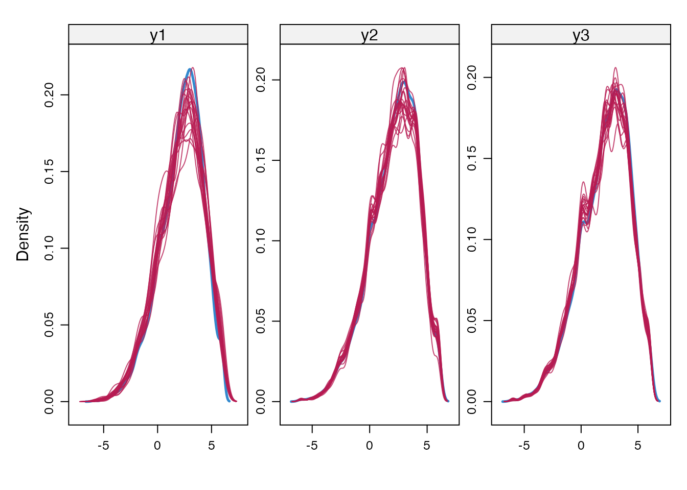
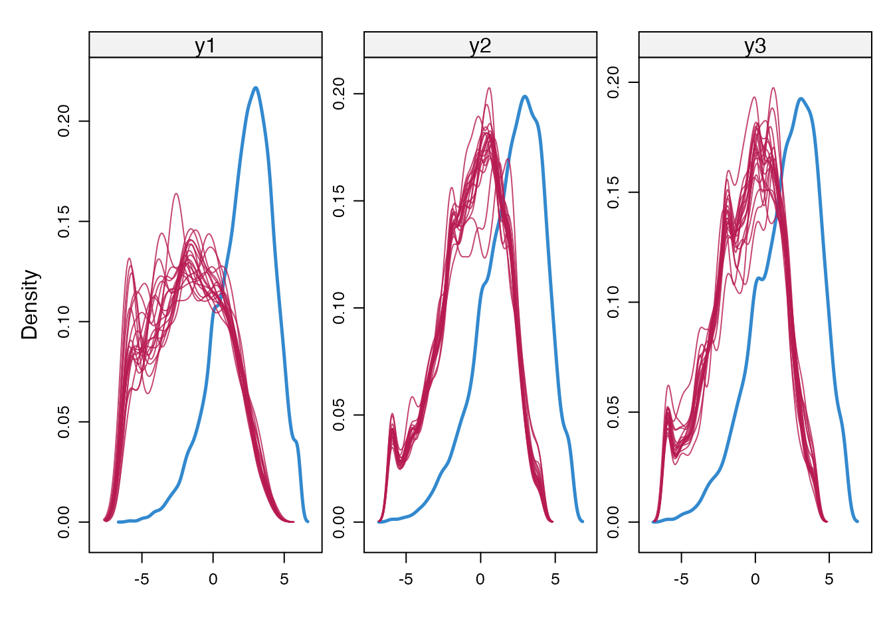
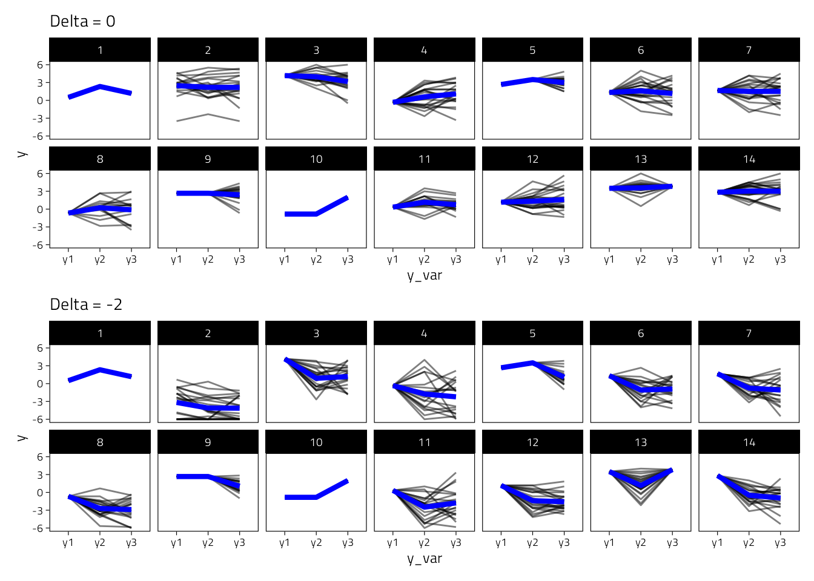
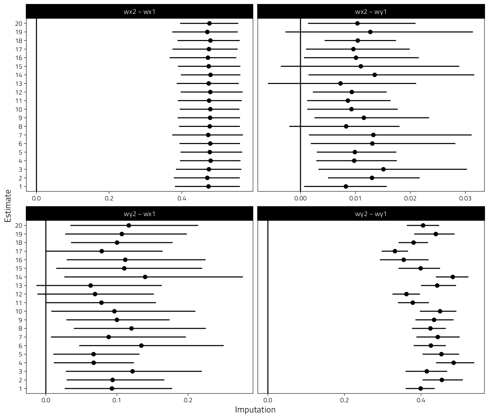
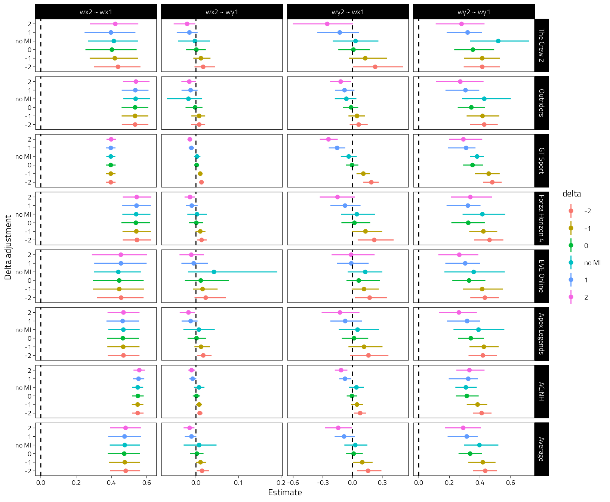

# Missing data sensitivity analysis

This document contains a missing data sensitivity analysis.

We first load the required packages.

```r
knitr::opts_chunk$set(cache = TRUE)
library(lavaan)
library(brms)
library(patchwork)
library(tidyverse)
library(bayestestR)
library(multidplyr)
library(here)
library(knitr)
library(mice)

# mcmc setup
options(mc.cores = 1)
if (require("cmdstanr")) options(brms.backend = "cmdstanr")
ITER <- 2000
WARMUP <- 1000

# imputation
# different delta values
deltas <- c(2, 1, 0, -1, -2)
## number of imputations
m <- 20
```

For the sensitivity analysis we keep only `Affect` and `Hours`.


```r
d_riclpm_wide <- read_rds(here("Temp", "d_riclpm_wide.rds"))
# keep only necessary vars
d <- filter(d_riclpm_wide, y_var == "Affect", x_var == "Hours")
```


## Imputation model
We use `MICE` to impute a missing not a random (MNAR) mechanism using [delta adjustment](https://stefvanbuuren.name/fimd/sec-sensitivity.html). Predictive mean matching (PMM) is used for the actual imputations.


```r
#' Perform imputation using MICE
#'
#' @param data the data
#' @param delta delta adjustement; a constant that's removed from the MAR imputation
#' @param m number of imputations
#'
#' @return a mice imputation object

mice_mnar_delta <- function(data, delta = 0, m = 5) {
  d2 <- data[, !names(data) %in% c("pid", "y_var", "x_var")]
  pred <- make.predictorMatrix(d2)
  imp0 <- mice(
    d2,
    print = FALSE,
    pred = pred,
    m = 1
  )

  # pred <- quickpred(d2, minpuc = 0.33)

  # do not impute hours
  pred[, "x1"] <- 0
  pred[, "x2"] <- 0
  pred[, "x3"] <- 0

  post <- imp0$post
  method <- imp0$method
  method[names(method) %in% c("x1", "x2", "x3")] <- ""

  # delta adjustment
  # squeeze to scale range
  cmd <- paste("imp[[j]][,i] <- squeeze(imp[[j]][,i] +", delta, ", c(-6, 6))")
  post[c("y1", "y2", "y3")] <- cmd

  imp <- mice(
    d2,
    print = FALSE,
    pred = pred,
    post = post,
    method = method,
    m = m
  )
  imp
}
```


Here we inspect the imputations, by creating density plots of observed and imputed values for delta = 0 and -2.


```r
imp2 <- mice_mnar_delta(data = d, delta = -2, m = m)
imp_mar <- mice_mnar_delta(data = d, delta = 0, m = m)
densityplot(imp_mar, ~ y1 + y2 + y3)
```



```r
densityplot(imp2, ~ y1 + y2 + y3)
```



We also compare the imputed slopes for 14 participants, asuming delta 0 or -2.

```r
#' Plot the slopes for 15 participants and the imputations
plot_imputed_slopes <- function(imp) {
  tmp <- mice::complete(imp, action = "all")
  n_subs <- 14
  tmp2 <- lapply(tmp, function(d) head(d, n = n_subs))
  tmp2 <- bind_rows(tmp2, .id = "imp")
  tmp2$id <- rep(1:n_subs, m)

  tmp3 <- pivot_longer(
    tmp2,
    c(y1, y2, y3),
    names_to = "y_var", values_to = "y"
  )
  tmp3_sum <- tmp3 %>%
    group_by(id, y_var) %>%
    summarise(y = mean(y))
  ggplot(tmp3, aes(y_var, y, group = interaction(id, imp))) +
    geom_line(alpha = .5) +
    geom_line(data = tmp3_sum, aes(group = id), color = "blue", size = 1.5) +
    facet_wrap(~id, nrow = 2) +
    ylim(c(-6, 6))
}

plot_imputed_slopes(imp_mar) + labs(title = "Delta = 0") +
  plot_imputed_slopes(imp2) + labs(title = "Delta = -2") +
  plot_layout(nrow = 2)
```



## Analysis
For the analysis step we use the same lavaan model as for the main analysis.


We then fit the lavaan model to each imputed data set.


```r
get_lavaan_pars <- function(x) {
  bind_rows(
    parameterestimates(x) %>%
      mutate(Type = "Unstandardized"),
    standardizedsolution(x) %>%
      rename(est = est.std) %>%
      mutate(Type = "Standardized")
  ) %>%
    as_tibble() %>%
    unite("Parameter", c(lhs, op, rhs), sep = " ", remove = FALSE) %>%
    filter(Type == "Unstandardized", str_detect(Parameter, " ~ ")) %>%
    filter(Parameter %in% c("wx2 ~ wx1", "wx2 ~ wy1", "wy2 ~ wy1", "wy2 ~ wx1"))
}

lavaan_mice_mnar <- function(data, delta = 0, m = 5) {
  # use observed data only if m = 0
  if (m > 0) {
    imp <- mice_mnar_delta(data = data, delta = delta, m = m)
  } else {
    imp <- list(m = c(1))
  }

  # fit model to each imputed dataset
  fit_multi_imp <- lapply(seq_len(imp$m), function(i) {
    if (m > 0) {
      d_tmp <- mice::complete(data = imp, action = i, include = FALSE)
    } else {
      d_tmp <- data
    }
    fit_riclpm_sep <- d_tmp %>%
      group_by(Game) %>%
      summarise(
        fit = lavaan(
          riclpm_constrained,
          data = cur_data(),
          missing = "ml",
          meanstructure = TRUE,
          int.ov.free = TRUE
        ) %>% list()
      )
    out <- fit_riclpm_sep %>%
      mutate(pars = map(fit, get_lavaan_pars)) %>%
      select(-fit) %>%
      ungroup() %>%
      unnest(pars)
    out$imp <- i
    out$delta <- delta
    out
  })
  fit_multi_imp
}
```

All lavaan models are then meta-analyzed

```r
# Load cache if it exists
file_path <- here("Temp", "lavaan-MI.rds")
if (file.exists(file_path)) {
  fit_mnar_imp <- read_rds(file = file_path)
} else {
  # fit model without MI
  fit_no_mi <- lavaan_mice_mnar(data = d, delta = "no MI", m = 0)
  fit_mnar_imp <- lapply(
    deltas,
    function(delta) lavaan_mice_mnar(data = d, delta = delta, m = m)
  )

  fit_mnar_imp <- c(list(fit_no_mi), fit_mnar_imp)
  write_rds(fit_mnar_imp, file = file_path)
}
```

We perform the meta-analysis for each delta value and for the m (imputed) lavaan models.


```r
#' Run MA with MICE lavaan objects
#'
#' @param data a list with results from the m imputations
run_MA_imp <- function(data, cluster, brms_empty) {
  res <- lapply(data, run_MA, cluster = cluster, brms_empty = brms_empty)
  res <- do.call(rbind, res)

  all_imps <- res %>%
    mutate(out = map(fit, get_ma_post)) %>%
    mutate(
      out2 = map(
        out,
        ~ describe_posterior(.x, centrality = "mean", ci = 0.95) %>%
          rename(Game = Parameter)
      )
    ) %>%
    select(-fit, -out) %>%
    unnest(out2) %>%
    select(-CI, -starts_with("ROPE")) %>%
    group_by(Parameter, Game) %>%
    mutate(imp = row_number()) %>%
    as.data.frame()

  pooled <- res %>%
    group_by(Parameter) %>%
    summarise(
      fit = combine_models(mlist = fit, check_data = FALSE) %>% list()
    )
  pooled$delta <- as.character(data[[1]]$delta[1])
  # only return posterior summary to save space
  pooled <- pooled %>%
    mutate(out = map(fit, get_ma_post)) %>%
    mutate(
      out2 = map(
        out,
        ~ describe_posterior(.x, centrality = "mean", ci = 0.95) %>%
          rename(Game = Parameter)
      )
    ) %>%
    select(-fit, -out) %>%
    unnest(out2) %>%
    select(-CI, -starts_with("ROPE")) %>%
    as.data.frame()

  list("all" = all_imps, "pooled" = pooled)
}
run_MA <- function(data, cluster, brms_empty) {
  fit_ma <- data %>%
    group_by(Parameter) %>%
    mutate(i = cur_group_id()) %>%
    partition(cluster) %>%
    summarise(
      fit = list(
        update(
          brms_empty,
          newdata = cur_data(),
          control = list(adapt_delta = .9999, max_treedepth = 15),
          iter = ITER, warmup = WARMUP,
          refresh = 0,
        )
      )
    ) %>%
    collect()
  fit_ma$delta <- data$delta[1]
  fit_ma
}
# get posterior summaries
get_ma_post <- function(x) {
  coef(x, summary = FALSE) %>%
    .[["Game"]] %>%
    .[, , 1] %>%
    as.data.frame() %>%
    cbind(fixef(x, summary = FALSE)) %>%
    as_tibble()
}
# Save/load meta-analyses in one file
file_path <- here("Temp", "brms-MI-meta-analyses.rds")
if (file.exists(file_path)) {
  fit_ma_imp <- read_rds(file = file_path)
} else {
  # Meta-analyze the models fitted independently to games
  d_ma <- fit_mnar_imp[[1]][[1]]

  # Compile meta-analytic brms/Stan model
  bf_ma <- bf(est | se(se) ~ 0 + Intercept + (0 + Intercept | Game))
  fit_ma_empty <- brm(
    bf_ma,
    data = d_ma,
    prior = prior(student_t(7, 0, 0.25), class = "sd", group = "Game") +
      prior(normal(0, 0.5), class = "b"),
    chains = 0,
    control = list(adapt_delta = .999)
  )
  cluster <- new_cluster(4)
  cluster_library(cluster, c("dplyr", "brms", "here", "stringr"))
  cluster_copy(cluster, c("fit_ma_empty", "ITER", "WARMUP"))
  fit_ma_imp <- lapply(
    fit_mnar_imp,
    function(data) run_MA_imp(data, cluster, fit_ma_empty)
  )

  rm(cluster)
  write_rds(fit_ma_imp, file = file_path)
}

pooled <- lapply(fit_ma_imp, function(d) d$pooled) %>%
  bind_rows() %>%
  mutate(delta = factor(delta))
all <- lapply(fit_ma_imp, function(d) d$all) %>%
  do.call(rbind, .)
rm(fit_ma_imp)
```

Here we check so that the correct number of imputations were performed.

```r
all %>%
  group_by(delta, Parameter) %>%
  summarise(n = n())
```

```
## # A tibble: 24 × 3
## # Groups:   delta [6]
##    delta Parameter     n
##    <chr> <chr>     <int>
##  1 -1    wx2 ~ wx1   160
##  2 -1    wx2 ~ wy1   160
##  3 -1    wy2 ~ wx1   160
##  4 -1    wy2 ~ wy1   160
##  5 -2    wx2 ~ wx1   160
##  6 -2    wx2 ~ wy1   160
##  7 -2    wy2 ~ wx1   160
##  8 -2    wy2 ~ wy1   160
##  9 0     wx2 ~ wx1   160
## 10 0     wx2 ~ wy1   160
## # … with 14 more rows
```

We also take a look at some of the imputed coefficients.


```r
all %>%
  filter(Game == "Intercept", delta == -1) %>%
  mutate(imp = factor(imp)) %>%
  ggplot(
    aes(Mean, imp)
  ) +
  geom_point() +
  geom_linerange(aes(xmin = CI_low, xmax = CI_high)) +
  geom_vline(xintercept = 0) +
  facet_wrap(~Parameter, scales = "free_x") +
  labs(x = "Imputation", y = "Estimate")
```

<div class="figure" style="text-align: center">

<p class="caption">(\#fig:imputed-coefs)Results from the missing data sensivitity analysis. Coefficients plus 95% CIs for each imputation when delta = -1</p>
</div>

## Sensitivity plot
We plot all regression coefs, "wy2 ~ wx1" should be the most interesting one. 

```r
pooled %>%
  tibble() %>% 
  mutate(Game = if_else(Game == "Intercept", "Average", Game)) %>% 
  mutate(Game = fct_rev(fct_relevel(Game, "Average"))) %>% 
  mutate(
    delta = factor(
      delta,
      levels = c("-2", "-1", "0", "no MI", "1", "2")
    )
  ) %>%
  ggplot(
    aes(Mean, delta, color = delta)
  ) +
  geom_point() +
  geom_linerange(aes(xmin = CI_low, xmax = CI_high)) +
  geom_vline(xintercept = 0, linetype = "dashed") +
  labs(y = "Delta adjustment", x = "Estimate") +
  facet_grid(Game ~ Parameter, scales = "free")
```

<div class="figure" style="text-align: center">

<p class="caption">(\#fig:sensitivity-plot)Coefficients plus 95% CIs for the pooled MI models</p>
</div>
